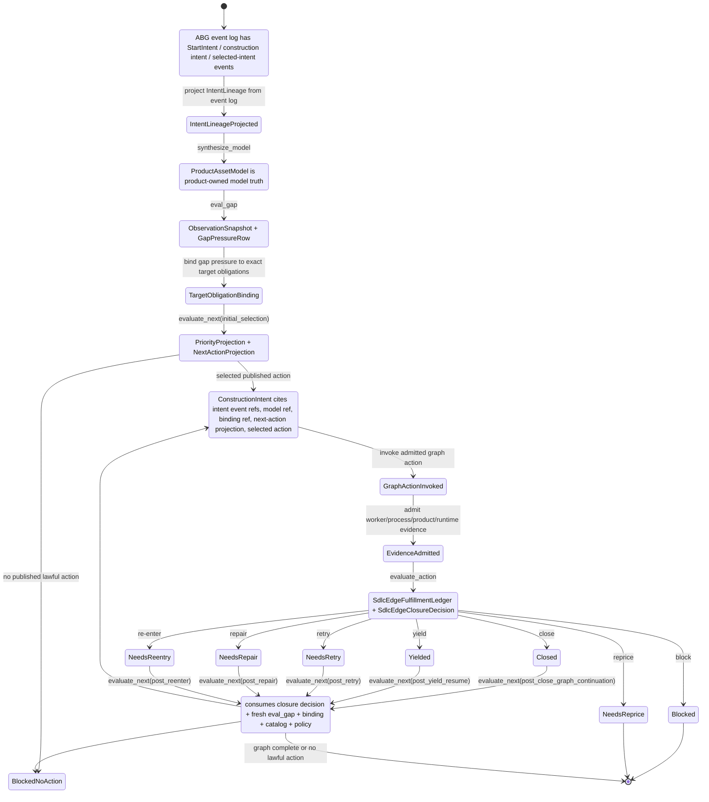

# T-135: Realize Evaluate_Next-Owned Runner Traversal Spine

## STDO Triage

Smallest lawful re-entry: `realization_refactor`.

Change-class note: this is a realization refactor only under the T-109 design
surface. This ticket cannot close until T-109 ratifies the axiomatic closure
target it implements.

The T-109 design target is now explicit. The missing implementation is the
runner consequence path. Current code can preserve gap/evaluate-next/action
closure truth and still invoke the next step through local installed-operator
branching. That violates the one-surface axiom.

## Homeostasis Function Split

This ticket consumes the ODD Method homeostasis loop and must use the precise
constitutional functions:

- `synthesize_model`: synthesizes `ProductAssetModel` from event-log-derived
  `IntentLineage`, prior model, and admitted product truth. It does not observe
  the worksite, select action, or close action.
- `eval_gap`: compares desired product/model truth to observed reality and emits
  gap pressure. It does not select action and does not close action.
- `evaluate_next`: binds gap pressure to target obligations, ranks published
  lawful graph actions, and publishes `NextActionProjection` with a selected
  action when lawful. It does not admit construction intent.
- `evaluate_action`: folds admitted evidence for the action just taken into
  `SdlcEdgeFulfillmentLedger` and `SdlcEdgeClosureDecision`. It does not select
  the next graph action.

Construction intent is admitted from gap-derived action selection. The product
intent document is not unrelated to construction intent; it is part of the
external intent events whose `IntentLineage` projection seeds the product model.
`eval_gap` compares that model to observed reality. `evaluate_next` selects a
published graph action from the resulting gap pressure. A distinct admission
constructor admits current construction intent from the selected action.

## F_P Evaluation Record Model

This ticket tightens the runner around recorded `F_P` evaluation.

The governing invariant is:

```text
F_P.<role>.eval(input_basis) -> Findings<role>
ABG/F_D.admit(Findings<role>) -> RecordSurface<role>
RecordSurface<role> -> later evaluation input
```

For the requirements lane, the owning record is not the requirement document
itself. The requirement document is product/model truth. The action-closure
record is the edge fulfillment ledger over declared obligations and admitted
assessments:

```text
declared requirements + target obligations
-> worker/F_P findings
-> F_D/admission checks
-> obligation assessments
-> evaluate_action
-> SdlcEdgeFulfillmentLedger
-> SdlcEdgeClosureDecision
```

Therefore a requirement surface can create or update requirement truth while
leaving requirement obligations open. Recording `REQ-*` identifiers is evidence
that requirement pressure exists; it is not proof that the requirement has been
fulfilled by the product.

`RecordSurface<role>` may be called a ledger, register, projection, or admitted
event depending on the role. The name is not authority. The authority is the
admitted deterministic record of the `F_P` evaluation.

The installed runner must not consume raw worker prose, raw `F_P` findings, or
event-log projection alone as if they were the admitted evaluation record. Event
truth says what happened. The ledger/register/projection records what the
admitted evaluator concluded about target obligations, observed worksite state,
evidence, ambiguity, and policy.

The current surfaces reconcile as follows:

| Surface | T-135 role |
|---|---|
| ABG event log | Prime runtime fact authority for hook calls, findings, admissions, selected intents, graph invocation, evidence, and interruption events. |
| ABG `PayloadLedgerProjection` | ABG projection over admitted payload/evidence/closure-input events. It may feed SDLC evaluation but must not replace the SDLC edge fulfillment record. |
| ABG `ObligationLedgerAsset` | Admitted obligation source truth. It feeds `eval_gap` and `evaluate_action`; it does not select traversal. |
| ABG `ConstructionProgressLedger` | ABG construction progress/stagnation record. It can inform yield/closure pressure, but it is not the SDLC edge fulfillment ledger. |
| odd_sdlc `SdlcEdgeFulfillmentLedger` | Owning admitted record for `evaluate_action` over an edge attempt: target bindings, worksite/evidence, counts, admission gates, and convergence. |
| odd_sdlc `SdlcEdgeClosureDecision` | Disposition over `SdlcEdgeFulfillmentLedger`: `close`, `yield`, `retry`, `repair`, `re-enter`, `reprice`, or `block`. It does not select a graph action. |
| odd_sdlc `SdlcManagedTraversalLedger` | Legacy/conformance traversal surface. Under T-135/T-140 it must be demoted, derived, or folded into the T-109 consequence spine; it must not remain an executable selector. |
| odd_sdlc ingress/source ledger rows | Source lineage and conformance input to `synthesize_model` / `eval_gap`. They are not closure or traversal-selection authority. |
| public gaps / query-domain rows | Read-only evaluator view. They may display evaluator truth but cannot be consumed as runner invocation authority. |

This is how T-135 preserves one truth surface while allowing multiple ledgers
and registers to exist: each record surface has one evaluation role, and only
the T-109 spine composes those roles into traversal consequence.

Initial selection and post-action selection are both `evaluate_next`; they
differ only by `NextActionBasis`:

```text
initial_selection
post_yield_resume
post_close_graph_continuation
post_retry
post_repair
post_reenter
post_reprice
post_block
```

## Migration Declaration

- migration strategy: `inside_out_hard_break`
- old truth path: installed-operator local branches, gap-dossier action strings,
  CLI retry/context injection, prompt-pressure route prose, and postflight
  summaries decide follow-up traversal.
- new truth path: `synthesize_model` emits `ProductAssetModel`, `eval_gap`
  emits gap pressure and target-binding findings into an admitted record,
  `evaluate_next` emits `NextActionProjection` over a published graph action,
  a separate admission constructor admits `ConstructionIntent`,
  `evaluate_action` folds admitted worksite/evidence findings into
  `SdlcEdgeFulfillmentLedger` and `SdlcEdgeClosureDecision`, and fresh
  `evaluate_next` selects any follow-up work; the runner invokes graph work only
  from admitted construction intent.
- old producers: `installed_operator.ts`, CLI start loops, handoff prompt
  assembly, gap dossier action lists, assurance/postflight summary strings.
- new producers: admitted hook/eval findings, target-obligation binding records,
  T-109 edge fulfillment ledger, T-109 closure decision fold, ABG/odd_sdlc
  evaluate_next projection, admitted construction intent, runtime event/evidence
  admission.
- old consumers: installed start runner, CLI command adapter, live harness,
  public gap summaries, RC report summaries.
- new consumers: installed runner, public gaps/read models, CLI rendering, live
  harness reports, RC reports.
- projections/proof surfaces: operator-run event archive, F_P evaluation record
  surfaces, edge fulfillment ledger, closure decision projection, evaluate_next
  projection, CLI/gaps JSON, live/sandbox runner tests.
- migration closure: no production invocation path can dispatch graph work from
  local strings, prompt prose, CLI loop state, or public read-only gaps output.

## Migration Checklist

- [x] old truth path is named explicitly
- [x] new truth path is named explicitly
- [x] producer set for the new truth is listed
- [x] consumer set for the new truth is listed
- [x] projection/read-model surfaces are listed
- [x] old truth path is removed or explicitly demoted from authority
- [x] mixed-state behavior is no longer accepted as closure evidence
- [x] tests proving mixed old/new behavior are removed or repriced
- [x] recurring realization patterns are checked against existing library/commonization surfaces
- [x] ticket declares library usage and names the governing library or rationale
- [x] if the work exists in more than one build tenant, this backlog/active ticket carries only one tenant lifecycle and any sibling tenant work lives on its own suffixed ticket
- [x] ticket wording, product wording, and proof claims are reconciled before closure

## Functional Review Criteria

- [x] Traversal selection is carrier-owned by closure/evaluate_next/intent truth,
      not control-flow-owned by installed-operator branches.
- [x] The runner consumes admitted carriers directly and does not reconstruct
      authority from strings, payload fallback, prompt text, or public gaps rows.
- [x] Every consequential `F_P` eval consumed by the runner has an owning
      admitted record surface; event-log projection alone is not treated as
      worksite/edge evaluation truth.
- [x] Legacy ledgers/registers are explicitly demoted, derived, or folded into
      the T-109 spine before they can influence traversal.
- [x] Effects remain at the edge: worker invocation happens after admitted
      intent, not during evaluate_next/source-truth interpretation.
- [x] Positive tests prove default graph following and priority override through
      evaluate_next projection.
- [x] Negative tests prove local fabricated actions and public read-only gaps
      rows cannot invoke work.

## Impacted Interface Review Checklist

- [x] `installed_operator.ts`: dispatches only from admitted evaluate_next-selected
      construction intent.
- [x] `start/public_start.ts`: resolves public start intent into
      `initial_selection` / target-binding projection only; no local ordering
      can become the runner traversal selector.
- [x] `spec_method/entry.ts`: parses command intent and renders projection; no
      retry business loop or retry-context synthesis.
- [x] `operator/handoff.ts`: prompt packages may carry context, but not route
      authority.
- [x] `projection/query_domain.ts`: read-only display only; no executable action
      authority.
- [x] live harness: proves non-close continuation through evaluate_next-owned
      intent, not installed-operator local branch.
- [x] RC report: summarizes closure/evaluate_next truth and does not derive its own
      traversal decision.

## Required Break Order

1. Inventory every production path that can dispatch a follow-up traversal.
2. Publish/consume the T-109 closure decision and evaluate_next projection carrier.
3. Break one installed-operator local branch and keep it broken until rebound
   through admitted intent.
4. Rebind the runner dispatch kernel to admitted `ConstructionIntent`.
5. Remove or demote old branch producers and display-only strings.
6. Rebind CLI, gaps, live harness, and RC summaries to the evaluate_next projection.
7. Reprice tests that accepted mixed local/evaluate_next authority.

## Break-To-Closure Map

- Breaking installed-operator local action branches closes the no-rival-runner
  clause.
- Breaking CLI retry/context injection closes the no-CLI-controller clause.
- Breaking prompt/postflight route authority closes the no-prompt-prose clause.
- Rebinding live harness and RC reports closes the public proof/read-model
  clause.

## Mixed-State Negative Proof

At least one test must construct a fixture where the old local branch says
`retry_same_edge` or repair while the evaluate_next projection does not select
that action. The run must fail closed or follow evaluate_next truth; the old
path must not dispatch work.

## Functional Spine

The runner must consume:

```text
synthesize_model(IntentLineage projection from event log, prior ProductAssetModel, admitted product truth)
-> ProductAssetModel
-> eval_gap(ProductAssetModel, RuntimeEventLog, RuntimeProjection, Worksite)
-> ObservationSnapshot
-> GapPressureRow
-> TargetObligationBinding
-> evaluate_next(NextActionBasis, gap, binding, ActionCatalog, Policy)
-> PriorityProjection
-> NextActionProjection
-> admit ConstructionIntent
-> ConstructionIntent
-> WorksiteEvidence
-> evaluate_action
-> SdlcEdgeFulfillmentLedger(declared obligations + admitted assessments)
-> SdlcEdgeClosureDecision
-> evaluate_next
-> NextActionProjection
```

The runner may invoke work only from admitted `ConstructionIntent`.

## State Flow Diagram



State constraints:

- `IntentLineageProjected` is not a new ledger. It is a read model over admitted
  ABG events. Every action is still grounded in the event log.
- `ProductModelSynthesized` is product-owned model truth; it does not authorize
  traversal by itself.
- `InitialNextAction` and `PostActionNext` are the same `evaluate_next`
  function with explicit `NextActionBasis` values.
- `ActionEvaluated` emits dispositions only. Repair, retry, and re-entry become
  invocations only after `evaluate_next` selects a published graph action.
- `Closed` is not terminal by itself. It closes the current edge; whole-graph
  continuation is selected only by `evaluate_next(post_close_graph_continuation)`.
- `Yielded` returns control without failure classification and without local
  CLI looping.

## Design Constraint

This ticket does not invent a new ledger. T-109 owns
`SdlcEdgeFulfillmentLedger` and `SdlcEdgeClosureDecision`. This ticket wires the
installed runner to those carriers and classifies every other ledger/register as
an input record, derived read model, or legacy surface that cannot select
traversal.

This ticket also does not create a separate requirement-closure path. Requirement
truth feeds product/model/gap evaluation. Requirement fulfillment is evaluated
through the same declared-obligation assessment fold as every other edge. That
is the constitutional purpose of T-135: one total loop for observation,
obligation binding, action selection, evidence admission, edge closure, and next
action.

## Constitutional Amendment - 2026-05-10

T-135 is the constitutional runner-spine ticket, not just a local branch-removal
ticket. Its implementation target is the total consequence loop:

```text
transform action
-> F_P/F_D evaluation findings
-> admitted obligation assessments
-> SdlcEdgeFulfillmentLedger
-> SdlcEdgeClosureDecision
-> evaluate_next
-> admitted ConstructionIntent
-> next transform action
```

The bug found in the requirements lane was that an edge could treat
`worker_invoked` or requirement-marker echo as fulfillment. That made
requirements appear closed when the worksite only contained a requirement
surface. The amended rule is:

- `evaluate_action` owns closure.
- `evaluate_action` reads declared obligations and admitted assessments.
- Requirement documents are product/model truth, not closure truth.
- Requirement obligations remain pressure until admitted evidence proves
  fulfillment of the obligation.
- A worker invocation with no declared obligations fails closed; there is no
  synthetic fallback obligation that can convert process completion into edge
  fulfillment.
- Runner continuation consumes `SdlcEdgeClosureDecision` and
  `evaluate_next`; no requirement lane may bypass this fold.

## Codex Feedback Disposition - 2026-05-10

- [x] Reconciled close and graph continuation: `close` closes the current edge,
      while `evaluate_next(post_close_graph_continuation)` owns any next-edge
      selection.
- [x] Removed evaluator-as-admitter wording: `evaluate_next` emits
      `NextActionProjection`; a separate admission constructor admits
      `ConstructionIntent`.
- [x] Made initial traversal explicit: `initial_selection` does not fabricate a
      prior closure decision.
- [x] Added `start/public_start.ts` to the migration surface because public start
      currently resolves executable graph-function targets and must not remain a
      rival selector.
- [x] Replaced stale `cli/command.ts` checklist wording with current
      `spec_method/entry.ts` and `start/public_start.ts` surfaces.

Verification for the carrier-law correction:

```bash
npm run build:semantic
npm run lint:semantic
node --test test_env/tests/test_t136_yield_closure_disposition.test.mjs
node --test test_env/tests/test_t138_traversal_consequence_replayability.test.mjs
npm run test:t032
npm run test:t033
npm run test:t129
```

Passed build, lint, T-136 9/9, T-138 8/8, T-032 4/4, T-033 8/8, and T-129 10/10.

## Implementation Evidence - 2026-05-10

T-135 is implemented as the runner migration slice over the T-109 consequence
spine.

Applied changes:

- `start/public_start.ts` now resolves public start through
  `evaluate_next(initial_selection)`, constructs `SdlcNextActionProjection`,
  and admits `SdlcConstructionIntent` before an execution contract can dispatch
  graph work.
- `operator/installed_operator.ts` now archives admitted construction intent,
  worksite evidence, edge fulfillment ledger, closure decision, and follow-up
  next-action projection for each installed run.
- Installed-operator continuation now consumes
  `installedStartHasEvaluateNextTraversalTruth`; legacy local strings such as
  same-edge retry, repair re-entry, archive inspection, and F_P escalation are
  no longer traversal authority.
- `spec_method/entry.ts` preserves replay basis for observed starts by matching
  replayed graph-function runs instead of re-resolving `next` against current
  workspace state.
- Existing semantic/sandbox expectations were repriced where they encoded the
  old broad bootstrap/release path instead of the current published graph action
  selected by the evaluate_next path.
- `deriveSdlcEdgeFulfillmentCountsFromAssessments` now fails closed when an
  edge has no declared obligations, even if the worker invocation completed.

Focused proof:

```bash
npm run test:t135
# 7/7 passed

npm run test:t033
# 8/8 passed

npm run test:t137
# 5/5 passed

npm run test:t091
# 5/5 passed

node --test test_env/tests/test_t136_yield_closure_disposition.test.mjs
# 9/9 passed

node --test test_env/tests/test_t138_traversal_consequence_replayability.test.mjs
# 8/8 passed
```

Regression proof:

```bash
npm run lint:semantic
# passed

npm run test:t058
# 8/8 passed

npm run test:t064
# 9/9 passed

npm run test:t066
# 27/27 passed

npm run test:t076
# 2/2 passed

npm run test:t087
# 1/1 passed

npm run test:t096
# 1/1 passed

npm run test:t098
# 1/1 passed

npm run test:semantic
# 319/319 passed on 2026-05-10

npm run test:sandbox
# 15/15 passed on 2026-05-10 after no-declared-obligation fail-closed patch

git diff --check
# passed
```

Closure finding: T-135's implementation no longer has a production runner path
that can dispatch graph work from public gaps rows, gap-dossier action strings,
prompt prose, CLI loop state, or postflight summary text. Runner dispatch is
now rooted in admitted construction intent derived from evaluate_next over the
published action surface.

## Implementation Notes

- Start by locating every call path that can cause a follow-up traversal.
- Replace local branch selection with evaluate_next-selected intent consumption.
- Preserve effect boundaries: ABG/odd_sdlc admission writes events/evidence;
  F_P workers do not write ledger truth.
- Keep public gaps read-only. It can display evaluate_next truth, not execute it.
