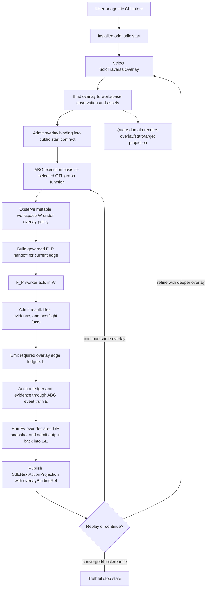

# T-160: First-Class Traversal Overlays For Guided Graph Passes Over Workspace

## STDO Triage

First missing layer: design.

The current TypeScript line can publish more named executive graph functions,
but it does not yet have a first-class carrier for the design concept now needed:
a traversal graph is a governed overlay over the current mutable workspace.

The workspace is not disposable scratch state. It retains operational truth
persistently: source files, generated assets, local specifications, execution
artifacts, repair state, build/test outputs, and operator-visible worksite
condition all persist in `W`.

The overlay does not create that truth. The overlay is the reusable
function-like traversal definition. An overlay binding applies that reusable
overlay to a concrete workspace observation, concrete asset bindings, admitted
prior ledger/event history, and a selected graph-function target.

This is not an ABG enhancement request. ABG remains authoritative for graph
calls, frames, continuations, events, projections, and traversal truth. The
`odd_sdlc` product-level gap is selection, binding, and interpretation: the
domain needs to declare which guided graph pass exists, how that pass is bound
to the actual worksite reality, what ledger/eval obligations that binding
carries, and how a later binding refines the history admitted by an earlier
binding.

The lawful re-entry point is design. Product law already supports graph
functions, active worksite lifecycle, policy over evaluation/closure, ledgers,
ABG replay truth, and read-only projections. This ticket defines the TypeScript
realization shape needed to make that product law executable without adding a
rival truth surface.

## Problem Statement

The current code has multiple graph-function programs, but graph depth is still
expressed mostly through named graph functions and hardcoded public start target
selection.

That is not enough for guided worksite passes.

A light hello-world pass and a heavy bootstrap pass need to be selectable as
different overlays over the same workspace. Each selected pass must then be
bound to the concrete workspace observation before traversal starts. The
resulting binding must carry identity into start, execution, handoff, ledger,
eval, event, projection, archive replay, and next-action routing.

There is a second use case that is just as important: overlays must support
bounded segment deepening. An operator may want to apply a requirements-deepening
overlay and stop at requirement authority, apply a design-depth overlay and stop
at design/topology/schedule authority, apply a testing overlay and stop at test
qualification, or apply a build/review overlay and stop at code build or code
review evidence. The overlay therefore needs a declared termination policy, not
only a start-target policy.

Without overlay binding identity:

- a light run and heavy run can be confused as the same graph track;
- a later overlay cannot lawfully refine prior admitted work;
- a segment-deepening pass cannot prove why it stopped at requirements, design,
  testing, build, or review rather than silently drifting into the next segment;
- public start target selection stays hardcoded instead of governed by policy;
- replay cannot prove that the ledger/eval artifacts belong to the selected
  guided pass;
- future full-traversal, lite implementation, solution-architecture,
  bootstrap-requirements, UAT-test-case, repair-only, eval-only, and
  heavy-planning passes will keep accreting ad hoc target selection logic.

## Current Code Structure Pass

The current code already contains the lower-level mechanisms needed for a
first slice.

- `build_tenants/typescript/code/src/graph/catalog.ts` defines product-specific
  graph-function catalog entries and combines bootstrap, operational, and
  triage function catalogs into `SDLC_FUNCTION_CATALOG`.
- `build_tenants/typescript/code/src/graph/module.ts` defines
  `constructExecutive()`, which flattens leaf graph functions into named
  executive graph functions. The current executives are
  `bootstrap_release_self_test` and `release_operational_cycle`.
- `build_tenants/typescript/code/src/projection/query_domain.ts` projects the
  graph catalog and start targets, but `startTargets()` currently has a
  hardcoded public target set.
- `query_domain.ts` also has `assertModuleMatchesCatalog()`, which reconstructs
  the canonical module and rejects unexpected graph functions. Any overlay
  implementation must keep this fail-closed behavior while making the canonical
  comparison overlay-aware.
- `build_tenants/typescript/code/src/start/public_start.ts` already supports
  target kinds `next`, `graph_function`, and `asset`. It can run a named graph
  function directly, but `next` still resolves through the query-domain start
  target projection. T-160 changes that authority path: public start consumes
  admitted overlay catalog/binding truth directly, while query-domain renders
  the same truth as an operator read model.
- `build_tenants/typescript/code/src/spec_method/entry.ts` constructs the
  canonical module directly in query/start/replay paths. Overlay selection must
  be admitted at this entry boundary and threaded into those paths.
- `build_tenants/typescript/code/src/hooks/catalog.ts` derives hook contracts
  from `SDLC_FUNCTION_CATALOG` plus selected reusable dispatch functions. Any
  new overlay leaf edge must be hook-visible; an overlay that only composes
  existing edges should not duplicate hook truth.
- `build_tenants/typescript/code/src/operator/traversal_consequence.ts` carries
  `SdlcNextActionProjection` and already separates `selectedActionRef` from
  `nextGraphFunctionRef` and `nextGraphVectorRef`. It needs overlay binding
  identity in the same causal carrier family.
- `build_tenants/typescript/code/src/operator/installed_operator.ts` consumes
  execution contracts, emits `SdlcEdgeFulfillmentLedger`, derives closure, and
  constructs the next action projection. It currently reconstructs the canonical
  module in consequence evaluation and does not carry overlay binding identity
  through ledger/eval output.
- `build_tenants/typescript/code/src/shared/traversal_strategy_plan.ts` carries
  edge strategy defaults by edge name. Overlay-level strategy must not become a
  hidden global default.
- `build_tenants/typescript/test_env/tests/test_t030_graph_catalog_module.test.mjs`
  asserts exact executive names and vector counts. Overlay support must update
  these assertions to prove the new catalog shape intentionally.

## Required Design

Introduce a first-class traversal overlay catalog above graph-function catalog
publication, then introduce an overlay binding carrier for each concrete
application of an overlay to workspace reality.

The lifecycle invariant is part of the carrier design: the binding must
distinguish material assets that already exist in `W` from planned assets that
are explicitly declared by the selected overlay template. Absent assets may
autobind only from the selected overlay template. They must not be inferred from
ad hoc filesystem search.

The design distinction is:

```text
SdlcTraversalOverlay = reusable traversal function / policy
SdlcOverlayBinding   = invocation binding of that overlay to observed W
SdlcExecutionContract = admitted run contract for the binding
```

Candidate carrier family:

```ts
type SdlcTraversalOverlayRef = `overlay://odd-sdlc/${string}`;
type SdlcOverlayBindingRef = `overlay-binding://odd-sdlc/${string}`;
type SdlcOverlayPolicyRef = `policy://odd-sdlc/overlay/${string}`;
type SdlcGraphCatalogDigestRef = `graph-catalog-digest://odd-sdlc/${string}`;
type SdlcGraphFunctionBoundaryRef = string;
type SdlcGraphVectorBoundaryRef = string;
type SdlcStartTargetRef = string;
type SdlcOverlayComputeRegime = "f_p" | "f_d" | "f_h";

export interface SdlcTraversalOverlay {
  readonly kind: "sdlc_traversal_overlay";
  readonly overlayRef: SdlcTraversalOverlayRef;
  readonly name: string;
  readonly intent: string;
  readonly graphFunctionRefs: readonly SdlcGraphFunctionBoundaryRef[];
  readonly graphVectorRefs: readonly SdlcGraphVectorBoundaryRef[];
  readonly graphCatalogDigestRef: SdlcGraphCatalogDigestRef;
  readonly publicStartTargets: readonly SdlcStartTargetRef[];
  readonly defaultStartTarget: SdlcStartTargetRef;
  readonly policies: {
    readonly workspaceObservationPolicyRef: SdlcOverlayPolicyRef;
    readonly evalPolicyRef: SdlcOverlayPolicyRef;
    readonly refinementPolicyRef: SdlcOverlayPolicyRef;
    readonly traversalStrategyPlanRef: SdlcOverlayPolicyRef | null;
  };
  readonly termination: {
    readonly policyRef: SdlcOverlayPolicyRef;
    readonly terminalAssetTypes: readonly string[];
    readonly terminalGraphFunctionRefs: readonly SdlcGraphFunctionBoundaryRef[];
    readonly lawfulStopDispositions: readonly string[];
    readonly requiresEvalAdmission: boolean;
  };
  readonly requiredLedgersByEdge: readonly SdlcOverlayLedgerRequirement[];
  readonly predecessorOverlayRefs: readonly SdlcTraversalOverlayRef[];
}

export interface SdlcOverlayBinding {
  readonly kind: "sdlc_overlay_binding";
  readonly bindingRef: SdlcOverlayBindingRef;
  readonly overlayRef: SdlcTraversalOverlayRef;
  readonly graphCatalogDigestRef: SdlcGraphCatalogDigestRef;
  readonly workspaceBasis: {
    readonly workspaceRootUri: string;
    readonly workspaceIdentityRef: string;
    readonly preActionWorkspaceObservationRef: string;
    readonly preActionWorkspaceFingerprintRef: string;
    readonly postActionWorkspaceObservationRef: string | null;
    readonly postActionWorkspaceFingerprintRef: string | null;
    readonly workspaceDeltaRef: string | null;
  };
  readonly selection: {
    readonly selectedGraphFunctionRef: SdlcGraphFunctionBoundaryRef;
    readonly selectedGraphVectorRef: SdlcGraphVectorBoundaryRef;
    readonly selectedStartTargetRef: SdlcStartTargetRef;
    readonly requestedBy: "public_start" | "archive_replay" | "operator_resume";
  };
  readonly assetBindings: readonly SdlcOverlayAssetBindingPayload[];
  readonly priorLedgerRefs: readonly string[];
  readonly priorEventRefs: readonly string[];
  readonly freshnessPolicyRef: SdlcOverlayPolicyRef;
  readonly predecessorRefs: readonly string[];
}

export interface SdlcOverlayAssetBindingPayload {
  readonly kind: "sdlc_overlay_asset_binding_payload";
  readonly bindingRef: string;
  readonly overlayBindingRef: SdlcOverlayBindingRef;
  readonly assetType: string;
  readonly assetRef: string;
  readonly workspacePath: string;
  readonly bindingMode: "material" | "planned_from_template";
  readonly templateRef: string | null;
  readonly producerGraphFunctionRef: SdlcGraphFunctionBoundaryRef | null;
  readonly requiredAtStart: boolean;
  readonly predecessorRefs: readonly string[];
}

export interface SdlcOverlayLedgerRequirement {
  readonly edgeRef: SdlcGraphVectorBoundaryRef;
  readonly computeRegime: SdlcOverlayComputeRegime;
  readonly requiredLedgerKinds: readonly string[];
  readonly closureRequiresLedger: boolean;
}
```

The graph refs above are candidate TypeScript shapes, not permission to admit
raw names. Implementation must use the existing published graph-function and
graph-vector boundary-ref helpers. Human-readable graph names may render in
query-domain or operator output, but admission, replay, and structural
comparison must use boundary refs plus catalog digest refs. ABG-internal graph
IDs must fail closed at the odd_sdlc boundary.

The policy refs above are not open strings. They are typed registered policy
refs admitted against the overlay catalog or a named policy registry before the
binding may execute. A raw unregistered policy ref must fail admission.

`workspaceBasis` intentionally carries phase-split fields over one worksite
locus:

- `workspaceRootUri` is the effect boundary and path root;
- `workspaceIdentityRef` is the logical project/workspace identity;
- `preActionWorkspaceObservationRef` is the concrete observation carrier used
  to admit the binding before traversal advances;
- `preActionWorkspaceFingerprintRef` is the freshness/digest check over that
  pre-action observation basis;
- `postActionWorkspaceObservationRef` and
  `postActionWorkspaceFingerprintRef` are post-F_P evidence fields populated by
  admission after workspace mutation;
- `workspaceDeltaRef` points at the admitted workspace delta between pre-action
  and post-action observations.

They are grouped under one binding payload so they do not become peer carriers.
The pre-action fields are immutable selection identity. The post-action fields
and delta are closure/evidence identity. Replay may reject any one of them
independently when that semantic check fails.

`SdlcOverlayAssetBindingPayload`, overlay selection, and termination details are
Subordinate Payloads unless a later implementation review proves they need
independent admission, publication, or public pattern-match semantics.

Every execution under an overlay binding must stamp:

```text
overlayRef
overlayBindingRef
graphCatalogDigestRef
preActionWorkspaceObservationRef
postActionWorkspaceObservationRef?
graphFunctionRef
graphVectorRef
ledgerRef
closureDecisionRef
eventRef
evalRef
refinesOverlayRef?
```

Workspace persistence rule:

```text
W retains persistent operational truth.
O defines a reusable traversal function over workspace truth.
B binds O to a concrete observation of W and admitted prior L/E.
F_P may mutate W under B.
L admits closure-relevant evidence about that mutation under B, including
post-action observation and workspace-delta evidence.
E anchors admitted facts for replay.
Ev evaluates declared L/E snapshots under B and writes its own admitted result back.
```

Persistent workspace truth can be observed and acted upon by later overlays,
but it is not enough for closure by itself. Closure still requires admitted
ledger/event/eval truth and a `SdlcEdgeClosureDecision` for the selected
overlay binding.

ABG event-truth boundary:

```text
ABG events remain the authoritative event log.
overlayBindingRef is odd_sdlc domain correlation on ledgers, eval inputs,
execution contracts, projections, and optional event metadata.
If ABG does not natively type overlayBindingRef, event membership is proven by
odd_sdlc ledger/admission/predecessor refs anchored to ABG events.
```

ABG does not decide overlay meaning. `odd_sdlc` must not turn repeated event
snapshot copies or overlay metadata into a second event store.

Function-binding form:

```text
B = bind(O, W_observed, asset_bindings, prior_L/E, terminal_policy)
run(B) -> F_P work in W -> L -> E -> Ev -> next B or stop
```

## Bootstrap And Template Binding Lifecycle

The minimum lifecycle starts with a single source document:

```text
bootstrap.md
```

The first run may select an induction-to-requirements overlay:

```text
odd_sdlc start --workspace . --graph-overlay bootstrap-requirements --until overlay-stop
```

For that first binding, `bootstrap.md` is a material asset binding because the
file exists and is the original source reality. Downstream assets such as
`specification/INTENT.md`, `specification/PRODUCT.md`, `specification/GOALS.md`,
and `specification/requirements/` may not exist yet. They are still explicit
bindings, but their binding mode is `planned_from_template`: the overlay's graph
template declares the asset type, default workspace path, producer graph
function, and terminal expectation.

That is not inferred binding.

It is explicit template binding:

```text
material binding:
  bootstrap.md exists in W
  bind it as input source truth

planned template binding:
  INTENT.md does not exist yet
  overlay template declares it as an expected produced asset
  binding records asset type, planned path, and producer graph function
```

The graph therefore acts as an asset-creation template. It names which assets
must exist now, which assets are expected to be created by this traversal, and
which future assets remain outside the selected overlay's terminal boundary.

The next run can select a focused design overlay. At that point `INTENT.md`,
`PRODUCT.md`, `GOALS.md`, and `specification/requirements/` should be material
asset bindings if the induction overlay produced them. Future design assets may
again be planned template bindings, for example:

```text
build_tenants/typescript/design/...
implementation_design_surface
implementation_module_surface
implementation_component_topology_surface
component_realization_schedule_surface
```

This gives the lifecycle a stable rule:

```text
If the asset exists, bind the material asset explicitly.
If the asset does not exist but the selected overlay template declares it, bind
the planned asset explicitly from the template.
If the asset does not exist and no selected overlay template declares it, fail
closed or leave it outside the binding.
```

The default binding behavior is therefore template-governed, not filesystem
inference. The operator names the workspace and overlay. The overlay template
provides the default asset slots and paths. The binding records whether each
slot is material or planned.

The overlay catalog must initially publish these out-of-the-box traversal
graphs:

1. `overlay://odd-sdlc/current-full-traversal`

   The current full traversal. This is the compatibility baseline for the
   existing default graph path. It may select existing executive graph functions
   such as `bootstrap_release_self_test` or `release_operational_cycle`, but the
   overlay must publish exact graph membership, terminal policy, and required
   ledgers instead of relying on the old hardcoded public target set.

2. `overlay://odd-sdlc/lite-design-module-implementation`

   A lite traversal for small software changes. It starts from admitted
   requirements or equivalent source pressure and generates only the
   implementation design/ADR surface, implementation module surface, and
   implementation/product materialization needed for the selected target. It
   must not run the heavy feature-decomposition, scenario, aggregate domain,
   topology, sunny-day, or schedule sequence unless the lite overlay explicitly
   declares one of those assets as required.

3. `overlay://odd-sdlc/solution-architecture`

   A solution-architecture traversal. It starts from requirements and generates
   architecture/detailed-design authority sufficient to reach the implementation
   boundary, then stops before code or test materialization. Its terminal state
   is `overlay_segment_complete`, not product/worksite convergence.

4. `overlay://odd-sdlc/bootstrap-requirements`

   A bootstrap traversal that starts from initial unstructured source such as
   `bootstrap.md` and terminates at admitted requirements authority. It may
   produce supporting intent/product/goals surfaces when the selected template
   declares them, but the terminal proof is requirements authority and its
   admitted closure/eval basis.

5. `overlay://odd-sdlc/uat-test-cases`

   A UAT test-case traversal. It consumes requirements plus admitted
   solution-architecture/detailed-design authority and generates UAT test cases
   covering that architecture. It terminates at UAT test-case authority. It does
   not execute tests and does not materialize implementation code unless a later
   overlay explicitly selects that work.

Compatibility aliases such as `overlay://odd-sdlc/bootstrap-heavy` or
`overlay://odd-sdlc/operational-cycle` may remain only as catalog-visible aliases
to one of the out-of-the-box overlays. They must not become a second mechanism
or hidden default.

The catalog may later add bounded segment overlays without changing the
mechanism:

- `overlay://odd-sdlc/requirements-depth`, terminating at
  `requirement_surface` or admitted requirement-closure/eval truth;
- `overlay://odd-sdlc/design-depth`, terminating at design, implementation
  design, module, topology, or schedule authority according to policy;
- `overlay://odd-sdlc/testing-depth`, terminating at test design, test
  materialization, execution, qualification, or archive authority;
- `overlay://odd-sdlc/code-build-review`, terminating at code materialization,
  build evidence, code-review evidence, or a typed non-close disposition.

The first implementation may realize
`lite-design-module-implementation` as a named lightweight executive graph
function if the selected steps are already lawful. If a true narrow path needs
a narrower materialization edge, add that edge explicitly to the
product-specific graph-function catalog and hook catalog rather than overloading
`derive_component_code_surface` with missing upstream inputs.

Segment overlays may be realized as named executive graph functions, as long as
their terminal boundary is explicit and replay-visible. A segment overlay must
not close by simply stopping early in a controller loop; it closes only when the
declared terminal asset/eval condition has been admitted into L/E.

### Overlay Stop vs Product Closure

`overlay_segment_complete` is a truthful terminal disposition for the selected
overlay only. It is not product closure and it is not worksite convergence.

Every segment stop must publish remaining pressure refs:

- `remainingGraphPressureRefs`
- `remainingRequirementPressureRefs`
- `remainingAssetPressureRefs`
- `nextEligibleOverlayRefs`

Those refs make the residual graph/worksite pressure replay-visible instead of
controller-local. A solution-architecture overlay may stop before
implementation, and a bootstrap-requirements overlay may stop before design,
but `gaps` and query-domain must render that state as segment completion with
remaining pressure, not as full product convergence.

Product/worksite convergence may be reported only when the relevant product
closure policy has no remaining pressure for the selected scope and the
admitted `SdlcEdgeClosureDecision` says the edge/worksite is closed.

## End-State Flow Capability



Expected capability:

- the same workspace can be passed through a light overlay and then a heavy
  overlay;
- the same workspace can be passed through the five out-of-the-box graphs:
  current full traversal, lite design/module/implementation, solution
  architecture, bootstrap requirements, and UAT test cases;
- the same workspace can be passed through requirements, design, testing,
  build, or review overlays that deepen one segment and terminate at a declared
  boundary;
- every traversal pass is tethered to persistent workspace reality by a
  concrete overlay binding;
- both passes remain visible through one event spine and ledger/eval
  consistency relation;
- the heavy overlay can refine or reject the light overlay by emitting new
  ledger/eval/event facts, not by deleting the light pass;
- `gaps`, `query-domain`, and `start` expose overlay and binding identity
  without requiring operators to inspect the full GTL module, while public
  start admits from the overlay carrier rather than from query-domain output.

## Design Module Method Constraints

This ticket is governed by `DESIGN_MODULE_METHOD.md`.

### Authority Seam Closure

- Define one overlay catalog carrier as the authority for reusable overlay
  identity, public start targets, graph membership, ledger obligations, eval
  policy, termination policy, refinement policy, published graph-function/vector
  boundary refs, and graph catalog digest refs.
- Define one overlay binding carrier as the authority for applying a reusable
  overlay to concrete workspace reality, including observation, fingerprint,
  asset bindings, prior ledger/event refs, and selected graph function/vector.
- Treat selection, termination details, and asset-binding rows as subordinate
  payloads unless a later implementation review proves independent authority.
  Do not let early return, exhausted candidates, or CLI controller state become
  termination authority.
- Do not let `query_domain.ts`, `public_start.ts`, `entry.ts`, or
  `installed_operator.ts` independently reconstruct overlay meaning from graph
  names.
- Public start must consume admitted overlay catalog/binding truth directly.
  Query-domain is a read-only projection over that truth and must not become an
  authority hop in the start path.
- Raw graph names are display handles only. Boundary refs and catalog digest
  refs decide admission, replay, and structural comparison.
- Overlay segment completion cannot imply product/worksite convergence unless
  remaining pressure is empty for the selected closure scope and the admitted
  `SdlcEdgeClosureDecision` records that closure.
- Preserve fail-closed structural comparison between published catalog truth
  and admitted module truth.
- Replay must reject mismatched overlay binding identity, missing overlay
  binding identity, stale workspace observation, or mismatched graph membership
  when overlay binding identity is required.

### Essential Carrier Consolidation

The irreducible carrier set is:

- `SdlcTraversalOverlay`
- `SdlcOverlayBinding`
- `SdlcExecutionContract` with overlay binding identity
- `SdlcEdgeFulfillmentLedger` with overlay binding identity
- `SdlcEdgeClosureDecision` with overlay binding identity
- `SdlcNextActionProjection` with overlay binding identity

Subordinate payloads:

- overlay selection payload inside `SdlcOverlayBinding`
- overlay termination payload inside `SdlcTraversalOverlay`
- `SdlcOverlayAssetBindingPayload` rows inside `SdlcOverlayBinding`
- policy refs resolved through the overlay policy registry
- published graph-function/vector boundary refs and graph catalog digest refs
  consumed by overlay carriers

Do not add peer carriers that mirror these fields for only one module. Derived
query-domain, gaps, stdout, archive summaries, and sandbox descriptors are read
models or proof surfaces over this carrier set.

### Enforcement After Proof

- Add parsing/admission for overlay catalog, overlay binding, and overlay
  selection before threading overlay/binding refs into execution paths.
- Add structural tests for catalog/module/query-domain drift before adding live
  sandbox proof.
- Add replay rejection tests before accepting archive replay behavior.
- Only after deterministic carrier tests pass should scenario/live proof claim
  overlay closure.

### ODD Alignment

- A traversal overlay selects graph functions; it is not itself a new executor.
- ABG remains the runtime authority for graph-call, frame, continuation, event,
  projection, and traversal truth.
- `odd_sdlc` owns domain overlay meaning, selection policy, ledger obligations,
  eval policy, refinement policy, query projection, and proof interpretation.
- `F_P` worker internals remain bounded by handoff/result/admission contracts.
  The overlay may constrain the work boundary; it must not absorb worker
  solution strategy into core runtime law.

## Adjacent Defect Boundaries

The 2026-05-12 hello-world forensic note flags two nearby defect classes:

- `fp_evaluate_result.status` can be mistaken for closure when the governing
  closure truth is `SdlcEdgeClosureDecision.disposition`;
- workers can attempt to read framework source, historical sandboxes, or other
  paths outside the active workspace.

Those defects are carried by T-158/T-159 review and repair work. T-160 does not
take ownership of their implementation fixes, but it must not codify either
defect into overlay-stamped carriers. Overlay binding must constrain F_P reads
to the active bound workspace, and overlay-stamped read models must consume
closure from `SdlcEdgeClosureDecision` / admitted consequence truth rather than
from report-admission status fields.

## Implementation Sequencing

This is one backlog ticket, but implementation must proceed inside-out.

1. Stage 1: publish and admit source carriers. Add `SdlcTraversalOverlay`,
   `SdlcOverlayBinding`, subordinate asset-binding payloads, policy-ref
   validation, boundary-ref validation, graph catalog digest refs, and
   deterministic catalog/module drift tests. Include `SdlcEdgeClosureDecision`
   in the irreducible carrier set before any closure claim.
2. Stage 2: publish the five out-of-the-box overlays and their termination
   policies: current full traversal, lite design/module/implementation,
   solution architecture, bootstrap requirements, and UAT test cases. Add
   `overlay_segment_complete` and remaining-pressure refs as first-class
   output for bounded passes.
3. Stage 3: make public start consume the admitted overlay catalog/binding
   carrier directly. Query-domain becomes the read-only projection of the same
   truth, not the authority that `start` consumes.
4. Stage 4: thread the admitted binding outward to `SdlcExecutionContract`,
   spec-method replay, handoff manifests, worker result admission, ledgers,
   closure decisions, eval inputs/outputs, next-action projection, archive
   replay, and gaps/query-domain read models.
5. Stage 5: add proof lanes for the five out-of-the-box overlays and then use
   live hello-world/data-mapper style runs only after the deterministic carrier
   and replay tests are closed.

Later stages must not land as closure evidence before Stage 1 has a
fail-closed source carrier and structural drift tests.

## Implementation Checklist

- [ ] Add an overlay catalog module under the TypeScript graph/domain surface,
      preferably near `graph/catalog.ts` or as `graph/overlays.ts`, exporting
      `SdlcTraversalOverlay`, `SdlcOverlayBinding`,
      `SdlcOverlayLedgerRequirement`, subordinate asset-binding payloads, and a
      machine-readable overlay catalog.
- [ ] Add an overlay binding admission path that binds overlay definition to
      workspace root, pre-action workspace observation/fingerprint, concrete
      asset bindings, prior ledger/event refs, selected graph function/vector
      boundary refs, catalog digest ref, and termination policy.
- [ ] Add post-action workspace observation/fingerprint and workspace-delta refs
      to the evidence side of admission so lineage is ordered by pre-action
      binding and post-action consequence, not by a single ambiguous workspace
      fingerprint.
- [ ] Add overlay policy-ref admission so workspace observation, eval,
      refinement, traversal strategy, termination, and freshness policy refs
      must resolve through the overlay catalog or named policy registry.
- [ ] Use published graph-function and graph-vector boundary refs plus catalog
      digest refs in overlay carriers. Raw graph names and ABG-internal IDs are
      display/debug data only and must fail closed if used as authority.
- [ ] Add explicit template-governed asset binding modes:
      `material` for existing workspace assets and `planned_from_template` for
      absent assets declared by the selected overlay graph/template.
- [ ] Ensure missing assets are never inferred from ad hoc filesystem search:
      absent assets may autobind only when the selected overlay template
      declares their asset type, default path, producer graph function, and
      terminal role.
- [ ] Publish overlay catalog rows for the mandatory out-of-the-box traversal
      graphs: current full traversal, lite design/module/implementation,
      solution architecture, bootstrap requirements, and UAT test cases.
- [ ] Bind hello-world through scenario/profile data to the generic lite
      design/module/implementation overlay. Do not publish `hello-world-light`
      as a product-law overlay name.
- [ ] Add segment-termination policy payloads on overlays that name terminal
      asset types, terminal graph functions, eval expectations, and lawful stop
      dispositions.
- [ ] Add `overlay_segment_complete` plus remaining-pressure refs to segment
      outputs, and prevent gaps/query-domain/start from reporting segment
      completion as product/worksite convergence.
- [ ] Shape the overlay catalog so future requirements-depth, design-depth,
      testing-depth, and code-build-review overlays can use the same mechanism
      without adding new start/replay/controller paths.
- [ ] Add or compose a lawful lightweight executive graph function for the
      lite design/module/implementation overlay. Reuse existing leaf edges only
      where their input contracts are satisfied; otherwise define a narrower
      product-specific edge with explicit inputs, outputs, transform contract,
      evaluation contract, and hook contract.
- [ ] Extend `constructSdlcGraphFunctionCatalog()` so executive programs can be
      associated with overlay refs without losing the current graph-function
      catalog contract.
- [ ] Extend `constructSdlcGtlModule()` so the canonical module includes any
      new lightweight executive and module metadata publishes overlay refs.
- [ ] Replace hardcoded `publicTargetNames` in `query_domain.ts` with
      overlay-derived public start targets rendered from the admitted overlay
      catalog/binding read model.
- [ ] Extend `SdlcQueryDomainProjection` to publish overlay catalog/read-model
      rows, selected/default overlay where known, and overlay-governed start
      targets.
- [ ] Change public start so `next` and overlay selectors consume admitted
      overlay catalog/binding truth directly; query-domain must not be the
      authority hop for start admission.
- [ ] Make `assertModuleMatchesCatalog()` overlay-aware while preserving
      fail-closed checks for missing, unexpected, or structurally drifted graph
      functions and start targets.
- [ ] Extend public start request parsing in `spec_method/entry.ts` with an
      admitted overlay selector, without breaking existing `next`,
      `graph_function:<handle>`, or `asset:<handle>` target kinds.
- [ ] Extend `SdlcPublicStartRequest`, `SdlcExecutionContract`, and
      `constructExecutionContract()` to carry `overlayRef`,
      `overlayBindingRef`, and binding predecessor refs.
- [ ] Thread `overlayRef` and `overlayBindingRef` through `public_start.ts`, `entry.ts`,
      `installed_operator.ts`, `handoff.ts`, `traversal_consequence.ts`, and
      archive serialization.
- [ ] Add `overlayRef` and `overlayBindingRef` to worker handoff manifests and result admission
      validation where the manifest/result pair must prove they belong to the
      same guided pass.
- [ ] Add `overlayRef`, `overlayBindingRef`, or equivalent predecessor refs to
      `SdlcEdgeFulfillmentLedger`, `SdlcEdgeClosureDecision`, and
      `SdlcNextActionProjection`.
- [ ] Add overlay binding identity directly to `SdlcEdgeClosureDecision`; do
      not let `fp_evaluate_result.status` or report admission stand in for edge
      closure.
- [ ] Require every edge with `computeRegime: "f_p"` in an overlay to declare at
      least one ledger obligation; fail closed if closure is attempted without
      the required ledger.
- [ ] Ensure eval output under an overlay is admitted back into L/E and carries
      the same overlay binding identity or an explicit refinement relation.
- [ ] Make overlay-level traversal strategy visible through a carrier or policy
      ref; do not hide light-vs-heavy behavior as a global edge-name default.
- [ ] Make overlay termination visible through the overlay termination payload
      and registered policy ref; do not hide segment termination as an
      exhausted-vector or local-loop condition.
- [ ] Update hook catalog tests so new overlay-specific leaves are hook-visible
      and overlay executives do not duplicate hook authority.
- [ ] Update query-domain, public-start, and spec-method tests to prove overlay
      target selection, direct graph-function targeting, and stale overlay
      rejection.
- [ ] Add replay tests proving mismatched, absent, or stale overlay binding
      identity fails closed.
- [ ] Add scenario sandbox proof that the lite design/module/implementation
      overlay, bound to a hello-world profile, can run without invoking the
      heavy bootstrap planning sequence.
- [ ] Add scenario or live-equivalent proof that a heavy overlay can consume a
      prior light overlay's admitted ledger/event history as refinement input.

## Acceptance Criteria

- AC-1: A machine-readable traversal overlay catalog is published by the
  TypeScript tenant and includes the mandatory out-of-the-box overlays:
  current full traversal, lite design/module/implementation, solution
  architecture, bootstrap requirements, and UAT test cases.
- AC-1a: The overlay model supports bounded segment-deepening overlays for
  requirements, design, testing, and code/build/review without introducing a
  second mechanism or controller path.
- AC-2: Public start consumes admitted overlay catalog/binding truth for `next`
  and overlay selector admission. Query-domain projection publishes the same
  overlay-governed start targets as a read model and no longer relies on a
  hardcoded public graph-function name set for ordinary `next` target
  selection.
- AC-2a: Overlay catalog and binding carriers use published graph-function and
  graph-vector boundary refs plus graph catalog digest refs for authority.
  Raw graph names and ABG-internal IDs are rejected as authority inputs.
- AC-3: Existing public target kinds remain valid: `next`,
  `graph_function:<handle>`, and `asset:<handle>`.
- AC-4: Public start admits overlay selection, creates or resumes an
  `SdlcOverlayBinding` before any traversal advances, stamps that binding into
  the execution contract, and archive replay preserves or rejects the same
  binding deterministically.
- AC-4a: The admitted binding tethers the overlay to pre-action workspace
  observation/fingerprint, post-action observation/delta evidence, asset
  bindings, selected graph function/vector refs, prior L/E refs, and
  termination policy in one end-to-end contract.
- AC-4b: Overlay binding distinguishes material asset bindings from planned
  template bindings. Existing assets bind to observed workspace reality; absent
  assets bind only when the selected overlay template explicitly declares their
  asset type, default path, producer graph function, and terminal role.
- AC-5: Execution contract, handoff manifest, worker result admission,
  fulfillment ledger, `SdlcEdgeClosureDecision`, eval output, and next action
  projection all carry overlay binding identity or an explicit refinement
  predecessor.
- AC-6: Every overlay edge with `computeRegime: "f_p"` declares required ledger
  kinds, and closure fails closed when the required ledger is absent.
- AC-7: The lite design/module/implementation overlay, bound by hello-world
  scenario/profile data, executes a lawful small pass over the same workspace
  without invoking the heavy bootstrap design/topology/schedule sequence.
- AC-7a: A segment overlay can terminate at its declared boundary, such as
  requirement authority, design-depth authority, test qualification, build
  evidence, or code-review evidence, and replay can prove the stop was governed
  by overlay termination policy.
- AC-7b: `overlay_segment_complete` is reported separately from
  product/worksite convergence and carries remaining graph, requirement, asset,
  and next-eligible-overlay pressure refs.
- AC-8: The current full traversal or other heavier overlay can refine a prior
  lite pass by consuming admitted lite-pass ledger/event history and emitting new
  ledger/eval/event facts.
- AC-9: A heavy overlay finding never deletes, overwrites, or silently replaces
  a prior light overlay finding; it publishes refinement, rejection, retry,
  re-entry, or repricing evidence.
- AC-10: Replay fails closed when overlay binding identity, workspace
  observation/fingerprint, graph-function membership, graph vector identity,
  ledger refs, or eval refs do not match the selected overlay's declared policy.
- AC-11: `gaps`, `query-domain`, and `start` expose overlay and binding
  identity in their machine-readable output, while concise operator output
  remains readable and query-domain remains a read model.
- AC-12: The implementation does not add a second runtime, event store,
  controller loop, or product-local traversal authority beside ABG.

## Implementation Evidence - 2026-05-12

Current implementation status: completed. The overlay carrier path, segment
completion carrier, replay fail-closed path, refinement predecessor carriage,
five-overlay hello-world admission matrix, and live lite hello-world proof have
all been admitted as closure evidence.

Implemented in this pass:

- Added the first-class traversal overlay catalog and binding carriers in the
  TypeScript graph surface, including the five out-of-the-box overlays:
  current full traversal, lite design/module/implementation, solution
  architecture, bootstrap requirements, and UAT test cases.
- Added bounded executive graph functions for bootstrap requirements, solution
  architecture, lite design/module/implementation, and UAT test cases.
- Made query-domain render overlay-governed start targets as a read model over
  the admitted overlay catalog rather than acting as the start authority.
- Added overlay selection to public start and spec-method entry with
  `overlay:<handle>` / `--graph-overlay <handle>` support while preserving
  `next`, `graph_function:<handle>`, and `asset:<handle>`.
- Threaded `overlayRef`, `overlayBindingRef`, and graph catalog digest refs
  through execution contracts, traversal intent packages, handoff manifests,
  fulfillment ledgers, closure decisions, and next-action projections.
- Stabilized ABG replay continuity for overlay runs by using the admitted
  overlay binding ref as the frame lineage id and preserving overlay request
  identity during spec-method replay.
- Added a governed T-160 hello-world JavaScript lite sandbox fixture that binds
  hello-world through scenario/profile data rather than publishing a
  hello-world-specific product-law overlay.

Deterministic verification run:

```bash
npm run test:t030
npm run test:t032
npm run test:t033
npm run test:t158
npm run test:t160
npm run test:t160:hello-world-js-overlays
npm run test:t160:hello-world-js-lite
```

Additional focused regression run after segment-completion and replay hardening:

```bash
npm run test:t030
npm run test:t032
npm run test:t033
npm run test:t158
npm run test:t160
npm run test:t160:hello-world-js-overlays
npm run test:t160:hello-world-js-lite
```

Live verification run:

```bash
npm run test:t160:hello-world-js-lite-live
```

Live archive:

```text
build_tenants/typescript/test_env/test_runs/scenario_t160_hello_world_js_lite_live/20260512T080731763Z_pid77789
```

Final live closure archive after segment-completion hardening:

```text
build_tenants/typescript/test_env/test_runs/scenario_t160_hello_world_js_lite_live/20260512T090236028Z_pid41194
```

Observed live result:

- test result: pass;
- duration: 330678.516708 ms on the final hardening run;
- generated product asset:
  `build_tenants/hello_world_javascript/src/hello.js`;
- product asset output: `Hello, world!`;
- product asset lineage:
  `requirement:t160_hello_world_js_lite.stage_01_hello_world.req_t160_001`
  and
  `requirement:t160_hello_world_js_lite.stage_01_hello_world.req_t160_002`;
- ABG event continuity: one execution basis, four planned vectors, four closed
  vectors;
- closed edge order:
  `derive_implementation_design_surface`,
  `select_implementation_stack_profile`,
  `derive_implementation_module_surface`,
  `derive_component_code_surface`;
- each edge closure carried
  `overlay://odd-sdlc/lite-design-module-implementation` and the same
  admitted overlay binding ref.
- final code-edge archive:
  `workspace/.ai-workspace/runtime/odd_sdlc/operator-runs/20260512T090603788Z_pid41194`;
- final code-edge archive includes `sdlc_overlay_segment_completion.json`;
- final segment-completion carrier reports
  `stopDisposition=overlay_segment_complete`,
  `productConverged=false`, remaining graph/requirement/asset pressure refs,
  and `nextEligibleOverlayRefs=[overlay://odd-sdlc/current-full-traversal]`;
- final next-action projection carries the same
  `overlaySegmentCompletionRef`, `overlayStopDisposition=overlay_segment_complete`,
  remaining pressure refs, and `choosesNextTraversal=false`.

Five-overlay hello-world admission matrix:

```bash
npm run test:t160:hello-world-js-overlays
```

Result: pass. The matrix provisions the same hello-world fixture in a fresh
installed sandbox for each governed overlay and proves the public-start
selector resolves to the intended overlay and graph-function target:

- `overlay:current-full-traversal` ->
  `overlay://odd-sdlc/current-full-traversal` ->
  `Fg_conform_project_authority`;
- `overlay:bootstrap-requirements` ->
  `overlay://odd-sdlc/bootstrap-requirements` ->
  `bootstrap_requirements`;
- `overlay:solution-architecture` ->
  `overlay://odd-sdlc/solution-architecture` ->
  `solution_architecture`;
- `overlay:uat-test-cases` -> `overlay://odd-sdlc/uat-test-cases` ->
  `uat_test_cases`;
- `overlay:lite-design-module-implementation` ->
  `overlay://odd-sdlc/lite-design-module-implementation` ->
  `lite_design_module_implementation`.

Residual proof closure:

- bootstrap-requirements, solution-architecture, UAT-test-cases, and lite
  overlays all construct segment-completion carriers with
  `overlay_segment_complete`, remaining-pressure refs, and successor overlay
  refs in `test_t160_traversal_overlays.test.mjs`;
- current-full overlay binding preserves prior lite ledger/event refs as
  predecessor truth, proving refinement-by-carriage rather than replacement;
- replay with a stale overlay binding ref fails closed as `stale_query_domain`;
- asset binding distinguishes material assets from declared
  `planned_from_template` assets and rejects material assets not declared by
  the selected overlay template.

Original closure decision: close.

Post-closure review supersedes that closure decision. The 2026-05-12 STDO
design/code review below found that the carrier/stamping work exists, and that
the lite live run produced a valid hello-world product file, but the ticket is
not closed against its own closure law until the graph-contract, binding,
refinement, and replay defects are repaired.

## Post-Closure STDO Design/Code Review - 2026-05-12

Current posture: reopened pending resolution. The implementation is a useful
first slice of the traversal-overlay mechanism, but it still permits a lite run
to close through graph obligations and replay assumptions that are not the lite
overlay's declared design.

### Design Findings

HIGH: the lite overlay violates its own graph contract.

`lite-design-module-implementation` is implemented as the executive step set:

```text
derive_implementation_design_surface
select_implementation_stack_profile
derive_implementation_module_surface
derive_component_code_surface
```

The final step is the existing `derive_component_code_surface` edge. That edge's
published source contract requires `implementation_component_topology_surface`,
`component_realization_schedule_surface`, and `implementation_stack_profile`.
The lite executive deliberately skips the topology and realization-schedule
edges. The final live archive confirms the handoff still carried those skipped
source-asset obligations into the code-materialization prompt.

This violates the Required Design rule at lines 524-529: if the lite path cannot
satisfy the existing materialization edge inputs, add a narrower product-specific
edge rather than overloading `derive_component_code_surface` with missing
upstream inputs. This is the likely source of bloat and reconciliation failures:
the worker is asked to materialize a one-line product while carrying obligations
for heavy design surfaces the selected overlay did not produce.

HIGH: public start does not bind material workspace truth into the overlay
binding on the live path.

The design requires existing assets to bind as `material` and absent declared
assets to bind as `planned_from_template`. `constructSdlcOverlayBinding()` can
accept `materialAssetRefs`, but `public_start.ts` constructs runtime bindings
without passing any material assets. The only observed use of `materialAssetRefs`
is the deterministic unit test. Runtime overlay binding therefore stamps planned
templates, but does not yet prove that existing requirements, design, source, or
tenant assets are bound as material workspace truth.

HIGH: refinement-by-carriage is not proven end to end.

The ticket claims current-full can consume prior lite ledger/event history as
refinement input. The current proof injects synthetic `priorLedgerRefs` and
`priorEventRefs` directly into `constructSdlcOverlayBinding()`. Public start does
not discover the latest admitted prior overlay ledger/event truth from the
workspace archives and does not pass those refs into the current-full binding.
That proves carrier capacity, not the working refinement path required by AC-8
and AC-9.

MEDIUM: UAT overlay authority is under-specified in code.

The ticket defines UAT test-case traversal as consuming requirements plus
solution-architecture/detailed-design authority. The implemented
`derive_uat_testcases_surface` edge consumes only `requirement_surface`. Either
the UAT edge must consume the admitted architecture/design surface or the ticket
must explicitly weaken that overlay's design contract.

MEDIUM: the five-overlay sandbox matrix proves start selection, not segment
completion.

The matrix asserts that each overlay selector resolves to the expected overlay
and graph-function target. Only the lite live path proves a real segment
completion archive. Bootstrap-requirements, solution-architecture, and UAT
segment-stop behavior remain synthetic/unit-level proof.

### Code Findings

HIGH: explicit graph-function replay matching is inverted.

`selectedArchiveMatchesRequestedStart()` returns `true` when the requested
graph-function handle does not equal the archived selected graph-function name.
That can replay the wrong archive for an explicit `graph_function:<handle>`
request. It must require equality.

HIGH: overlay binding identity is too weak for replay validation.

The binding ref basis omits selected graph vector, asset binding rows,
`priorLedgerRefs`, and `priorEventRefs`. Replay compares only the supplied
`replayOverlayBindingRef` to a reconstructed binding ref. That cannot fail
closed when the same overlay/start target is reused with different predecessor
history, asset binding rows, or vector identity.

MEDIUM: overlay asset-binding row identity is not binding-specific.

Each row's `bindingRef` is only `overlayRef/asset-binding/<assetType>`. It omits
overlay binding ref, workspace path, mode, template ref, and evidence refs. The
row cannot be used as durable predecessor identity across workspaces or replay
attempts.

MEDIUM: post-action workspace observation and delta fields are present but never
populated.

`postActionWorkspaceObservationRef`, `postActionWorkspaceFingerprintRef`, and
`workspaceDeltaRef` are always null on the binding carrier. AC-4a requires those
as evidence-side admission fields. Populate them through consequence admission
or remove the closure claim.

### Proposed Resolution

1. Add a lawful lite code-materialization edge.

   Introduce a product-specific edge such as
   `derive_lite_component_code_surface` or
   `materialize_lite_component_code_surface` whose inputs match the lite overlay:
   admitted requirements or equivalent source pressure,
   `implementation_design_surface`, `implementation_stack_profile`, and
   `implementation_module_surface`. Do not route lite through
   `derive_component_code_surface` unless the lite overlay also produces and
   admits topology and realization-schedule authority.

2. Update the lite executive and overlay catalog.

   Replace the final lite step with the new lite materialization edge. Keep the
   current full traversal on the existing heavy materialization edge. This
   preserves the graph track as the train tracks and lets the overlay choose the
   lawful graph function needed to traverse that track.

3. Bind material workspace assets in public start.

   Public start must observe the overlay template's declared asset slots against
   the active workspace. Existing declared slots become `material` bindings with
   evidence refs. Missing declared output slots become `planned_from_template`.
   Undeclared missing assets remain outside the binding or fail closed according
   to overlay policy.

4. Admit predecessor ledger/event discovery for refinement.

   For overlays with predecessor overlay refs, public start must find reachable
   admitted prior consequence archives for the same workspace, validate overlay
   ref, binding identity, graph catalog digest, closure decision, and workspace
   basis, then pass the admitted ledger/event refs into
   `constructSdlcOverlayBinding()`. Current-full after lite must prove this path
   from archive truth, not synthetic test arguments.

5. Strengthen overlay binding replay identity.

   Include or structurally compare selected graph vector ref, asset binding rows,
   prior ledger refs, prior event refs, workspace basis, catalog digest, and
   selected graph function/start target. Mismatches must produce typed blocking
   diagnostics rather than `stale_query_domain` as a generic catch-all.

6. Fix explicit graph-function replay selection.

   `selectedArchiveMatchesRequestedStart()` must accept a replay archive for
   `graph_function:<handle>` only when the handle equals the archived selected
   graph-function name.

7. Correct the UAT overlay contract.

   Either add architecture/design input authority to the UAT edge or explicitly
   reprice the UAT overlay to requirements-only test-case generation. The ticket
   currently says requirements plus architecture/design, so the preferred repair
   is to carry the design authority.

8. Populate post-action workspace evidence or narrow the claim.

   If `workspaceBasis` remains the carrier for both pre-action and post-action
   identity, consequence admission must write post-action observation,
   fingerprint, and workspace-delta refs. If not, AC-4a and the carrier text must
   be revised so the fields are not claimed as implemented closure evidence.

### Required Regression Proof Before Reclose

- deterministic graph-catalog/module test proving the lite executive uses the
  new lite materialization edge and no longer carries topology/schedule source
  obligations;
- deterministic public-start test proving runtime overlay binding emits material
  asset rows for existing declared workspace assets;
- deterministic replay test proving explicit `graph_function:<handle>` replay
  rejects mismatched archived graph functions;
- deterministic replay test proving binding mismatch on vector, asset rows, or
  predecessor ledger/event refs fails closed with typed diagnostics;
- scenario proof that current-full run after a prior lite run discovers and
  carries admitted lite ledger/event refs from archives;
- scenario or live-equivalent proof that bootstrap-requirements,
  solution-architecture, and UAT overlays each produce real
  `sdlc_overlay_segment_completion.json` archives at their terminal boundary;
- fresh live lite hello-world run proving the final code edge prompt no longer
  carries skipped heavy topology/schedule obligations and still produces a valid
  requirement-lineaged product file.

## Required Proof

Deterministic proof:

- graph catalog/module tests cover overlay catalog publication, executive
  membership, expected vector counts, published boundary refs, and graph
  catalog digest refs;
- query-domain tests cover overlay-derived start targets, read-model projection,
  and structural drift;
- public-start/spec-method tests cover overlay selector parsing, overlay
  binding admission from carrier truth rather than query-domain output,
  execution contract stamping, and existing target-kind compatibility;
- template-binding tests cover `bootstrap.md` material input plus planned
  `INTENT.md` / `PRODUCT.md` / `GOALS.md` / requirements outputs, and reject
  absent assets that are not declared by the selected overlay template;
- termination-policy tests cover bootstrap-requirements, solution-architecture,
  UAT-test-case, and code/build/review segment stops and reject
  controller-only early termination;
- overlay-stop tests prove `overlay_segment_complete` carries remaining-pressure
  refs and cannot be interpreted as product/worksite convergence without a
  closing `SdlcEdgeClosureDecision`;
- archive replay tests cover overlay binding mismatch, missing binding, stale
  workspace observation, and valid overlay continuation/refinement;
- `test_t160_overlay_refinement_pipeline.test.mjs` proves the closure-law
  algebra: `bootstrap-requirements` binds `bootstrap.md` as material input and
  planned specification outputs, emits segment ledger/event/eval refs, then
  `solution-architecture`, `uat-test-cases`, `lite-design-module-implementation`,
  or `current-full-traversal` binds those prior refs as admitted history; the
  test must also prove stale or mismatched binding refs fail replay;
- deterministic overlay-catalog tests prove all five out-of-the-box overlays
  publish their declared start targets, terminal policy, ledger obligations,
  and allowed successor/remaining-pressure semantics;
- hook tests cover any new product-specific leaf edges;
- ledger/eval tests prove required-ledger enforcement for `computeRegime:
  "f_p"` edges.

Scenario proof:

- a lite design/module/implementation sandbox run with a hello-world profile
  reaches the materialization/eval boundary without traversing the heavy
  bootstrap planning sequence;
- a solution-architecture sandbox run starts from requirements and stops before
  implementation while publishing remaining implementation pressure;
- a bootstrap-requirements sandbox run starts from initial unstructured source
  and stops at requirements authority;
- a UAT-test-cases sandbox run consumes requirements plus architecture/design
  authority and produces UAT test-case authority without executing tests;
- a current-full-traversal or heavier overlay run over the same workspace can
  see prior lite-pass admitted ledger/event truth and publish refinement rather
  than replacement.

Suggested TypeScript verification commands, adjusted if package scripts change:

```bash
npm run build:semantic
npm run test:t030
npm run test:t032
npm run test:t034
npm run test:t058
npm run test:semantic
npm run test:scenario-sandbox
```

## Product.md Validation

This design is consistent with `specification/PRODUCT.md`.

- Product says `odd_sdlc.TS` is built around graph functions, typed assets, ABG
  replay truth, and bounded SDLC hooks. Traversal overlays select graph
  functions and policy over those carriers; they do not add a rival executor.
- Product says the installed product must expose a coherent operator loop over
  `gaps`, `start`, worker execution, result ingestion, runtime projection, and
  archive proof. Overlay and binding identity make that loop more explicit for
  light, heavy, repair, and eval-guided passes.
- Product says ABG owns substrate truth, events, projections, manifests, and
  runtime identity. This ticket keeps overlay selection as `odd_sdlc` domain
  policy and preserves ABG event/projection authority.
- Product says current materialized assets are projections over constructive
  history, and intermediate ledgers distribute probabilistic compute across
  bounded traversals. Overlay ledgers make that bounded traversal history
  explicit.
- Product says policy surfaces constrain evaluation, escalation, worker/backend
  selection, or closure expectations without redefining graph law. Traversal
  overlays are such policy/selection carriers over published graph functions.
- Product-facing default behavior is now explicit: the installed tenant must
  ship the current full traversal, lite design/module/implementation, solution
  architecture, bootstrap requirements, and UAT test-case overlays as governed
  graph-pass choices rather than hidden target-selection heuristics.

The design is therefore a Product.md-aligned refinement of existing product
law, not a product-definition replacement.

## Current Code Validation

The final design is implementable against the current code structure because:

- named executive graph functions already exist through `constructExecutive()`;
- `public_start.ts` already distinguishes `next`, `graph_function`, and `asset`
  target kinds;
- `SdlcNextActionProjection` already separates selected action from next graph
  function/vector, giving a natural place to add overlay binding identity;
- `installed_operator.ts` already emits fulfillment ledgers, closure decisions,
  and next-action projections after worker admission;
- query-domain already fails closed on catalog/module drift and can be extended
  to compare overlay-aware catalog structure;
- hook contracts are catalog-derived and can remain edge-owned rather than
  overlay-owned.

The design requires change because:

- public start targets are currently hardcoded in `query_domain.ts`;
- canonical module construction is called directly from several spec-method
  paths without overlay selection;
- `SdlcExecutionContract`, handoff manifests, ledgers, eval outputs, and
  next-action projections do not yet carry overlay binding identity;
- test coverage currently asserts only the two existing executive names and
  their vector counts;
- traversal strategy defaults are edge-name global rather than overlay-visible.

## Closure Law

This ticket can close only when the TypeScript tenant can prove selectable
traversal overlays as a governed design/module feature:

```text
W = mutable workspace
O = selected traversal overlay
L = required ledgers emitted under O
E = ABG event/projection truth anchoring admitted transitions
Ev = evaluator work over declared L/E snapshots under O
```

The close state must demonstrate:

```text
O_bootstrap_requirements(W) -> L_req, E, Ev_req, overlay_segment_complete, remaining_pressure
O_solution_architecture(W, L_req, E) -> L_design, E, Ev_design, overlay_segment_complete, remaining_pressure
O_lite_implementation(W, L_req/L_design, E) -> L_impl, E, Ev_impl
O_current_full_traversal(W, prior L/E) -> L_full, E, Ev_full, SdlcEdgeClosureDecision
```

with no second runtime, no shadow event truth, no hidden start-target heuristic,
no closure from ambient workspace state alone, and no product convergence claim
from `overlay_segment_complete` without an admitted `SdlcEdgeClosureDecision`
and empty remaining pressure for the selected closure scope.

## Post-Closure Correction: Lite Overlay Coherence

Review found that the initial lite overlay was still a filtered path through
the full implementation design stack:

```text
derive_implementation_design_surface
-> select_implementation_stack_profile
-> derive_implementation_module_surface
-> derive_lite_component_code_surface
```

That shape violated the design intent of this ticket. A lite SDLC overlay is
not required to conform to the full SDLC graph. It must be a shorter coherent
graph with GTL steps and worker configuration tuned for a lighter software
change pass.

Resolution:

```text
derive_lite_design_adr_surface
-> derive_lite_module_surface
-> derive_lite_component_code_surface
```

The three lite leaves are `overlay_only` graph functions. They are admitted as
the implementation steps of `lite_design_module_implementation`, and the lite
overlay terminal producer is the final lite component-code edge rather than the
executive wrapper. The current-full overlay now publishes the full leaf graph
function set in its overlay catalog so archived continuation to a full leaf
does not fail stale replay validation.

The lite worker prompts now explicitly bound each edge:

- lite design/ADR produces compact design authority only;
- lite module authority produces only immediate implementation module truth;
- lite component code materializes the bounded product files without expanding
  component topology, stack profile, realization schedule, release, or
  test-execution surfaces.

Regression evidence before live run:

```bash
npm run build:semantic
node --test test_env/tests/test_t030_graph_catalog_module.test.mjs
node --test test_env/tests/test_t160_traversal_overlays.test.mjs
node --test test_env/tests/test_t058_spec_method_entrypoint.test.mjs
node --test test_env/tests/test_t033_public_start.test.mjs
node --test test_env/tests/test_t158_consequence_admission_regression.test.mjs
node --test test_env/tests/test_t066_product_materialization_contract.test.mjs
node --test --test-name-pattern "T-160 JavaScript hello-world lite traversal" test_env/sandbox/test_scenario_sandbox.test.mjs
node --test --test-name-pattern "T-160 JavaScript hello-world overlay matrix" test_env/sandbox/test_scenario_sandbox.test.mjs
```

Live evidence:

```bash
npm run test:t160:hello-world-js-lite-live
```

Archive:

```text
build_tenants/typescript/test_env/test_runs/scenario_t160_hello_world_js_lite_live/20260512T120925487Z_pid34027
```

Result:

- duration: `164959.186458ms`;
- operator runs: `3`;
- same-edge retries: `0`;
- repair attempts: `0`;
- aborted attempts: `0`;
- final closure disposition: `close`;
- product files written: `src/hello.js`;
- product file lineage count: `2`.

Observed edge sequence from `analyze-run`:

```text
derive_lite_design_adr_surface
-> derive_lite_module_surface
-> derive_lite_component_code_surface
```

The generated product file carries requirement lineage and executes:

```text
build_tenants/typescript/test_env/test_runs/scenario_t160_hello_world_js_lite_live/20260512T120925487Z_pid34027/workspace/build_tenants/hello_world_javascript/src/hello.js
```

```javascript
// requirement:t160_hello_world_js_lite.stage_01_hello_world.req_t160_001
// requirement:t160_hello_world_js_lite.stage_01_hello_world.req_t160_002
console.log("Hello, world!");
```

Root causes fixed during live observation:

- Lite prompt binding used the executive `graphFunctionName` instead of the
  current edge vector, so the component-code step still received full-SDLC
  component-code instructions. The prompt directives now key off `edgeName`.
- Steel-thread feature scope promoted to full breadth when the selected
  schedule ref was generic and the workspace had exactly one declared module.
  Single declared module workspaces now preserve `steel_thread` scope.
- Product authority parsing only recognized declared/expected product-file
  headings and missed plain `## Product Files`. The parser now admits the plain
  heading and the materialization scope keeps declared targets under the
  selected module output root.

## Post-Closure Correction: UAT Overlay GTL Inputs

Review found that the UAT overlay prose required UAT test-case generation to
consume requirements plus admitted solution architecture / detailed design
authority, while the GTL catalog configured `derive_uat_testcases_surface` with
only `requirement_surface` as input.

This is an SDLC GTL configuration correction, not a GTL language enhancement.
The graph language already supports multi-input edges. The SDLC graph catalog
now configures:

```text
requirement_surface + implementation_design_surface
-> derive_uat_testcases_surface
-> uat_testcases_surface
```

Regression evidence:

```bash
npm run build:semantic
node --test test_env/tests/test_t030_graph_catalog_module.test.mjs
node --test test_env/tests/test_t160_traversal_overlays.test.mjs
node --test --test-name-pattern "T-160 JavaScript hello-world overlay matrix" test_env/sandbox/test_scenario_sandbox.test.mjs
```

## Post-Closure Correction: Runtime Binding Truth and Replay Consistency

Review found that the original closure overclaimed AC-4a, AC-4b, AC-8, and
AC-10. The implementation carried the overlay-binding carrier shape, but the
runtime start path did not yet bind existing material assets or discover prior
admitted overlay L/E refs, and spec-method archive replay did not validate
predecessor overlay-binding consistency.

Corrections admitted:

- `public_start.ts` now observes selected overlay asset-template paths in the
  current workspace/output root. Existing assets bind as `material` with file
  and pre-action observation evidence; absent assets remain
  `planned_from_template`.
- `public_start.ts` now scans admitted predecessor overlay operator archives and
  carries prior ledger refs plus runtime-event archive refs into the current
  overlay binding.
- `spec_method/entry.ts` validates that an archived next-action projection's
  predecessor `overlayBindingRef` matches the admitted closure/ledger binding
  from the same archive. It intentionally does not forward that predecessor
  binding into `publicStartOnce()`, because the next edge reconstructs its own
  binding and cross-edge comparison would break lawful replay.
- `installed_operator.ts` now writes
  `sdlc_overlay_binding_post_action.json`, a refined overlay-binding carrier
  with post-action observation, fingerprint, and workspace-delta refs.

Regression evidence:

```bash
npm run build:semantic
node --test test_env/tests/test_t033_public_start.test.mjs
node --test test_env/tests/test_t058_spec_method_entrypoint.test.mjs
node --test test_env/tests/test_t064_installed_operator_ux.test.mjs
node --test test_env/tests/test_t160_traversal_overlays.test.mjs
```
