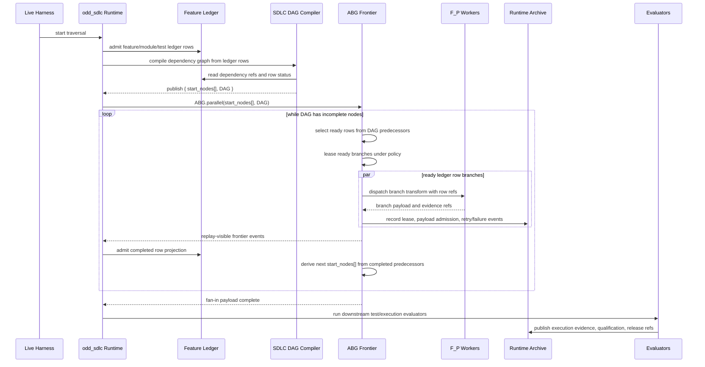

# T-174: Publish SDLC Feature Dependency DAG To ABG Frontier

## STDO Intake

Smallest lawful re-entry point: `requirements`.

Reason: this changes the bridge between SDLC domain topology and ABG execution
topology. The defect is not a local four-lane fixture problem. ABG already proves
that a declared DAG frontier can execute in parallel. The missing SDLC law is the
convention by which odd_sdlc derives a feature/module/test dependency DAG from
its own admitted construction surfaces and publishes that DAG into ABG's frontier
structure.

## Current Finding

Option 1 is proven as ABG substrate behavior. ABG can execute a declared
dependency frontier with bounded parallelism, branch leases, output allocation,
fan-in, and replayable events.

Option 2 is not yet proven as the current SDLC construction path.

T-175 alignment: T-174 runtime proof artifacts are not a standalone report
surface. `sdlc_live_fp_parallel_materialization_frontier.json`,
`sdlc_module_dependency_map.json`, and traversal-selection archives are
cataloged operator-run artifacts under the T-175 artifact catalog. Analyzer and
runtime-gap paths must admit those artifacts through cataloged guards and fail
closed on malformed ABG frontier evidence.

The TypeScript line can derive module and test dependency maps, and T-172/T-173
can select parallel traversal from those maps. The missing convention is how
ledger-tracked feature/module/test work becomes:

```text
SDLC.dependency_graph(feature_ledger) -> { start_nodes[], DAG }
ABG.parallel(start_nodes[], DAG)
```

The DAG identifies dependencies among the feature work items being tracked in
the ledger. `start_nodes[]` is the current dependency-free dispatch frontier.
ABG, not odd_sdlc, advances from that frontier.

The current catalog also carries serializing dependencies: it places
`derive_component_code_surface` before `derive_test_design_surface` and
`derive_component_test_surface`, and makes test surfaces consume
`component_code_surface`. That shape prevents the intended parallel branch
family:

```text
Seq(requirements -> uat_testcases -> design -> modules -> module_dependency_map)
  -> Parallel(
       module_implementation_by_dependency_dag,
       test_cases_or_test_materialization
     )
  -> running_tests
```

T-174 must establish the convention that `module_dependency_map` is the authority
for module implementation branch dependencies and steel-thread derivation, while
testcase/test topology is the authority for the parallel test branch family.
Both are dispatch projections over admitted ledger rows.

## T-175 Review-Fix Integration: 2026-05-22

The T-175 source-truth migration now absorbs T-174 graph truth in the live
installed path:

- live frontier publication consumes both admitted module and test dependency
  maps, plus their traversal selections, before compiling the SDLC DAG;
- malformed dependency-map references fail closed as DAG blocking reasons;
- live frontier artifact admission requires the DAG, start-node, branch,
  fan-in, worker-ref, and conflict fields emitted by the writer;
- runtime gaps report the missing live frontier artifact when parallel
  dependency traversal is selected;
- analyzer output renders Frontier Graph Truth instead of requiring raw JSON
  inspection.

Deterministic checks run after the fix:

- `npm run test:t174:dag-catalog`
- `npm run test:t174:frontier-compiler`

These checks do not satisfy the live closure proof. T-174 closure still requires
a fresh post-T-175 live proof.

## Synthetic Multilane Hardening: 2026-05-22

The deterministic proof suite now includes
`npm run test:t174:synthetic-multilane`. This deeper hello-world multilane
synthetic proof:

- derives test dependency topology from admitted implementation dependency-map
  rows when the component-code edge sees test materialization targets before
  `test_design_surface` exists;
- normalizes selected-output-root-prefixed targets into canonical live branch
  refs such as
  `branch://odd-sdlc/live/derive-component-code-surface/dev-hello`;
- compiles the rooted module/test topology into the live frontier artifact
  shape and validates the artifact admission guard;
- runs the ABG evented saga frontier with four first-batch lanes before fan-in;
- lints the generated component-code handoff prompt and a representative worker
  response for system-data leakage, including framework carrier JSON, live
  frontier JSON, operator-run paths, historical `test_env/test_runs` paths, and
  absolute local workspace paths.

This proof prevents the failed live-run class where synthetic coverage accepted
raw map compilation but missed installed-operator integration, rooted path
normalization, derived test topology, canonical live branch refs, and
prompt/response hygiene. It remains synthetic evidence only; the ticket still
requires a fresh post-migration live proof.

## Closure Proof: 2026-05-22

T-174 closed after T-175 source-truth migration with a focused installed live
proof that starts from conformed authority and staged implementation/test
topology, then lets the installed operator publish the SDLC-derived frontier.

Command:

```bash
ODD_SDLC_TS_T174_FOUR_LANE_HELLO_WORLD_JS_SCENARIO_LIVE=1 \
ODD_SDLC_TS_T174_FOUR_LANE_HELLO_WORLD_JS_SCENARIO_WORKER='process://codex?model=gpt-5.3-codex-spark&effort=medium' \
ODD_SDLC_TS_T174_FOUR_LANE_HELLO_WORLD_JS_SCENARIO_MAX_ADVANCES=4 \
npm run test:t174:four-lane-live
```

Result:

- passed in `330639.484167ms`
- run root:
  `build_tenants/typescript/test_env/test_runs/scenario_t174_parallel_hello_world_js_four_lane_live/20260522T070742023Z_pid25031`
- frontier archive:
  `.ai-workspace/runtime/odd_sdlc/operator-runs/20260522T070830931Z_pid25031/sdlc_live_fp_parallel_materialization_frontier.json`

Frontier evidence:

- `kind`: `sdlc_live_fp_parallel_materialization_frontier`
- `graphTruthSource`: `sdlc_feature_dependency_dag`
- `selectedMethod`: `parallel`
- `laneCount`: `4`
- `devLaneCount`: `2`
- `testLaneCount`: `2`
- `fanInCount`: `1`
- `batchSizes`: `[4, 1]`
- `maxActive`: `4`
- `readyBranchRefs` and `compiledReadyBranchRefs`:
  - `branch://odd-sdlc/live/derive-component-code-surface/dev-hello`
  - `branch://odd-sdlc/live/derive-component-code-surface/dev-world`
  - `branch://odd-sdlc/live/derive-component-code-surface/test-hello`
  - `branch://odd-sdlc/live/derive-component-code-surface/test-world`
- `fanInRows[0].payloadDigest`:
  `payload://odd-sdlc/live/derive-component-code-surface/fan-in`
- `writeTerritoryConflictRefs`: `[]`
- `outputAllocationConflictRefs`: `[]`
- emitted event kinds include:
  `branch_lease_acquired`, `branch_payload_admitted`,
  `branch_lease_released`, `branch_fan_in_projected`

Generated product proof:

- `node --input-type=module -e "const m = await import('./src/index.js'); console.log(await m.helloWorld());"`
  returned `hello world`
- `node --test test/hello.test.js test/world.test.js` passed `2/2`

Analyzer proof:

- current analyzer rehydrates the live run and reports the T-174 frontier under
  `frontierSummary`, including `graphTruthSource`, `dagRef`, `startNodes`,
  `readyBranchRefs`, `compiledReadyBranchRefs`, `branchRows`, `fanInRows`,
  worker refs, and conflict refs
- runtime artifact gaps are `0` after scoping the product graph truth to the
  component-code frontier edge; downstream component-test retries no longer
  invent hidden frontier obligations
- public `gaps` rehydrates the closure archive with
  `edgeClosureDisposition: close`; remaining open rows point at later lifecycle
  `prepare_test_execution_surface` work, not this frontier publication ticket

Post-proof checks:

- `npm run build:semantic`
- `npm run test:t175`
- `npm run test:t174:synthetic-multilane`
- T-174 conformance/bootstrap sandbox
- T-174 four-lane standalone frontier sandbox
- `npm run test:t174`
- `git diff --check`

## Graph Function DAG Convention

Every selected graph function is represented as a DAG, even when the DAG happens
to be a single chain. The existing underlying graph is walked and normalized into
node and dependency declarations. Graph functions must preserve their current
behavior after normalization: a serial chain still runs serially; a graph with
independent ready nodes can expose those nodes to ABG as one dispatch batch.

```text
graph_function
  -> DAG(nodes, dependencies)
  -> edge_traversal_type selects collective ledger inputs
  -> dependency_eval derives ready rows
  -> if graph admits parallel ready rows:
       ABG.parallel(ready_rows, DAG)
     else:
       ABG.parallel([next_ready_row], DAG)
```

The edge traversal type does not decide whether execution is parallel. It
decides the collective input set from the ledger:

```text
min(features) / targeted(features) -> minimal selected_rows
steel_thread(features)             -> dependency-closed selected_rows
full_breadth(features)             -> maximal selected_rows
```

The graph decides whether those selected rows can run together. A ledger may
track ten features while dependency evaluation partitions them as:

```text
dep(1,2,3,4,5)
dep(6,7,8,9)
dep(10)
```

If the graph admits those dependency groups as independent, ABG may run the
current ready rows for each group in parallel. If the graph declares a serial
relation, ABG receives the same DAG but only one row or one dependency group is
ready at a time.

Dependency evaluation comes from admitted SDLC authority, not prompt discretion:

- published graph-function node/edge declarations for the selected graph
- feature/module/test ledger rows and their predecessor refs
- `module_dependency_map` for module implementation dependencies
- test dependency map for test branch dependencies
- write-territory and output-allocation conflict checks before branch leasing
- evaluator policy that selects `min`, `targeted`, `steel_thread`, or
  `full_breadth` rows without dropping deferred residual rows

## Target DAG Shape

The SDLC-derived target shape is:

```text
requirements
  -> uat_testcases
  -> design
  -> modules
  -> module_dependency_map
  -> (
       module_implementation_by_dependency_dag,
       test_case_or_test_materialization_branches
     )
  -> fan-in over source and test artifacts
  -> running_tests
  -> execution evidence / qualification / release
```

Module implementation branches are ordered by `module_dependency_map`. Independent
modules become parallel ABG branches; dependent modules become downstream ABG
branches. The steel thread is derivable from the same map.

Test-case or test-materialization branches may run beside module implementation
when their admitted testcase/test-topology/API authority is sufficient and their
write territories are disjoint. Running tests is not a sibling branch. It waits
for fan-in over source and test artifacts.

## Ledger To Frontier Convention

The feature/module/test ledger is the source of the parallelism array.

```text
parallel_array[] = ledger.rows where unmet_predecessor_refs == []
DAG.nodes = ledger.rows
DAG.edges = ledger row dependency refs
ABG.parallel(parallel_array[], DAG)
```

The ledger rows identify work items. The dependency graph identifies the
ordering relation among those rows. The current dependency-free ledger rows are
the ABG start nodes. odd_sdlc publishes the translation; ABG executes the
frontier.

The traversal labels are collective input-set selectors over the same ledger and
DAG. They are not separate execution models.

```text
min(features) / targeted(features):
  selected_rows = the minimal feature set needed for the scoped outcome or
  repair pressure

steel_thread(features):
  selected_rows = dependency-closed feature set for the selected steel thread

full_breadth(features):
  selected_rows = all admitted feature rows for the edge

for every selector:
  selected_subgraph = DAG restricted to selected_rows plus required dependencies
  parallel_array[] = currently dependency-free rows inside selected_subgraph

edge requirement batch:
  union(row.ownedRequirementRefs for row in parallel_array[])
```

That batch is the pressure passed to the edge traversal. Parallelism comes from
the size and dependency relation of the admitted batch. `min(features)` and
`targeted(features)` are equivalent selectors with different basis pressure:
one starts from the scoped product outcome, the other starts from repair or
failure pressure. Steel thread is `dependent(features)`: it selects a coherent
dependency-closed feature set and can still contain `n` rows. Full breadth is
`max(features)`: it selects the whole admitted feature set. Each selector is
lawful only when deferred ledger rows remain visible as residual pressure
instead of being dropped.

Current TypeScript steel-thread behavior is only a partial precursor to this
model. The older `SdlcFeatureScope` path narrows a worker handoff to included
module names and defers the rest. The newer dependency-map path can name
`steelThreadCandidateNodeIds`. Neither is yet the full T-174 convention until
the selected ledger rows, owned requirement batch, deferred residual rows,
`start_nodes[]`, and ABG frontier declarations are one replay-visible carrier
chain.



## Required Design Decisions

1. Define the SDLC dependency DAG carrier.

   The carrier must include node refs, edge names, predecessor refs, successor
   refs, source asset refs, target asset refs, read refs, write-territory refs,
   output-allocation refs, fan-in refs, and edge-accounting refs.

   It must also carry the ledger refs that own the work items and the
   `start_nodes[]` projection derived from dependency-free rows.

2. Reframe the serial executive step list.

   A serial topological order may remain as a read model for CLI display,
   deterministic replay, and older tests. It must not remain the authority that
   selects branch order after an SDLC dependency DAG is admitted.

3. Split the test-build dependency that currently serializes the graph.

   Test design and test materialization must consume admitted testcase,
   test-topology, tenant test-stack, and public API/design authority. They must
   not require completed component source files merely to write test files. Any
   real code-dependent test adaptation belongs after module/test fan-in as a
   qualification or projection node.

4. Compile SDLC dependency DAG nodes into ABG frontier declarations.

   odd_sdlc publishes branch identity, dependency, read/write/output allocation,
   and edge contract refs. ABG owns ready selection, concurrency caps, lease
   ordering, retry isolation, cancellation, and fan-in event merge.

5. Preserve auditability.

   The archive must show how a branch became ready, what lease ABG granted, what
   worker/evaluator produced the payload, how retries were isolated, and how
   fan-in merged payloads into downstream evidence.

## Work Plan

1. Requirements/product: state that odd_sdlc derives feature/module/test
   dependency DAGs from admitted ledger rows and publishes `{ start_nodes[], DAG
   }` to ABG when dependencies expose parallel ready sets.
2. Design: define the full traversal DAG carrier and the ABG frontier compilation
   contract.
3. Graph catalog: walk existing graph functions and normalize each selected graph
   function into a DAG, preserving current behavior for serial chains while
   exposing independent ready nodes where the graph allows them.
4. Traversal collection: make edge traversal type choose the collective ledger
   input rows (`min`, `targeted`, `steel_thread`, `full_breadth`) before
   dependency evaluation derives the current ready rows.
5. Module implementation: compile `module_dependency_map` into ABG branch
   declarations so independent modules run concurrently and dependent modules
   wait for predecessors.
6. Test pipeline: remove the unconditional `component_code_surface` dependency
   from test-design/test-materialization authority, or split the code-dependent
   portion into a downstream fan-in node.
7. Runtime: make installed operator submit all currently ready SDLC DAG branches
   to ABG frontier execution instead of selecting one `nextGraphVectorRef` by
   serial order.
8. Events/archive: persist branch declarations, ABG lease events, worker process
   refs, payload admissions, retry isolation, fan-in projections, and resulting
   edge fulfillment refs.
9. Analyzer: report DAG nodes, frontier batches, parallel branches, fan-in nodes,
   blocked dependencies, write-territory conflicts, and serializing edges.
10. Tests: add deterministic catalog/DAG/frontier-compiler tests and live sandbox
   assertions that reject harness-selected stage order.
11. Live proof: run the four-lane hello-world sandbox as an installed SDLC run
    where odd_sdlc derives two module implementation lanes and two test lanes,
    then ABG chooses the ready batch before fan-in.

## Proof Plan

Static proof:

- `npm run lint:semantic`
- `npm run build:semantic`

Focused proof:

- `npm run test:t174:dag-catalog`
- `npm run test:t174:frontier-compiler`
- `npm run test:t174:parallel-hello-world-sandbox`
- `npm run test:t174:four-lane-frontier-sandbox`

Live proof:

- `npm run test:scenario:t174-four-lane-hello-world-js-live`

Accepted live proof must show:

- the live harness starts traversal only
- the installed operator publishes admitted SDLC-derived `{ start_nodes[], DAG }`
- ABG selects the first ready batch with four branches: two dev branches and two
  test branches
- each branch carries disjoint write-territory refs and output-allocation refs
- four branch worker/evaluator refs are archived before fan-in
- fan-in waits for all four branch payloads
- downstream test execution waits for fan-in
- analyzer output renders the same batches and event refs from archive truth

## Acceptance

- Option 2 is proven in the installed SDLC line: odd_sdlc translates admitted
  feature/module/test ledger rows into `{ start_nodes[], DAG }` and publishes
  that structure to ABG frontier execution.
- `module_dependency_map` governs module implementation branch dependencies and
  steel-thread derivation.
- Module implementation and test build can run as sibling branch families when
  admitted authority and territories allow it.
- Test execution remains a fan-in successor over source and test artifacts.
- No live harness or odd_sdlc-local loop selects each stage or branch order.
- Analyzer and archive output make proportionality, Min(F_P), branch readiness,
  ABG lease selection, and fan-in decisions replay-auditable.

## Implementation Update - 2026-05-22

Implemented the semantic and sandbox frontier slice:

- added `SdlcFeatureDependencyDag`, `SdlcFeatureDependencyDagNode`,
  `SdlcFeatureDependencyDagEdge`, and `SdlcAbgFrontierCompilation` carriers
- added `operator/feature_dependency_dag.ts` to compile admitted module and test
  dependency maps into an SDLC DAG, derive `startNodes`, detect cycles and
  static write/output conflicts, and publish ABG `DependencyFrontierDeclaration`
  rows
- exported the compiler through the TypeScript tenant public operator index
- updated graph catalog and edge-assurance source contracts so test design and
  test materialization no longer carry an unconditional `component_code_surface`
  precondition
- added deterministic T-174 proof tests for DAG start nodes, ABG frontier runner
  consumption, write/output conflict visibility, and serial-chain preservation
- wired `test:t174:dag-catalog` and `test:t174:frontier-compiler` into
  `test:t174`

Proof run:

- `npm run test:t174` - pass
- `npm run test:t172` - pass
- `npm run lint:semantic` - pass
- `npm run lint:test-harness` - pass
- `git diff --check` - pass

Remaining closure work under this ticket's live closure law:

- fresh post-T-175 proof of installed-operator runtime submission of the
  compiled SDLC DAG to ABG frontier in the live path
- archive/analyzer rendering of DAG nodes, frontier batches, branch leases,
  conflicts, and fan-in refs from runtime truth
- live four-lane installed proof using `npm run
  test:scenario:t174-four-lane-hello-world-js-live`

## T-175 Alignment Update - 2026-05-22

The implementation is now included under T-175 source-truth migration:

- `contracts/product_graph_contract_catalog.ts` carries the T-174 graph truth
  rows for ABG-frontier eligible component implementation and test
  materialization;
- `operator_run_artifact_catalog.ts` owns the T-174 module/test dependency-map,
  traversal-selection, and live frontier artifacts;
- installed-operator live frontier publication derives an
  `SdlcFeatureDependencyDag`, compiles it through
  `compileSdlcFeatureDependencyDagToAbgFrontier`, and submits the compiled
  declaration set to ABG's evented saga frontier;
- the live frontier archive records `graphTruthSource`, `dagRef`, `startNodes`,
  compiled ready refs, and conflict refs as replay-visible T-174 evidence.

No T-174 proof command was rerun during this alignment pass. T-174 closure still
requires a fresh post-migration T-174 proof run.
