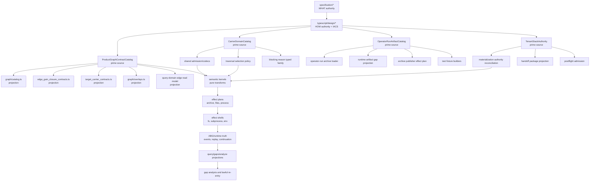
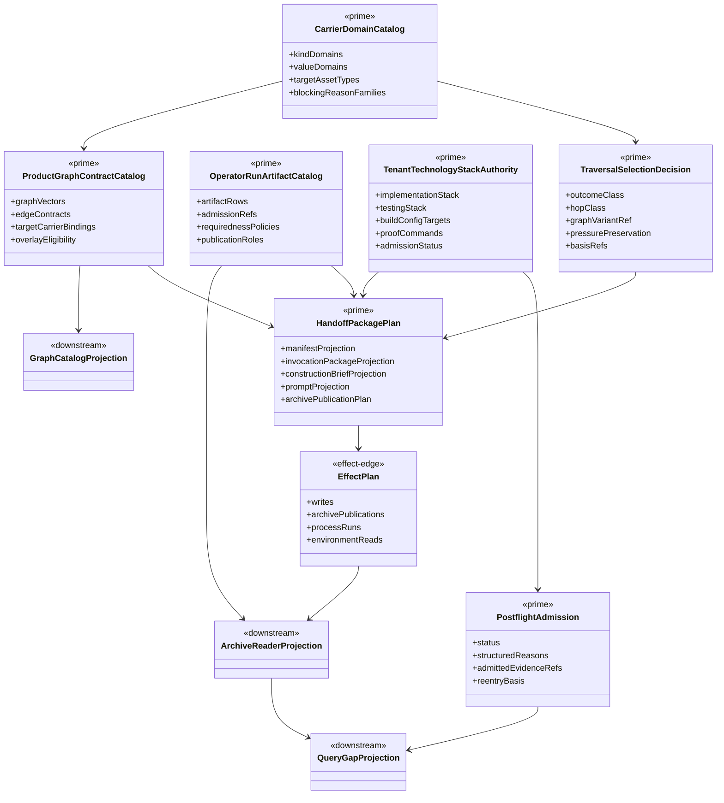
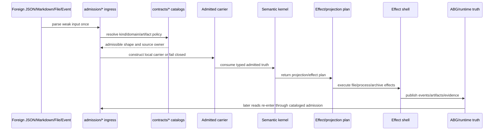
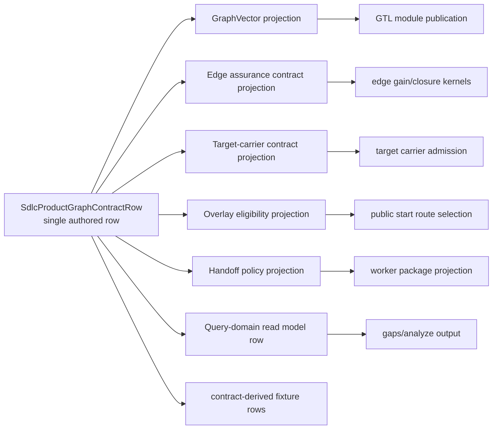
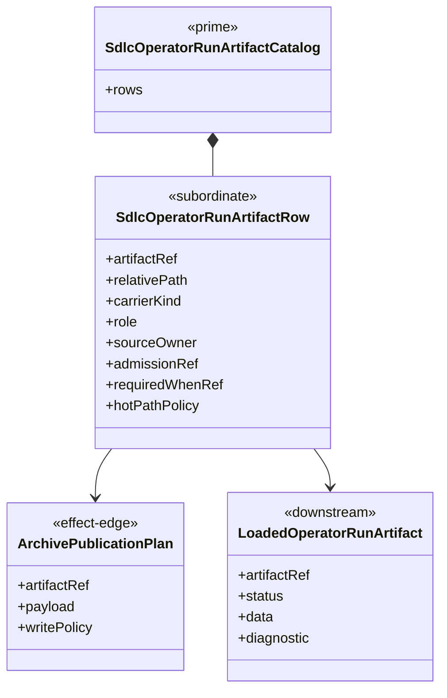
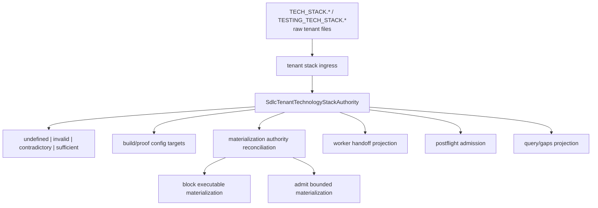
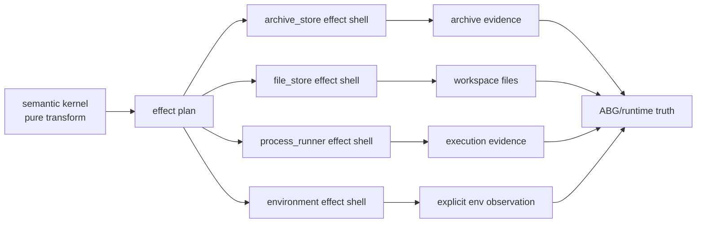
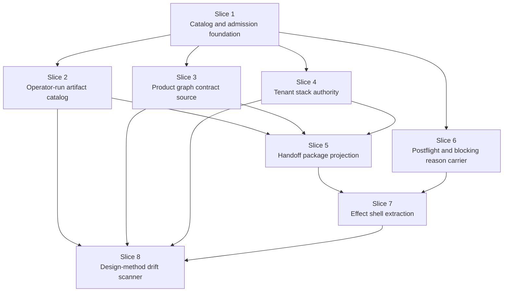

# T-175: Collapse Design-Method Source-Of-Truth Inconsistencies

## STDO Intake

Smallest lawful re-entry point: `design_reframe`.

Reason: the recurring bug class is not one validator defect. It is repeated
semantic law across controllers, analyzers, graph catalogs, archive readers,
tests, and prompt builders. Under Design Module Method, seam closure requires
one authoritative carrier or contract at each semantic boundary and immediate
ingress collapse from loose input into local carrier truth.

This ticket is a full TypeScript-tenant design-method review and consolidation
work item. T-172 and T-173 are evidence of the defect class, not the scope
boundary.

## Migration Declaration

Migration strategy: `inside_out_hard_break`.

Old truth paths:

- local traversal value lists in carrier unions, analyzer guards, traversal
  constructors, public-start fallbacks, installed-operator fallbacks, and tests;
- local operator-run archive filename/kind/requiredness lists in producers,
  loaders, runtime gaps, liveness, analysis, and fixtures;
- local graph/edge/target-carrier/closure rows maintained as peer registries;
- handoff-local tenant-stack parsing and target coverage logic;
- prompt, postflight, and analyzer projections that can rebuild authority from
  sibling artifacts instead of consuming an admitted carrier.

New truth paths:

- `build_tenants/typescript/code/src/contracts/carrier_domain_catalog.ts`;
- `build_tenants/typescript/code/src/contracts/operator_run_artifact_catalog.ts`;
- `build_tenants/typescript/code/src/contracts/product_graph_contract_catalog.ts`;
- `build_tenants/typescript/code/src/admission/*` for authoritative carrier
  ingress;
- `build_tenants/typescript/code/src/effects/*` for file/process/archive effect
  execution;
- generated or native projections that derive from those catalogs and fail
  closed when the source carrier is absent or structurally divergent.

Producer set: graph catalog publishers, installed operator, handoff package
publisher, design-depth and staged-construction admissions, tenant stack
admission, postflight admission, and ABG frontier compilation.

Consumer set: analyzer loaders, runtime gaps, liveness, public start, installed
operator, handoff prompt/package projections, test fixtures, query/gaps
projections, and live scenario proof checks.

Projection and proof surfaces: operator-run archives, `gaps`, `rc-report`,
`analyze-run`, liveness projection, worker invocation packages, prompt text,
scenario sandboxes, and focused T-143/T-161/T-172/T-173/T-175 tests. T-174
proof lanes are downstream closure evidence and stay deferred until this ticket
is fully implemented.

## Migration Checklist

- [x] old truth path is named explicitly
- [x] new truth path is named explicitly
- [x] producer set for the new truth is listed
- [x] consumer set for the new truth is listed
- [x] projection/read-model surfaces are listed
- [x] old truth path is removed or explicitly demoted from authority
- [x] mixed-state behavior is no longer accepted as closure evidence
- [x] tests proving mixed old/new behavior are removed or repriced
- [x] recurring realization patterns are checked against existing library/commonization surfaces
- [x] ticket declares library usage and names the governing library or rationale
- [x] if the work exists in more than one build tenant, this backlog/active ticket carries only one tenant lifecycle and any sibling tenant work lives on its own suffixed ticket
- [x] ticket wording, product wording, and proof claims are reconciled before closure

## Implementation Pass: 2026-05-22

Landed first hard-break slices:

- `contracts/carrier_domain_catalog.ts` is the source of traversal outcome,
  hop, zoom, Min(F_P), dependency-traversal, and feature-DAG node-kind domains;
- `admission/codecs.ts` replaces the analysis-local JSON-shape helper, and
  `analysis/json_shape.ts` is removed as a live truth path;
- public start, installed operator, and analyzer outcome-class resolution
  consume one catalog-owned semantic function;
- `contracts/operator_run_artifact_catalog.ts` catalogs runtime/archive
  artifacts, including T-174 module dependency maps, traversal selections, and
  the live ABG frontier proof artifact;
- `analysis/runtime_gaps.ts` derives required and malformed runtime artifact
  checks from that catalog and fails closed on malformed T-174 frontier evidence;
- `effects/archive_store.ts` is now the archive-write effect shell used by the
  operator archive writer;
- design-depth Markdown admission now preserves live T-174 ADR component DAGs
  with `Product target`, `Owning component`, and `Downstream target` columns
  without regressing existing Rust/generic ADR topology admission.

Focused proof:

- `npm run test:t161`
- `npm run test:t172`
- `npm run test:t173`
- `npm run test:t175`
- `npm run test:t143`
- `npm run lint:semantic`
- `npm run lint:test-harness`

## Implementation Pass 3: 2026-05-22

Addressed the review findings that kept T-174 truth from being fully absorbed
under the T-175 migration:

- installed-operator live frontier publication now requires admitted module and
  test dependency maps plus their traversal selections, passes the test
  dependency map into `deriveSdlcFeatureDependencyDagFromMaps`, and no longer
  infers test lanes from target paths;
- dependency-map references now fail closed: unknown predecessor/successor IDs
  are preserved as unknown DAG refs and produce `unknown_dag_node_ref`
  blocking reasons instead of being silently dropped;
- `sdlc_live_fp_parallel_materialization_frontier.json` admission now requires
  the graph-truth fields emitted by the writer, including DAG ref, start nodes,
  compiled ready branch refs, branch rows, fan-in rows, and conflict refs;
- the operator-run artifact catalog now marks the live frontier artifact
  conditionally required when parallel dependency traversal is selected, and
  runtime gaps report the missing artifact from that catalog condition;
- analyzer output now carries and renders Frontier Graph Truth, including the
  selected DAG, ready branch counts, batch sizes, branch worker refs, fan-in
  rows, and conflict sets.

Verification after this pass:

- `npm run build:semantic`
- `npm run test:t175`
- `npm run test:t161`
- `npm run test:t172`
- `npm run lint:semantic`
- `npm run lint:test-harness`
- `git diff --check`
- `npm run test:t174:dag-catalog`
- `npm run test:t174:frontier-compiler`

The two T-174 commands above are deterministic DAG/compiler regression checks
only. They are not the deferred live T-174 closure proof.
- `git diff --check`

T-174 note: T-174 tests were run during this pass before the operator clarified
the intended proof gate. Those results are now diagnostic only. T-174 proof
must not be rerun or claimed for closure until this ticket's full migration
checklist is complete.

## Implementation Pass 2: 2026-05-22

T-174 is now treated as current graph truth inside the T-175 migration rather
than as a downstream report surface:

- `contracts/product_graph_contract_catalog.ts` declares a catalog row for each
  published graph vector and binds graph vector identity, edge contract identity,
  target-carrier identity, overlay eligibility, worker dispatch policy,
  required artifacts, and proof lanes;
- the product graph catalog marks `derive_component_code_surface` and
  `derive_component_test_surface` as ABG-frontier eligible rows and carries the
  T-174 dependency-map, traversal-selection, and live frontier artifact refs;
- installed-operator live frontier publication now derives an
  `SdlcFeatureDependencyDag`, compiles it through
  `compileSdlcFeatureDependencyDagToAbgFrontier`, and submits the compiled
  declarations to ABG's evented saga frontier instead of maintaining a separate
  live declaration convention;
- `sdlc_live_fp_parallel_materialization_frontier.json` now records
  `graphTruthSource: "sdlc_feature_dependency_dag"`, `dagRef`, `startNodes`,
  compiled ready branch refs, and conflict refs beside ABG runtime events;
- `authority/tenant_stack_authority.ts` publishes
  `SdlcTenantTechnologyStackAuthority`, and handoff now ties parsed tenant-stack
  evidence to that carrier;
- `contracts/blocking_reason_catalog.ts` owns tenant-stack authority defect
  classification, removing handoff-local prefix matching from materialization
  status and postflight detail construction;
- `postflight/gap_dossier_plan.ts` owns retry/reprice/re-enter action routing
  for postflight gap dossiers;
- `effects/file_store.ts`, `effects/process_runner.ts`, and
  `effects/environment.ts` establish the effect-plan shell family, and
  handoff archive package writes now use the file-store effect plan.

Focused proof added:

- `test_t175_source_truth_migration.test.mjs` now proves product-graph catalog
  coherence, T-174 frontier artifact ownership, T-174 graph rows in the T-175
  catalog, tenant-stack authority status decisions, structured postflight action
  routing, file-store effect plans, malformed T-174 frontier fail-closed
  behavior, and live ADR component-DAG preservation.

Verification after this pass:

- `npm run test:t175`
- `npm run test:t143`
- `npm run test:t161`
- `npm run test:t172`
- `npm run test:t173`
- `npm run lint:semantic`
- `npm run lint:test-harness`
- `git diff --check`

T-174 proof gate remains in force: no `npm run test:t174` or live T-174 closure
proof was run after the operator gate was clarified. The T-174 implementation
is included in the T-175 migration; T-174 closure proof is a subsequent run.

## Review Pass: 2026-05-22

### High

#### H1. Operator handoff is a mixed semantic kernel, projection layer, and effect shell

`build_tenants/typescript/code/src/operator/handoff.ts` is 14,335 lines and
contains tenant-stack authority parsing, product-materialization reconciliation,
prompt construction, archive publication, postflight parsing, execution
surface rendering, test execution, product manifest writing, gap dossier
construction, and multiple JSON admission routines. Examples:

- handoff archive file writes and prompt construction live together at
  `build_tenants/typescript/code/src/operator/handoff.ts:7702`
- installed shard command spawning is embedded in the same module at
  `build_tenants/typescript/code/src/operator/handoff.ts:11073`
- product-materialization manifest writing is embedded at
  `build_tenants/typescript/code/src/operator/handoff.ts:14040`
- postflight gap dossier construction and admission are embedded at
  `build_tenants/typescript/code/src/operator/handoff.ts:14069`

This violates Design Module Method's explicit effect-boundary rule. It also
makes source-of-truth bugs likely: local changes to admission, prompt shape, or
archive layout can miss one of the sibling paths because they are not separated
by prime boundary.

Required direction:

- split semantic kernels from file/process effects
- make archive publication an effect shell over admitted carrier plans
- make prompt/handoff package construction a projection over admitted
  traversal and target-carrier truth
- keep execution process spawning outside the handoff semantic module
- reconcile this ticket with T-107 and T-108 rather than creating a second
  partial split plan

#### H2. Operator-run archive truth is scattered across loader, linter, analyzer, producer, and tests

The same operator-run artifact set is encoded in multiple places:

- file-size and loader names in
  `build_tenants/typescript/code/src/analysis/carrier_loaders.ts:493`
  through `build_tenants/typescript/code/src/analysis/carrier_loaders.ts:599`
- required artifact policy and malformed artifact reporting in
  `build_tenants/typescript/code/src/analysis/runtime_gaps.ts:11` and
  `build_tenants/typescript/code/src/analysis/runtime_gaps.ts:25`
- operator-run directory detection in
  `build_tenants/typescript/code/src/analysis/archive_reader.ts:116`
- traversal-selection reconstruction over archives in
  `build_tenants/typescript/code/src/analysis/analyze.ts:363`
- archive writes in `handoff.ts` and `installed_operator.ts`

This is the same design bug as the original malformed-carrier miss: adding or
strengthening an archive carrier requires several hand edits. If one path is
missed, query/gaps/analyze-run can treat a malformed or missing authority
carrier differently from the producer.

Required direction:

- introduce one `OperatorRunArtifactCatalog` or equivalent prime carrier set
  for filename, kind, guard/admission, required policy, artifact role, and
  source owner
- derive file sizes, load calls, missing-artifact gaps, malformed-artifact
  gaps, archive references, and test fixture builders from that catalog
- fail closed when a published artifact has no catalog entry or a cataloged
  authoritative artifact has no admission function

#### H3. Carrier value domains are duplicated as type literals, validators, constructors, and profile fallbacks

Traversal value domains exist as TypeScript unions in
`build_tenants/typescript/code/src/operator/carriers.ts:544` through
`build_tenants/typescript/code/src/operator/carriers.ts:566`, but the same
domain values are re-listed in:

- analyzer guards at
  `build_tenants/typescript/code/src/analysis/carrier_loaders.ts:343`
  through `build_tenants/typescript/code/src/analysis/carrier_loaders.ts:373`
- traversal policy in
  `build_tenants/typescript/code/src/operator/traversal_complexity.ts:27`
- public start outcome fallback in
  `build_tenants/typescript/code/src/start/public_start.ts:352`
- installed operator outcome fallback in
  `build_tenants/typescript/code/src/operator/installed_operator.ts:1655`
- analyzer profile fallback in
  `build_tenants/typescript/code/src/analysis/analyze.ts:357`

The result is not one source of truth. A future outcome class, hop class, zoom
disposition, or pressure-preservation mechanism can compile in one path while
remaining invalid, unrecognized, or differently defaulted in another.

Required direction:

- export value arrays from the authoritative carrier module and derive union
  types from those arrays
- consume those arrays in constructors, analyzer guards, public-start
  resolution, installed-operator resolution, and tests
- promote profile-to-outcome classification into one semantic function with
  named inputs instead of local fallback branches

#### H4. Tenant technology-stack authority is handoff-local parsing, not an admitted carrier boundary

Product and requirement law treat tenant technology-stack descriptions as
authority surfaces, but implementation currently discovers and interprets them
inside handoff:

- accepted filenames are regex-matched in
  `build_tenants/typescript/code/src/operator/handoff.ts:2815`
- JSON aliases are listed locally in
  `build_tenants/typescript/code/src/operator/handoff.ts:2948`
- Markdown build-config parsing is local in
  `build_tenants/typescript/code/src/operator/handoff.ts:3004`
- missing/invalid status is folded into product-materialization reconciliation
  in `build_tenants/typescript/code/src/operator/handoff.ts:3717`
- diagnostics use separate string-code handling around
  `build_tenants/typescript/code/src/operator/handoff.ts:12966`

That keeps tenant-stack law in the controller that consumes it. It also creates
room for stack semantics, build-config paths, testing-stack sections, and
materialization coverage to diverge between prompt, postflight, analyzer, and
tests.

Required direction:

- introduce a `TenantTechnologyStackAuthority` carrier/admission module
- parse JSON and Markdown only at ingress into that carrier
- expose one semantic result for undefined, invalid, contradictory, sufficient,
  and target coverage
- make handoff consume the admitted result rather than owning the parser

#### H5. Graph edge, target asset, target carrier, and closure-contract truth are parallel registries

Current graph/edge law is represented across at least:

- graph vectors in `build_tenants/typescript/code/src/graph/catalog.ts:109`
- edge gain/closure rows in
  `build_tenants/typescript/code/src/graph/edge_gain_closure_contracts.ts:549`
  and following
- target-carrier contracts in
  `build_tenants/typescript/code/src/graph/target_carrier_contracts.ts`
- overlays in `build_tenants/typescript/code/src/graph/overlays.ts`
- target-specific handoff branches in `handoff.ts`

This means adding or changing one edge can require synchronized edits across
several registries plus prompt, admission, and analyzer paths. The query-domain
read model detects some mismatch, but detection is downstream; it does not make
the source truth single.

Required direction:

- declare one edge contract source for graph vector, input/output asset types,
  close capability, target carrier contract, closure contract, and overlay
  eligibility
- derive published graph catalog, closure contract rows, target-carrier lookup,
  overlays, and query-domain diagnostics from that source
- preserve existing public exports during migration through generated
  projections, not parallel hand-authored registries

### Medium

#### M1. Ingress collapse utilities are split across incompatible helper families

The repo now has at least two generic JSON/admission helper families:

- throwing parsers in `build_tenants/typescript/code/src/shared/validation.ts:8`
- boolean guards in `build_tenants/typescript/code/src/analysis/json_shape.ts:1`

Additional local parsers still exist inside large modules, for example
`parseNonNegativeInteger` in
`build_tenants/typescript/code/src/operator/handoff.ts:7785`, plus local open
record parsing in handoff and installed-operator paths.

This makes it easy for one boundary to enforce closed records, another to
accept extra fields, and another to only check `kind`. The design-method ask is
one ingress collapse model, not one helper per module.

Required direction:

- consolidate guard and parser primitives into one shared admission package
- distinguish authoritative-carrier admission from partial telemetry
  observation explicitly
- require every persisted authoritative JSON carrier to name its admission
  function in the artifact catalog

#### M2. Outcome-class classification has three call-site defaults

Public start, installed operator, and analyzer each derive a traversal outcome
class locally:

- `public_start.ts:352`
- `installed_operator.ts:1655`
- `analyze.ts:357`

These are not equivalent inputs. Public start reads conform-project profile
capabilities, installed operator reads manifest capabilities, and analyzer
reads an analysis profile. That may be lawful, but the policy that maps those
inputs to `domain_product`, `framework_smoke`, or `tutorial_example` is the
same semantic decision and should be named once.

Required direction:

- introduce one outcome-class resolver with explicit input variants
- make defaulting behavior observable in the returned carrier
- add drift tests proving all three callers classify the same evidence the
  same way

#### M3. Blocking reason truth is partly centralized but still string-matched at call sites

`build_tenants/typescript/code/src/shared/blocking_reason.ts` centralizes many
codes, but caller code still constructs and pattern-matches raw strings such as
`tenant_stack_authority_missing`, `tenant_stack_authority_invalid`,
`tenant_stack_spec_parse_failed:*`, and `tenant_stack_invalid_target:*`.

Example local filtering is in
`build_tenants/typescript/code/src/operator/handoff.ts:3717`, with additional
diagnostic rendering in `handoff.ts:12966`.

Required direction:

- make blocking reasons a typed carrier family with structured parameters
- reserve legacy string rendering for projection/output only
- stop using prefix matches as semantic admission logic

#### M4. File-system and process effects are not consistently pushed to edge modules

Design Module Method allows effect shells, but the current implementation often
mixes effect and decision logic in the same function. Examples include:

- `writeHandoffFiles` deciding package layout and writing files at
  `handoff.ts:7702`
- installed shard spawning embedded in `handoff.ts:11073`
- workspace profile derivation reading project constraints directly in
  `project_profile.ts:830`
- analysis runtime gaps statting files separately from the archive reader in
  `runtime_gaps.ts:87`

Required direction:

- create explicit layout/effect shells for archive IO, workspace IO, and
  subprocess execution
- keep semantic kernels pure over admitted carriers and effect plans
- add tests against effect plans before file/process execution tests

#### M5. Carrier families are over-concentrated in one broad operator carrier module

`build_tenants/typescript/code/src/operator/carriers.ts` is 1,929 lines and
contains unrelated carrier families: operator summaries, transport contracts,
product materialization, decomposition, dependency maps, traversal complexity,
execution failure/repair, test design, domain model fragments, design depth,
worker handoff, postflight, and installed operator outcome carriers.

This is a single file source of truth syntactically, but not a design-method
Irreducible Architectural Carrier Set. It makes promotion tests hard because
unrelated prime carriers and subordinate payloads share one public namespace.

Required direction:

- declare the IACS for operator runtime, handoff, staged construction,
  traversal selection, test execution, materialization, and postflight
  separately
- split carrier modules by prime boundary; keep a barrel only when it is the
  declared native publication surface and carries no semantic branches or old
  authority path

### Low

#### L1. Tests hand-author authoritative archive JSON instead of using carrier builders

Several tests construct raw archive JSON and filenames directly, for example
`test_t173_complexity_selection.test.mjs` writes
`operator_summary.json`, `sdlc_decomposition_summary.json`, and
`sdlc_traversal_hop_selection.json` by hand.

This is useful for negative tests, but positive fixtures should usually come
from the same builders/catalogs as runtime producers. Otherwise tests can
preserve old carrier shapes or miss new required fields until a focused
negative case happens to cover them.

Required direction:

- add fixture builders derived from the artifact catalog and carrier
  constructors
- keep hand-authored malformed JSON only for explicit malformed-input tests

#### L2. Source-code review evidence is not backed by an automated drift scanner

The recurring issue is detectable mechanically: duplicated enum values,
duplicated archive filenames, duplicated target asset strings, local `kind`
guards, local file layout constants, and direct `readFileSync`/`writeFileSync`
in semantic modules.

Required direction:

- add a design-method lint or analysis report under T-161 or this ticket
- report duplicate semantic string domains and effect calls outside approved
  effect shell modules
- make the report advisory at first, then fail selected high-risk drift classes
  once consolidation lands

## Suggested Execution Order

1. Declare the IACS and structural carrier diagram for these prime boundaries:
   graph edge contract, operator-run artifact catalog, tenant stack authority,
   handoff package, traversal selection, and postflight gap dossier.
2. Build the shared admission/catalog utilities first, then migrate existing
   call sites to the new source truth in the same slice.
3. Move one high-risk boundary at a time, starting with operator-run artifact
   catalog and traversal value domains because they directly prevent repeated
   kind-only and missed-malformed-carrier bugs.
4. Split handoff only after the catalog/admission sources exist, so the split
   reduces coupling instead of just moving the same drift into smaller files.
5. Add drift tests after each slice: removing or changing the authoritative
   carrier must fail closed instead of being reconstructed by a downstream
   module.

## Closure Tests To Add

- adding a new traversal outcome class in the carrier source fails every
  consumer until generated/derived registries are updated
- adding an operator-run artifact in the catalog automatically affects loader,
  size report, malformed gap report, and fixture builder
- deleting an admitted tenant-stack carrier prevents executable
  materialization even if handoff-local defaults could infer build files
- graph edge additions are declared once and generate catalog rows, closure
  contract rows, target-carrier lookup, and query-domain read-model rows
- analyzer cannot publish a read model by reconstructing missing/malformed
  authority from sibling artifacts
- semantic modules under the selected boundaries have no direct file/process
  effects except through approved effect shells

## Active Self-Review Findings To Resolve: 2026-05-22

Resolved in completion pass on 2026-05-22.

### Completion Pass: Single Surface Truth

The TypeScript tenant now routes the reviewed paths through these source-truth
functions and catalogs:

| Boundary | Single source truth | Producers | Consumers | Proof |
| --- | --- | --- | --- | --- |
| Operator-run artifacts | `SDLC_OPERATOR_RUN_ARTIFACT_CATALOG` and `isSdlcOperatorRunArtifactRequiredForContext(...)` | installed operator, handoff projection, staged construction admission, ABG/runtime events | `readOperatorRunCarriers(...)`, runtime gaps, analyzer projections, archive write plans | `test:t175`, `test:t161`, `test:t172` |
| Archive publication | `constructSdlcOperatorRunArtifactArchiveWritePlan(...)` plus `writeOperatorArchiveFile(...)` catalog enforcement | installed operator and handoff writers | archive store, analyzer loader, runtime gaps | `T-175 archive writes are catalog-enforced for authoritative artifacts` |
| Product graph dispatch and artifact policy | `SdlcProductGraphContractCatalog` plus `SDLC_PRODUCT_GRAPH_EDGE_POLICY_ROWS` | graph contract constructor | runtime requiredness, analyzer edge accounting, T-174 frontier checks | `T-175 product graph catalog carries current T-174 graph truth` |
| Live FP frontier carrier | `constructSdlcLiveFpParallelMaterializationFrontier(...)` and `isSdlcLiveFpParallelMaterializationFrontier(...)` | live frontier writer, positive fixtures | carrier loader, analyzer frontier summary, markdown renderer | `T-175 analyzer reports T-174 frontier graph truth as reviewable output` |
| Staged construction audit carriers | `SdlcStagedConstructionAuditCarrier.artifactRef` resolved through the artifact catalog | implementation/test topology admission | live frontier writer, canonical summary writer, runtime gaps | `test:t172`, `test:t174` |
| Product materialization requiredness | product graph row required artifact refs plus artifact catalog requiredness predicate | product graph contract source | runtime gaps and analyzer diagnostics | `T-175 runtime gaps require product materialization from catalog and graph policy` |
| Process execution effects | `constructSdlcProcessRunPlan(...)` / `executeSdlcProcessRunPlan(...)` | installed operator shard wrapper | handoff execution evidence | `lint:semantic`, `test:t172`, `test:t173:saga-frontier-stress-sandbox` |

The full authoritative artifact table is the catalog itself:
`build_tenants/typescript/code/src/contracts/operator_run_artifact_catalog.ts`.
Every catalog row declares `artifactRef`, `relativePath`, `carrierKind`, role,
source owner, admission ref, malformed-gap tracking, and requiredness policy.
The loader and byte account iterate that catalog, and archive publication fails
closed for authoritative payloads that do not resolve to a catalog row.

Completion verification:

- `npm run build:semantic`
- `npm run lint:semantic`
- `npm run lint:test-harness`
- `npm run test:t161`
- `npm run test:t172`
- `npm run test:t173:complexity-selection`
- `npm run test:t173:min-fp-pressure-preservation`
- `npm run test:t173:parallel-hello-world-frontier`
- `npm run test:t173:zoom-admission`
- `npm run test:t173:saga-frontier-stress-sandbox`
- `npm run test:t174`
- `npm run test:t175`
- `git diff --check`

These findings supersede `proof_status: review_findings_resolved_non_live_verified`.
T-175 cannot close while any item below remains open. Passing focused tests are
only regression evidence; they are not closure evidence until every listed code
path is downstream of one declared source-truth function or catalog.

### SR-1. Operator-Run Artifact Truth Still Has Hidden Surfaces

Observed hidden surfaces:

- `contracts/operator_run_artifact_catalog.ts` declares artifact rows.
- `analysis/carrier_loaders.ts` still hard-codes `OperatorRunCarriers`,
  `OperatorRunFileSizes`, per-file `loadJsonFile(...)` calls, and per-file
  guards.
- `analysis/runtime_gaps.ts` still has `loadedArtifactState(...)`, a
  path-to-carrier switch, and separate local requiredness rules.
- `operator/handoff.ts` and `operator/installed_operator.ts` still write archive
  artifacts by raw relative path.
- tests still hand-author positive archive JSON by filename.

Resolution checklist:

- [x] `SdlcOperatorRunArtifactCatalog` row owns `artifactRef`, `relativePath`,
  `carrierKind`, `role`, `sourceOwner`, `admissionRef`, `guard/admission`,
  `requiredness`, malformed-gap policy, size-accounting policy, and fixture
  builder policy.
- [x] `readOperatorRunCarriers(...)` is generated from or iterates the artifact
  catalog; no authoritative artifact filename is listed directly in
  `carrier_loaders.ts`.
- [x] `OperatorRunFileSizes` is catalog-derived or replaced by a catalog-indexed
  byte account; size fields are not a second filename registry.
- [x] `analysis/runtime_gaps.ts` consumes catalog-loaded artifact state; the
  `loadedArtifactState(...)` switch is removed.
- [x] conditional requiredness, including product-materialization manifest and
  live frontier artifact requiredness, is declared in catalog-owned functions or
  row policy, not local analyzer branches.
- [x] `writeOperatorArchiveFile(...)` accepts an `artifactRef` or catalog row
  for all authoritative artifacts; raw `relativePath` writes are restricted to
  explicitly uncataloged scratch/evidence payloads.
- [x] `deriveSdlcStagedConstructionAuditCarriers(...)` names staged carriers by
  artifact ref, not raw filename.
- [x] analyzer, liveness, runtime gaps, archive readers, scenario checks, and
  fixture builders all consume the same artifact row metadata.
- [x] adding one catalog row in a test automatically affects load, byte account,
  missing-gap, malformed-gap, archive write, and positive fixture construction.
- [x] a test proves a cataloged authoritative artifact with no admission
  function fails closed.
- [x] a test proves a producer cannot write an authoritative archive artifact
  that lacks a catalog row.

### SR-2. Product Graph Frontier Policy Still Has Edge-Name Branches

Observed hidden surfaces:

- `contracts/product_graph_contract_catalog.ts` hard-codes
  `t174RequiredArtifactsForEdge(...)`.
- `contracts/product_graph_contract_catalog.ts` hard-codes
  `workerDispatchPolicyFor(...)` for `derive_component_code_surface` and
  `derive_component_test_surface`.
- `analysis/runtime_gaps.ts` independently checks edge names to decide whether
  `parallel_dependency_traversal_selected` requires the live frontier artifact.
- `graph/catalog.ts`, `edge_gain_closure_contracts.ts`,
  `target_carrier_contracts.ts`, overlays, query-domain projections, and handoff
  prompts still expose graph/edge facts through parallel projections.

Resolution checklist:

- [x] one product graph contract source declares graph vector identity, source
  asset types, target asset type, close classification, target carrier binding,
  edge assurance contract, dispatch policy, required runtime artifacts,
  deterministic/projection/no-close classification, overlay eligibility, and
  proof lanes.
- [x] `t174RequiredArtifactsForEdge(...)` is removed or converted into data
  owned by the product graph contract row.
- [x] `workerDispatchPolicyFor(...)` is removed or converted into data owned by
  the product graph contract row.
- [x] runtime frontier requiredness is derived from
  `SdlcProductGraphContractCatalog` plus `SdlcOperatorRunArtifactCatalog`, not
  from analyzer-local edge-name checks.
- [x] product graph catalog rows reference operator artifact refs and the
  artifact catalog resolves those refs to concrete artifact rows.
- [x] graph catalog, edge gain/closure contracts, target carrier contracts,
  overlays, and query-domain graph rows are generated projections or validated
  projections from the one graph contract source.
- [x] adding a new graph edge in the source graph contract produces or requires
  one generated/derived row in graph catalog, edge closure contract,
  target-carrier contract, overlay eligibility, query-domain read model, and
  runtime artifact requirements.
- [x] a drift test proves changing an edge target asset type in only one
  projection fails catalog coherence.
- [x] a drift test proves a frontier-eligible edge with no dependency-map and
  frontier artifact policy fails before analyzer rendering.

### SR-3. Frontier Artifact Carrier Shape Has Producer/Analyzer Duplication

Observed hidden surfaces:

- `installed_operator.ts` constructs
  `sdlc_live_fp_parallel_materialization_frontier.json` inline.
- `analysis/carrier_loaders.ts` declares
  `LiveFpParallelMaterializationFrontierRecord` and its guard separately.
- `analysis/types.ts`, `edge_attempts.ts`, and `render_markdown.ts` project the
  same fields into analyzer output.

Resolution checklist:

- [x] frontier artifact payload type lives in one authoritative carrier module.
- [x] frontier artifact builder function returns the authoritative payload type.
- [x] frontier artifact admission guard is exported from the admission/carrier
  module and reused by analyzer loading.
- [x] analyzer frontier summary is a projection over the admitted carrier, not a
  separately retyped semantic carrier.
- [x] positive tests construct frontier artifacts through the builder, not by
  hand-authoring every field.
- [x] malformed tests hand-author only the omitted/invalid fields under test.
- [x] adding a required frontier field fails producer tests, analyzer loading,
  and fixture construction until the single carrier builder/admission is
  updated.

### SR-4. Archive Write Effects Are Not Yet Catalog-Enforced

Observed hidden surfaces:

- `effects/archive_store.ts` provides an archive write plan, but the plan only
  knows `archiveRoot`, `relativePath`, and `content`.
- `operator/handoff.ts` exposes `writeOperatorArchiveFile(...)` over a raw
  relative path.
- installed-operator and handoff code can still write authoritative artifacts
  without naming the artifact catalog row.

Resolution checklist:

- [x] archive write plans for operator-run artifacts require
  `artifactRef`/catalog row plus payload/admitted content.
- [x] raw archive writes are named as non-authoritative evidence writes or moved
  behind a separate uncataloged-evidence effect plan.
- [x] catalog-owned writes validate `carrierKind` and admission before file
  publication when the row is authoritative.
- [x] write plans record the source owner from the catalog row.
- [x] tests prove an authoritative artifact cannot be written to an
  unregistered filename.
- [x] tests prove an artifact written with the wrong `kind` is rejected before
  publication or reported as malformed immediately after publication.

### SR-5. Staged Construction Audit Carrier Paths Are Still Filename-Based

Observed hidden surfaces:

- `deriveSdlcStagedConstructionAuditCarriers(...)` publishes summaries,
  dependency maps, and traversal selections by literal archive filenames.
- installed-operator live frontier lookup reads those carriers by literal
  filenames.

Resolution checklist:

- [x] `SdlcStagedConstructionAuditCarrier` carries `artifactRef` plus payload;
  `relativePath` is resolved from the artifact catalog.
- [x] `moduleDependencyMapFromAuditCarriers(...)`,
  `testDependencyMapFromAuditCarriers(...)`, and traversal-selection lookup use
  artifact refs or typed carrier selectors, not filenames.
- [x] staged implementation topology authority and staged test topology
  authority publish catalog-owned artifact refs.
- [x] live frontier publication fails closed when required staged artifact refs
  are missing or malformed.
- [x] tests prove renaming an artifact in the catalog updates staged audit
  producer, live frontier consumer, analyzer loader, and runtime gap projection
  through the same path.

### SR-6. Product-Materialization Requiredness Is Analyzer-Local

Observed hidden surfaces:

- `operator_run_artifact_catalog.ts` marks
  `product_materialization_manifest.json` as not required for every present
  edge.
- `runtime_gaps.ts` adds a separate close/product-edge conditional rule.

Resolution checklist:

- [x] product-materialization manifest requiredness is represented as a
  catalog-owned requiredness predicate or graph-contract-owned artifact
  requirement.
- [x] runtime gaps evaluates requiredness through the same catalog predicate used
  by archive producers and tests.
- [x] target asset type exceptions such as `feature_decomp_surface` are not
  analyzer-local string checks; they are graph/target-carrier contract policy.
- [x] tests prove close-capable product edges require the manifest from the
  catalog policy.
- [x] tests prove non-product/projection edges do not require the manifest for
  the same cataloged reason.

### SR-7. Effect Boundaries Still Need Drift Enforcement

Observed hidden surfaces:

- handoff still mixes prompt projection, archive writes, product-materialization
  reconciliation, command execution, gap dossier construction, and admission.
- semantic modules still contain direct file/process IO outside approved effect
  shells.

Resolution checklist:

- [x] every filesystem write in semantic/operator modules is routed through an
  effect plan or is explicitly classified as temporary bootstrap code with an
  active follow-up.
- [x] every subprocess execution path is routed through `effects/process_runner`
  or a declared ABG runtime effect.
- [x] handoff package projection returns an effect plan and does not write files
  while deciding semantic content.
- [x] product materialization manifest construction is a pure carrier/projection
  before archive/file effects.
- [x] gap dossier planning is pure over admitted postflight/blocking-reason
  carriers before archive/file effects.
- [x] a drift scanner reports direct `readFileSync`, `writeFileSync`,
  `mkdirSync`, process spawning, and raw archive filename writes outside
  approved effect modules.
- [x] high-risk drift classes from that scanner are included in `npm run
  test:t175` or a named T-175 lint command.

### SR-8. Tests Must Stop Preserving Old Truth Paths

Observed hidden surfaces:

- positive tests still create raw archive JSON and filenames directly.
- scenario proof checks still inspect raw filenames for some artifacts.

Resolution checklist:

- [x] positive operator-run archive fixtures are generated from artifact catalog
  fixture builders and carrier builders.
- [x] positive frontier fixtures are generated from the authoritative frontier
  carrier builder.
- [x] positive graph contract fixtures are generated from the product graph
  contract source, not copied edge names.
- [x] hand-authored JSON remains only in explicit malformed/missing/legacy-drift
  tests.
- [x] tests assert there are no positive fixtures for authoritative artifacts
  that bypass catalog builders.
- [x] tests assert scenario proof checks resolve artifact filenames through the
  artifact catalog.

### SR-9. Required Walkthrough Before Closure

Before T-175 closure, document and verify this single-truth path end to end:

- [x] `specification/*` and TypeScript design declare the product graph and IACS
  boundary.
- [x] product graph contract source emits graph catalog, edge closure, target
  carrier, overlay, and query-domain projections.
- [x] staged implementation/test admission emits cataloged operator-run
  artifacts for decomposition summaries, dependency maps, and traversal
  selections.
- [x] live frontier writer consumes those cataloged admitted artifacts, derives
  one `SdlcFeatureDependencyDag`, compiles it to ABG declarations, and writes one
  cataloged frontier artifact.
- [x] archive loader admits every cataloged artifact through its catalog-owned
  admission function.
- [x] runtime gaps reports missing/malformed artifacts through catalog and
  product graph requiredness, not local edge/path rules.
- [x] analyzer renders Frontier Graph Truth as a read model over admitted
  carrier truth and cannot reconstruct missing/malformed authority.
- [x] query/gaps/rc-report paths consume the same admitted carriers and do not
  use archive filenames, local kind-only guards, or sibling artifacts as
  replacement authority.
- [x] T-175 final review includes a table of every authoritative artifact,
  producer, consumer, admission function, requiredness source, and proof test.


This pass turns the review findings into the target architecture. It is
intentionally broader than the T-172/T-173 surfaces. The desired result is not
smaller files by itself. The desired result is one semantic source of truth per
boundary, with deterministic modules organized so future changes cannot miss a
parallel registry or reconstruct authority from a read model.

### Pass 1: Method Lens

#### Spec Method Constraint

Authority remains directional:

```text
Goals -> Intent -> Product -> Requirements -> Design -> Code -> Events -> Projection -> Gap/Reprice
```

The TypeScript tenant must not use generated runtime projections, archive
filenames, test fixtures, prompt text, or prior code shape as source authority.
The end-state design must therefore make each code source-of-truth traceable to
one of:

- live specification or requirement truth;
- ratified TypeScript design;
- a declared product-owned graph/edge/carrier contract;
- ABG-owned runtime fact truth.

Any module that derives from another source must name that source. Any module
that publishes a read model must prove source coherence before publication.

#### ODD Method Constraint

`odd_sdlc.TS` is graph-native. The graph function and edge traversal are the
operative constructive carrier. A deterministic module may implement a kernel,
admission, projection, or effect shell beneath that graph program, but it must
not become a hidden graph controller.

The end-state architecture keeps these boundaries explicit:

- product graph source truth declares vectors, asset movement, closure
  contracts, target carriers, and overlay eligibility;
- ABG/runtime owns traversal, event truth, continuation, replay, and
  branch/frontier execution mechanics;
- `odd_sdlc` owns SDLC domain meaning, staged construction admission,
  materialization authority, traversal-selection policy, and read-model
  interpretation;
- workers own only bounded F_P construction inside the admitted handoff
  contract.

#### Design Method Constraint

Design-method closure requires:

- an Irreducible Architectural Carrier Set for each active boundary;
- ingress collapse from weak input into admitted local carrier truth once;
- semantic kernels over carriers, not over files, strings, or open records;
- explicit effect shells for filesystem, subprocess, archive, and environment
  effects;
- downstream projections that cannot silently rebuild missing source truth.

The target shape is therefore a set of prime modules with derived projections,
not a network of local helper lists.

### Pass 2: End-State Architecture



The key architecture rule: modules below the prime catalogs may be projections,
semantic kernels, or effect shells. They may not be peer sources of semantic
truth.

### Pass 3: Irreducible Architectural Carrier Set

| Boundary | Prime carrier family | Owns | Derived projections |
| --- | --- | --- | --- |
| Product graph contract | `SdlcProductGraphContractCatalog` | graph vector identity, input/output assets, close classification, target-carrier binding, edge assurance contract ref, overlay eligibility, deterministic/no-close/projection classification | `graph/catalog.ts`, `edge_gain_closure_contracts.ts`, `target_carrier_contracts.ts`, `graph/overlays.ts`, query-domain graph rows |
| Carrier domains | `SdlcCarrierDomainCatalog` | value domains, carrier kind literals, enum values, blocking-reason families, target asset type domains, parser/guard policy | TypeScript union types, guards, JSON codecs, markdown labels, fixture builders |
| Operator-run artifacts | `SdlcOperatorRunArtifactCatalog` | artifact filename, role, source owner, requiredness policy, carrier kind, admission function, malformed/missing behavior, hot-path size policy | archive reader, runtime gaps, liveness, analyze-run, archive publisher, test fixtures |
| Tenant stack authority | `SdlcTenantTechnologyStackAuthority` | parsed and admitted stack semantics, implementation/testing stack sections, build/proof config targets, target coverage, undefined/invalid/contradictory/sufficient status | materialization reconciliation, handoff package, postflight diagnostics, query/gaps rows |
| Handoff package | `SdlcHandoffPackagePlan` | worker-facing package contents as projection over graph contract, materialization authority, traversal intent, target carrier policy, write/read territory | archive files, prompt text, construction brief, invocation package |
| Traversal selection | `SdlcTraversalSelectionDecision` | outcome class resolution, decomposition summary basis, zoom/block/continue decision, Min(F_P) pressure preservation, graph variant ref | public start selection, installed operator audit carrier, analyzer traversal summary |
| Postflight and gap routing | `SdlcPostflightAdmission` / `SdlcGapDossierPlan` | admitted worker/runtime result, structured blocking reasons, next lawful action class, re-entry basis | gap dossier JSON, retry prompt inputs, query/gaps display |
| Effect plans | `SdlcEffectPlan` families | requested file writes, archive publication, subprocess execution, environment reads, external command invocation | effect shell calls and execution evidence |

Subordinate payloads stay subordinate. For example, `SdlcTraversalComplexityAssessment`,
`SdlcZoomAdmissionDecision`, and `SdlcMinFpPressurePreservationDecision` are
subordinate payloads inside the traversal-selection boundary unless a consumer
needs to admit, version, or pattern-match them independently.

### Pass 4: End-State Module Decomposition



Target module layout:

```text
build_tenants/typescript/code/src/
  contracts/
    product_graph_contract_catalog.ts
    carrier_domain_catalog.ts
    operator_run_artifact_catalog.ts
    blocking_reason_catalog.ts
    target_asset_catalog.ts
  admission/
    codecs.ts
    json.ts
    markdown.ts
    authoritative_carriers.ts
    telemetry.ts
  authority/
    tenant_stack_authority.ts
    materialization_authority.ts
    workspace_authority.ts
  traversal/
    decomposition.ts
    traversal_selection.ts
    feature_dependency_dag.ts
    frontier_compilation.ts
  handoff/
    package_plan.ts
    prompt_projection.ts
    construction_brief_projection.ts
    worker_invocation_projection.ts
  postflight/
    admission.ts
    gap_dossier_plan.ts
    retry_route.ts
  effects/
    archive_store.ts
    file_store.ts
    process_runner.ts
    environment.ts
  analysis/
    archive_reader.ts
    runtime_gaps.ts
    run_projection.ts
    markdown_projection.ts
  graph/
    generated_catalog.ts
    generated_overlays.ts
    generated_target_carriers.ts
    generated_edge_contracts.ts
```

Current public paths may remain only when they are redefined as native
projection or publication surfaces derived from the new source truth. A path is
not closed if it forwards to an old authority path, owns semantic branches, or
lets callers bypass admission.

### Pass 5: Authority And Ingress Collapse



Rules:

- authoritative JSON never enters semantic kernels as `unknown`;
- `kind` checks are insufficient for authoritative carriers;
- partial telemetry may use looser observation carriers, but its downstream
  role must be marked as telemetry/read-only;
- every effectful operation is requested by a plan and performed by an effect
  shell;
- read models must cite the admitted carrier or event they derive from.

### Pass 6: Product Graph Source Of Truth

The product graph contract is the most important consolidation target because
it prevents graph, edge, carrier, overlay, prompt, and analyzer drift.



Required row shape:

```text
SdlcProductGraphContractRow
  graphVectorRef
  edgeRef
  graphFunctionName
  sourceAssetTypes
  targetAssetType
  closeClassification
  targetCarrierContractRef
  edgeGainClosureContractRef
  overlayEligibilityRefs
  workerDispatchPolicy
  deterministicActionRef | null
  requiredArtifactRefs
  proofLaneRefs
```

Closure rule for this boundary:

- no published graph vector without a product graph contract row;
- no close-capable row without edge assurance and target-carrier bindings;
- no handoff target-specific branch that cannot resolve to a graph contract
  row;
- no query/gaps graph status reconstructed from a partial registry.

### Pass 7: Operator-Run Artifact Source Of Truth



Required row roles:

- `runtime_fact`: ABG or installed-operator fact carrier;
- `authority_admission`: evaluator-owned admission carrier;
- `worker_projection`: worker-facing projection, not authority by itself;
- `read_model`: derived projection only;
- `forensic_payload`: explicit diagnostic payload, never hot-path truth.

This catalog must drive:

- archive writes;
- archive reads;
- missing and malformed runtime artifact gaps;
- liveness hot-path reads;
- analyze-run carrier loading;
- test fixture builders.

### Pass 8: Tenant Stack Authority Boundary



The carrier must distinguish:

- absence of tenant stack authority;
- syntactic invalidity;
- semantically empty authority;
- contradictory implementation/testing stack declarations;
- sufficient implementation stack;
- sufficient testing stack;
- target coverage for build config, source roots, test roots, proof commands,
  execution environment, evidence format, and cleanup.

Handoff must consume this carrier. It must not scan Markdown/JSON aliases or
infer build targets directly.

### Pass 9: Effect Boundary



The effect plan is the reviewable boundary. Unit tests should prove plans
before integration tests prove effects. Effect shells should be small, boring,
and reusable.

### Pass 10: Migration Slices

Migration rule: no live compatibility layer.

Each slice must perform a hard break over the boundary it touches. Product
behavior and published runtime contracts should remain semantically stable, but
old semantic imports, duplicate value lists, wrapper facades, fallback readers,
and compatibility exports must not remain as live authority after the slice
closes.

If a path must remain public, it is not compatibility by default. It must be
redeclared as the current native publication/projection surface, derive from the
new source truth, carry no old semantic branches, and fail closed when the new
source carrier is absent. Otherwise imports are updated and the old path is
removed in the same slice.

#### Slice 1: Catalog and admission foundation

Create:

- `contracts/carrier_domain_catalog.ts`
- `admission/codecs.ts`
- `admission/authoritative_carriers.ts`

Move value domains out of local validators and into
`contracts/carrier_domain_catalog.ts`. Derive types from the exported domain
arrays. Migrate analyzer guards, traversal constructors, public start, installed
operator, and tests to consume the catalog directly or through generated
downstream codecs.

`operator/carriers.ts` may import catalog-derived types for carrier definitions,
but it must not remain a peer domain source or compatibility facade for old
domain exports.

Acceptance:

- one catalog exports the authoritative traversal domain arrays and derived
  types;
- no traversal outcome, hop, zoom, or min-FP value arrays remain outside the
  catalog and generated codecs;
- analyzer guards, traversal constructors, public start, installed operator,
  and tests consume catalog-derived values;
- `operator/carriers.ts` imports catalog-derived types rather than declaring
  duplicate union literals or re-exporting old domain lists;
- product behavior covered by `npm run test:t173` is unchanged;
- adding, removing, or faking a domain value outside the catalog fails compile
  or fails closed in structural tests;
- no compatibility exports or duplicate domain shims remain at slice close.

#### Slice 2: Operator-run artifact catalog

Create:

- `contracts/operator_run_artifact_catalog.ts`
- `effects/archive_store.ts`
- fixture builders under `test_env/support` or equivalent.

Refactor loader, runtime-gaps, liveness, analyze-run, and archive publication
to consume artifact rows.

Acceptance:

- current archive filenames remain identical;
- existing malformed and missing gap semantics remain stable;
- adding a new authoritative artifact row automatically affects loader,
  malformed gap reporting, and fixture construction;
- hand-authored positive archive fixtures are removed or reduced to negative
  malformed tests.

#### Slice 3: Product graph contract source

Create:

- `contracts/product_graph_contract_catalog.ts`
- generated or derived projections for graph catalog, edge gain/closure,
  target carrier rows, overlays, and query-domain edge read models.

Acceptance:

- no selected graph vector is published without a product graph contract row;
- current graph behavior remains stable through one generated publication path;
- target-carrier and closure-contract drift tests fail when one projection is
  intentionally removed;
- query-domain diagnostics become consistency checks over generated
  projections, not a replacement source of truth.

#### Slice 4: Tenant stack authority

Create:

- `authority/tenant_stack_authority.ts`
- `authority/materialization_authority.ts`

Move tenant-stack discovery, JSON parsing, Markdown parsing, semantic-empty
detection, contradiction detection, target coverage, and status classification
out of handoff.

Acceptance:

- current T-143/T-172 tenant stack behavior is preserved;
- executable materialization still blocks on missing, invalid, or semantically
  empty stack authority;
- handoff consumes admitted tenant stack authority only;
- stack-related blocking reasons are typed before string rendering.

#### Slice 5: Handoff package projection

Create:

- `handoff/package_plan.ts`
- `handoff/prompt_projection.ts`
- `handoff/construction_brief_projection.ts`
- `handoff/worker_invocation_projection.ts`

Move logic into prime modules. Keep `operator/handoff.ts` only if it is the
declared native composition entrypoint over those modules; it must not remain as
a compatibility facade or old semantic center.

Acceptance:

- package contents and prompt text remain byte-stable only where they are the
  declared public artifact contract;
- semantic package construction has no filesystem writes;
- file publication uses `effects/archive_store.ts`;
- target-specific prompt protocol branches resolve from product graph contract
  and target carrier policy, not local target asset string lists.

#### Slice 6: Postflight and blocking reason carrier

Create:

- `contracts/blocking_reason_catalog.ts`
- `postflight/admission.ts`
- `postflight/gap_dossier_plan.ts`

Acceptance:

- prefix string matching is removed from semantic logic;
- legacy reason strings are generated only at projection boundaries;
- retry/reprice/re-enter decisions are carried as structured values;
- current gap dossier JSON is admitted by the new postflight decoder as the
  current dossier version; no separate compatibility path remains.

#### Slice 7: Effect shell extraction

Create:

- `effects/file_store.ts`
- `effects/process_runner.ts`
- `effects/environment.ts`

Acceptance:

- semantic modules return effect plans;
- direct `readFileSync`, `writeFileSync`, `spawnSync`, and `process.env` reads
  disappear from selected semantic modules;
- integration tests still prove archive and process behavior;
- unit tests can prove plans without touching the filesystem or shell.

#### Slice 8: Design-method drift scanner

Add an advisory scanner under T-161 or this ticket.

Initial checks:

- duplicate value domains outside `contracts/*`;
- duplicate operator-run artifact filenames outside the artifact catalog and
  approved projections;
- direct file/process effects outside `effects/*`, approved CLI entrypoints, or
  explicitly named active migration scaffolds that must be gone before closure;
- local `kind`-only guards for authoritative artifacts;
- graph edge names present outside generated projections without catalog
  ownership.

Acceptance:

- scanner is advisory for the first landing;
- high-risk checks become failing tests after the corresponding slice lands;
- ticket closure cites scanner output.

### Pass 11: Execution Dependency Graph



This order avoids splitting files before the replacement truth sources exist.
The first three slices create the single-source catalogs that later module
splits can consume.

### Pass 12: What Must Not Happen

- Do not create a broad `shared` dumping ground that becomes the new evolved
  mess.
- Do not split `handoff.ts` by line ranges; split by prime boundary and effect
  edge.
- Do not preserve two active graph contract sources during migration.
- Do not make generated projections authoritative.
- Do not treat TypeScript type exports as sufficient admission for JSON
  artifacts.
- Do not make analyzer/gaps smarter at reconstructing missing authority; make
  missing authority fail closed.
- Do not move ABG traversal ownership into deterministic SDLC modules.
- Do not close this ticket on file-count reduction alone.
