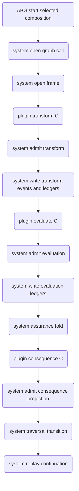
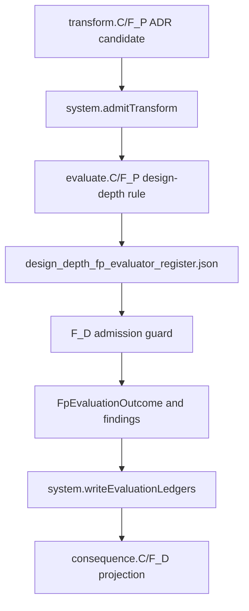

# ODD SDLC TypeScript ABG 3.9 RC3 Staged Compute Boundary

Status: implemented design for T-180 semantic proof; live hello-world proof
pending.

Derives from:

- `specification/PRODUCT.md`
- `specification/requirements/03-runtime-governance.md`
- `specification/requirements/18-typed-construction-algebra.md`
- ABIogenesis `REQ-R-ABG3-FN-COMPOSITION`
- ABIogenesis `REQ-L-GTL3-COMPUTE-NOTATION`
- ABIogenesis `3.9.0-rc.3`

## STDO Re-Triage

This is a `requirement_reprice` followed by `design_reframe`.

The current SDLC TypeScript runtime states the compute-stage epistemology but
still contains realization paths where SDLC-local code synthesizes selected
composition identity and derives evaluation, ledgers, consequence, closure, and
next action around one `fpDispatch` adapter. That conflicts with the ABG 3.9 RC3
boundary where ABG is the system side-effect owner and product plugins compute
typed values or refs only.

## One Truth Rule

Plugin stages are composed through GTL. ABG selects that GTL composition through
`abg.fn_composition` and owns runtime truth over the selected composition. SDLC
shall consume selected composition ref, digest, selection ref, and selected
regime binding ref from ABG runtime/plugin carriers. SDLC shall not derive live
selected composition identity from graph-function names, edge names, archive
roots, report paths, or local context refs.

ABG is the only writer for runtime events, admission truth, payload ledgers,
assurance fold, traversal transition, continuation, correction, closure, and
replay truth.

SDLC may keep multiple product ledger/read-model surfaces, but they must be
projections over ABG-admitted events and ABG-derived ledgers. They are not
independent writers of runtime truth.

SDLC owns product semantics, product plugins, pressure interpretation, gain
meaning, analyzer read models, target-carrier meaning, and proof interpretation.

## Common-Surface Compression Rule

This design extends the T-175 source-truth consolidation. New RC3 migration code
must first route through existing common surfaces:

- value domains: `contracts/carrier_domain_catalog.ts`
- artifact truth: `contracts/operator_run_artifact_catalog.ts`
- graph/frontier policy: `contracts/product_graph_contract_catalog.ts`
- carrier ingress: `admission/*`
- file/process effects: `effects/*`
- missing/malformed runtime gaps: `analysis/runtime_gaps.ts` via catalog truth
- analyzer proof: projections over admitted carriers

Do not add a second local enum, artifact filename list, selected-composition
helper, path-derived graph policy, analyzer fallback, archive writer, or process
effect when one of those common surfaces can be extended. If a new common
surface is required, it must name producers, consumers, admission, effects, and
proof before implementation closure.

## Target Flow

```text
ABG.start(fn<A, B>.C)
  .bind(system.openGraphCall)
  .bind(system.openFrame)
  .bind(plugin.transform.C)
  .bind(system.admitTransform)
  .bind(system.writeTransformEventsAndLedgers)
  .bind(plugin.evaluate.C)
  .bind(system.admitEvaluation)
  .bind(system.writeEvaluationLedgers)
  .bind(system.assuranceFold)
  .bind(plugin.consequence.C)
  .bind(system.admitConsequenceProjection)
  .bind(system.traversalTransition)
  .bind(system.replayContinuation)
```



## IACS

### AbgRc2SubstratePin

Purpose: make ABG `3.9.0-rc.3` the single substrate release truth for the
TypeScript tenant.

Owning surfaces:

- `build_tenants/typescript/package.json`
- `build_tenants/typescript/package-lock.json`
- `build_tenants/typescript/code/src/runtime/abiogenesis_substrate.ts`
- install/release adapter tests and release snapshot evidence

Acceptance: no source, install, or test path claims ABG `3.8.0-rc.3` as the
current substrate.

### SdlcSelectedCompositionConsumption

Purpose: preserve selected `abg.fn_composition` identity through every runtime
surface without local synthesis.

Owning surfaces:

- ABG 3.9 RC3 plugin input / compute-stage binding carriers
- SDLC transform, evaluate, consequence, analyzer, and archive carriers

Acceptance: missing, stale, or locally synthesized selected composition identity
fails closed.

### SdlcTransformPluginAdapter

Purpose: bind SDLC product construction to `plugin.transform.C`.

Inputs:

- selected composition identity and regime binding
- edge contract and target carrier contract refs
- worker construction brief and transform request refs
- T-174 frontier refs when applicable

Outputs:

- candidate refs
- product/materialization evidence refs
- transform result refs

Forbidden:

- evaluation findings
- ledger writes
- runtime event writes
- closure
- traversal selection
- continuation or replay

### SdlcEvaluatePluginAdapter

Purpose: bind SDLC ambiguous evaluation to `plugin.evaluate.C`.

The general SDLC path is GTL-composed and F_P-formed because it maps ambiguity
across transform work, deterministic evidence registers, pressure, and intent
fit. ABG selects/admit the composed `evaluate.C` stage; SDLC does not create a
second local evaluation runtime.

Inputs:

- selected composition identity and regime binding
- admitted transform refs
- retained F_D evidence registers
- edge assurance contract refs
- target carrier admission summaries
- materialization refs
- T-174 frontier refs when applicable
- ABG causality/replay refs

Outputs:

- `GtlEvaluationFindingRef[]`
- `GtlEvaluation`
- `SdlcDesignDepthRegister` evaluator-rule candidate when the selected rule is
  the implementation-design depth register pilot
- metrics refs
- residual pressure refs
- diagnostic refs
- evidence refs
- authority refs
- continuation refs
- proposed disposition

Forbidden:

- final ledger writes
- runtime event writes
- closure
- traversal selection
- continuation or replay

F_D evaluation may exist only as an explicit optimization for a disambiguated
edge contract. It still passes through the same `evaluate.C` admission boundary.

#### Design-Depth Evaluator Register Rule

The implementation-design depth register pilot promotes one concrete
`evaluate.C/F_P` rule output:

- Interface: `EnginePluginInput` plus selected composition identity, admitted
  transform refs, construction brief refs, invocation package refs, manifest
  refs, and retained deterministic evidence registers.
- Adapter: `SdlcEvaluatePluginAdapter`.
- Candidate carrier: `SdlcDesignDepthRegister` serialized as
  `design_depth_fp_evaluator_register.json`.
- Admission carrier: the runtime/analyzer result of
  `admitDesignDepthRegisterFromArtifact` with
  `requireSourceFileTargets=true`.
- System owner: ABG owns evaluation-set execution, admission, event and ledger
  writes, replay identity, and consequence traversal.
- Product owner: ODD_SDLC owns the prompt contract, register schema policy,
  target/source-file completeness law, and domain interpretation of the admitted
  register rows.
- Visibility: operator-run artifact catalog, postflight evidence,
  `fp_evaluate_result.json`, evaluation finding authority refs, analyzer carrier
  state, and staged audit output.
- Bridge: deterministic ADR-derived register synthesis is retained only as a
  declared compatibility path when the evaluator-register feature flag is
  disabled or a legacy deterministic fixture intentionally exercises it.

The sidecar is not a final ledger write, not closure authority, and not a
product design surface. For the pilot path, selected `evaluate.C/F_P` over the
workspace is the highest semantic/product judgment truth for the register
content. F_D admission guards shape, identity, completeness, provenance, and
fail-closed consistency. ABG owns event, ledger, admission, provenance, and
replay truth; it records the selected evaluation as runtime truth and does not
semantically override the selected F_P judgment.

The consumed register flow is therefore:

```text
workspace -> selected evaluate.C/F_P -> evaluator sidecar candidate
  -> F_D admission guard -> ABG ledger/provenance/replay
```

The forbidden flow is:

```text
workspace -> any matching archive JSON -> admission helper -> consumed truth
```

Structural carrier flow:



Tests for this pilot derive from the IACS boundary above. They must prove the
sidecar path, runtime/analyzer admission parity, strict malformed-input
rejection, evidence propagation, and evaluator-rule registration. Source-text
guards may remain as drift detection, but they are not the sole design proof.

### SdlcConsequenceProjectionPluginAdapter

Purpose: bind SDLC product consequence/read-model projection to
`plugin.consequence.C`.

The default compute means is F_D because this stage projects product read-model
refs over ABG-admitted facts.

Inputs:

- admitted transform/evaluation facts
- ABG evaluation ledgers
- assurance fold refs
- traversal transition refs
- product read-model policy refs

Outputs:

- consequence projection refs
- analyzer/read-model refs
- downstream product projection refs

Forbidden:

- runtime event writes
- admission writes
- final ledger writes
- closure
- traversal selection
- replay

### SdlcAnalyzerStageTruth

Purpose: make the staged boundary reviewable without raw artifact spelunking.

Analyzer output must show:

- selected composition ref, digest, selection ref
- transform refs
- evaluation finding refs
- ABG ledger refs
- assurance fold refs
- consequence refs
- traversal transition refs
- replay continuation refs
- parallel branch refs and fan-in rows when T-174 frontier truth applies

### HelloWorldRc2ProofHarness

Purpose: prove the installed hello-world lane follows the RC3 staged boundary.

The proof must run only after semantic tests pass. It must fail if hello-world
output is produced through the old bundled SDLC adapter path.

## F_D Register Preservation

The migration keeps current deterministic register/process value, but changes
its authority.

Retained as evidence:

- worker process/liveness observations
- worker result report shape and admission facts
- deterministic postflight summaries
- product materialization manifest and materialized file refs
- target-carrier admission summaries
- edge-gain input rows
- feature/test dependency maps
- T-174 frontier graph truth

Not retained as authority:

- local closure decision as final closure truth
- local next-action projection as traversal authority
- local ledger write as ABG ledger truth
- local selected composition synthesis

## Minimal F_P Evaluation Context

If full evidence payloads create prompt size or latency risk, the F_P evaluator
shall receive a reduced context projection:

1. selected composition ref, digest, selection ref, and regime binding ref
2. transform request/result refs and worker report ref
3. materialization refs and product materialization manifest ref
4. postflight status, blocking reason refs, and evidence refs
5. target-carrier admission status/ref
6. edge assurance contract ref/digest
7. T-174 frontier refs for parallel-frontier edges
8. ABG runtime projection refs for causality and replay

This context is a product projection over admitted evidence. It is not a second
truth surface.

## Implementation Sequence

1. Pin ABG 3.9 RC3 in package, lockfile, substrate contract, install adapter, and
   release snapshot tests.
2. Wire ABG 3.9 RC3 selected composition and compute-stage binding consumption into
   installed operator runtime inputs.
3. Split current installed operator dispatch into transform, evaluate, and
   consequence product plugins.
4. Move local postflight/evaluate artifacts behind `plugin.evaluate.C` or delete
   them when replaced.
5. Move consequence archive writers behind `plugin.consequence.C` projection and
   ABG admission.
6. Delete or demote local composition synthesis to deletion-scheduled migration
   readers.
7. Update analyzer admission and markdown rendering for stage truth.
8. Update installed cold-agent guidance and prompt hygiene checks.
9. Add semantic tests and negative tests.
10. Add a ledgered steel-thread proof for runtime event, payload/evidence,
    assurance/evaluation, consequence/read-model, and traversal/replay surfaces.
11. Run live hello-world after semantic tests pass.

## Required Proof

```bash
npm run build:semantic
npm run lint:semantic
npm run test:t059
npm run test:t179
npm run test:t174
npm run test:t180
npm run test:scenario:t132-hello-world-js-live
```

The live command is not a substitute for the semantic tests. It is the final
installed proof after the staged boundary is implemented.
