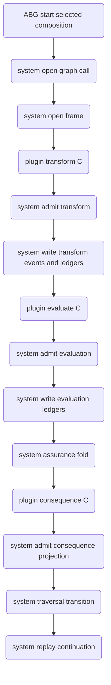
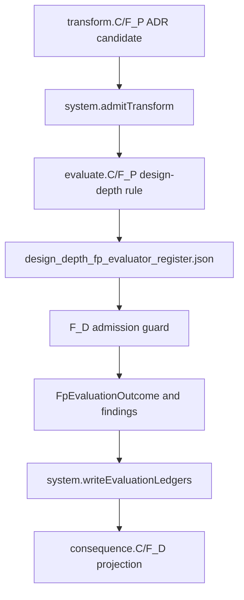

# ODD SDLC TypeScript ABG 3.9 RC3 Staged Compute Boundary

Status: implemented design for T-180 semantic proof; live hello-world proof
pending.

Derives from:

- `specification/PRODUCT.md`
- `specification/requirements/03-runtime-governance.md`
- `specification/requirements/18-typed-construction-algebra.md`
- ABIogenesis `REQ-R-ABG3-FN-COMPOSITION`
- ABIogenesis `REQ-L-GTL3-COMPUTE-NOTATION`
- ABIogenesis `3.9.0-rc.5`

## STDO Re-Triage

This is a `requirement_reprice` followed by `design_reframe`.

The current SDLC TypeScript runtime states the compute-stage epistemology but
still contains realization paths where SDLC-local code synthesizes selected
composition identity and derives evaluation, ledgers, consequence, closure, and
next action around one `fpDispatch` adapter. That conflicts with the ABG 3.9 RC3
boundary where ABG is the system side-effect owner and product plugins compute
typed values or refs only.

## One Truth Rule

Plugin stages are composed through GTL. ABG selects that GTL composition through
`abg.fn_composition` and owns runtime truth over the selected composition. SDLC
shall consume selected composition ref, digest, selection ref, and selected
regime binding ref from ABG runtime/plugin carriers. SDLC shall not derive live
selected composition identity from graph-function names, edge names, archive
roots, report paths, or local context refs.

ABG is the only writer for runtime events, admission truth, payload ledgers,
assurance fold, traversal transition, continuation, correction, closure, and
replay truth.

SDLC may keep multiple product ledger/read-model surfaces, but they must be
projections over ABG-admitted events and ABG-derived ledgers. They are not
independent writers of runtime truth.

SDLC owns product semantics, product plugins, pressure interpretation, gain
meaning, analyzer read models, target-carrier meaning, and proof interpretation.

## Common-Surface Compression Rule

This design extends the T-175 source-truth consolidation. New RC3 migration code
must first route through existing common surfaces:

- value domains: `contracts/carrier_domain_catalog.ts`
- artifact truth: `contracts/operator_run_artifact_catalog.ts`
- graph/frontier policy: `contracts/product_graph_contract_catalog.ts`
- carrier ingress: `admission/*`
- file/process effects: `effects/*`
- missing/malformed runtime gaps: `analysis/runtime_gaps.ts` via catalog truth
- analyzer proof: projections over admitted carriers

Do not add a second local enum, artifact filename list, selected-composition
helper, path-derived graph policy, analyzer fallback, archive writer, or process
effect when one of those common surfaces can be extended. If a new common
surface is required, it must name producers, consumers, admission, effects, and
proof before implementation closure.

## Handoff Removal Rule

`operator/handoff.ts` is not an owning design module and is not an accepted
long-term adapter. It is a deletion target. Any remaining code there is open
T-183 migration debt, permitted only while it is a thin worker-launch bridge
with no prompt semantics, evaluator semantics, ledger semantics, consequence
selection, product topology, stack policy, or closure authority. Logic formerly
collected there has these homes:

| former handoff concern | owning RC3 surface |
| --- | --- |
| worker launch manifests, prompt source carriers, transform request/result refs | `operator/plugins/transform/*` |
| selected F_P evaluator sidecar admission, design-depth pressure maps, review-grade findings | `operator/plugins/evaluate/*` |
| deterministic evidence/postflight guards | `postflight/*` and `operator/plugins/evaluate/postflight.ts` |
| tenant stack authority and effective runtime/build/test contracts | `build_tenants/<tenant>/spec/TECH_STACK.json` as product authority, with generic transform/evaluate enforcement under `operator/plugins/transform/*` and `operator/plugins/evaluate/*` |
| archive/file/process side effects | `effects/*` plus catalog-backed archive helpers |
| ABG/system ledger write candidates and gap dossiers | `operator/ledgers/*`, `assurance_gate.ts`, and `traversal_consequence.ts` until split |
| deterministic continuation projection | `operator/plugins/consequence/*` and `traversal_consequence.ts` |

New code must not add prompt, semantic evaluation, ledger, consequence, stack,
or topology logic to `handoff.ts`. If a helper is still imported from
`handoff.ts`, it must either be the thin worker-launch bridge with a named T-183
deletion row, or the design is not closed. Passing tests through a remaining
handoff semantic path are non-closure evidence, not compatibility proof.

## Canonical Prompt-Source Carrier

`worker_construction_brief.json` is the canonical worker prompt-source carrier.
It must carry typed obligation pressure, not only ids, counts, or prose
summaries. The required pressure fields are:

- `obligations.inlineObligations[]`: compact typed rows for structural and
  high-signal requirement pressure in the active edge.
- `obligations.inlineRequirementPressureRows[]`: the requirement-only work
  queue the worker/evaluator must map before claiming completion.
- `obligations.requirementTraceObligationIds[]`: compact lineage/id index, not
  a replacement for the typed rows.

`worker_invocation_package.json` may retain the same rows as an archive/audit
projection, but it is not the worker's primary work queue when the construction
brief is available.

## Phase 1 Parent-Agent Subworkstreams

Agent-internal subworkstreams are a compute-stage acceleration strategy inside
one selected `.C` invocation. They are not an ABG branch family, not a second
scheduler, and not closure authority.

The parent `transform.C/F_P` or read-only `evaluate.C/F_P` worker may split its
own work by admitted work-plan, dependency-map, target-carrier, tranche,
authority, or obligation pressure. The framework publishes the observable WHAT
and the typed observation carrier. It does not prescribe HOW the agent
decomposes the work.

The Phase 1 carrier is `SdlcComputeSubworkstreamManifest`:

```text
sdlc_compute_subworkstream_manifest
  phase: phase_1_parent_agent_internal
  authority: observation_only_parent_plugin_result
  stageRef: transform.C | evaluate.C
  selectedEdgeRef
  targetCarrierRef
  subworkstreams[]
    workstreamRef
    targetModuleRef | targetInterfaceRef
    predecessorWorkstreamRefs
    dependencyInputRefs
    authorityInputRefs
    evidenceRefs
    readRefs
    writeTerritoryRefs
    outputAllocationRefs
    idempotencyKey
    fanInScopeRef
    changedFileRefs | proposedFileRefs
    status
    blockingReasonRefs
    residualGapRefs
    mergeDisposition
  mergeResult
    mergedOutputRefs
    conflictRefs
    discardedOutputRefs
    carryForwardGapRefs
    parentResultRef
```

The manifest is admitted only as part of the parent plugin result path:

```text
transform.C parent result
  -> worker_result_report.subworkstreamManifest
  -> fp_transform_result evidence candidate refs
  -> normal evaluate.C/admission/consequence lifecycle

evaluate.C parent result
  -> fp_evaluate_result.subworkstreamManifest
  -> normal ABG/system admission and consequence lifecycle
```

Forbidden:

- subworkstreams emitting runtime events, ledgers, closure decisions,
  consequence projections, traversal transitions, or ABG branch leases
- `evaluate.C` subworkstreams writing workspace/product files
- treating subworkstream success as edge closure without parent merge,
  evaluate.C, system admission, consequence.C, and ABG traversal transition
- presenting this Phase 1 carrier as cloud-native distributed ABG execution

The field names intentionally align with ABG saga-frontier branch declarations
where possible: predecessor, read, write-territory, output-allocation,
idempotency, and fan-in refs. Promotion to runtime-visible distributed
execution is Phase 2 and belongs to ABG frontier semantics.

## SDLC Node Rule

An SDLC node is not an imperative operator helper. It is a graph-stage
computation over an input asset and its dependency pressure:

```text
A -> dependencies(A) -> selected F_P traversal/evaluation -> admitted B
```

The product-owned node declares the source asset type, target asset type,
dependency/pressure inputs, target carrier, and selected compute-stage
composition. F_P owns ambiguous traversal, construction, and semantic
evaluation over that dependency pressure. F_D may build read-only dependency
indexes, package prompts, admit carrier shape/provenance, execute declared
commands, write ABG/system ledgers, and project consequence. F_D must not
replace the selected F_P traversal/evaluation by inferring semantic node output
from filenames, logs, language conventions, or historical archive shape.

The TypeScript operator folder should therefore converge toward:

- `operator/nodes/*`: SDLC graph node declarations and dependency pressure
  inputs.
- `operator/plugins/transform/*`: `transform.C` adapters for F_P construction
  work.
- `operator/plugins/evaluate/*`: `evaluate.C` adapters for F_P semantic
  traversal/evaluation and F_D admission guards.
- `operator/plugins/consequence/*`: `consequence.C` deterministic projection
  over admitted state.
- `operator/ledgers/*` and `effects/*`: ABG/system-owned writes and side
  effects.

Any node-specific semantic rule remaining in `handoff.ts`,
`installed_operator.ts`, or a generic admission file is migration debt unless it
is an F_D guard over an admitted F_P/project carrier.

## ODD Authority Mapping

ODD_SDLC remains the practical implementation of ODD methodology. ODD's older
function labels map onto the current post-transform compute process as
authority functions inside selected `evaluate.C`, not as a new runtime layer:

| ODD authority function | RC3 compute-stage spelling | admitted carrier family |
| --- | --- | --- |
| `synthesize_model` | `synthesize_model.C/F_P` as a selected `evaluate.C` rule when model meaning is ambiguous | `ProductAssetModel` |
| `eval_gap` | `eval_gap.C/F_P` as a selected `evaluate.C` rule over declared lineage-reachable ledger snapshots | `ObservationSnapshot` and `GapPressureRow` |
| `evaluate_action` | `evaluate_action.C/F_P` or disambiguated `F_D` policy inside selected `evaluate.C` | `EdgeFulfillmentLedger` and `EdgeClosureDecision` |
| `evaluate_next` | `evaluate_next.C/F_D` or `F_P` policy after admitted closure truth | `NextActionProjection` over `ActionCatalog` |

`evaluate.C` is the compute-stage container. It is not a single semantic
authority. Each rule declares which ODD authority function it realizes or
consumes, and every output admits into the corresponding constitutional carrier
family before ABG/system F_D writes events, ledgers, projection, or replay
truth.

## Design Surface Pressure Chain

Design surfaces are not passive assets and are not closure tokens. They are the
pressure chain the SDLC uses to keep intent, requirement, design, test, code,
execution, and release obligations alive across the graph.

Each design surface has two roles:

- it is an admitted product surface for its own graph edge
- it is a pressure source for downstream register construction

The downstream register is therefore not produced from filenames, test logs, or
operator-local heuristics. It is produced by selected F_P evaluation over the
incoming design surface plus its dependency pressure:

```text
design_surface(A) + dependencies(A)
  -> declared lineage-reachable ledger snapshot
  -> selected evaluate.C authority rule
  -> constitutional carrier candidate
  -> F_D admission
  -> ABG/system ledger truth
```

This is the same work a human operator would do when prompting an agent: carry
the upstream design pressure forward, ask what obligations remain active, and
turn that pressure into the next typed register. The system implementation must
make that chain explicit. A register without a selected upstream design surface
and dependency-pressure basis is not an admissible semantic register. A design
surface that is generated and then ignored by the downstream register path is a
broken pressure chain.

## Existing Requirement-To-Function Fulfillment

Product/materialization evidence is not the same as product fulfillment. The
runtime may observe files, paths, tags, digests, execution logs, and materialized
product-file roles, but those observations are only evidence candidates. This
section restates existing `odd_sdlc` product and requirement law as an RC3
implementation boundary; it does not introduce a new product purpose.

Generated code fulfillment requires an admitted semantic binding:

```text
Requirement
  -> product requirement row
  -> design requirement / design obligation row
  -> component or module responsibility
  -> declared product target
  -> code symbol, callable function, exported API, route, CLI, or executable entrypoint
  -> test function, test case, execution evidence, or review-grade evaluator finding
  -> EdgeFulfillmentLedger
  -> EdgeClosureDecision
```

Every evaluator in this chain exists to preserve lineage pressure. The evaluator
receives the accumulated requirements and design obligations for its stage,
subdivides or checks them at the next stage boundary, and emits rows that keep
the path from requirement to design to module to function visible. At the code
stage, closure is the admitted relationship `fn() == test.fn()` or the
equivalent public/executable behavior matched to its test or execution
evidence.

Failed tests are negative fulfillment evidence in that same relationship. A
failed test must bind back to the requirement, product/design obligation,
function or entrypoint, and test function it falsifies. The admitted evaluator
pressure then forces `EdgeClosureDecision` to repair, retry, block, or reprice,
and `NextActionProjection` loops through the published graph action. A raw
failure count or local retry flag is not enough.

The selected `evaluate_action.C/F_P` rule, or explicit project-declared
structured authority, owns that binding. F_D may verify that referenced files,
symbols, digests, test outputs, and evidence refs exist and are internally
consistent. F_D must not infer from a changed file or requirement tag that a
requirement has reached coded fulfillment.

The generic row shape for coded fulfillment is:

```text
requirementRef
productRequirementRef
designObligationRef
componentRef
productTargetRef
codeSurfaceRef
functionOrEntrypointRef
realizationEvidenceRefs
testOrExecutionEvidenceRefs
evaluatorFindingRef
```

`functionOrEntrypointRef` is the key distinction. Without it, the system has
only boundary tracking: it knows a file changed, but not that a product
requirement is realized by a function, API, route, command, or executable
entrypoint.

## Algorithmic Definitions

The generic SDLC node algorithm is:

```text
node(A, B):
  basis = admitted A + declared lineage-reachable ledger snapshot
    + admitted dependency pressure for A
  transform_candidate = transform.C(basis)
  authority_output = evaluate.C authority rule over basis + transform_candidate
  admitted_pressure = ABG/system F_D admission over authority_output
  B = admitted target carrier + admitted pressure ledgers
  next_action = consequence.C(admitted ABG state)
```

For an asset chain:

```text
A -> B -> C -> D
```

the obligations for `D` are the active pressure carried by `(A, B, C)`.
Delivery of `D` is not evaluated only against its local output. It is evaluated
against the dependency pressure created by the upstream admitted surfaces.

The ledger algorithm is:

```text
evaluate.C authority rule
  -> constitutional carrier candidate
  -> sdlc_evaluate_content_ledger
  -> ABG/system F_D admission
  -> ABG/system F_D ledger writer
  -> admitted ledger
```

`sdlc_evaluate_content_ledger` is the concrete TypeScript migration carrier for
F_P-generated semantic content. Legacy `*_register.json` artifacts are exact
projections of admitted content-ledger rows while downstream consumers are being
split. They are not primary truth and cannot satisfy authority without the
selected content ledger that produced them.

The delete rule is equally explicit: any F_D helper that turns filenames, logs,
language conventions, historical archives, prior test output, or deterministic
test success into semantic register rows is not an optimization. It is a second
truth surface and must be removed or demoted to non-authoritative diagnostics.

## Bad Register Elimination

The RC3 implementation eliminates false-assurance registers. A false-assurance
register is any register, ledger, sidecar, parser result, archive artifact, or
read model that can influence close, retry, repair, re-entry, reprice, next
action, analyzer truth, or public gap truth without selected F_P semantic
evaluation or explicit project-declared authority.

Every candidate surface must be traced as:

```text
producer
  -> compute means
  -> selected composition / regime evidence
  -> admission helper
  -> consumed-by surfaces
  -> closure, retry, repair, next-action, analyzer, or gap effect
```

The only generic semantic funnel is:

```text
transform.C output / admitted evidence / lineage snapshot
  -> selected evaluate.C/F_P authority rule
  -> content ledger or typed evaluator finding
  -> F_D admission guard
  -> ABG/system ledger writer
  -> EdgeFulfillmentLedger / EdgeClosureDecision / NextActionProjection
```

Deterministic producers may create evidence, diagnostics, projections,
admission decisions, command execution records, and ABG/system side effects.
They must not create semantic assurance rows for ambiguous SDLC work. A
compatibility register may remain only as an exact projection of admitted F_P
truth with selected composition, selected regime, evaluator, and admission
evidence preserved.

## Target Flow

```text
ABG.start(fn<A, B>.C)
  .bind(system.openGraphCall)
  .bind(system.openFrame)
  .bind(plugin.transform.C)
  .bind(system.admitTransform)
  .bind(system.writeTransformEventsAndLedgers)
  .bind(plugin.evaluate.C)
  .bind(system.admitEvaluation)
  .bind(system.writeEvaluationLedgers)
  .bind(system.assuranceFold)
  .bind(plugin.consequence.C)
  .bind(system.admitConsequenceProjection)
  .bind(system.traversalTransition)
  .bind(system.replayContinuation)
```



## IACS

### AbgRc5SubstratePin

Purpose: make ABG `3.9.0-rc.5` the single substrate release truth for the
TypeScript tenant.

Owning surfaces:

- `build_tenants/typescript/package.json`
- `build_tenants/typescript/package-lock.json`
- `build_tenants/typescript/code/src/runtime/abiogenesis_substrate.ts`
- install/release adapter tests and release snapshot evidence

Acceptance: no source, install, or test path claims ABG `3.8.0-rc.3` or
`3.9.0-rc.4` as the current substrate.

### SdlcSelectedCompositionConsumption

Purpose: preserve selected `abg.fn_composition` identity through every runtime
surface without local synthesis.

Owning surfaces:

- ABG 3.9 RC3 plugin input / compute-stage binding carriers
- SDLC transform, evaluate, consequence, analyzer, and archive carriers

Acceptance: missing, stale, or locally synthesized selected composition identity
fails closed.

### SdlcTransformPluginAdapter

Purpose: bind SDLC product construction to `plugin.transform.C`.

Inputs:

- selected composition identity and regime binding
- edge contract and target carrier contract refs
- worker construction brief and transform request refs
- T-174 frontier refs when applicable

Outputs:

- candidate refs
- product/materialization evidence refs
- transform result refs

Forbidden:

- evaluation findings
- ledger writes
- runtime event writes
- closure
- traversal selection
- continuation or replay

### SdlcEvaluatePluginAdapter

Purpose: bind SDLC ambiguous evaluation to `plugin.evaluate.C`.

The general SDLC path is GTL-composed and F_P-formed because it maps ambiguity
across transform work, deterministic evidence admissions, pressure, and intent
fit. ABG selects/admit the composed `evaluate.C` stage; SDLC does not create a
second local evaluation runtime.

Inputs:

- selected composition identity and regime binding
- admitted transform refs
- retained deterministic evidence admissions and process observations
- edge assurance contract refs
- target carrier admission summaries
- materialization refs
- T-174 frontier refs when applicable
- ABG causality/replay refs
- admitted upstream design surfaces and dependency-pressure refs

Outputs:

- `GtlEvaluationFindingRef[]`
- `GtlEvaluation`
- authority-function carrier candidates:
  `ProductAssetModel`, `ObservationSnapshot`, `GapPressureRow`,
  `EdgeFulfillmentLedger`, `EdgeClosureDecision`, and
  `NextActionProjection` refs as appropriate to the declared evaluator rule
- semantic pressure maps and typed ledger candidates as subordinate payloads
- `SdlcDesignDepthRegister` evaluator-rule candidate when the selected rule is
  the implementation-design depth register pilot
- metrics refs
- residual pressure refs
- diagnostic refs
- evidence refs
- authority refs
- continuation refs
- proposed disposition

Forbidden:

- final ledger writes
- runtime event writes
- closure
- traversal selection
- continuation or replay

F_D evaluation may exist only as an explicit optimization for a disambiguated
edge contract. It still passes through the same `evaluate.C` admission boundary.

#### Design-Depth Evaluator Register Rule

The implementation-design depth register pilot promotes one concrete
`evaluate.C/F_P` rule output:

- Interface: `EnginePluginInput` plus selected composition identity, admitted
  transform refs, construction brief refs, invocation package refs, manifest
  refs, deterministic evidence admissions, upstream design-surface refs, and
  dependency-pressure refs.
- Adapter: `SdlcEvaluatePluginAdapter`.
- Candidate carrier: `SdlcDesignDepthRegister` serialized as
  `design_depth_fp_evaluator_register.json`.
- Admission carrier: the runtime/analyzer result of
  `admitDesignDepthRegisterFromArtifact` with
  `requireSourceFileTargets=true`.
- System owner: ABG owns evaluation-set execution, admission, event and ledger
  writes, replay identity, and consequence traversal.
- Product owner: ODD_SDLC owns the prompt contract, register schema policy,
  target/source-file completeness law, and domain interpretation of the admitted
  register rows.
- Visibility: operator-run artifact catalog, postflight evidence,
  `fp_evaluate_result.json`, evaluation finding authority refs, analyzer carrier
  state, and staged audit output.
- Bridge: none in default live execution. Deterministic source-text guards may
  still reject malformed candidates, but they do not synthesize semantic
  design-depth truth for closure.

The sidecar is not a final ledger write, not closure authority, and not a
product design surface. For the pilot path, selected `evaluate.C/F_P` over a
declared lineage-reachable ledger snapshot is the highest semantic/product
judgment truth for the register content. Raw workspace observations must first
enter admitted evidence or `ObservationSnapshot` truth before they become
evaluator authority input. F_D admission guards shape, identity, completeness,
provenance, and fail-closed consistency. ABG owns event, ledger, admission,
provenance, and replay truth; it records the selected evaluation as runtime
truth and does not semantically override the selected F_P judgment.

The consumed register flow is therefore:

```text
workspace observations -> admitted evidence or ObservationSnapshot
  -> declared lineage-reachable ledger snapshot
  -> selected evaluate.C/F_P design-depth rule
  -> evaluator sidecar candidate -> F_D admission guard
  -> ABG ledger/provenance/replay
```

The forbidden flow is:

```text
workspace -> any matching archive JSON -> admission helper -> consumed truth
```

Structural carrier flow:



Tests for this pilot derive from the IACS boundary above. They must prove the
sidecar path, runtime/analyzer admission parity, strict malformed-input
rejection, evidence propagation, and evaluator-rule registration. Source-text
guards may remain as drift detection, but they are not the sole design proof.

#### Review-Grade Edge Fulfillment Rule

Every close-capable worker-dispatched generated asset edge requires a separate
`evaluate.C/F_P` rule that reviews the generated asset against incoming
requirements, accepted upstream authority, stage fit, and overlap evidence.
This rule does not introduce a new closure ledger. Source code is code review;
requirements, UAT cases, testcase authority, feature decomposition, design,
scenario, repair, execution, release, and runtime surfaces receive the same
review-grade accountability in their own stage terms.

Rule output:

- Interface: `EnginePluginInput` plus selected composition identity, admitted
  transform refs, construction brief refs, invocation package refs, manifest
  refs, worker output refs, scalar `fp_evaluate_result.json`, and accepted
  upstream design-depth evidence refs.
- Adapter: `SdlcEvaluatePluginAdapter`.
- Candidate carrier: `SdlcReviewGradeEdgeFulfillmentAssessment` serialized as
  `review_grade_edge_fulfillment_assessment.json`.
- Admission carrier: runtime/analyzer admission of the assessment artifact.
- System owner: ABG owns evaluation-set execution, admission, event and ledger
  writes, replay identity, and traversal consequence.
- Product owner: ODD_SDLC owns the prompt contract, failure-class taxonomy,
  per-obligation semantic adequacy policy, and interpretation of generated
  asset fit.
- Visibility: operator-run artifact catalog, assessment artifact, review-grade
  postflight artifact when blocked, `fp_evaluate_result.json` evidence refs,
  analyzer carrier state, and staged audit output.

The assessment is consumed through the existing
`SdlcWorkerObligationAssessment -> SdlcEdgeFulfillmentLedger` path. It is not a
second code-review ledger, not closure authority by itself, and not a
replacement for ABG admission. The selected `evaluate.C/F_P` rule is the
semantic review source. F_D admission guards shape, identity, complete coverage
of traversal obligations, required actions for open findings, and fail-closed
consistency.

Review-grade findings classify generated-asset failure as:

- `trace_missing`
- `semantic_not_realized`
- `boundary_collapsed`
- `wrong_stage`
- `schema_invalid`
- `execution_environment`
- `test_overlap_missing`

The fulfilled state requires semantic evidence and accepted authority refs.
Partial, blocked, or unassessed states require a failure class and a concrete
required action. A passed assessment with any open finding is invalid. A blocked
assessment with no open finding is invalid.

Review-grade flow:

```text
incoming requirements + accepted upstream authority + generated asset/diff
  -> selected evaluate.C/F_P review-grade rule
  -> review_grade_edge_fulfillment_assessment.json
  -> F_D admission guard
  -> existing edge fulfillment rows and ledger
  -> closure only when required rows are fulfilled
```

Forbidden flow:

```text
generated asset exists + requirement tags parse + schema passes
  -> fulfilled without semantic review-grade assessment
```

### SdlcConsequenceProjectionPluginAdapter

Purpose: bind SDLC product consequence/read-model projection to
`plugin.consequence.C`.

The default compute means is F_D because this stage projects product read-model
refs over ABG-admitted facts.

Inputs:

- admitted transform/evaluation facts
- ABG evaluation ledgers
- assurance fold refs
- traversal transition refs
- product read-model policy refs

Outputs:

- consequence projection refs
- analyzer/read-model refs
- downstream product projection refs

Forbidden:

- runtime event writes
- admission writes
- final ledger writes
- closure
- traversal selection
- replay

### SdlcAnalyzerStageTruth

Purpose: make the staged boundary reviewable without raw artifact spelunking.

Analyzer output must show:

- selected composition ref, digest, selection ref
- transform refs
- evaluation finding refs
- ABG ledger refs
- assurance fold refs
- consequence refs
- traversal transition refs
- replay continuation refs
- parallel branch refs and fan-in rows when T-174 frontier truth applies

### HelloWorldRc2ProofHarness

Purpose: prove the installed hello-world lane follows the RC3 staged boundary.

The proof must run only after semantic tests pass. It must fail if hello-world
output is produced through the old bundled SDLC adapter path.

## F_D Evidence Preservation

The migration keeps deterministic evidence/process value, but deletes its
semantic-register authority. These retained facts can inform selected
`evaluate.C/F_P` and ABG/system admission, but they do not construct semantic
rows.

Retained as evidence:

- worker process/liveness observations
- worker result report shape and admission facts
- deterministic postflight summaries
- product materialization manifest and materialized file refs
- target-carrier admission summaries
- edge-gain input rows
- feature/test dependency maps
- T-174 frontier graph truth

Not retained as authority:

- deterministic design-depth, repair, test-schedule, review-grade, or
  obligation-row synthesis
- local closure decision as final closure truth
- local next-action projection as traversal authority
- local ledger write as ABG ledger truth
- local selected composition synthesis

## Minimal F_P Evaluation Context

If full evidence payloads create prompt size or latency risk, the F_P evaluator
shall receive a reduced context projection:

1. selected composition ref, digest, selection ref, and regime binding ref
2. transform request/result refs and worker report ref
3. materialization refs and product materialization manifest ref
4. postflight status, blocking reason refs, and evidence refs
5. target-carrier admission status/ref
6. edge assurance contract ref/digest
7. T-174 frontier refs for parallel-frontier edges
8. ABG runtime projection refs for causality and replay

This context is a product projection over admitted evidence. It is not a second
truth surface.

## Implementation Sequence

1. Pin ABG 3.9 RC3 in package, lockfile, substrate contract, install adapter, and
   release snapshot tests.
2. Wire ABG 3.9 RC3 selected composition and compute-stage binding consumption into
   installed operator runtime inputs.
3. Split current installed operator dispatch into transform, evaluate, and
   consequence product plugins.
4. Move local postflight/evaluate artifacts behind `plugin.evaluate.C` or delete
   them when replaced.
5. Move consequence archive writers behind `plugin.consequence.C` projection and
   ABG admission.
6. Delete or demote local composition synthesis to deletion-scheduled migration
   readers.
7. Update analyzer admission and markdown rendering for stage truth.
8. Update installed cold-agent guidance and prompt hygiene checks.
9. Add semantic tests and negative tests.
10. Add a ledgered steel-thread proof for runtime event, payload/evidence,
    assurance/evaluation, consequence/read-model, and traversal/replay surfaces.
11. Run live hello-world after semantic tests pass.

## Required Proof

```bash
npm run build:semantic
npm run lint:semantic
npm run test:t059
npm run test:t179
npm run test:t174
npm run test:t180
npm run test:scenario:t132-hello-world-js-live
```

The live command is not a substitute for the semantic tests. It is the final
installed proof after the staged boundary is implemented.
