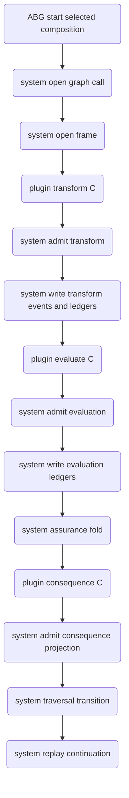

# ODD SDLC TypeScript ABG RC5 Compute-Stage Boundary

Status: proposed design for T-180.

Derives from:

- `specification/PRODUCT.md`
- `specification/requirements/03-runtime-governance.md`
- `specification/requirements/18-typed-construction-algebra.md`
- ABIogenesis `REQ-R-ABG3-FN-COMPOSITION`
- ABIogenesis `REQ-L-GTL3-COMPUTE-NOTATION`
- ABIogenesis `3.8.0-rc.5`

## STDO Re-Triage

This is a `requirement_reprice` followed by `design_reframe`.

The current SDLC TypeScript runtime states the compute-stage epistemology but
still contains realization paths where SDLC-local code synthesizes selected
composition identity and derives evaluation, ledgers, consequence, closure, and
next action around one `fpDispatch` adapter. That conflicts with the ABG RC5
boundary where ABG is the system side-effect owner and product plugins compute
typed values or refs only.

## One Truth Rule

Selected composition identity comes from ABG-selected `abg.fn_composition`
truth. SDLC shall consume selected composition ref, digest, selection ref, and
selected regime binding ref from ABG runtime/plugin carriers. SDLC shall not
derive live selected composition identity from graph-function names, edge names,
archive roots, report paths, or local context refs.

ABG is the only writer for runtime events, admission truth, payload ledgers,
assurance fold, traversal transition, continuation, correction, closure, and
replay truth.

SDLC owns product semantics, product plugins, pressure interpretation, gain
meaning, analyzer read models, target-carrier meaning, and proof interpretation.

## Target Flow

```text
ABG.start(fn<A, B>.C)
  .bind(system.openGraphCall)
  .bind(system.openFrame)
  .bind(plugin.transform.C)
  .bind(system.admitTransform)
  .bind(system.writeTransformEventsAndLedgers)
  .bind(plugin.evaluate.C)
  .bind(system.admitEvaluation)
  .bind(system.writeEvaluationLedgers)
  .bind(system.assuranceFold)
  .bind(plugin.consequence.C)
  .bind(system.admitConsequenceProjection)
  .bind(system.traversalTransition)
  .bind(system.replayContinuation)
```



## IACS

### AbgRc5SubstratePin

Purpose: make ABG `3.8.0-rc.5` the single substrate release truth for the
TypeScript tenant.

Owning surfaces:

- `build_tenants/typescript/package.json`
- `build_tenants/typescript/package-lock.json`
- `build_tenants/typescript/code/src/runtime/abiogenesis_substrate.ts`
- install/release adapter tests and release snapshot evidence

Acceptance: no source, install, or test path claims ABG `3.8.0-rc.3` as the
current substrate.

### SdlcSelectedCompositionConsumption

Purpose: preserve selected `abg.fn_composition` identity through every runtime
surface without local synthesis.

Owning surfaces:

- ABG RC5 plugin input / compute-stage binding carriers
- SDLC transform, evaluate, consequence, analyzer, and archive carriers

Acceptance: missing, stale, or locally synthesized selected composition identity
fails closed.

### SdlcTransformPluginAdapter

Purpose: bind SDLC product construction to `plugin.transform.C`.

Inputs:

- selected composition identity and regime binding
- edge contract and target carrier contract refs
- worker construction brief and transform request refs
- T-174 frontier refs when applicable

Outputs:

- candidate refs
- product/materialization evidence refs
- transform result refs

Forbidden:

- evaluation findings
- ledger writes
- runtime event writes
- closure
- traversal selection
- continuation or replay

### SdlcEvaluatePluginAdapter

Purpose: bind SDLC ambiguous evaluation to `plugin.evaluate.C`.

The general SDLC path is F_P-formed because it maps ambiguity across transform
work, deterministic evidence registers, pressure, and intent fit.

Inputs:

- selected composition identity and regime binding
- admitted transform refs
- retained F_D evidence registers
- edge assurance contract refs
- target carrier admission summaries
- materialization refs
- T-174 frontier refs when applicable
- ABG causality/replay refs

Outputs:

- `GtlEvaluationFindingRef[]`
- `GtlEvaluation`
- metrics refs
- residual pressure refs
- diagnostic refs
- evidence refs
- authority refs
- continuation refs
- proposed disposition

Forbidden:

- final ledger writes
- runtime event writes
- closure
- traversal selection
- continuation or replay

F_D evaluation may exist only as an explicit optimization for a disambiguated
edge contract. It still passes through the same `evaluate.C` admission boundary.

### SdlcConsequenceProjectionPluginAdapter

Purpose: bind SDLC product consequence/read-model projection to
`plugin.consequence.C`.

The default compute means is F_D because this stage projects product read-model
refs over ABG-admitted facts.

Inputs:

- admitted transform/evaluation facts
- ABG evaluation ledgers
- assurance fold refs
- traversal transition refs
- product read-model policy refs

Outputs:

- consequence projection refs
- analyzer/read-model refs
- downstream product projection refs

Forbidden:

- runtime event writes
- admission writes
- final ledger writes
- closure
- traversal selection
- replay

### SdlcAnalyzerStageTruth

Purpose: make the staged boundary reviewable without raw artifact spelunking.

Analyzer output must show:

- selected composition ref, digest, selection ref
- transform refs
- evaluation finding refs
- ABG ledger refs
- assurance fold refs
- consequence refs
- traversal transition refs
- replay continuation refs
- parallel branch refs and fan-in rows when T-174 frontier truth applies

### HelloWorldRc5ProofHarness

Purpose: prove the installed hello-world lane follows the RC5 staged boundary.

The proof must run only after semantic tests pass. It must fail if hello-world
output is produced through the old bundled SDLC adapter path.

## F_D Register Preservation

The migration keeps current deterministic register/process value, but changes
its authority.

Retained as evidence:

- worker process/liveness observations
- worker result report shape and admission facts
- deterministic postflight summaries
- product materialization manifest and materialized file refs
- target-carrier admission summaries
- edge-gain input rows
- feature/test dependency maps
- T-174 frontier graph truth

Not retained as authority:

- local closure decision as final closure truth
- local next-action projection as traversal authority
- local ledger write as ABG ledger truth
- local selected composition synthesis

## Minimal F_P Evaluation Context

If full evidence payloads create prompt size or latency risk, the F_P evaluator
shall receive a reduced context projection:

1. selected composition ref, digest, selection ref, and regime binding ref
2. transform request/result refs and worker report ref
3. materialization refs and product materialization manifest ref
4. postflight status, blocking reason refs, and evidence refs
5. target-carrier admission status/ref
6. edge assurance contract ref/digest
7. T-174 frontier refs for parallel-frontier edges
8. ABG runtime projection refs for causality and replay

This context is a product projection over admitted evidence. It is not a second
truth surface.

## Implementation Sequence

1. Pin ABG RC5 in package, lockfile, substrate contract, install adapter, and
   release snapshot tests.
2. Wire RC5 selected composition and compute-stage binding consumption into
   installed operator runtime inputs.
3. Split current installed operator dispatch into transform, evaluate, and
   consequence product plugins.
4. Move local postflight/evaluate artifacts behind `plugin.evaluate.C` or delete
   them when replaced.
5. Move consequence archive writers behind `plugin.consequence.C` projection and
   ABG admission.
6. Delete or demote local composition synthesis to deletion-scheduled migration
   readers.
7. Update analyzer admission and markdown rendering for stage truth.
8. Update installed cold-agent guidance and prompt hygiene checks.
9. Add semantic tests and negative tests.
10. Run live hello-world after semantic tests pass.

## Required Proof

```bash
npm run build:semantic
npm run lint:semantic
npm run test:t179
npm run test:t174
npm run test:scenario:t132-hello-world-js-live
```

The live command is not a substitute for the semantic tests. It is the final
installed proof after the staged boundary is implemented.
