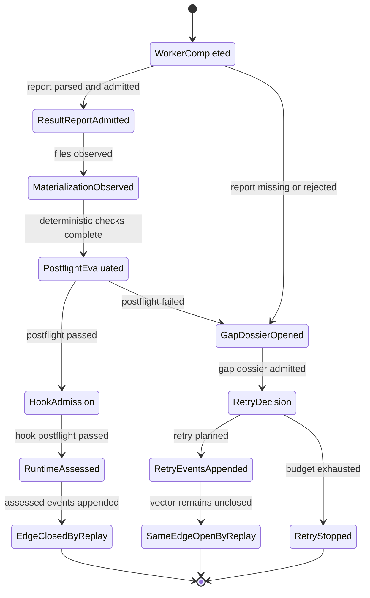

# odd_sdlc TypeScript Deterministic Traversal State Machine

**Status**: Active
**Owner Ticket**: `T-076`
**Implements**: REQ-F-ODDSDLC-013, REQ-F-ODDSDLC-014, REQ-F-ODDSDLC-015, REQ-F-ODDSDLC-020, REQ-F-ODDSDLC-039, REQ-F-ODDSDLC-051, REQ-F-ODDSDLC-052, REQ-F-ODDSDLC-053, REQ-F-ODDSDLC-054, REQ-F-ODDSDLC-055
**Derives From**: `ODD_SDLC_TYPESCRIPT_INSTALLED_OPERATOR_UX.md`, `ODD_SDLC_TYPESCRIPT_RECURSIVE_REALIZATION_DEEPENING.md`, `ODD_SDLC_TYPESCRIPT_TRAVERSAL_ASSURANCE_INTEGRATION.md`, `ODD_SDLC_ABIOGENESIS_SUBSTRATE_CONTRACT.md`

## Position

The installed TypeScript operator is a deterministic event-calculus boundary
around probabilistic worker output.

The worker may produce a probabilistic candidate surface. The operator must not
make probabilistic state decisions. It admits the candidate through deterministic
contracts, emits ABG runtime truth, and returns a projection over that truth.

The governing type is:

```text
transition : State x Input -> TransitionResult
```

The function is total. Every observed input at every state returns one typed
result:

```text
Advanced | OpenedGap | RequiresReprice | RequiresHuman | Blocked
```

No state transition may be represented only by archive files, next-action prose,
operator memory, or a manual rerun convention.

## Authority Split

ABG owns:

- execution basis
- graph call, frame, vector, retry, continuation, terminal, and assessment
  event truth
- replay projection
- retry attempt counting
- same-edge retry eligibility
- convergence projection

`odd_sdlc.TS` owns:

- graph-function domain meaning
- worker handoff manifest contract
- product materialization contract
- worker result report admission
- deterministic postflight classification
- gap dossier content
- domain projection and operator summary

The domain may classify a failed candidate. It must return that classification
to ABG-compatible event truth before any retry, repair, repricing, human, or
terminal result is claimed.

## IACS

| Carrier | Boundary | Authority | Admission | Inadmissible Shortcut |
| --- | --- | --- | --- | --- |
| `SdlcWorkerHandoffManifest` | worker dispatch | graph edge handoff | derived from ABG execution basis, hook contract, conformed project profile, and replay retry context | prompt-only work instruction |
| `SdlcTraversalStrategyPlan` | traversal modulation | one authoritative per-edge strategy surface | consumed by GTL/vector declarations and installed operator handoff from the same resolved plan | duplicated full-breadth or steel-thread edge lists in separate modules |
| `SdlcTraversalStrategyDecision` | current edge strategy | selected strategy for this edge | ABG-selected strategy wins; odd_sdlc fallback is used only when ABG provides no strategy | retry context overriding an explicit ABG-selected strategy |
| `SdlcFeatureScope` | feature-scope pressure | non-narrowing full-breadth or scoped steel-thread/targeted-repair pressure | derived from the strategy decision and archived in the handoff | full-breadth induction filtered to one module |
| `SdlcWorkerRetryContext` | same-edge re-entry | replay-derived prior failure state | derived from ABG retry projection and admitted gap dossiers | local attempt counter |
| `SdlcProductMaterializationContract` | product file output | tenant-root materialization law | declares tenant root, selected output root, required roles, and `relativePathBasis=tenant_root` | path convention inferred by worker |
| `SdlcWorkerResultReport` | worker result | F_P candidate surface | closed JSON report with output digest and materialized file inventory | prose scrape or stdout inference |
| `SdlcPostflightResult` | deterministic admission | F_D postflight verdict | output, digest, unresolved reasons, materialization, and evidence checks | accepting generated files because they exist |
| `SdlcPostflightGapDossier` | failure classification | odd_sdlc domain gap meaning | derives from postflight verdict, worker report, materialization contract, and evidence refs | flat blocking-reason string as repair contract |
| `SdlcAssuranceLedger` | assurance dimension | odd_sdlc domain evaluation truth | one deterministic ledger over materialization, semantic convergence, obligation carry, requirement fulfillment, ambiguity, capability, or shallow realization | hidden evaluator branch or prose-only assessment |
| `TraversalRequirementSatisfaction` | total-transition input | folded SDLC domain closure truth | deterministic fold over required assurance ledgers | closing from one green artifact or archive-only note |
| `RuntimeEvent[]` | traversal truth | ABG event calculus | `vector_evaluated`, `retry_repair_planned`, `retry_attempt_opened`, optional continuation events, or `assessed` | archive-only status |
| `SdlcInstalledOperatorStartOutcome` | operator projection | read model over state and archive | carries emitted event kinds, gap dossier, and archive refs | next action as transition authority |

## Traversal Strategy Law

The traversal strategy plan is a carrier, not a convenience map. GTL/vector
modulation and operator handoff must consume the same resolved plan surface. A
separate `FULL_BREADTH_TRAVERSAL_NAMES` set in graph construction and a separate
operator fallback map are competing truth surfaces.

ABG-selected strategy is authoritative when present. odd_sdlc may apply its
source-owned fallback plan only when ABG has not supplied a strategy directive.
Retry pressure may select `targeted_repair` only through ABG-visible reentry
truth, or as fallback repair policy when no ABG-selected strategy exists.

Full-breadth edges may still project a `SdlcFeatureScope` carrier with
`mode: full_breadth` so manifests remain uniform. That carrier is non-narrowing:
it must not filter authority refs, retrieval hints, closure obligations,
materialization, or execution shards. The strategy decision records
`featureScopeRequired: false` for full-breadth.

## Feature Scope Derivation Law

Feature scope is framework-derived authority. A worker may consume it but does
not author it for closure.

Steel-thread or targeted-repair scope must bind to selected schedule refs,
required progress artifact refs, repair/reentry refs, or other typed traversal
facts. If no selected chain can be derived, the framework must fall back to
non-narrowing full breadth or emit a typed scope-derivation defect. It must not
silently choose the first declared module as the current scope.

Scope-aware assurance should evaluate typed row/module/entity/operation
identities. Reason-string token matching is not closure law by itself; it is
admissible only as a transitional projection when deterministic tests prove that
generic in-scope reasons are not suppressed and incidental token mentions do not
leak out-of-scope blockers.

## Design-Depth Admission Law

Design-depth admission may normalize useful ambiguous candidates before strict
closure, but normalization remains generic builder behavior. Missing target
identity is not repaired by inventing placeholder module names. Tenant-specific
terms such as project module vocabulary must not be hardcoded into generic
odd_sdlc core to infer ownership.

Contradictory module/entity ownership is either rejected or emitted as typed
ambiguity pressure. A partial candidate may carry useful design facts forward,
but it must not erase identity conflicts or convert them into ordinary missing
detail.

Worker retry field sets and strict parser law must be one surface. A retry
instruction must not advertise a carrier shape that the parser will reject.

## Total Transition Slice

The first T-076 implementation slice governs the failed-postflight path:

```text
WorkerResultReport
  -> evaluateWorkerResultPostflight
  -> SdlcPostflightResult(blocked)
  -> SdlcPostflightGapDossier(open)
  -> AssuranceLedgerSet
  -> TraversalRequirementSatisfaction(blocked | retry_same_edge | reprice_required)
  -> ABG retry repair decision
  -> retry runtime events appended
  -> operator projection
```

The pass path remains:

```text
WorkerResultReport
  -> evaluateWorkerResultPostflight
  -> AssuranceLedgerSet
  -> TraversalRequirementSatisfaction(close_allowed)
  -> hook admission
  -> ABG assessed events
  -> replay closes current vector
```

The failed path does not close the vector. Replay keeps the same current edge
open, records retry attempt truth, and allows the next handoff to carry the
prior gap dossier.

## Mermaid State Machine



## Functional Shape

The implementation should read as transforms over admitted truth:

```text
candidate
  |> admit result report
  |> evaluate postflight
  |> derive assurance ledgers
  |> fold traversal requirement satisfaction
  |> fold(postflightToGapAndRetry, postflightToAssessment)
  |> append events
  |> project summary
```

Effect boundaries are limited to:

- worker process invocation
- filesystem observation
- archive copies
- event-log append

The core classification remains pure:

- classify blocking reasons
- build gap dossier
- derive assurance ledgers
- fold traversal requirement satisfaction
- derive retry decision input
- construct emitted runtime events

## Local And Global Optimization Review

Local optimization:

- keep materialization path-basis law in `SdlcProductMaterializationContract`
- keep postflight failure classification in a gap carrier, not in
  `installed_operator.ts` prose
- keep retry context as derived replay state in the handoff manifest

Global optimization:

- use ABG retry/continuation events instead of adding an `odd_sdlc` retry event
  family
- preserve `operator_summary` as a projection only
- do not copy Python's distributed controller; preserve its capability by
  collapsing it into explicit TypeScript carriers and ABG events

## Non-Claims

This design does not claim full data_mapper RC parity. It closes the algebraic
break where failed postflight previously left event calculus. The broader
authority-to-code and code-to-test depth checks remain governed by T-066,
T-069, and the wider T-041 RC envelope. The assurance-ledger slice T-077 through
T-084 is complete as a deterministic input to this state machine; it is not a
claim that a fresh external data_mapper qualification run has reached full RC
depth.
