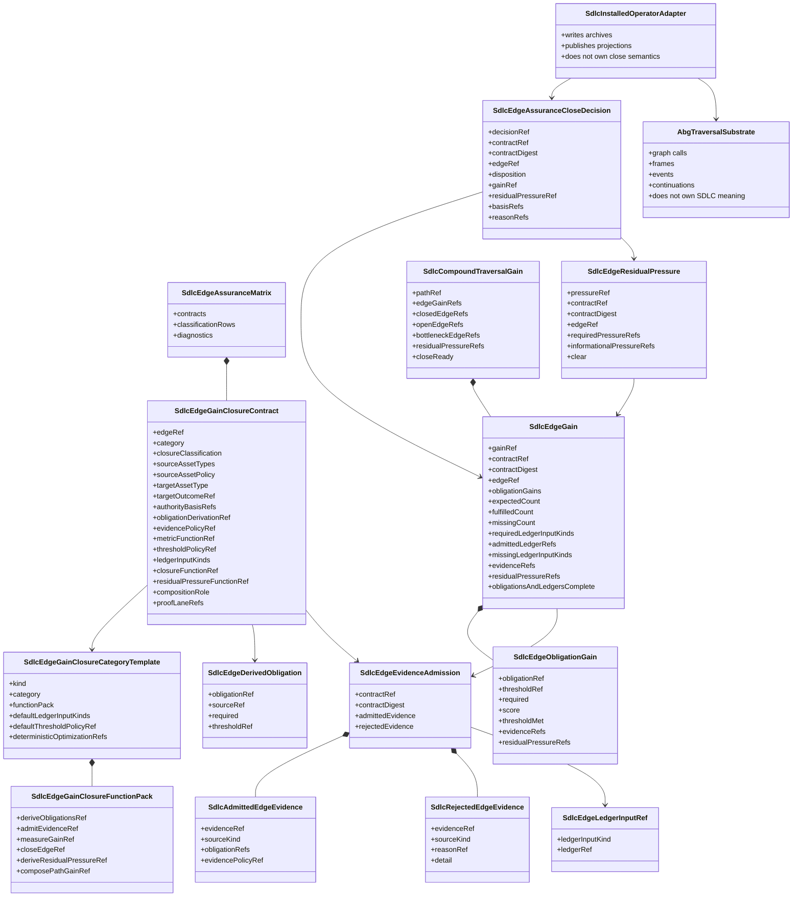

# ODD SDLC TypeScript Edge Gain And Closure Contract

**Status**: Active design for T-171 and T-172, derived from T-164
**Date**: 2026-05-14
**Owner Tickets**: `.ai-workspace/tickets/completed/T-171-full-test35-parity-refactor-for-test72-execution-backed-closure.md`, `.ai-workspace/tickets/active/T-172-realize-staged-disambiguation-graph-and-decomposition-admission.md`
**Origin Ticket**: `.ai-workspace/tickets/completed/T-164-declare-per-edge-gain-and-closure-functions-for-sdlc-traversals.md`
**Implements**: REQ-F-GFUNC-006, REQ-F-ODDSDLC-013, REQ-F-ODDSDLC-014, REQ-F-ODDSDLC-015, REQ-F-ODDSDLC-063, REQ-F-ODDSDLC-064, REQ-F-ODDSDLC-065, REQ-F-ODDSDLC-066, REQ-F-ODDSDLC-067, REQ-F-ODDSDLC-068, REQ-F-ODDSDLC-080, REQ-F-ODDSDLC-081
**Derives From**: `specification/PRODUCT.md`, `specification/requirements/02-graph-functions.md`, `specification/requirements/03-runtime-governance.md`, `specification/requirements/10-odd-sdlc-software-domain-buildout.md`, `specification/requirements/14-odd-sdlc-installed-product-contract.md`, `specification/requirements/16-edge-gain-closure-contract.md`, `specification/requirements/18-typed-construction-algebra.md`, `ODD_SDLC_TYPESCRIPT_TRAVERSAL_ASSURANCE_INTEGRATION.md`, `ODD_SDLC_TYPESCRIPT_TRAVERSAL_LEDGER_SOLUTION.md`, `ODD_SDLC_TYPESCRIPT_REUSABLE_GRAPH_FUNCTION_LIBRARY.md`

## STDO Re-Triage

T-164 is a design reframe before it is a runtime refactor.

The current code already has graph functions, overlays, handoff manifests,
fulfillment ledgers, closure decisions, query projections, and installed
sandbox proof. The missing layer is the declared edge-level computation:

```text
contract row
  -> admitted evidence
  -> ledger measurements
  -> gain
  -> residual pressure
  -> close decision
  -> compound traversal fold
```

This belongs in TypeScript tenant design because `odd_sdlc` owns SDLC domain
meaning. ABG owns traversal substrate truth, graph-call frames, events,
continuation, replay, and raw runtime projection. `odd_sdlc` must not create a
second runtime loop to compensate for missing edge semantics.

## Design Claim

Every published typed graph vector has one assurance classification. Every
close-capable vector has one product-owned edge assurance contract. A graph
overlay is valid only when every selected vector resolves to a matrix row.

The contract row is the parameter surface for generic functional kernels:

```text
derive_edge_obligations(contract, authority_context)
admit_edge_evidence(contract, candidate_outputs, runtime_events, ledgers)
measure_edge_gain(contract, admitted_evidence, ledger_rows)
derive_edge_residual_pressure(contract, gain)
derive_edge_close(contract, gain, residual_pressure)
compose_path_gain(edge_gains)
```

The row declares meaning. The generic kernels execute the meaning. Runtime
adapters only admit facts, archive facts, and publish read models.

Target-carrier admission is an evidence dimension in this flow. It preserves
output envelope identity and protocol pressure, but it is not the content metric
for requirement fulfillment, implementation correctness, test adequacy, or
product close.

Executable code and executable test edges add one more declared evidence
dimension: admitted execution evidence. Materialized files and well-formed
target carriers are necessary evidence for those edges, but they are
insufficient when the edge contract declares executable behavior.

## Staged Disambiguation And Edge Accounting

T-172 strengthens the edge-gain contract with two runtime-admitted dimensions:
construction-depth admission and selected-graph accounting.

Construction-depth admission treats solution construction as a disambiguation
pipeline:

```text
requirements
-> design commitments
-> admitted tenant technology-stack description
-> module/component topology
-> dependency map
-> evaluator-selected traversal
-> bounded materialization
-> execution evidence
-> release qualification
```

Code and tests are deterministic closure surfaces only after upstream ambiguity
has been reduced into admitted topology, dependency, and traversal carriers or
preserved as residual pressure. The evaluator owns the admitted
`SdlcDecompositionSummary`; worker-emitted topology rows are evidence, not final
authority.

The summary measures:

- upstream obligation count;
- downstream row count;
- upstream-per-downstream compression ratio;
- downstream-per-upstream expansion ratio;
- max owned upstream refs per downstream row;
- max downstream rows per upstream ref;
- max owned upstream refs without a public boundary;
- public boundary count;
- substantive downstream responsibility count;
- materialization target refs;
- residual refs.

Admission rejects high-density rows, compression collapse, downstream explosion,
downstream rows without upstream basis, invalid reference values, facade rows,
under-decomposed parents, residual refs carried outside the owning subsurface,
and trivial products that try to bypass decomposition. When the conformed product profile declares
`capability_contracts.trivial_product: true`, the evaluator admits the stage
only as a degenerate one-requirement/one-module/one-component decomposition;
execution-detail facts may not be inflated into separate implementation or test
obligations.

Tenant technology-stack description is the authority surface for executable
materialization details. The bootstrap traversal derives tenant-local stack
surfaces such as `build_tenants/<tenant>/spec/TECH_STACK.*`,
`TESTING_TECH_STACK.*`, `PRODUCT_TARGETS.*`, or `EXECUTION_CONTRACT.*` from the
initial document and conformed project profile. Admission classifies each
tenant stack surface as:

- `undefined`: materialization cannot proceed; traversal blocks or zooms back
  to bootstrap/design to derive the missing tenant spec.
- `sufficient`: `F_P.transform` may make bounded implementation assumptions
  inside the declared language/runtime/build/proof surface and must preserve
  those assumptions in emitted artifacts or evidence.
- `contradictory`: materialization cannot proceed until the product, design,
  and tenant spec conflict is resolved.

The minimum tenant stack spec has distinct implementation and testing sections.
Implementation declares language/runtime, build tool, build-config targets,
source roots, build commands, tool-use assumptions, and byproduct cleanup.
Testing declares test runtime/language when distinct, framework or runner, test
roots, fixture/data strategy, test build/config targets, proof commands,
execution environment assumptions, evidence format, and cleanup. Testing may
reuse the implementation tenant only when the tenant spec declares that
relationship; otherwise it is a distinct test-stack authority.

The installed operator consumes admitted tenant stack declarations as data:
build-config targets, source/test roots, build/test/proof commands,
tool-install assumptions, evidence expectations, and cleanup rules. It does not
encode SBT, Cargo, Maven, Gradle, Node, Python, or other ecosystem manifest
grammar as core SDLC law.

Thresholds are product-profile or edge-contract data. The TypeScript default
profile publishes concrete limits, currently `8:1` for aggregate compression,
`8` downstream rows per upstream ref, `8` owned upstream refs per downstream
row, and `1` owned upstream ref without a public boundary. These are independent
profile levers; a product profile may tighten or relax any of them, but prompt
text and worker-local judgement do not set them.

The selected executive graph is also admitted. Each selected edge has an
accounting row with one disposition:

| Disposition | Meaning |
| --- | --- |
| `required` | Produces new authority or closure evidence and remains close-capable. |
| `conditional` | Produces authority only when named failure, capability, or operational pressure exists. |
| `projection_no_close` | Rolls up admitted carriers/events without owning fresh product judgement. |
| `merge_required` | Pressure belongs to another retained edge and this edge must be merged before closure. |
| `replace_required` | Pressure belongs to a staged authority edge that replaces this inherited edge. |
| `delete_required` | No unique construction pressure remains and the edge must leave the selected graph. |

Rows with `workerDispatchAllowed: false` are deterministic evaluator or
projection edges. The installed operator executes them without dispatching
`F_P.transform`, without `worker_run.json`, and without F_P transform refs.
Analyzer admission rejects any live or archived run that observes worker
dispatch on those rows.

## Irreducible Carrier Set

| Carrier | Owns | Does Not Own |
| --- | --- | --- |
| `SdlcEdgeGainClosureCategoryTemplate` | Default function-pack refs, ledger input defaults, deterministic optimization refs for a category such as conformance, synthesis, formalisation, encoding, qualification, projection, or assurance measurement. | Edge-specific authority, thresholds, proof lanes, runtime evidence, or closure decisions. |
| `SdlcEdgeGainClosureContract` | One typed vector's edge identity, category, closure classification, source/target asset types, authority basis, evidence policy, metric, threshold, ledger inputs, closure function, residual-pressure function, composition role, proof lanes, and deterministic support refs. | Runtime loop ownership, worker strategy, or hidden next-action selection. |
| `SdlcEdgeAssuranceMatrix` | The indexed registry of all published vector classifications and close-capable contracts. | A second graph catalog or overlay executor. |
| `SdlcAdmittedEdgeEvidence` | Evidence admitted under one contract digest: product files, reports, execution results, ledger refs, worker assessments, replay evidence, and rejected evidence diagnostics. | Raw worker prose or unvalidated artifact existence. |
| `SdlcEdgeGain` | Per-obligation measurements, fulfilled/expected counts, evidence refs, bottleneck refs, and metric diagnostics. | Scalar percent-complete authority. |
| `SdlcEdgeResidualPressure` | Missing, partial, blocked, deferred, replay, reprice, or carried-forward pressure derived from gain. | Route-level narrative summary. |
| `SdlcEdgeAssuranceCloseDecision` | Close, yield, retry, repair, re-enter, reprice, or block decision derived from the contract, gain, and residual pressure. | ABG vector advancement or event truth. |
| `SdlcCompoundTraversalGain` | Typed fold over edge gains and residual pressure for a graph function or overlay route. | A route-completion shortcut that hides intermediate pressure. |

Subordinate payloads, manifests, archive files, and projections may serialize
these carriers. They do not become parallel authority.

## Structural Carrier Diagram

This is the DMM structural carrier asset for the active edge assurance contract
boundary. It distinguishes prime carriers from subordinate payloads and keeps
ABG traversal authority outside the SDLC-domain close fold.



`SdlcEdgeDerivedObligation`, `SdlcEdgeEvidenceAdmission`,
`SdlcRejectedEdgeEvidence`, `SdlcEdgeLedgerInputRef`, and
`SdlcEdgeObligationGain` are currently public because runtime handoff,
admission, ledger, and test code construct or inspect them directly. If the
next implementation slice proves any of them are only local field groupings,
they should be folded into their parent carrier rather than kept as promoted
top-level authority.

`SdlcEdgeGainClosureFunctionPack` is a category-template field grouping. It is
not independent edge authority. It may remain named for readability while the
category-template surface stabilizes, but it does not become a second IACS
prime carrier unless another module consumes or versions it independently.

## Functional Boundary

The assurance contract is realized as pure or nearly-pure transforms below the
graph program:

```text
resolve contract row
  -> load authority basis
  -> derive obligations
  -> run declared transform mechanism
  -> admit evidence
  -> measure gain
  -> derive residual pressure
  -> derive close disposition
  -> project next action
  -> compose route gain when applicable
```

The transform mechanism may be configured `F_P`, deterministic `F_D`, or
human-governed `F_H` depending on the edge contract. For the generic SDLC path,
configured `F_P` remains the constructive default. `F_D` is optimization,
admission, validation, folding, routing, and deterministic support unless the
edge contract declares deterministic authority.

## Module Boundaries

| Module | Classification | Owns | Does Not Own |
| --- | --- | --- | --- |
| `graph/edge_gain_closure_contracts.ts` | Declarative matrix module | category templates, vector classifications, contract rows, validation diagnostics, source/target parity checks | runtime evidence, closure execution, graph traversal |
| `graph/overlays.ts` | Overlay selection module | overlay membership and validation that selected vectors have contract rows | independent closure law |
| `operator/edge_gain_closure.ts` | Semantic kernel module | pure derive/admit/measure/residual/close/compose functions over admitted carriers | process execution, filesystem mutation, ABG continuation |
| `operator/handoff.ts` | Handoff carrier module | selected contract refs/digests in worker manifests and obligation context | prompt-only authority |
| `operator/assurance_gate.ts` | Evidence admission module | conversion from postflight, worker reports, execution evidence, and ledgers into admitted evidence and gain inputs | graph-vector selection or next-action routing |
| `operator/traversal_consequence.ts` | Consequence module | edge gain, residual pressure, and closure decision records in the consequence chain | local retry loop |
| `operator/installed_operator.ts` | Adapter module | installed command binding, archive writing, ABG-compatible result publication | semantic closure beyond the admitted consequence |
| `projection/query_domain.ts` | Read-model module | query/gaps projection of contract identity, missing contracts, residual pressure, proof lanes | closure authority |

This follows Design Module Method:

- one authoritative carrier family at the edge assurance boundary
- raw runtime and worker payloads admitted once before semantic kernels consume
  them
- pure transforms for gain, close, residual pressure, and path composition
- side effects isolated to installed operator and archive adapters

## Contract Row Shape

Each close-capable row has this shape:

```text
edge_ref
closure_classification
edge_category
source_asset_types
source_asset_policy
target_asset_type
target_outcome_ref
authority_basis_refs
obligation_derivation_ref
evidence_policy_ref
metric_function_ref
threshold_policy_ref
ledger_input_kinds
closure_function_ref
residual_pressure_function_ref
composition_role
proof_lane_refs
deterministic_optimization_refs
residual_pressure_refs
```

Rows that are `library_only`, `projection_only`, or `no_close` still publish
classification and source/target boundaries so the graph catalog has no
unclassified escape hatch.

`source_asset_policy` declares how a handoff source-set is compared with the
selected contract row. The default policy is `strict`: the selected source
asset set must match the graph-vector contract. A shortened overlay or lite
vector may use `subset_allowed` only when the matrix row declares that policy
or when a separate overlay-specific row declares the narrowed source set. The
handoff adapter must enforce this from the row; it may not relax source meaning
by omitting a source-set check in imperative code.

## ODD Function Binding

The generic gain/close kernel implements the ODD constructive function
`evaluate_action`.

| ODD function | This module's binding |
| --- | --- |
| `synthesize_model` | Outside this module. F_P workers and upstream graph functions synthesize candidate surfaces. |
| `eval_gap` | Outside this module except for residual-pressure read models. Query and gaps projections render admitted pressure. |
| `evaluate_next` | Outside this module. ABG and installed operator continuation select the next graph movement from admitted closure facts. |
| `evaluate_action` | `deriveSdlcEdgeObligations -> admitSdlcEdgeEvidence -> measureSdlcEdgeGain -> deriveSdlcEdgeResidualPressure -> deriveSdlcEdgeAssuranceCloseDecision`, parameterized by the selected contract row and admitted evidence. |

This design module therefore owns SDLC-domain action evaluation, not traversal
substrate continuation.

## Recurrence And Commonization Decision

The edge assurance carrier pattern recurs in ABG and in `odd_sdlc`.

ABG owns substrate-level edge assurance: graph-call facts, hook action typing,
continuation, event provenance, replay-visible runtime evidence, and generic
runtime admission. `odd_sdlc` owns SDLC-domain edge assurance: requirement,
design, implementation, test, release, and operational closure meaning.

The recurrence is intentional and should not be commonized as one carrier
family. A shared carrier would either leak SDLC product semantics into ABG or
erase product-owned meaning from SDLC closure. The acceptable commonization is
limited to pure mechanics that have no domain meaning, such as stable JSON
canonicalization and digest construction.

## Execution Authority Status

Current implementation status is transitional.

The generic gain/residual-pressure kernel is recorded in runtime carriers, but
the installed close disposition still uses the legacy closure decision fold.
That is acceptable only before the next runtime authority slice. Before the
generic kernel becomes authoritative for installed close, the implementation
must run an execution-authority audit proving exactly one path chooses the
close disposition for an affected traversal.

Landing condition for that slice:

```text
one selected edge contract
  -> one admitted evidence set
  -> one gain/residual-pressure computation
  -> one authoritative close disposition
  -> downstream projections only observe that decision
```

## Category Templates

Categories provide reusable defaults. They are not loose labels.

| Category | Default gain question | Default close question |
| --- | --- | --- |
| `conformance` | Did broad workspace input become a canonical project profile without losing topology or capability pressure? | Is the canonical structure present, typed, and usable by downstream edges, with nonconformance preserved? |
| `authority_synthesis` | Did source authority become traceable intent, product, goals, requirements, or bootstrap surfaces? | Are required authority points represented or explicitly carried as residual pressure? |
| `solution_formalisation` | Did synthesized requirements become typed design/formal surfaces that constrain implementation? | Are design obligations parseable, traceable, and sufficiently disambiguated for downstream work? |
| `implementation_formalisation_and_planning` | Did design authority become module, topology, stack, schedule, or sequence authority? | Is implementation planning complete enough for bounded code construction, with gaps carried? |
| `implementation_encoding` | Did implementation authority become executable or durable product artifacts? | Does admitted behavioral/product evidence satisfy declared obligations without required residual pressure? |
| `implementation_qualification` | Did implementation evidence qualify against topology and declared component obligations? | Does qualification prove the component edge rather than only file presence? |
| `test_formalisation_and_planning` | Did test authority become executable test design, module, topology, stack, or schedule surfaces? | Is test structure bound to declared testcase and implementation authority? |
| `test_encoding_and_execution` | Did tests materialize and execute under declared contracts? | Are execution results admitted, passing where required, and linked to test topology? |
| `repair_archive_release_qualification` | Did repair, archive, release-depth, and release surfaces prove readiness? | Are repair pressure, archive evidence, parity, and release authority closed or explicitly blocking? |
| `operational_transition_and_return` | Did release state move through build, deploy, runtime observation, and retrofit return with admitted evidence? | Are side effects returned as governed evidence rather than assumed complete? |
| `assurance_measurement` | Did a ledger function measure one assurance dimension from admitted inputs? | Does the ledger row publish a valid measuring result without becoming constructive authority? |
| `governance_projection` | Did gap or triage truth become an operator read model? | Projection closes only read-model consistency, not product work. |

## Closure Laws

The edge close predicate is:

```text
close(edge) iff
  every required obligation meets its declared threshold
  and required evidence is admitted under the edge evidence policy
  and required diagnostics are clear
  and no required residual pressure remains
```

The missing computation is never:

```text
requirement tag + worker percent complete >= 100
```

Requirement tags identify authority. Worker assessments may become evidence.
The missing computation is the declared derivation from authority to
obligations, admission of evidence against those obligations, metric evaluation,
residual-pressure derivation, and closure decision.

The compound close predicate is:

```text
close(path) iff
  every required intermediate edge closes
  and the terminal edge closes
  and no required residual pressure remains anywhere in the path fold
```

## Runtime Carriage

The selected contract ref and digest must be carried through:

- worker handoff manifest
- traversal obligation context
- admitted evidence rows
- assurance or fulfillment ledgers
- closure decision
- next-action projection
- query/gaps read models
- archive evidence
- replay predecessor refs

Replay may reuse predecessor evidence only when workspace, graph vector, target
binding, evidence policy, contract digest, and predecessor lineage match.

## Failure Modes

The matrix and runtime fail closed for:

- missing contract row for a selected close-capable edge
- duplicate row for the same vector
- ambiguous row with missing required identity, authority, evidence, metric,
  proof, or residual-pressure fields
- row for an unpublished graph vector
- admitted evidence that does not match the selected contract digest
- worker assertion, artifact existence, manifest shape, or postflight success
  presented as closure without the edge close function
- compound traversal attempting to drop intermediate residual pressure

## Proof Plan

T-164 closes in stages:

1. Matrix proof: every published vector is classified and overlay-selected
   vectors resolve to contract rows.
2. Runtime carriage proof: contract refs and digests appear consistently across
   handoff, evidence, ledgers, closure, projection, archive, and replay.
3. Semantic-kernel proof: the same generic functions drive at least two edge
   categories without bespoke edge-local closure code.
4. Compound proof: a three-edge chain preserves intermediate residual pressure
   and fails close when any required intermediate edge is open.
5. Installed sandbox proof: the same three-edge assurance chain runs through
   the installed product archive path.
6. Absorbed-ticket proof: T-158, T-103, T-130, and T-142 are re-expressed as
   edge-contract proof obligations rather than isolated closure fixes.
