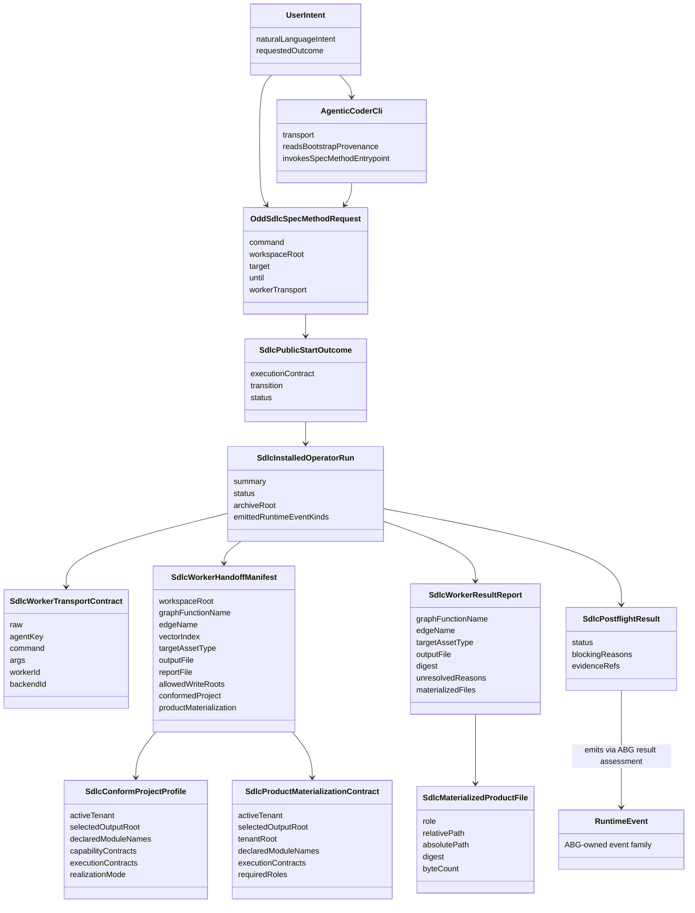

# ODD SDLC TypeScript Installed Operator UX

**Status**: active  
**Owner Tickets**: `T-064`, `T-066`, `T-068`  
**Implements**: REQ-F-ODDSDLC-030, REQ-F-ODDSDLC-032, REQ-F-ODDSDLC-051, REQ-F-ODDSDLC-052, REQ-F-ODDSDLC-053, REQ-F-ODDSDLC-054, REQ-F-ODDSDLC-055, REQ-F-ODDSDLC-056

## Problem

The Spec Method entrypoint can project `start` and `gaps`, but an installed
operator needs an executable loop:

```text
User -> Agentic_Coder_CLI
  -> Spec Method command intent
  -> installed odd_sdlc callable contract
  -> ABG runtime truth
  -> GTL graph-function edge
  -> IoC worker/plugin execution
  -> materialized asset + worker result report
  -> ABG event/projection truth
  -> Agentic_Coder_CLI
  -> User
```

`ODD_SDLC_TYPESCRIPT_SPEC_METHOD_ENTRYPOINT.md` owns the single method command
entry. This design adds the installed operator slice below it. The operator
slice may invoke workers and append ABG-compatible runtime events, but it does
not choose graph traversal outside replay-derived ABG projection.

This is an `STDO-UX` boundary. The agentic coder CLI is the primary flexible
user interface over installed product truth. It accepts user intent, reads
bootstrap provenance, calls installed commands, inspects archives, and reports
the next lawful state. It is not a second runtime.

The same model-backed executable family may also be bound as an `F_P`
worker/plugin for a graph-function edge. That worker role is separate from the
UI role and is admitted only through the worker transport contract, handoff
manifest, result report, and archive proof.

## Structural Carrier Diagram



## First-Slice IACS

| Carrier | Boundary | Authority | Admission | Inadmissible Shortcut |
| --- | --- | --- | --- | --- |
| `UserIntent` | UI/operator | operator requested outcome | natural language lowered through bootstrap provenance and installed command contract | prompt-only execution without installed command/projection truth |
| `AgenticCoderCli` | UI/operator binding | interface transport | generated `AGENTS.md`/`CLAUDE.md` plus installed manifest/provenance | rival controller or hidden workflow runtime |
| `OddSdlcSpecMethodRequest` | Spec Method entrypoint | command intent | Spec Method request admission | private test harness command |
| `SdlcPublicStartOutcome` | start projection | selected graph-function basis | existing public start carrier | local traversal selection |
| `SdlcWorkerTransportContract` | operator execution | worker process binding | `process://...` URI admission | ambient command string |
| `SdlcWorkerHandoffManifest` | operator execution | graph edge handoff | derived from execution basis and hook contract | prompt-only authority |
| `SdlcConformProjectProfile` | workspace conformance | canonical project truth | derived by `Fg_conform_project` from documents and project constraints | direct scalar YAML defaults as operative truth |
| `SdlcProductMaterializationContract` | operator execution | downstream product-output root | derived from conformed project profile and edge target type | hidden writes outside `build_tenants/<tenant>/` |
| `SdlcWorkerResultReport` | operator execution | worker result shape | closed JSON report admission | prose scraping |
| `SdlcMaterializedProductFile` | realization output | generated product source/test file | tenant-root path, role, digest, byte count | markdown surface treated as implementation |
| `SdlcPostflightResult` | operator execution | deterministic result checks | file, digest, target, edge, root checks | accepting file existence alone |
| `RuntimeEvent` | ABG substrate | replay truth | ABG `resultAssessment` and event sink | SDLC-local shadow event family |

## Module Responsibilities

- `spec_method/entry.ts` admits method command intent and routes `start` with a
  supplied worker to the installed operator slice.
- `operator/event_store.ts` reads and appends the installed ABG event log at
  `.ai-workspace/events/events.jsonl`.
- `operator/transport.ts` admits worker process transports and invokes the
  process with an archived manifest.
- `operator/plugins/transform/launch_contract.ts` derives the worker handoff
  manifest, invocation package, prompt asset refs, construction brief, and
  product materialization contract used by `transform.C`.
- `operator/plugins/transform/result_projection.ts` admits the worker result
  report and projects transform candidate/evidence refs.
- `operator/plugins/evaluate/*` owns deterministic postflight and F_P evaluator
  prompt/rule inputs.
- `operator/plugins/consequence/*` owns declared edge-output, constructor,
  repair re-entry, and other read-model projections over ABG-admitted state.
- `operator/product_materialization/*` owns product-output authority,
  observation, replay, and materialization manifest projections.
- `operator/installed_operator.ts` composes the first-slice run, emits
  ABG-compatible runtime facts, archives the run, and returns the operator
  projection.

## Worker Progress Observation Law

Owner ticket: `.ai-workspace/tickets/active/B-082-backfill-agentic-cli-buffering-progress-observation-design-adr.md`
ADR: `build_tenants/common/design/adrs/ADR-009-agentic-cli-worker-progress-observation-boundary.md`

Live agentic coder CLIs are not reliable terminal-progress devices. In
particular, Claude Code text output can buffer until final response while the
worker is healthy, reading authority, calling the remote model, and writing the
declared output artifact.

The installed operator therefore distinguishes three progress planes:

| Plane | Examples | Authority Role |
| --- | --- | --- |
| process/protocol progress | `actor_process_stream_observed`, structured worker protocol chunks, stdout/stderr byte counts | liveness and diagnostics |
| artifact progress | declared `outputRef`, `reportRef`, plan/progress carrier refs, archive file mtime/digest/byte changes | liveness and diagnostics over declared refs |
| closure progress | admitted `SdlcWorkerResultReport`, postflight, ledgers, ABG projection | edge closure authority |

Only closure progress can close an SDLC graph edge. Process/protocol progress
and artifact progress may prevent false silent-worker classification or sharpen
retry/reentry, but they do not replace F_P semantic judgment, F_D deterministic
checks, or ledger admission.

A timeout with preserved declared output or product files is not
`silent_worker_inactivity`. It is either salvageable through normal
postflight/ledger admission, or it must surface as typed
artifact-progress-without-report evidence with refs to the preserved artifacts.

`worker_process_started_context.json` carries `manifestRef`, `promptRef`,
`reportRef`, `outputRef`, stdout/stderr refs, PID, command, cwd, and timeout
policy so the archive names the live progress surfaces before completion. Those
refs are observation surfaces, not semantic closure.

For `process://claude`, the default transport uses realtime structured output
instead of final buffered text output:

```text
claude -p --output-format stream-json --include-partial-messages --verbose ...
```

Heartbeats prove the actor wrapper is alive. They do not prove the worker is
making productive transform progress. A worker with only heartbeats and no
process/protocol or declared-artifact progress remains a typed runtime concern.

## Product Materialization Law

`code_surface` and `component_test_surface` are not satisfied by a markdown
summary alone. Their handoff manifest carries a
`SdlcConformProjectProfile` and a `SdlcProductMaterializationContract` derived
from that profile:

- `activeTenant`
- `selectedOutputRoot`
- absolute tenant root under `build_tenants/<tenant>/`
- declared module names
- declared or inferred execution contracts
- required file roles
- archive materialization manifest path

The worker may create files, but only the manifest names the allowed product
root. Postflight rejects the traversal when the required product roles are not
present, when a file is outside the tenant root, when the relative path does
not match the tenant root, or when digest/byte-count evidence does not match
the actual file content.

This is a first slice of product realization. It proves that the graph edge can
materialize downstream source/test files under ODD authority. It does not yet
claim that the generated inventory satisfies the full independent qualification
bar; that remains tracked by `T-041` and `T-066`.

## Local And Global Optimization Review

Local optimization:

- keep worker transport and result parsing out of `spec_method/entry.ts`
- reuse hook contracts and hook postflight instead of making a second SDLC
  evaluator family
- use the existing ABG `RuntimeEvent` family and event log path

Global optimization:

- preserve `publicStartOnce` as a projection adapter
- keep ABG as traversal/event/projection authority
- preserve agentic coder CLI as UI binding over installed product truth rather
  than lowering it into worker plumbing everywhere
- make the temporary output binding explicit and replaceable by ABG output
  allocation after `abiogenesis:T-082`
- avoid copying Python's imperative service topology

## First-Slice Limits

The first slice proves one constructive edge from the installed command path.
It does not claim full Python parity, multi-edge autonomous convergence, or
generic ABG output allocation. Those remain RC work for ABG-owned whole-graph
iteration evidence and replay proof over the full data-mapper walk.
