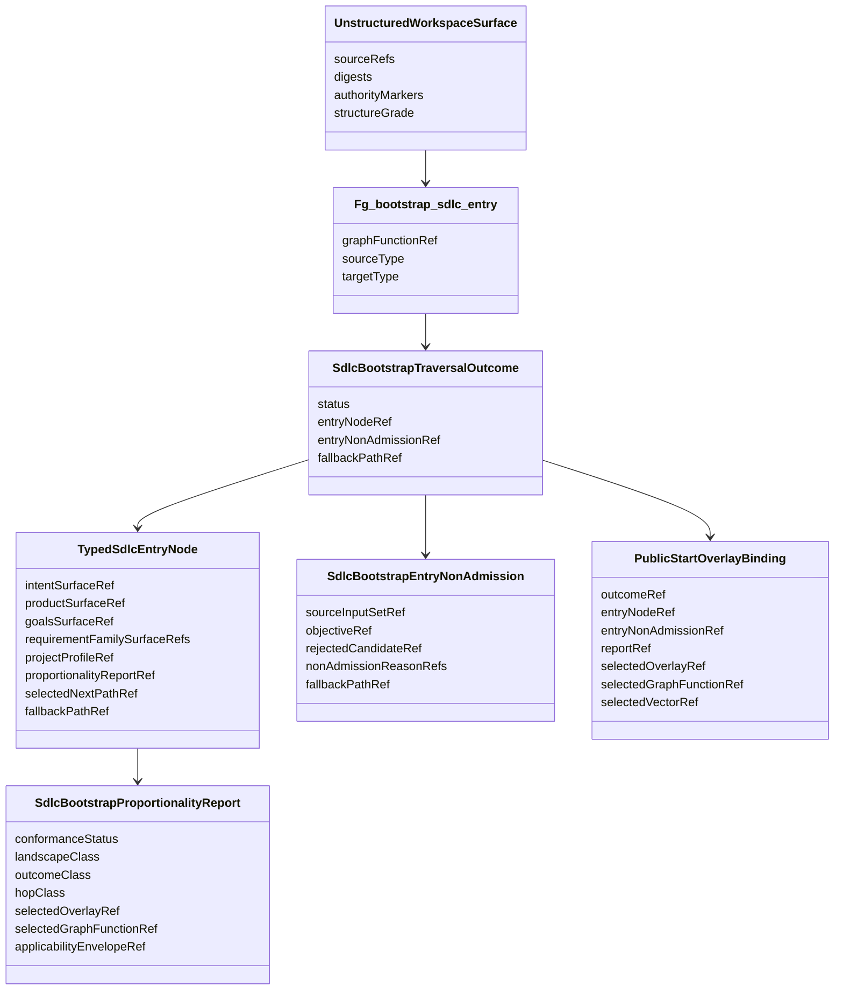
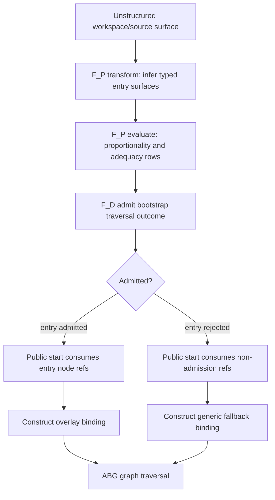
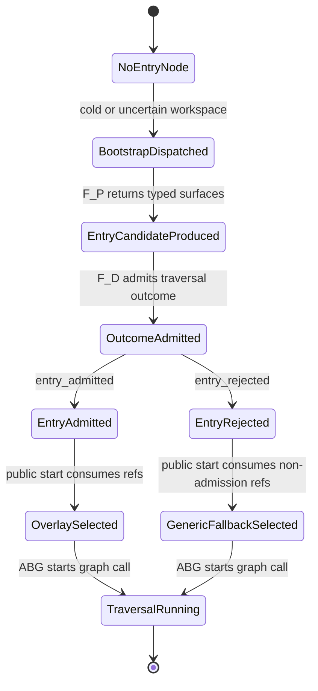

# ODD SDLC TypeScript Optimising Overlay

**Status**: Active
**Date**: 2026-06-07
**Owner Ticket**: `.ai-workspace/tickets/completed/T-165-define-optimising-overlay-for-landscape-conditioned-fd-specialization.md`
**Implements**: REQ-F-GFUNC-001, REQ-F-GFUNC-004, REQ-F-GFUNC-006, REQ-F-ASSET-001, REQ-F-ASSET-002, REQ-F-ASSET-003, REQ-F-ASSETMODEL-003, REQ-F-ASSETMODEL-004, REQ-F-ODDSDLC-074
**Derives From**: `specification/PRODUCT.md`, `specification/requirements/02-graph-functions.md`, `specification/requirements/06-bootstrap-assets-and-recursive-edges.md`, `specification/requirements/07-asset-typing-and-binding.md`, `specification/requirements/18-typed-construction-algebra.md`, `ODD_SDLC_TYPESCRIPT_REUSABLE_GRAPH_FUNCTION_LIBRARY.md`, `ODD_SDLC_TYPESCRIPT_WORKSPACE_INGRESS_SEAMS.md`

## Purpose

Define the TypeScript optimising overlay line.

The first phase makes bootstrap and proportionality one governed graph-function
boundary:

```text
type.unstructured
  -> Fg_bootstrap_sdlc_entry
  -> type.typed
```

The constructive target is a typed SDLC entry node. The admitted output is a
bootstrap traversal outcome that cites either that admitted entry node or an
admitted entry non-admission carrier. Public start consumes the admitted
outcome when selecting the next overlay, graph function, or generic fallback.
Public start does not infer the bootstrap facts itself.

## Base Traversal

Every optimized or specialized path remains a typed traversal first:

```text
TypedTraversal<Source, Target>
  sourceTypeRef
  targetTypeRef
  graphFunctionRef
  transformContractRef
  evaluationContractRef
  admissionContractRef
  closureContractRef
  fallbackContractRef
  replayIdentity
```

Bootstrap is the boundary specialization:

```text
BoundaryIngressTraversal
  extends TypedTraversal<type.unstructured, TypedSdlcEntryNode>
```

The boundary is special because the source is unstructured or only partially
conformed. The runtime law is not special. The same graph-function catalog,
typed asset binding, F_P/F_D split, ABG traversal truth, and downstream edge
assurance contract law still apply.

## T-200 Deep Overlay Refinement

Depth traversal is introduced as an additive overlay selection, not by mutating
the existing full SDLC overlay.

The baseline full traversal remains
`overlay://odd-sdlc/current-full-traversal`. The depth lane is the sibling
`overlay://odd-sdlc/deep-sdlc-traversal`. It deliberately duplicates the
current full traversal graph-function list, public starts, default start,
terminal graph functions, terminal asset templates, and lawful stop
dispositions, then carries an explicit
`deep_sdlc_traversal_candidate` annotation.

The annotation is product policy and pressure only:

- it marks the overlay as depth-traversal eligible
- it requires a decomposition trace before depth closure may be claimed
- it records the baseline parent overlay ref
- it states that ABG remains the only runtime authority

The optimizing overlay read model may list the deep overlay as a candidate
child overlay. The generic fallback remains
`overlay://odd-sdlc/current-full-traversal`. Public start may target the deep
overlay explicitly, but the selection does not create runtime truth, closure
truth, graph cursor movement, recursion, or event emission inside SDLC.

The later T-200 depth graph function must consume this overlay annotation and
ABG/GTL graph-function zoom surfaces. Until the decomposition trace carrier and
child graph-function foldback are implemented, this sibling overlay is an
admitted route marker and testable selection surface, not completion of depth
traversal.

## Prime Law

Graph functions remain the primary constructive carrier.

ABG owns runtime traversal, events, frames, continuation, projection, replay,
and fold truth.

`odd_sdlc` owns SDLC domain meaning, graph overlays, typed asset contracts,
edge assurance contracts, proportionality policy, and proof interpretation.

`F_P` may interpret unstructured source material and construct declared typed
surfaces. `F_D` admits, rejects, routes, validates, digests, and projects over
admitted refs. Neither `F_P` nor public-start branch logic becomes a rival
runtime truth source.

Implementation of this design must expose planned carrier, graph, public-start,
projection, and test changes for review before code begins.

## Domain Model



## Phase 1 Graph Function

`Fg_bootstrap_sdlc_entry` is a composition over existing bootstrap library
forms plus one proportionality selection surface:

```text
Fg_ingress_project
  input: IngressSourceSet
  output: Project typed asset refs, lineage, ambiguity, bootstrap gaps

Fg_conform_project
  input: ingress refs, project constraints, topology policy
  output: ConformProjectProfile, selected tenant, capabilities, gaps

Fg_select_proportional_sdlc_entry
  input: conformance refs, objective refs, edge assurance contracts
  output: SdlcBootstrapProportionalityReport

Fg_bootstrap_sdlc_entry
  input: UnstructuredWorkspaceSurface
  output: SdlcBootstrapTraversalOutcome
```

The composition is reusable. Other future products may bind different source
and target types, but this ticket only implements the `odd_sdlc` entry-node
outcome family.

## Flow



## State



## Carrier Shape

```text
TypedSdlcEntryNode
  kind: "typed_sdlc_entry_node"
  sourceInputSetRef
  intentSurfaceRef
  productSurfaceRef
  goalsSurfaceRef
  requirementFamilySurfaceRefs
  projectBootstrapSurfaceRef
  projectProfileRef
  initialBuildTenantSurfaceRefs
  proportionalityReportRef
  selectedNextPathRef
  fallbackPathRef
  evidenceRefs
  authorityRefs
  stableDigest

SdlcBootstrapTraversalOutcome
  kind: "sdlc_bootstrap_traversal_outcome"
  status: "entry_admitted" | "entry_rejected"
  entryNodeRef?
  entryNonAdmissionRef?
  sourceInputSetRef
  objectiveRef
  fallbackPathRef
  evidenceRefs
  authorityRefs
  stableDigest

SdlcBootstrapEntryNonAdmission
  kind: "sdlc_bootstrap_entry_non_admission"
  sourceInputSetRef
  objectiveRef
  rejectedCandidateRef
  nonAdmissionReasonRefs
  fallbackPathRef
  evidenceRefs
  authorityRefs
  stableDigest

SdlcBootstrapProportionalityReport
  kind: "sdlc_bootstrap_proportionality_report"
  conformanceStatus
  landscapeClass
  outcomeClass
  hopClass
  selectedOverlayRef
  selectedGraphFunctionRef
  selectedGraphVectorRef
  applicabilityEnvelopeRef
  pressurePreservationMechanismRefs
  rejectedAlternativeRefs
  fallbackPathRef
  optimizationNonAdmissionReasonRefs
  evidenceRefs
  authorityRefs
  stableDigest
```

## Admission Rules

`TypedSdlcEntryNode` admission requires:

- every required ref resolves under the admitted source workspace
- produced surfaces match their declared type and authority role
- optional requirement or tenant surfaces are either present with lineage or
  absent with explicit residual pressure
- `proportionalityReportRef` resolves to an admitted report for the same source
  input and objective basis
- `selectedNextPathRef` resolves to a published start target, overlay, graph
  function, or graph vector
- `fallbackPathRef` resolves to the generic lawful baseline
- contradictory conformance facts reject the node
- stale source digests reject replay reuse

`SdlcBootstrapTraversalOutcome` admission requires:

- `status: entry_admitted` cites an admitted `TypedSdlcEntryNode`
- `status: entry_rejected` cites an admitted `SdlcBootstrapEntryNonAdmission`
- exactly one of `entryNodeRef` or `entryNonAdmissionRef` is present
- `fallbackPathRef` resolves for both accepted and rejected outcomes
- source/objective refs match the executed bootstrap graph call
- stale source digests reject replay reuse

`SdlcBootstrapEntryNonAdmission` admission requires:

- rejected candidate refs, reason refs, and fallback refs are present
- contradictory or missing conformance is represented as rejection evidence
- no selected optimized path is present
- fallback resolves to the generic lawful baseline

`SdlcBootstrapProportionalityReport` admission requires:

- selected overlay, graph function, and graph vector refs resolve
- optimized selection cites an admitted applicability envelope
- pressure-preservation mechanism refs are present for every skipped or fused
  edge
- non-admitted optimization records explicit reason refs and fallback refs
- outcome classification does not depend on prompt prose, chat memory, file
  naming convention, or stale comments

## Public Start Algorithm

```text
public_start(target):
  objective = admit_operator_objective(target)
  source = admit_or_refresh_unstructured_workspace_surface()

  outcome = find_replay_valid_bootstrap_traversal_outcome(source, objective)
  if outcome is missing:
    bootstrapRequest = construct_abg_graph_call_request(
      graphFunctionRef = Fg_bootstrap_sdlc_entry,
      sourceRef = source.ref,
      objectiveRef = objective.ref,
      expectedOutcomeType = SdlcBootstrapTraversalOutcome
    )
    outcome = dispatch_abg_and_read_admitted_outcome(bootstrapRequest)

  if outcome.status == "entry_rejected":
    rejection = admit_or_read(outcome.entryNonAdmissionRef)
    binding = construct_generic_fallback_binding(
      outcomeRef = outcome.ref,
      nonAdmissionRef = rejection.ref,
      fallbackPathRef = rejection.fallbackPathRef
    )
  else:
    entry = admit_or_read(outcome.entryNodeRef)
    report = admit_or_read(entry.proportionalityReportRef)
    binding = construct_overlay_binding(
      outcomeRef = outcome.ref,
      entryNodeRef = entry.ref,
      reportRef = report.ref,
      selectedOverlayRef = report.selectedOverlayRef,
      selectedGraphFunctionRef = report.selectedGraphFunctionRef,
      selectedGraphVectorRef = report.selectedGraphVectorRef,
      fallbackPathRef = report.fallbackPathRef
    )

  dispatch_abg_graph_call(binding)
```

Public start may construct the ABG graph-call request and consume admitted
outcomes. It may not execute `Fg_bootstrap_sdlc_entry` locally or publish the
outcome itself.

## Phase 2 Minimum Smoke Path

After phase 1 is admitted, the hello-world class may select a single iterative
smoke node:

```text
single_iterative_smoke_node
  -> design + build + test in one F_P.transform
  -> semantic adequacy in one F_P.evaluate
  -> F_D admission, gain, closure, and replay proof
```

The node is admissible only when the phase 1 proportionality report proves the
input class is bounded and pressure can be preserved by the fused path.

## Audit Checklist

- The implementation plan was reviewed before code began.
- Every new carrier specializes `TypedTraversal<Source, Target>` or a declared
  child carrier of that base.
- `Fg_bootstrap_sdlc_entry` is published in the graph-function catalog.
- The admitted output is `SdlcBootstrapTraversalOutcome`, not an untyped
  decision blob.
- Public start consumes outcome refs and does not derive landscape class
  locally.
- Public start obtains missing bootstrap outcomes only through ABG-owned graph
  traversal or an admitted pre-start execution contract.
- Optimized selection is impossible without an admitted proportionality report.
- Every fallback is explicit and ref-backed.
- Overlay bindings carry outcome, entry/report or non-admission refs, and
  digests.
- Replay rejects stale source digests.
- Query-domain exposes optimization state only as read-model projection.
- ABG remains the only runtime event, fold, continuation, and replay owner.
- Generic F_P baseline remains available when optimization is not admitted.
