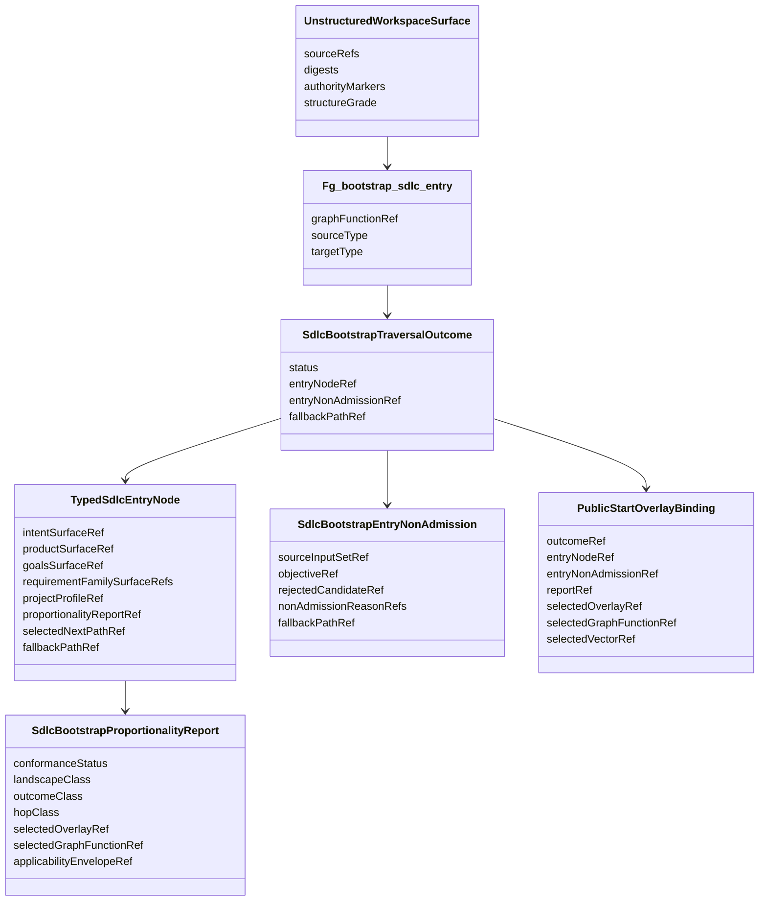
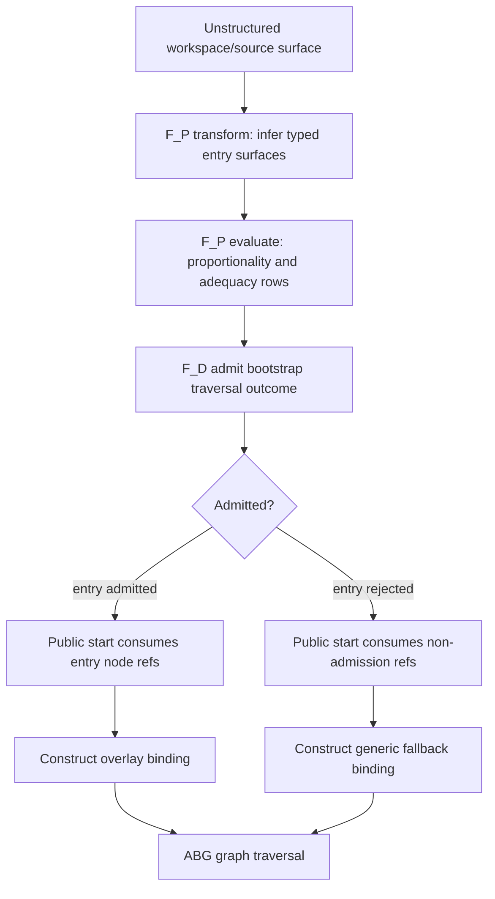
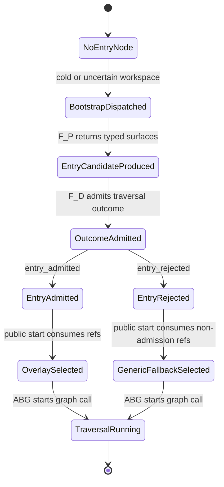

# ODD SDLC TypeScript Optimising Overlay

**Status**: Active
**Date**: 2026-06-07
**Owner Ticket**: `.ai-workspace/tickets/completed/T-165-define-optimising-overlay-for-landscape-conditioned-fd-specialization.md`
**Implements**: REQ-F-GFUNC-001, REQ-F-GFUNC-004, REQ-F-GFUNC-006, REQ-F-ASSET-001, REQ-F-ASSET-002, REQ-F-ASSET-003, REQ-F-ASSETMODEL-003, REQ-F-ASSETMODEL-004, REQ-F-ODDSDLC-074
**Derives From**: `specification/PRODUCT.md`, `specification/requirements/02-graph-functions.md`, `specification/requirements/06-bootstrap-assets-and-recursive-edges.md`, `specification/requirements/07-asset-typing-and-binding.md`, `specification/requirements/18-typed-construction-algebra.md`, `ODD_SDLC_TYPESCRIPT_REUSABLE_GRAPH_FUNCTION_LIBRARY.md`, `ODD_SDLC_TYPESCRIPT_WORKSPACE_INGRESS_SEAMS.md`

## Purpose

Define the TypeScript optimising overlay line.

The first phase makes bootstrap and proportionality one governed graph-function
boundary:

```text
type.unstructured
  -> Fg_bootstrap_sdlc_entry
  -> type.typed
```

The constructive target is a typed SDLC entry node. The admitted output is a
bootstrap traversal outcome that cites either that admitted entry node or an
admitted entry non-admission carrier. Public start consumes the admitted
outcome when selecting the next overlay, graph function, or generic fallback.
Public start does not infer the bootstrap facts itself.

## Base Traversal

Every optimized or specialized path remains a typed traversal first:

```text
TypedTraversal<Source, Target>
  sourceTypeRef
  targetTypeRef
  graphFunctionRef
  transformContractRef
  evaluationContractRef
  admissionContractRef
  closureContractRef
  fallbackContractRef
  replayIdentity
```

Bootstrap is the boundary specialization:

```text
BoundaryIngressTraversal
  extends TypedTraversal<type.unstructured, TypedSdlcEntryNode>
```

The boundary is special because the source is unstructured or only partially
conformed. The runtime law is not special. The same graph-function catalog,
typed asset binding, F_P/F_D split, ABG traversal truth, and downstream edge
assurance contract law still apply.

## T-200 Deep Overlay Refinement

Depth traversal is introduced as an additive overlay selection, not by mutating
the existing full SDLC overlay.

The baseline full traversal remains
`overlay://odd-sdlc/current-full-traversal`. The depth lane is the sibling
`overlay://odd-sdlc/deep-sdlc-traversal`. It deliberately duplicates the
current full traversal graph-function list, public starts, default start,
terminal graph functions, terminal asset templates, and lawful stop
dispositions, then carries an explicit
`deep_sdlc_traversal_candidate` annotation.

The annotation is product policy and pressure only:

- it marks the overlay as depth-traversal eligible
- it requires a decomposition trace before depth closure may be claimed
- it records the baseline parent overlay ref
- it states that ABG remains the only runtime authority

The optimizing overlay read model may list the deep overlay as a candidate
child overlay. The generic fallback remains
`overlay://odd-sdlc/current-full-traversal`. Public start may target the deep
overlay explicitly, but the selection does not create runtime truth, closure
truth, graph cursor movement, recursion, or event emission inside SDLC.

The later T-200 depth graph function must consume this overlay annotation and
ABG/GTL graph-function zoom surfaces. Until the decomposition trace carrier and
child graph-function foldback are implemented, this sibling overlay is an
admitted route marker and testable selection surface, not completion of depth
traversal.

## T-202 Consequence Traversal Catalog Projection

ABG T-156 makes consequence traversal eligibility an ABG-derived catalog over
GTL declarations. `odd_sdlc` consumes that substrate through overlays, but the
overlay remains product policy only. There is one runtime truth:

```text
overlay declaration
  -> GTL graph-function/vector declaration
  -> ABG allowedConsequenceTraversalCatalog
  -> consequence.C chooses one catalog row
  -> ABG admits or blocks the selected ConsequenceTraversalAction
  -> ABG construction/re-entry/events/replay/terminal truth
```

The overlay annotation is never an execution trigger. It is declaration source
and proportionality evidence. It cannot create tickets, invoke workers, move a
vector cursor, emit events, write ledgers, or close work.

### Declaration Lowering

The overlay carrier adds explicit allowed-consequence traversal rows. Each row
lowers onto the selected GTL graph function or graph vector through ABG T-156
declaration keys:

```text
abg.consequence.allowed_traversal_families
abg.consequence.allowed_traversals
```

Rows lower to ABG `AllowedConsequenceTraversalRow` shape:

```text
traversalFamily
allowedActionKinds
allowedGraphFunctionRefs
allowedTraversalTargetRefs
requiredAuthorityRefs
proportionalityBasisRefs
declarationSourceRefs
```

Empty allow-lists are permitted only when row presence itself is the edge-local
authority. Nonlocal traversal families must carry a concrete authority row:
depth rows cite the zoom/decomposition authority; ticket rows cite a product
route; public-start rows cite a declared next overlay or public start target.

### Overlay Edge Matrix

The first implementation targets these overlay edges:

| overlay | edge/function targets | declared families | constraints |
| --- | --- | --- | --- |
| `overlay://odd-sdlc/current-full-traversal` | every selected full traversal graph function | `same_edge_retry`, `gap_stop`, `non_admit` | generic baseline; no depth declaration |
| `overlay://odd-sdlc/current-full-traversal` | `derive_component_code_surface`, `qualify_component_realization_surface`, `derive_code_surface`, `derive_test_design_surface`, `derive_component_test_surface`, `derive_uat_test_source_surface`, `prepare_test_execution_surface`, `derive_test_execution_result_surface`, `qualify_component_test_execution_surface`, `derive_component_repair_schedule_surface`, `derive_test_run_archive_surface` | `ticket_traversal` | route only through `asset:ticket/...`, `ticket-route:...`, `graph-function:route_ticket_work_item`, or `published-traversal-target:...`; never direct `.ai-workspace/tickets` storage |
| `overlay://odd-sdlc/deep-sdlc-traversal` | the same code/test/review pressure functions | `depth_traversal`, `ticket_traversal`, `same_edge_retry`, `gap_stop`, `non_admit` | depth requires `Fg_decompose_depth_between_nodes`, the deep overlay annotation ref, selected graph-function/vector refs, and refinement/candidate/published traversal-target authority |
| `overlay://odd-sdlc/lite-design-module-implementation` | `lite_design_module_implementation`, `derive_lite_design_adr_surface`, `derive_lite_component_code_surface`, `prepare_test_execution_surface`, `derive_test_execution_result_surface` | `same_edge_retry`, `graph_span_reentry`, `public_start_reentry`, `ticket_traversal`, `gap_stop`, `non_admit` | repair re-entry is limited to declared test-execution-failed routes; public-start re-entry is limited to declared continuation into current-full |
| `overlay://odd-sdlc/framework-smoke-min-fp` | `framework_smoke_min_fp`, `derive_lite_design_adr_surface`, `derive_lite_component_code_surface`, `prepare_test_execution_surface`, `derive_test_execution_result_surface` | `same_edge_retry`, `graph_span_reentry`, `gap_stop`, `non_admit` | repair re-entry is limited to the declared test-execution-failed route; no depth declaration |
| `overlay://odd-sdlc/ticket-workflow` | `route_ticket_work_item` | `same_edge_retry`, `public_start_reentry`, `gap_stop`, `non_admit` | this is the product route after ticket traversal selection; it does not recursively create tickets |
| `overlay://odd-sdlc/bootstrap-requirements` | `Fg_conform_project`, `bootstrap_requirements` | `same_edge_retry`, `public_start_reentry`, `gap_stop`, `non_admit` | public-start re-entry is limited to declared next-eligible overlays |
| `overlay://odd-sdlc/solution-architecture` | `solution_architecture` | `same_edge_retry`, `public_start_reentry`, `gap_stop`, `non_admit` | public-start re-entry is limited to declared next-eligible overlays |

Graph functions are the product-visible route unit. Graph vectors remain
internal execution structure and may appear in rows only as ABG-derived edge
identity or as part of an admitted graph-function/re-entry/zoom authority.

### Code-Builder Overlay Refinement

T-203 narrows the code/test section of the overlay to one solution path.
`derive_component_code_surface`, `derive_component_test_surface`,
`derive_uat_test_source_surface`, and the overlay-scoped
`derive_lite_component_code_surface` are target profiles of
`Fg_graph_code_builder`. The lite profile is allowed only on the lite/smoke
overlays named below; it is not a fallback path for full-traversal source or
test materialization.

```text
requirements + design + tenant authority
  -> [
       Fg_graph_code_builder(source-code target),
       Fg_graph_code_builder(unit/component-test target),
       Fg_graph_code_builder(UAT-test target)
     ]
  -> test-run / qualification fan-in
  -> ticket_traversal or depth_traversal re-entry
```

The deep overlay annotation applies to all three full code-builder target
specializations. UAT testcase authority is requirements-specific; UAT-bound
scenario bundles are the `scenario_surface` rows derived over that authority
and design. Unit/component tests are requirement + design + module specific.
Generated source code, generated unit/component tests, and generated UAT test
source must be sibling ABG-frontier branches when admitted dependency maps
select `parallel`; source/test consistency is then proved only at test-run /
qualification fan-in. A test command with no generated source tests is
residual pressure for the ticket/depth consequence path, not proof of closure.
The ABG frontier artifact records this as distinct branch authority, including
the UAT dependency map, UAT traversal selection, and nonzero `uatTestLaneCount`
when UAT test-source work is admitted.
If the implementation dependency map is source-only, the module definitions
still derive unit/component-test dependency nodes before UAT test-source nodes
are derived from that test authority; absence of pre-existing test files must
not remove the unit/UAT branches from the first ABG-ready batch.
The derived UAT target path remains inside the tenant-declared discoverable
test source root for the selected stack; a UAT branch outside that root is
non-closure because downstream test execution would not consume it.

Existing confused paths that treat component tests as a later proof side effect
are retired. Any implementation that preserves a parallel source/test
materialization route outside `Fg_graph_code_builder` is non-closure.

### Runtime Steel-Thread Dependency Window

Steel-thread is a runtime traversal strategy over admitted SDLC dependency
assets, not a static overlay or GTL module rebuild profile.

The SDLC side resolves the product meaning:

```text
starting requirement or dependency node
  -> admitted module/test/UAT dependency maps
  -> predecessor-closed dependency window
  -> requirement refs + dependency-node refs + required progress artifacts
  -> StartIntent.runtimeTraversalSelections[]
```

The selected window answers "implement req-04 with the prerequisite rows needed
for the coherent MVP thread." Full breadth remains the graph-frontier fanout
over all admitted ready rows. Steel-thread does not mean a second graph, a
local controller, or an overlay-specific runtime loop.

The ABG side owns the admitted runtime envelope. Once SDLC supplies the
runtime start selection, ABG owns traversal facts, retry/yield/backoff,
replay-visible continuation, and any later consequence-selected traversal.
SDLC may interpret dependency maps and choose the selected refs; it must not
move graph cursors, emit runtime events, or continue locally from the selected
window.

### Consequence.C Contract

The SDLC consequence plugin is the product policy selector. It is not route
authority. Its traversal algorithm is:

```text
catalog = EnginePluginInput.allowedConsequenceTraversalCatalog
eligibleFamilies = catalog.rows.traversalFamily

derive desired family from admitted SDLC pressure:
  depth_traversal for deep overlay code/test/review depth pressure
  ticket_traversal for admitted terminal/review-grade ticket pressure
  graph_span_reentry or same_edge_retry for declared repair pressure
  public_start_reentry for declared overlay continuation
  gap_stop or non_admit for declared terminal outcomes

if desired family has no matching catalog row:
  return blocked/non-admitted consequence evidence with no traversalAction

otherwise:
  construct ConsequenceTraversalAction with explicit selectedTraversalFamily
  cite product evidence as proportionality, not route authority
  return it only through ConsequenceProjectionOutcome.traversalAction
```

ABG then gates the action against the catalog before construction projection or
runtime execution. The plugin must not synthesize catalog rows, infer
permission from annotations, choose relative cursors, target bare graph
vectors, write tickets, emit runtime events, move cursors, invoke workers,
write ledgers, close work, or fall back to a local family switch.

### T-202 Implementation State

The substrate pin is resolved by ABG `4.0.0-rc.29`, which carries T-156 and
static GTL annotation validation.

The TypeScript tenant now lowers SDLC overlay policy into ABG T-156 GTL
declaration rows during SDLC GTL module construction. The overlay read model
then exposes `allowedConsequenceTraversalDeclarations` by projecting the
ABG-derived catalog rows for that overlay. This is a read model only; it does
not create route authority outside ABG.

The installed consequence path consumes
`EnginePluginInput.allowedConsequenceTraversalCatalog` for depth traversal
selection. A depth traversal action must carry explicit
`selectedTraversalFamily = depth_traversal`, a published traversal target, the
deep overlay annotation and zoom/decomposition authority refs, and must admit
against the active overlay's ABG catalog before it can be returned through
`ConsequenceProjectionOutcome.traversalAction`.

Focused semantic proof covers current-full baseline/ticket rows, deep
depth/ticket rows, ticket-workflow non-recursive rows, GTL declaration
derivation, catalog-present selection admission, catalog-absent selection
rejection, annotation-only depth rejection, bare-vector target rejection,
direct ticket-storage rejection, installed consequence non-execution guards,
and current SDLC GTL typecheck. Full semantic verification passes 1042/1042.

Live builder proof covers the installed surface:

- hello-world JS zoom passes against the deep zoom path
- Rust detailed passes against the installed release surface
- data-mapper detailed runs the deep overlay through component-code depth and
  governed retries, then creates `asset:ticket/T-001` and `asset:ticket/T-002`
  for the remaining external Spark/Hadoop-on-Java-25 proof block
- `asset:ticket/T-001` starts through `overlay://odd-sdlc/ticket-workflow` and
  `route_ticket_work_item`, preserving `T-002` as downstream builder pressure

The data-mapper live proof is intentionally a builder-of-builder proof. It does
not claim generated data-mapper product convergence, and generated sandbox
product defects remain ticket/retry pressure rather than outside-in sandbox
patches.

## Prime Law

Graph functions remain the primary constructive carrier.

ABG owns runtime traversal, events, frames, continuation, projection, replay,
and fold truth.

`odd_sdlc` owns SDLC domain meaning, graph overlays, typed asset contracts,
edge assurance contracts, proportionality policy, and proof interpretation.

`F_P` may interpret unstructured source material and construct declared typed
surfaces. `F_D` admits, rejects, routes, validates, digests, and projects over
admitted refs. Neither `F_P` nor public-start branch logic becomes a rival
runtime truth source.

Implementation of this design must expose planned carrier, graph, public-start,
projection, and test changes for review before code begins.

## Domain Model



## Phase 1 Graph Function

`Fg_bootstrap_sdlc_entry` is a composition over existing bootstrap library
forms plus one proportionality selection surface:

```text
Fg_ingress_project
  input: IngressSourceSet
  output: Project typed asset refs, lineage, ambiguity, bootstrap gaps

Fg_conform_project
  input: ingress refs, project constraints, topology policy
  output: ConformProjectProfile, selected tenant, capabilities, gaps

Fg_select_proportional_sdlc_entry
  input: conformance refs, objective refs, edge assurance contracts
  output: SdlcBootstrapProportionalityReport

Fg_bootstrap_sdlc_entry
  input: UnstructuredWorkspaceSurface
  output: SdlcBootstrapTraversalOutcome
```

The composition is reusable. Other future products may bind different source
and target types, but this ticket only implements the `odd_sdlc` entry-node
outcome family.

## Flow



## State



## Carrier Shape

```text
TypedSdlcEntryNode
  kind: "typed_sdlc_entry_node"
  sourceInputSetRef
  intentSurfaceRef
  productSurfaceRef
  goalsSurfaceRef
  requirementFamilySurfaceRefs
  projectBootstrapSurfaceRef
  projectProfileRef
  initialBuildTenantSurfaceRefs
  proportionalityReportRef
  selectedNextPathRef
  fallbackPathRef
  evidenceRefs
  authorityRefs
  stableDigest

SdlcBootstrapTraversalOutcome
  kind: "sdlc_bootstrap_traversal_outcome"
  status: "entry_admitted" | "entry_rejected"
  entryNodeRef?
  entryNonAdmissionRef?
  sourceInputSetRef
  objectiveRef
  fallbackPathRef
  evidenceRefs
  authorityRefs
  stableDigest

SdlcBootstrapEntryNonAdmission
  kind: "sdlc_bootstrap_entry_non_admission"
  sourceInputSetRef
  objectiveRef
  rejectedCandidateRef
  nonAdmissionReasonRefs
  fallbackPathRef
  evidenceRefs
  authorityRefs
  stableDigest

SdlcBootstrapProportionalityReport
  kind: "sdlc_bootstrap_proportionality_report"
  conformanceStatus
  landscapeClass
  outcomeClass
  hopClass
  selectedOverlayRef
  selectedGraphFunctionRef
  selectedGraphVectorRef
  applicabilityEnvelopeRef
  pressurePreservationMechanismRefs
  rejectedAlternativeRefs
  fallbackPathRef
  optimizationNonAdmissionReasonRefs
  evidenceRefs
  authorityRefs
  stableDigest
```

## Admission Rules

`TypedSdlcEntryNode` admission requires:

- every required ref resolves under the admitted source workspace
- produced surfaces match their declared type and authority role
- optional requirement or tenant surfaces are either present with lineage or
  absent with explicit residual pressure
- `proportionalityReportRef` resolves to an admitted report for the same source
  input and objective basis
- `selectedNextPathRef` resolves to a published start target, overlay, graph
  function, or graph vector
- `fallbackPathRef` resolves to the generic lawful baseline
- contradictory conformance facts reject the node
- stale source digests reject replay reuse

`SdlcBootstrapTraversalOutcome` admission requires:

- `status: entry_admitted` cites an admitted `TypedSdlcEntryNode`
- `status: entry_rejected` cites an admitted `SdlcBootstrapEntryNonAdmission`
- exactly one of `entryNodeRef` or `entryNonAdmissionRef` is present
- `fallbackPathRef` resolves for both accepted and rejected outcomes
- source/objective refs match the executed bootstrap graph call
- stale source digests reject replay reuse

`SdlcBootstrapEntryNonAdmission` admission requires:

- rejected candidate refs, reason refs, and fallback refs are present
- contradictory or missing conformance is represented as rejection evidence
- no selected optimized path is present
- fallback resolves to the generic lawful baseline

`SdlcBootstrapProportionalityReport` admission requires:

- selected overlay, graph function, and graph vector refs resolve
- optimized selection cites an admitted applicability envelope
- pressure-preservation mechanism refs are present for every skipped or fused
  edge
- non-admitted optimization records explicit reason refs and fallback refs
- outcome classification does not depend on prompt prose, chat memory, file
  naming convention, or stale comments

## Public Start Algorithm

```text
public_start(target):
  objective = admit_operator_objective(target)
  source = admit_or_refresh_unstructured_workspace_surface()

  outcome = find_replay_valid_bootstrap_traversal_outcome(source, objective)
  if outcome is missing:
    bootstrapRequest = construct_abg_graph_call_request(
      graphFunctionRef = Fg_bootstrap_sdlc_entry,
      sourceRef = source.ref,
      objectiveRef = objective.ref,
      expectedOutcomeType = SdlcBootstrapTraversalOutcome
    )
    outcome = dispatch_abg_and_read_admitted_outcome(bootstrapRequest)

  if outcome.status == "entry_rejected":
    rejection = admit_or_read(outcome.entryNonAdmissionRef)
    binding = construct_generic_fallback_binding(
      outcomeRef = outcome.ref,
      nonAdmissionRef = rejection.ref,
      fallbackPathRef = rejection.fallbackPathRef
    )
  else:
    entry = admit_or_read(outcome.entryNodeRef)
    report = admit_or_read(entry.proportionalityReportRef)
    binding = construct_overlay_binding(
      outcomeRef = outcome.ref,
      entryNodeRef = entry.ref,
      reportRef = report.ref,
      selectedOverlayRef = report.selectedOverlayRef,
      selectedGraphFunctionRef = report.selectedGraphFunctionRef,
      selectedGraphVectorRef = report.selectedGraphVectorRef,
      fallbackPathRef = report.fallbackPathRef
    )

  dispatch_abg_graph_call(binding)
```

Public start may construct the ABG graph-call request and consume admitted
outcomes. It may not execute `Fg_bootstrap_sdlc_entry` locally or publish the
outcome itself.

## Phase 2 Minimum Smoke Path

After phase 1 is admitted, the hello-world class may select a single iterative
smoke node:

```text
single_iterative_smoke_node
  -> design + build + test in one F_P.transform
  -> semantic adequacy in one F_P.evaluate
  -> F_D admission, gain, closure, and replay proof
```

The node is admissible only when the phase 1 proportionality report proves the
input class is bounded and pressure can be preserved by the fused path.

## Audit Checklist

- The implementation plan was reviewed before code began.
- Every new carrier specializes `TypedTraversal<Source, Target>` or a declared
  child carrier of that base.
- `Fg_bootstrap_sdlc_entry` is published in the graph-function catalog.
- The admitted output is `SdlcBootstrapTraversalOutcome`, not an untyped
  decision blob.
- Public start consumes outcome refs and does not derive landscape class
  locally.
- Public start obtains missing bootstrap outcomes only through ABG-owned graph
  traversal or an admitted pre-start execution contract.
- Optimized selection is impossible without an admitted proportionality report.
- Every fallback is explicit and ref-backed.
- Overlay bindings carry outcome, entry/report or non-admission refs, and
  digests.
- Replay rejects stale source digests.
- Query-domain exposes optimization state only as read-model projection.
- ABG remains the only runtime event, fold, continuation, and replay owner.
- Generic F_P baseline remains available when optimization is not admitted.
