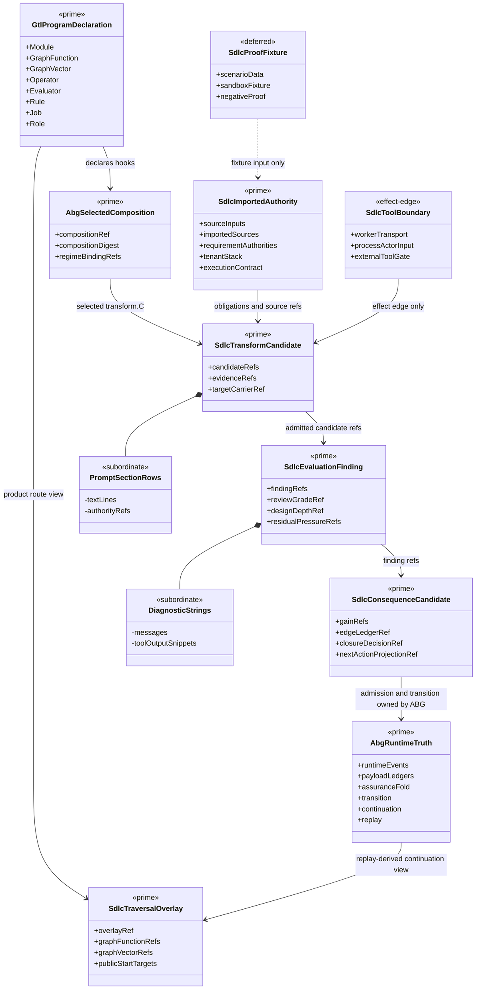
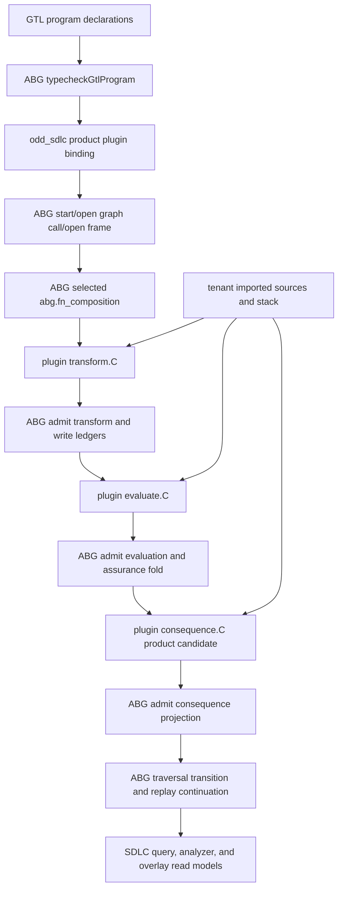
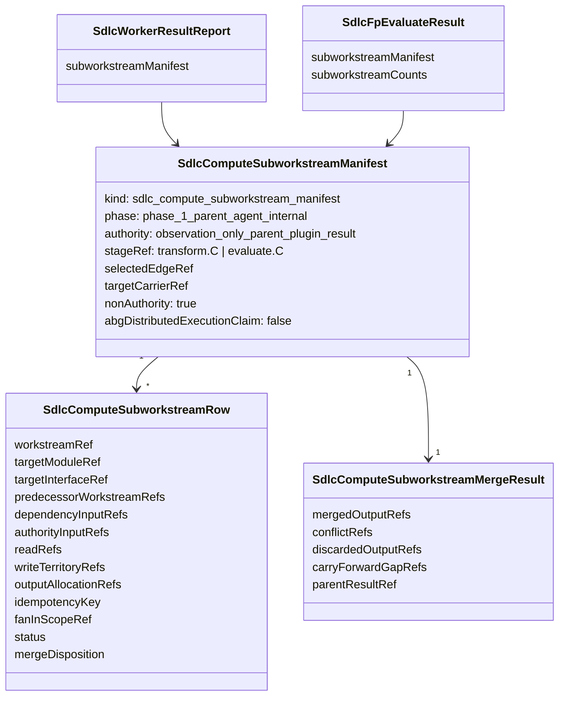
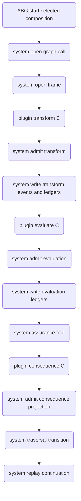
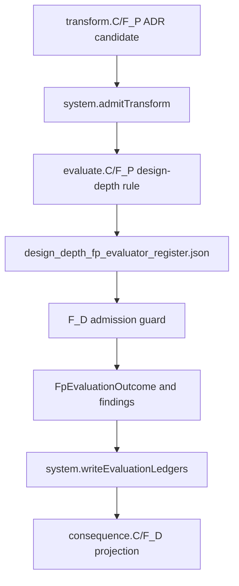

# ODD SDLC TypeScript Staged Compute Boundary

Status: implemented design for T-180 semantic proof; live hello-world proof
pending.

Derives from:

- `specification/PRODUCT.md`
- `specification/requirements/03-runtime-governance.md`
- `specification/requirements/18-typed-construction-algebra.md`
- ABIogenesis `REQ-R-ABG3-FN-COMPOSITION`
- ABIogenesis `REQ-L-GTL3-COMPUTE-NOTATION`
- ABIogenesis staged-compute runtime law

## STDO Re-Triage

This is a `requirement_reprice` followed by `design_reframe`.

The current SDLC TypeScript runtime states the compute-stage epistemology but
still contains realization paths where SDLC-local code synthesizes selected
composition identity and derives evaluation, ledgers, consequence, closure, and
next action around one `fpDispatch` adapter. That conflicts with the staged compute
boundary where ABG is the system side-effect owner and product plugins compute
typed values or refs only.

## One Truth Rule

Plugin stages are composed through GTL. ABG selects that GTL composition through
`abg.fn_composition` and owns runtime truth over the selected composition. SDLC
shall consume selected composition ref, digest, selection ref, and selected
regime binding ref from ABG runtime/plugin carriers. SDLC shall not derive live
selected composition identity from graph-function names, edge names, archive
roots, report paths, or local context refs.

ABG is the only writer for runtime events, admission truth, payload ledgers,
assurance fold, traversal transition, continuation, correction, closure, and
replay truth.

SDLC may keep multiple product ledger/read-model surfaces, but they must be
projections over ABG-admitted events and ABG-derived ledgers. They are not
independent writers of runtime truth.

SDLC owns product semantics, product plugins, pressure interpretation, gain
meaning, analyzer read models, target-carrier meaning, and proof interpretation.

## Common-Surface Compression Rule

This design extends the T-175 source-truth consolidation. New staged-compute
migration code must first route through existing common surfaces:

- value domains: `contracts/carrier_domain_catalog.ts`
- artifact truth: `contracts/operator_run_artifact_catalog.ts`
- graph/frontier policy: `contracts/product_graph_contract_catalog.ts`
- carrier ingress: `admission/*`
- file/process effects: `effects/*`
- missing/malformed runtime gaps: `analysis/runtime_gaps.ts` via catalog truth
- analyzer proof: projections over admitted carriers

Do not add a second local enum, artifact filename list, selected-composition
helper, path-derived graph policy, analyzer fallback, archive writer, or process
effect when one of those common surfaces can be extended. If a new common
surface is required, it must name producers, consumers, admission, effects, and
proof before implementation closure.

## Handoff Removal Rule

`operator/handoff.ts` is not an owning design module and is not an accepted
adapter. It is a deletion target. Any return of code there is non-closure
evidence unless a new ticket reprices this module map. Logic formerly collected
there has these homes:

| former handoff concern | owning staged-compute surface |
| --- | --- |
| worker launch manifests, prompt source carriers, transform request/result refs | `operator/plugins/transform/*` |
| selected F_P evaluator sidecar admission, design-depth pressure maps, review-grade findings | `operator/plugins/evaluate/*` |
| deterministic evidence/postflight guards | `postflight/*` and `operator/plugins/evaluate/postflight.ts` |
| tenant stack authority and effective runtime/build/test contracts | `build_tenants/<tenant>/spec/TECH_STACK.json` as product authority, with generic transform/evaluate enforcement under `operator/plugins/transform/*` and `operator/plugins/evaluate/*` |
| archive/file/process side effects | `effects/*` plus catalog-backed archive helpers |
| ABG/system ledger write candidates and gap dossiers | `operator/ledgers/*`, `assurance_gate.ts`, and `traversal_consequence.ts` until split |
| deterministic continuation projection | `operator/plugins/consequence/*` and `traversal_consequence.ts` |

New code must not add prompt, semantic evaluation, ledger, consequence, stack,
or topology logic to `handoff.ts`. If a helper is imported from `handoff.ts`,
the design is not closed. Passing tests through a remaining handoff semantic
path is non-closure evidence, not proof.

## T-197 Owner Partition And Decommission Register

Status: ratified design lock for T-197 W-010, W-020, W-030, and Wave 1
A-row ownership; terminal ledger refresh recorded on 2026-06-11. This section
authorizes bounded refactoring work only. It does not by itself close any
implementation row without the ticket proof ledger.

T-197 consolidates two defect axes:

- vertical authority leakage: SDLC realization code authors or selects ABG/GTL
  runtime truth instead of consuming it
- horizontal target-identity leakage: SDLC framework code names one governed
  target product, ecosystem, file, command, or scenario as generic law

The owner split is:

| owner | owns | must not own |
| --- | --- | --- |
| GTL | graph language, graph algebra, module/job/role/public-start declarations, target-carrier contract declaration, prompt AssetSurface law, hook and composition declarations | runtime facts, product domain meaning, target-specific filenames |
| ABG | program admission, selected `abg.fn_composition`, runtime events, payload ledgers, assurance fold, traversal transition, continuation, retry, correction, replay, saga/frontier runtime facts | SDLC product policy, tenant identity, target-specific requirement interpretation |
| odd_sdlc.TS | SDLC edge meaning, graph-function catalog, overlays as product route views, prompt policy overlays, target-carrier product meaning, consequence candidates/read models, analyzer/query projections, proof interpretation | ABG runtime event authorship, final closure fold, continuation truth, second GTL contract law |
| odd_service | future session, worker registry, dispatch routing, and client observation plane | current SDLC runtime truth or GTL/ABG contract law |
| tenant authority | imported project truth, tenant stack, execution contract, source/test/deployment declarations | framework defaults or SDLC constitutional law |
| proof harness | scenario setup, fixtures, negative proof, archive inspection | product runtime truth, generic target identity, closure authority |

### T-197 IACS

The irreducible architectural carrier set for this reconciliation boundary is:

| carrier family | role | authority | owning surfaces | non-closure signal |
| --- | --- | --- | --- | --- |
| `GtlProgramDeclaration` | prime GTL program truth: module, graph functions, graph vectors, operators, evaluators, rules, hooks, jobs, roles | GTL authoritative, SDLC publishes | `graph/*`, `gtl_conformance/program.ts`, ABG `typecheckGtlProgram(...)` | product code skips the ABG conformance gate or feeds a partial inventory |
| `SdlcTraversalOverlay` | product route view over GTL graph functions and vectors | SDLC downstream over GTL | `graph/overlays.ts`, public start target catalog | overlay owns closure, target movement, or runtime event truth |
| `AbgSelectedComposition` | selected `abg.fn_composition` identity and regime binding | ABG authoritative | plugin input, selected composition helpers, runtime archives | SDLC derives selected composition from edge names, paths, or graph-function names |
| `SdlcTransformCandidate` | transform.C product candidate/evidence refs | SDLC plugin candidate, ABG admitted | `operator/plugins/transform/*`, worker result carriers | transform writes ledgers, emits events, closes, or selects continuation |
| `SdlcEvaluationFinding` | evaluate.C finding refs and semantic review candidates | SDLC plugin candidate, ABG admitted | `operator/plugins/evaluate/*`, review-grade and design-depth artifacts | evaluation writes final ledgers, closes, transitions, or replays |
| `SdlcRepairSurfaceTriage` | evaluate.C repair-surface classification over non-fulfilled findings | SDLC plugin candidate over admitted review evidence; ABG owns yield/re-entry execution | `operator/review_grade_edge_fulfillment.ts`, `operator/closure_state_machine.ts`, `operator/installed_operator.ts` | nonlocal product gaps default to same-edge retry or omit repair graph/vector/asset refs |
| `SdlcConsequenceCandidate` | product consequence candidate/read model: gain, residual pressure, edge ledger, closure decision, next-action projection | SDLC downstream candidate until ABG admission/fold/transition | `operator/traversal_consequence.ts`, consequence plugin, analyzer projections | consequence candidate is treated as final ABG fold, transition, or continuation truth |
| `AbgRuntimeTruth` | events, frames, payload ledgers, assurance fold, transition, continuation, replay | ABG authoritative | ABG runtime package, SDLC ABG append sink, replay readers | SDLC constructs runtime lifecycle events before emit or reconstructs replay truth |
| `SdlcImportedAuthority` | imported-source ledger, source input, requirement authority, tenant stack, execution contract | tenant authority authoritative, SDLC admits/read-models | `workspace/*`, `workspace_api/entry.ts`, tenant stack specs | framework code names target files, ecosystems, or scenario brands as generic law |
| `SdlcToolBoundary` | worker transport, CLI/PTY, shell, MCP/future external tool gate | ABG/SDLC admitted tool boundary | `operator/transport.ts`, public start worker attachment, future odd_service adapter | transport grammar becomes product law or session registry grows inside SDLC core |
| `SdlcProofFixture` | scenario and sandbox proof data | proof-only downstream | `test_env/*`, qualification probes | fixture target identity leaks into production defaults or framework classifiers |

Subordinate payloads stay subordinate unless separately promoted by a ticket:
worker report fragments, construction brief clauses, prompt section rows,
diagnostic strings, process observations, scenario fixture paths, archive file
names, and target-specific examples. They may be evidence, but they are not
prime carriers.

Module ownership constraints:

| module area | owner class | allowed role | hard constraint |
| --- | --- | --- | --- |
| `graph/*` | SDLC product over GTL | publish graph program, overlays, target contracts | no hidden controller loop or local algebra outside GTL declarations |
| `gtl_conformance/*` | ABG consumer | build and typecheck live inventory | no test-only manifest, no product-local contract law |
| ABG CLI `start`, `operator/abg_runtime_binding.ts`, `start/*`, `workspace_api/*` | ABG command ingress plus product projection/plugin adapters | ABG admits operator request and enters runtime; odd_sdlc projects product policy/query surfaces and plugin bindings behind that ingress | odd_sdlc package API dispatches starts/gaps, owns retry loops, or substitutes traversal meaning for ABG runtime truth |
| `operator/plugins/transform/*` | transform plugin adapter | construct product candidates and evidence refs | no evaluation finding, ledger write, runtime event, close, transition, or replay |
| `operator/plugins/evaluate/*` | evaluate plugin adapter | construct evaluation findings and review candidates | no final ledger write, runtime event, close, transition, or replay |
| `operator/plugins/consequence/*`, `traversal_consequence.ts` | consequence candidate/read-model | derive product pressure and candidate projections over admitted evidence | no final ABG fold, transition, continuation, or runtime fact authorship |
| `workspace/*` | tenant-authority ingress/read model | admit imported source, project constraints, tenant stack | must-not-name-governed-target; target filenames flow only through imported-source or tenant declarations |
| `analysis/*`, `qualification/*` | projection/proof harness | read archives and fixtures | must-not-name-governed-target in production profiles or default gates |
| `install/*`, `release/*` | effect shell | install/package/release evidence | no traversal selection or runtime meaning |
| `operator/transport.ts` | worker binding adapter | lower admitted transport to ABG actor input | no odd_service session registry, no product law in backend flag grammar |

### Structural Carrier Diagram



Runtime flow:



Horizontal ingress rule:

```text
tenant source file
  -> specification/requirements/00-imported-sources.md or specification/requirements/*
  -> SdlcSourceInput / SdlcImportedRequirementAuthority
  -> traversal obligations / target carrier rows
  -> transform.C and evaluate.C

forbidden:
target filename, ecosystem command, scenario brand, or downstream product name
  -> framework classifier/default/ranker
```

### Reference-To-Target Derivation

| row | current source / reference | target owner API or carrier | target site | proof lane |
| --- | --- | --- | --- | --- |
| B1 | `test_t194` proved ABG gate only in tests | ABG `typecheckGtlProgram(...)` and `admitGtlProgramConformanceInput(...)` | product `gtl_conformance/*`, plugin binding, start adapters, release, build preflight | `test:t194`, `test:t197`, `test:t059` |
| A1 | `replayEventsWithGraphContinuationCursor` formerly synthesized vector lifecycle events | ABG continuation and replay projection | W-110 slice D consumes ABI 4.1.0-rc.6 `applyExplicitGraphVectorResumeCursor(...)`; SDLC no longer constructs vector lifecycle cursor events | source negative test plus installed continuation replay |
| A2 | `executeInstalledOperatorStartWithReentry` and `executeInstalledOperatorStart(...)` formerly owned local installed start/control | ABG command/control loop with SDLC as product plugin shell | T-204 state: public command ingress, start/gaps package APIs, and installed start executors are removed. Remaining `start/*` and `operator/installed_operator.ts` code is temporary plugin-support/move-to-ABG debt; it must not be exported as command/control and must be narrowed or moved before closure. | pack guard, source guard, focused start/runtime tests, and T-204 survival inventory |
| A3 | SDLC compiles DAG and calls `runEventedNativeSagaFrontier` inline | ABG frontier runtime with SDLC as thin caller | ratified in W-110 slice B: SDLC owns `sdlc_feature_dependency_dag` and branch payload candidates; ABG owns frontier execution, branch policy, leases, payload admission events, fan-in projection events, and replay-visible emitted events | `test:t197` A3 guard; `test:t174` authority/control admission negatives; live path audit |
| A4 | SDLC callers formerly constructed runtime events before `appendOddSdlcRuntimeEvents` | ABG/system event constructors and `emit()` | W-110 slice D consumes ABI 4.1.0-rc.6 cursor and graph-span/reentry authorship routes; `appendOddSdlcRuntimeEvents` remains sink only; production construct sites are gone | construct-site inventory test |
| A5 | `traversal_consequence.ts` builds gain, ledger, close, next-action chain | SDLC consequence candidate/read model; ABG terminal and runtime continuation transition truth | W-110 slices C/E/G ratify the split: SDLC consequence carriers remain product read models over admitted evidence, only ABG `terminalKind: "converged"` may produce installed convergence, ABG `gap_stop` remains blocked even when the SDLC consequence candidate closes, and `GtlConsequenceProjectionRef.traversalTransitionRef` consumes ABI 4.1.0-rc.6 runtime continuation transition projection refs. | three-edge chain admission-boundary test; `test:t197` A5 terminal gate and transition-ref guard |
| B2 | `component_depth_register.ts` local protocol enums | GTL target-carrier and declaration read model | reframe local rows as projections over GTL declarations | T-153/T-197 conformance test |
| B3 | `prompt_assets.ts` prompt registers and clause schema | GTL AssetSurface plus SDLC overlay policy | retain SDLC policy only where GTL owns structure | prompt asset conformance tests |
| B4a | review-grade binding constructor/admitter | ABG GTL contract-fulfillment binding API | keep imported ABI constructors/admitters | `test:t194`, review-grade binding tests |
| B4b | review-grade command string OR clauses | typed failure class and tenant execution contract | remove redundant command-string checks | review-grade negative test |
| C1a | worker spawn and session trajectory in `transport.ts` | future odd_service adapter; current admitted worker transport | thin backend retained; no SDLC session/worker registry or server growth; B-004 owns future odd_service promotion | transport tests |
| C1b | hard-coded worker backend flag grammar | declared worker capability argv profile plus transport args override | Claude default argv lowers through `SDLC_WORKER_CAPABILITY_ARG_PROFILES`; explicit `transport.args` bypass remains | transport argument tests |
| C2 | install docs for converged worker UX | documentation over current public API | keep as UX docs only | install instruction tests |
| C3 | no odd_service server | absence is target state | keep absent until separate product ticket | source grep |
| D1 | live module lane regex over paths | tenant stack target seeds plus dependency-map graph successors | classifier deleted; dev lanes derive from tenant-stack source roles and fan-in target refs derive from graph successors | frontier lane negative test |
| D2 | deterministic dependency traversal method pick | evaluator-selected admitted carrier | selected method lowers through `SdlcDependencyTraversalSelectedMethodCarrier` in staged authority/postflight paths | decomposition admission test |
| D3 | public-start bootstrap selection | admitted capability route | public-start keeps capability/overlay evidence refs and does not pick dependency traversal methods | narrowed public-start tests |
| D4 | `.test.` / `.spec.` infix exclusion | tenant testing-stack roles | design-source admission routes through tenant-stack test roles; test directory roots remain authority role surface, not broad product materialization targets | authority target tests |
| D5 | bare `/src` append | declared module layout | module names no longer synthesize source roots; consume explicit `moduleLayout.sourceRoots` / `sourceRoots` declarations | authority target tests |
| D6 | `"project"` directory special-case | tenant declared directory list | directory status comes from declared directory syntax/role, not the name `project` | authority target tests |
| H1 | `mapper_requirements.md` special cases | generic imported-source and requirement surfaces | removed from framework law; target file is tenant data only | `test:t197`, data-mapper sandbox |
| H2 | closed analysis profile enum | admitted profile id and capability flags | open profile id; use `truthyCapability` | analyze-run profile tests |
| H3 | enterprise-core inventory as default-looking gate | B-068 proof fixture only | contained outside production defaults; no qualification/root export and sandbox imports direct fixture module | qualification reachability test |
| H4 | scripted constructor sequence with downstream subsystem names | proof fixture | neutral `Probe*` / `b068_*_probe` script names in direct-import fixture | sandbox proof test |
| H5 | `npm test` pressure classifier | neutral test-execution contract role | use role IDs and tenant contract | prompt edge policy test |
| H6 | Scala/SBT diagnostic needles | row-owned evidence refs and neutral execution markers | hard-coded compiler phrases removed; tenant-specific diagnostics remain evidence data | repair reentry test |
| H7 | review prompt names `npm test` | generic role=test language | neutral prompt text | prompt text guard |
| H8 | `TEST35_CONCEPTUAL_STAGES` / `test35://` refs | neutral stage refs with scenario id as data | renamed to `SDLC_CONCEPTUAL_STAGES` and `sdlc://stage/...` | analyzer render tests |
| H9 | test35-branded headings | neutral headings | renderer output renamed to conceptual stage coverage | markdown render test |
| H10 | `spark_scala` alias | tenant-declared identity | stale alias removed | project profile test |
| H11 | data-mapper requirement example | tenant-neutral placeholder | example now uses tenant-neutral canonical requirement syntax | prompt policy test |
| H12 | ontology-specific heading tokens | spec-method-neutral markers | target ontology tokens removed from project-profile heading classifier | project profile test |
| E1 | graph-bound shard command | lawful graph/manifest-bound execution stage | shard command comes from manifest/admitted test-execution rows, not framework grammar | bind-chain audit |
| E2 | empty assurance stub | aligned post T-184 | keep | no action |
| E3 | string-ref closure heuristics | typed residual-pressure carrier inputs | closure transition and synthetic gap dossiers consume `SdlcClosureResidualPressureCarrier`; string fallback is compatibility-only | closure state tests |
| E4 | feature DAG topological order | lawful projection if callers stay read-only | private DAG projection only; ABG frontier owns branch scheduling | DAG caller tests |
| E5 | self-qualification fixture paths | lawful fixture | keep | no action |
| E6 | nonlocal product gap routing from review-grade / consequence fold | typed repair-surface triage plus ABG-owned yield/re-entry basis | review-grade findings may carry `SdlcRepairSurfaceTriageCarrier`; upstream re-entry names repair graph function/vector/asset refs and yields `nonlocal_repair_surface_admitted_upstream_reentry`; downstream-deferred rows do not become same-edge retry pressure | closure state and T-197 tests |
| P1 | generated-asset production-path closure | selected evaluate.C review-grade evidence | worker reports require same-archive `fp_evaluate_result.json`; generated-asset closure remains selected ABG edge + review-grade contract proof | generated-asset negative test |
| P2 | data-mapper breadth live proof | T-198 successor | out of T-197 closure law | successor ticket |
| P3 | stale proof fixture hygiene | semantic fixture sweep | component-depth admission requires whole-file JSON or exact selected target-carrier envelopes; fenced component-depth candidates fail closed; prompt policy requires whole-file JSON `component_depth_register` | semantic grep and focused tests |

### Decommission Register

| id | decommission target | action | ABG route / dependency | prerequisite | proof |
| --- | --- | --- | --- | --- | --- |
| A1 | synthetic cursor event rows | done: SDLC construction deleted; ABI 4.1.0-rc.6 `applyExplicitGraphVectorResumeCursor(...)` consumed | ABG explicit resume cursor route | ABI 4.1.0-rc.6 installed and pinned | source negative test |
| A4 | `constructVector*`, `constructGraphSpan*`, `constructFdAuthority*` before append | done for production runtime authorship: F_D audit rows are projection-only; cursor and graph-span/reentry rows consume ABI routes | ABG/system routes plus `emit()` sink | construct-site inventory complete and ABI 4.1.0-rc.6 installed | construct-site test |
| A3 | local live frontier ownership ambiguity | ratified as thin caller; no ABG entry move required | `runEventedNativeSagaFrontier` owns frontier execution; `SdlcLiveFpParallelMaterializationFrontier` admits only `abg_evented_saga_frontier` and `abg_branch_execution_policy` authority/control values | A3 disposition test | live frontier audit |
| A5 | mixed closure candidate/fold/transition chain | done: SDLC candidates/read models are separated from ABG terminal and runtime transition truth; installed status leak fixed in W-110 slice C; consequence transition refs consume ABI 4.1.0-rc.6 runtime continuation transition projections in W-110 slice E | existing ABG fold/transition/projection helpers, measured against pinned T-164 baseline | T-164 three-edge proof preserved; no `gap_stop` convergence promotion; no local next-action projection substituted for traversal transition ref; SDLC consequence carriers remain domain read models | three-edge chain test |
| A2 | installed multi-attempt loop authority ambiguity | partially done: public command/start surfaces deleted; residual installed-operator control code remains under T-204 audit | layered convergence moves to ABG command binding/control-loop surfaces; SDLC may retain only product plugin/session adapters with explicit survival proof | A5 transition-ref consumption complete in ABI 4.1.0-rc.6; T-204 source inventory pending | pack guard, source guard, focused start/runtime tests |
| B2 | local component-depth contract protocol law | reframe as GTL read model | ABG `typecheckGtlProgram(...)` feature coverage plus GTL target-carrier law | T-153 coverage row present | conformance test |
| B3 | prompt structural schema duplication | retain only SDLC overlay policy | GTL AssetSurface constructor/admitter and ABG program conformance row | GTL AssetSurface row present | prompt asset tests |
| B4b | command-string OR clauses | delete | ABG-admitted review-grade binding plus typed failure class | typed failure class covers route | review-grade tests |
| C1a/C1b | session/flag grammar in SDLC core | done: thin transport retained; capability argv grammar declared in transport profile | none for runtime authorship; B-004 owns future odd_service promotion | no odd_service registry in SDLC | transport tests |
| D1-D6 | ecosystem/path defaults | done: D1 and D4-D6 replaced with tenant stack/admitted evidence; D2-D3 consume selected-method/capability evidence | no ABG dependency for D1/D4-D6; tenant stack/source carriers own evidence | tenant profile/source carrier available | authority tests |
| H1 | target-specific requirement filename recognition | done; keep removed | no ABG dependency; generic imported-source route proven | generic imported-source route proven | T-197 H1 test |
| H2-H12 | target names, scenario brands, ecosystem phrases | done: H2 and H5-H12 use neutral ids or tenant-declared data; H3/H4 are contained B-068 proof fixtures with no public default export | no ABG dependency unless row feeds runtime truth | row-specific source identified | row-specific grep/tests |
| E6 | same-edge retry for nonlocal product gaps | done: typed repair-surface triage routes `upstream_reentry` through ABG handoff basis instead of default same-edge retry; downstream-deferred rows are excluded from same-edge pressure | ABG yield/re-entry execution over named graph/vector/asset basis | review-grade finding carries repair-surface triage | closure/review-grade tests |
| P1/P3 | stale proof bypasses | done: P1 selected evaluate.C/generated-asset production path guard; P3 whole-file JSON component-depth admission and fenced-carrier rejection | ABG admission/evaluate.C path for generated-asset proof; GTL target-carrier law for component-depth rows | B1/H1 stable | semantic proof |

No decommission target may be replaced with a shim, alias, or fallback path
that preserves the same authority under a new name. Deletion-first means the
old authority path must fail closed before the row is marked done.

### W-105 Construct-Site Sufficiency Inventory

This inventory gates Wave 1 realization. Each row must either consume an
existing ABG/GTL route or remain blocked on an upstream ABG/GTL dependency.
SDLC shall not replace a missing route with local runtime-event assembly.

Baseline before A5 edits: `npm run test:t164` passed on 2026-06-09 with
22/22 edge-contract tests and 1/1 Rust-service sandbox proof.

| family | current SDLC construct site | runtime facts assembled | ABG/GTL sufficiency disposition | Wave 1 action |
| --- | --- | --- | --- | --- |
| explicit graph-vector resume cursor | prior `installed_operator.ts` `replayEventsWithGraphContinuationCursor` constructed events at L1816-L1830; appended through `replayCursor.cursorEvents` on direct target paths | `vector_traversal_planned`, `vector_evaluated`, `vector_closed` for earlier vectors that were not actually replay-closed | **consumed in W-110 slice D**: ABI 4.1.0-rc.6 publishes `applyExplicitGraphVectorResumeCursor(...)`; SDLC submits basis/replay/target intent and receives ABG-authored cursor events plus replay projection | Keep source guard rejecting local vector lifecycle constructors in `installed_operator.ts`; preserve append sink only. |
| deterministic conform-project F_D advance | `appendFdConformanceRuntimeEvents` constructed iteration/lifecycle events before append | iteration decision events, `vector_evaluated`, `vector_closed` for `FG_CONFORM_PROJECT` | **existing route consumed in W-110 slice A**: SDLC now calls ABG `runEngineIterateAsync(...)` in `first_traversal` mode with an F_D evaluator outcome over `conform_project_report.json`; ABG emits F_D authority, payload, vector evaluation, and vector close facts | Keep the source guard rejecting `runtimeEventsForIterationDecision` in this path; preserve T-087/T-096/T-151 induction sequence with ABG-owned event kinds. |
| front-door traversal-hop audit | `writeFrontDoorTraversalSelectionAudit` returned `constructFdAuthorityOutcomeAdmittedEvent` and pushed it into runner `emitted` | `fd_authority_outcome_admitted` over public-start/decomposition selection | **projection-only after W-110 slice A**: front-door selection remains archived as `sdlc_frontdoor_*` system artifacts and no longer authors runtime F_D truth | Keep T-173/T-197 negative source guard rejecting local F_D event construction for traversal selection. |
| traversal-hop postflight audit | traversal selection audit returned `constructFdAuthorityOutcomeAdmittedEvent` | `fd_authority_outcome_admitted` over hop selection/postflight evidence | **projection-only after W-110 slice A**: traversal-hop selection remains archived as `sdlc_traversal_hop_selection.json`; ABG runtime truth is not emitted from this diagnostic projection | Keep T-173/T-197 negative source guard rejecting local F_D event construction for traversal selection. |
| repair graph-span reentry | prior `repairReentryGraphSpanRuntimeEvents` constructed schedule/assessment/foldback events plus plan/apply locally | `graph_span_evaluation_scheduled`, `graph_span_assessed`, `graph_span_foldback_evaluated`, `graph_reentry_planned`, `graph_reentry_applied` | **consumed in W-110 slice D**: ABI 4.1.0-rc.6 publishes `applyGraphSpanReentryRoute(...)`; SDLC submits admitted product assessment candidates and ABG returns authored graph-span/reentry events in runner ordering law | Keep source guard rejecting local graph-span and graph-reentry constructors in `installed_operator.ts`; SDLC may only submit product assessment candidates. |
| post-action graph-span reentry | prior `postActionReentryGraphSpanRuntimeEvents` constructed schedule/assessment/foldback events plus plan/apply locally | same graph-span and graph-reentry runtime fact family as repair reentry | **consumed in W-110 slice D**: same ABI `applyGraphSpanReentryRoute(...)` route as repair reentry; W-110 slice E binds consequence transition refs to ABI runtime continuation projection refs | Preserve T-164 residual-pressure baseline; keep SDLC consequence carriers as read models without reintroducing local transition-ref substitutes. |

Construct-site exhaustiveness is enforced by
`test_t197_product_gtl_gate.test.mjs` over every `construct*Event(...)` call
under `build_tenants/typescript/code/src`. Current classified product-runtime
sites are empty. W-110 slice D removed direct production `construct*Event(...)`
calls from `installed_operator.ts`; cursor and graph-span/reentry authorship now
flows through ABI 4.1.0-rc.6 routes.

Current excluded proof-fixture sites are:

- `qualification/enterprise_core_iteration_sandbox.ts` B-068 enterprise-core
  iteration probe: `constructVectorEvaluatedEvent`,
  `constructVectorClosedEvent`, and `constructRetryProgressRecordedEvent`.
  These are `SdlcProofFixture` sites, not product-runtime authority; H3/H4 are
  contained as B-068 direct-import proof fixtures with no qualification/root
  export. If this file becomes a live default gate, the exclusion must be
  removed and repriced before closure.

## Canonical Prompt-Source Carrier

`worker_construction_brief.json` is the canonical worker prompt-source carrier.
It must carry typed obligation pressure, not only ids, counts, or prose
summaries. The required pressure fields are:

- `obligations.inlineObligations[]`: compact typed rows for structural and
  high-signal requirement pressure in the active edge.
- `obligations.inlineRequirementPressureRows[]`: the requirement-only work
  queue the worker/evaluator must map before claiming completion.
- `obligations.requirementTraceObligationIds[]`: compact lineage/id index, not
  a replacement for the typed rows.

`worker_invocation_package.json` may retain the same rows as an archive/audit
projection, but it is not the worker's primary work queue when the construction
brief is available.

## Phase 1 Parent-Agent Subworkstreams

Agent-internal subworkstreams are a compute-stage acceleration strategy inside
one selected `.C` invocation. They are not an ABG branch family, not a second
scheduler, and not closure authority.

The parent `transform.C/F_P` or read-only `evaluate.C/F_P` worker may split its
own work by admitted work-plan, dependency-map, target-carrier, tranche,
authority, or obligation pressure. The framework publishes the observable WHAT
and the typed observation carrier. It does not prescribe HOW the agent
decomposes the work.

The Phase 1 carrier is `SdlcComputeSubworkstreamManifest`:

```text
sdlc_compute_subworkstream_manifest
  phase: phase_1_parent_agent_internal
  authority: observation_only_parent_plugin_result
  stageRef: transform.C | evaluate.C
  selectedEdgeRef
  targetCarrierRef
  subworkstreams[]
    workstreamRef
    targetModuleRef | targetInterfaceRef
    predecessorWorkstreamRefs
    dependencyInputRefs
    authorityInputRefs
    evidenceRefs
    readRefs
    writeTerritoryRefs
    outputAllocationRefs
    idempotencyKey
    fanInScopeRef
    changedFileRefs | proposedFileRefs
    status
    blockingReasonRefs
    residualGapRefs
    mergeDisposition
  mergeResult
    mergedOutputRefs
    conflictRefs
    discardedOutputRefs
    carryForwardGapRefs
    parentResultRef
```

Module-bounded carrier diagram:



The manifest is admitted only as part of the parent plugin result path:

```text
transform.C parent result
  -> worker_result_report.subworkstreamManifest
  -> fp_transform_result evidence candidate refs
  -> normal evaluate.C/admission/consequence lifecycle

evaluate.C parent result
  -> fp_evaluate_result.subworkstreamManifest
  -> normal ABG/system admission and consequence lifecycle
```

Forbidden:

- subworkstreams emitting runtime events, ledgers, closure decisions,
  consequence projections, traversal transitions, or ABG branch leases
- `evaluate.C` subworkstreams writing workspace/product files
- treating subworkstream success as edge closure without parent merge,
  evaluate.C, system admission, consequence.C, and ABG traversal transition
- presenting this Phase 1 carrier as cloud-native distributed ABG execution

The field names intentionally align with ABG saga-frontier branch declarations
where possible: predecessor, read, write-territory, output-allocation,
idempotency, and fan-in refs. Promotion to runtime-visible distributed
execution is Phase 2 and belongs to ABG frontier semantics.

The Phase 1 carrier is deliberately distinct from `SdlcFeatureDependencyDag`.
`SdlcFeatureDependencyDag` and the T-173/T-174 compiled frontier remain
admitted schedule and dependency truth. `SdlcComputeSubworkstreamManifest`
observes what a parent worker reports inside one selected compute turn. A future
Phase 2 promotion maps `predecessorWorkstreamRefs` to DAG edge predecessors,
`dependencyInputRefs` and `readRefs` to branch read/dependency refs,
`writeTerritoryRefs` and `outputAllocationRefs` to branch write leases and
outputs, and `idempotencyKey` / `fanInScopeRef` to ABG frontier retry and
fan-in identity. The observation carrier cannot back-author the DAG.

## ODD §11.5B Execution Authority Audit

T-185 changes prompt, carrier, and plugin-result semantics for parent-agent
compute. It does not add a product-local execution authority.

Static evidence:

- `operator/compute_subworkstreams.ts` defines and admits observation carriers
  only. It has no process imports, no process launch calls, no retry loop, and
  no traversal transition.
- `operator/plugins/transform/launch_contract.ts` grants worker-internal
  subagents or parallel workstreams in prompt text only, then forbids spawning
  another `odd_sdlc`/ABG worker, starting traversal, or leaving child processes
  running.
- `operator/plugins/evaluate/prompts.ts` grants only read-only compute strategy
  for evaluator subworkstreams and carries the same no-events/no-ledgers/no-
  closure/no-traversal/no-branch-lease boundary.
- `operator/installed_operator.ts` still dispatches the parent worker only
  through `invokeWorkerThroughAbgProcessActor(...)`; worker dispatch requires an
  admitted `SdlcWorkerTransportContract`.
- `operator/transport.ts` still lowers the admitted parent worker transport to
  the ABG supervised process actor input. T-185 adds no subagent transport,
  queue, lease, timeout, kill, stdout/stderr supervision, or child-process
  owner outside that actor seam.

Authority inventory:

| Surface | Owner after T-185 | T-185 role | Local execution authority ruled out |
| --- | --- | --- | --- |
| Traversal selection and vector advance | ABG | Carries selected edge refs for observation | No subworkstream row can select next traversal |
| Actor invocation and process supervision | ABG supervised process actor | Parent worker may internally use its own capabilities | No SDLC subagent `spawn`, queue, lease, timeout, kill, or stdout/stderr supervisor is introduced |
| Retry, correction, continuation, and re-entry | ABG | Parent result may report blocked/failed/discarded rows | Subworkstream status cannot retry or re-enter independently |
| Runtime event emission, append, replay, and projection | ABG/system artifact surfaces | Manifest is archive evidence and parent-result payload | Rows cannot emit runtime events or rewrite replay truth |
| Closure fold and consequence | ABG plus SDLC product policy inputs | Manifest may be cited as evidence by parent evaluate/consequence | Subworkstream success cannot close an edge without parent merge, evaluate.C, admission, consequence.C, and traversal transition |

Conclusion: after T-185 there is still exactly one execution authority for the
affected traversal: ABG. Subagent spawning and supervision, if a worker uses
them, remain inside the parent agent process and outside odd_sdlc runtime
authority. The only admitted runtime boundary visible to odd_sdlc is the parent
`.C` actor invocation and its parent result.

## SDLC Node Rule

An SDLC node is not an imperative operator helper. It is a graph-stage
computation over an input asset and its dependency pressure:

```text
A -> dependencies(A) -> selected F_P traversal/evaluation -> admitted B
```

The product-owned node declares the source asset type, target asset type,
dependency/pressure inputs, target carrier, and selected compute-stage
composition. F_P owns ambiguous traversal, construction, and semantic
evaluation over that dependency pressure. F_D may build read-only dependency
indexes, package prompts, admit carrier shape/provenance, execute declared
commands, write ABG/system ledgers, and project consequence. F_D must not
replace the selected F_P traversal/evaluation by inferring semantic node output
from filenames, logs, language conventions, or historical archive shape.

The TypeScript operator folder should therefore converge toward:

- `operator/nodes/*`: SDLC graph node declarations and dependency pressure
  inputs.
- `operator/plugins/transform/*`: `transform.C` adapters for F_P construction
  work.
- `operator/plugins/evaluate/*`: `evaluate.C` adapters for F_P semantic
  traversal/evaluation and F_D admission guards.
- `operator/plugins/consequence/*`: `consequence.C` deterministic projection
  over admitted state.
- `operator/ledgers/*` and `effects/*`: ABG/system-owned writes and side
  effects.

Any node-specific semantic rule remaining in `handoff.ts`,
`installed_operator.ts`, or a generic admission file is migration debt unless it
is an F_D guard over an admitted F_P/project carrier. A deleted handoff module
may not be reintroduced as a staging point for those rules.

## ODD Authority Mapping

ODD_SDLC remains the practical implementation of ODD methodology. ODD's older
function labels map onto the current post-transform compute process as
authority functions inside selected `evaluate.C`, not as a new runtime layer:

| ODD authority function | staged-compute spelling | admitted carrier family |
| --- | --- | --- |
| `synthesize_model` | `synthesize_model.C/F_P` as a selected `evaluate.C` rule when model meaning is ambiguous | `ProductAssetModel` |
| `eval_gap` | `eval_gap.C/F_P` as a selected `evaluate.C` rule over declared lineage-reachable ledger snapshots | `ObservationSnapshot` and `GapPressureRow` |
| `evaluate_action` | `evaluate_action.C/F_P` or disambiguated `F_D` policy inside selected `evaluate.C` | `EdgeFulfillmentLedger` and `EdgeClosureDecision` |
| `evaluate_next` | `evaluate_next.C/F_D` or `F_P` policy after admitted closure truth | `NextActionProjection` over `ActionCatalog` |

`evaluate.C` is the compute-stage container. It is not a single semantic
authority. Each rule declares which ODD authority function it realizes or
consumes, and every output admits into the corresponding constitutional carrier
family before ABG/system F_D writes events, ledgers, projection, or replay
truth.

## Design Surface Pressure Chain

Design surfaces are not passive assets and are not closure tokens. They are the
pressure chain the SDLC uses to keep intent, requirement, design, test, code,
execution, and release obligations alive across the graph.

Each design surface has two roles:

- it is an admitted product surface for its own graph edge
- it is a pressure source for downstream register construction

The downstream register is therefore not produced from filenames, test logs, or
operator-local heuristics. It is produced by selected F_P evaluation over the
incoming design surface plus its dependency pressure:

```text
design_surface(A) + dependencies(A)
  -> declared lineage-reachable ledger snapshot
  -> selected evaluate.C authority rule
  -> constitutional carrier candidate
  -> F_D admission
  -> ABG/system ledger truth
```

This is the same work a human operator would do when prompting an agent: carry
the upstream design pressure forward, ask what obligations remain active, and
turn that pressure into the next typed register. The system implementation must
make that chain explicit. A register without a selected upstream design surface
and dependency-pressure basis is not an admissible semantic register. A design
surface that is generated and then ignored by the downstream register path is a
broken pressure chain.

## Existing Requirement-To-Function Fulfillment

Product/materialization evidence is not the same as product fulfillment. The
runtime may observe files, paths, tags, digests, execution logs, and materialized
product-file roles, but those observations are only evidence candidates. This
section restates existing `odd_sdlc` product and requirement law as a staged-compute
implementation boundary; it does not introduce a new product purpose.

Generated code fulfillment requires an admitted semantic binding:

```text
Requirement
  -> product requirement row
  -> design requirement / design obligation row
  -> component or module responsibility
  -> declared product target
  -> code symbol, callable function, exported API, route, CLI, or executable entrypoint
  -> test function, test case, execution evidence, or review-grade evaluator finding
  -> EdgeFulfillmentLedger
  -> EdgeClosureDecision
```

Every evaluator in this chain exists to preserve lineage pressure. The evaluator
receives the accumulated requirements and design obligations for its stage,
subdivides or checks them at the next stage boundary, and emits rows that keep
the path from requirement to design to module to function visible. At the code
stage, closure is the admitted relationship `fn() == test.fn()` or the
equivalent public/executable behavior matched to its test or execution
evidence.

Failed tests are negative fulfillment evidence in that same relationship. A
failed test must bind back to the requirement, product/design obligation,
function or entrypoint, and test function it falsifies. The admitted evaluator
pressure then forces `EdgeClosureDecision` to repair, retry, block, or reprice,
and `NextActionProjection` loops through the published graph action. A raw
failure count or local retry flag is not enough.

The selected `evaluate_action.C/F_P` rule, or explicit project-declared
structured authority, owns that binding. F_D may verify that referenced files,
symbols, digests, test outputs, and evidence refs exist and are internally
consistent. F_D must not infer from a changed file or requirement tag that a
requirement has reached coded fulfillment.

The generic fulfillment carrier is ABIogenesis
`GtlContractFulfillmentBinding`. `odd_sdlc` may project local edge obligations,
target-carrier rows, component-depth rows, materialized product files, and
review-grade findings into that carrier before ABG admission, but it must not
define a second local fulfillment-binding law. SDLC-local code under
`operator/review_grade_edge_fulfillment.ts` is therefore a graph-edge projection
adapter over SDLC evidence; reusable binding field law, identity derivation, and
carrier admission remain ABG/GTL-owned under the T-153 contract-law API.

The carrier fields used for coded fulfillment are:

```text
requirementRef
productRequirementRef
designObligationRef
componentRef
productTargetRef
codeSurfaceRef
functionOrEntrypointRef
realizationEvidenceRefs
testOrExecutionEvidenceRefs
evaluatorFindingRef
```

`functionOrEntrypointRef` is the key distinction. Without it, the system has
only boundary tracking: it knows a file changed, but not that a product
requirement is realized by a function, API, route, command, or executable
entrypoint.

## Algorithmic Definitions

The generic SDLC node algorithm is:

```text
node(A, B):
  basis = admitted A + declared lineage-reachable ledger snapshot
    + admitted dependency pressure for A
  transform_candidate = transform.C(basis)
  authority_output = evaluate.C authority rule over basis + transform_candidate
  admitted_pressure = ABG/system F_D admission over authority_output
  B = admitted target carrier + admitted pressure ledgers
  next_action = consequence.C(admitted ABG state)
```

For an asset chain:

```text
A -> B -> C -> D
```

the obligations for `D` are the active pressure carried by `(A, B, C)`.
Delivery of `D` is not evaluated only against its local output. It is evaluated
against the dependency pressure created by the upstream admitted surfaces.

The ledger algorithm is:

```text
evaluate.C authority rule
  -> constitutional carrier candidate
  -> sdlc_evaluate_content_ledger
  -> ABG/system F_D admission
  -> ABG/system F_D ledger writer
  -> admitted ledger
```

`sdlc_evaluate_content_ledger` is the concrete TypeScript migration carrier for
F_P-generated semantic content. Legacy `*_register.json` artifacts are exact
projections of admitted content-ledger rows while downstream consumers are being
split. They are not primary truth and cannot satisfy authority without the
selected content ledger that produced them.

The delete rule is equally explicit: any F_D helper that turns filenames, logs,
language conventions, historical archives, prior test output, or deterministic
test success into semantic register rows is not an optimization. It is a second
truth surface and must be removed or demoted to non-authoritative diagnostics.

## Bad Register Elimination

The staged-compute implementation eliminates false-assurance registers. A false-assurance
register is any register, ledger, sidecar, parser result, archive artifact, or
read model that can influence close, retry, repair, re-entry, reprice, next
action, analyzer truth, or public gap truth without selected F_P semantic
evaluation or explicit project-declared authority.

Every candidate surface must be traced as:

```text
producer
  -> compute means
  -> selected composition / regime evidence
  -> admission helper
  -> consumed-by surfaces
  -> closure, retry, repair, next-action, analyzer, or gap effect
```

The only generic semantic funnel is:

```text
transform.C output / admitted evidence / lineage snapshot
  -> selected evaluate.C/F_P authority rule
  -> content ledger or typed evaluator finding
  -> F_D admission guard
  -> ABG/system ledger writer
  -> EdgeFulfillmentLedger / EdgeClosureDecision / NextActionProjection
```

Deterministic producers may create evidence, diagnostics, projections,
admission decisions, command execution records, and ABG/system side effects.
They must not create semantic assurance rows for ambiguous SDLC work. A
projection register may remain only as an exact projection of admitted F_P
truth with selected composition, selected regime, evaluator, and admission
evidence preserved.

## Target Flow

```text
ABG.start(fn<A, B>.C)
  .bind(system.openGraphCall)
  .bind(system.openFrame)
  .bind(plugin.transform.C)
  .bind(system.admitTransform)
  .bind(system.writeTransformEventsAndLedgers)
  .bind(plugin.evaluate.C)
  .bind(system.admitEvaluation)
  .bind(system.writeEvaluationLedgers)
  .bind(system.assuranceFold)
  .bind(plugin.consequence.C)
  .bind(system.admitConsequenceProjection)
  .bind(system.traversalTransition)
  .bind(system.replayContinuation)
```



## IACS

### AbiogenesisSubstratePin

Purpose: make the selected ABIogenesis package the single substrate release truth for the
TypeScript tenant.

Owning surfaces:

- `build_tenants/typescript/package.json`
- `build_tenants/typescript/package-lock.json`
- `build_tenants/typescript/code/src/runtime/abiogenesis_substrate.ts`
- install/release adapter tests and release snapshot evidence

Acceptance: no source, install, or test path claims a previous ABG release
candidate as the current substrate.

### SdlcSelectedCompositionConsumption

Purpose: preserve selected `abg.fn_composition` identity through every runtime
surface without local synthesis.

Owning surfaces:

- staged compute plugin input / compute-stage binding carriers
- SDLC transform, evaluate, consequence, analyzer, and archive carriers

Acceptance: missing, stale, or locally synthesized selected composition identity
fails closed.

### SdlcComputeSubworkstreamManifest

Purpose: observe parent-agent internal compute decomposition without creating a
second execution, scheduling, replay, or closure authority.

Owning surfaces:

- `build_tenants/typescript/code/src/operator/carriers.ts`
- `build_tenants/typescript/code/src/operator/compute_subworkstreams.ts`
- `worker_result_report.subworkstreamManifest`
- `fp_evaluate_result.subworkstreamManifest`
- operator-run artifact catalog rows for `compute_subworkstream_manifest.json`
  and `evaluate_compute_subworkstream_manifest.json`

Inputs:

- selected edge and target carrier refs
- admitted dependency, authority, schedule/tranche, and obligation refs
- parent worker-reported row status, evidence, read/write territories,
  output allocations, idempotency, and fan-in refs

Outputs:

- observation-only manifest rows inside the parent transform/evaluate result
- merge result with merged, conflicted, discarded, and carry-forward refs
- subworkstream counts on `SdlcFpEvaluateResult`

Forbidden:

- ABG event emission
- ledger writes
- traversal selection
- branch leases
- retry/re-entry ownership
- closure or consequence projection
- workspace/product writes from `evaluate.C`

Acceptance: admission rejects parent edge/target/stage mismatch,
source-tree-only splits with no dependency or authority refs, evaluate-side
write/output rows, `nonAuthority=false`, and any ABG distributed execution
claim.

### SdlcTransformPluginAdapter

Purpose: bind SDLC product construction to `plugin.transform.C`.

Inputs:

- selected composition identity and regime binding
- edge contract and target carrier contract refs
- worker construction brief and transform request refs
- T-174 frontier refs when applicable

Outputs:

- candidate refs
- product/materialization evidence refs
- transform result refs

Forbidden:

- evaluation findings
- ledger writes
- runtime event writes
- closure
- traversal selection
- continuation or replay

### SdlcEvaluatePluginAdapter

Purpose: bind SDLC ambiguous evaluation to `plugin.evaluate.C`.

The general SDLC path is GTL-composed and F_P-formed because it maps ambiguity
across transform work, deterministic evidence admissions, pressure, and intent
fit. ABG selects/admit the composed `evaluate.C` stage; SDLC does not create a
second local evaluation runtime.

Inputs:

- selected composition identity and regime binding
- admitted transform refs
- retained deterministic evidence admissions and process observations
- edge assurance contract refs
- target carrier admission summaries
- materialization refs
- T-174 frontier refs when applicable
- ABG causality/replay refs
- admitted upstream design surfaces and dependency-pressure refs

Outputs:

- `GtlEvaluationFindingRef[]`
- `GtlEvaluation`
- authority-function carrier candidates:
  `ProductAssetModel`, `ObservationSnapshot`, `GapPressureRow`,
  `EdgeFulfillmentLedger`, `EdgeClosureDecision`, and
  `NextActionProjection` refs as appropriate to the declared evaluator rule
- semantic pressure maps and typed ledger candidates as subordinate payloads
- `SdlcDesignDepthRegister` evaluator-rule candidate when the selected rule is
  the implementation-design depth register pilot
- metrics refs
- residual pressure refs
- diagnostic refs
- evidence refs
- authority refs
- continuation refs
- proposed disposition

Forbidden:

- final ledger writes
- runtime event writes
- closure
- traversal selection
- continuation or replay

F_D evaluation may exist only as an explicit optimization for a disambiguated
edge contract. It still passes through the same `evaluate.C` admission boundary.

#### Design-Depth Evaluator Register Rule

The implementation-design depth register pilot promotes one concrete
`evaluate.C/F_P` rule output:

- Interface: `EnginePluginInput` plus selected composition identity, admitted
  transform refs, construction brief refs, invocation package refs, manifest
  refs, deterministic evidence admissions, upstream design-surface refs, and
  dependency-pressure refs.
- Adapter: `SdlcEvaluatePluginAdapter`.
- Candidate carrier: `SdlcDesignDepthRegister` serialized as
  `design_depth_fp_evaluator_register.json`.
- Admission carrier: the runtime/analyzer result of
  `admitDesignDepthRegisterFromArtifact` with
  `requireSourceFileTargets=true`.
- System owner: ABG owns evaluation-set execution, admission, event and ledger
  writes, replay identity, and consequence traversal.
- Product owner: ODD_SDLC owns the prompt contract, register schema policy,
  target/source-file completeness law, and domain interpretation of the admitted
  register rows.
- Visibility: operator-run artifact catalog, postflight evidence,
  `fp_evaluate_result.json`, evaluation finding authority refs, analyzer carrier
  state, and staged audit output.
- Bridge: none in default live execution. Deterministic source-text guards may
  still reject malformed candidates, but they do not synthesize semantic
  design-depth truth for closure.

The sidecar is not a final ledger write, not closure authority, and not a
product design surface. For the pilot path, selected `evaluate.C/F_P` over a
declared lineage-reachable ledger snapshot is the highest semantic/product
judgment truth for the register content. Raw workspace observations must first
enter admitted evidence or `ObservationSnapshot` truth before they become
evaluator authority input. F_D admission guards shape, identity, completeness,
provenance, and fail-closed consistency. ABG owns event, ledger, admission,
provenance, and replay truth; it records the selected evaluation as runtime
truth and does not semantically override the selected F_P judgment.

The consumed register flow is therefore:

```text
workspace observations -> admitted evidence or ObservationSnapshot
  -> declared lineage-reachable ledger snapshot
  -> selected evaluate.C/F_P design-depth rule
  -> evaluator sidecar candidate -> F_D admission guard
  -> ABG ledger/provenance/replay
```

The forbidden flow is:

```text
workspace -> any matching archive JSON -> admission helper -> consumed truth
```

Structural carrier flow:



Tests for this pilot derive from the IACS boundary above. They must prove the
sidecar path, runtime/analyzer admission parity, strict malformed-input
rejection, evidence propagation, and evaluator-rule registration. Source-text
guards may remain as drift detection, but they are not the sole design proof.

#### Review-Grade Edge Fulfillment Rule

Every close-capable worker-dispatched generated asset edge requires a separate
`evaluate.C/F_P` rule that reviews the generated asset against incoming
requirements, accepted upstream authority, stage fit, and overlap evidence.
This rule does not introduce a new closure ledger. Source code is code review;
requirements, UAT cases, testcase authority, feature decomposition, design,
scenario, repair, execution, release, and runtime surfaces receive the same
review-grade accountability in their own stage terms.

Rule output:

- Interface: `EnginePluginInput` plus selected composition identity, admitted
  transform refs, construction brief refs, invocation package refs, manifest
  refs, worker output refs, scalar `fp_evaluate_result.json`, and accepted
  upstream design-depth evidence refs.
- Adapter: `SdlcEvaluatePluginAdapter`.
- Candidate carrier: `SdlcReviewGradeEdgeFulfillmentAssessment` serialized as
  `review_grade_edge_fulfillment_assessment.json`.
- Admission carrier: runtime/analyzer admission of the assessment artifact.
- System owner: ABG owns evaluation-set execution, admission, event and ledger
  writes, replay identity, and traversal consequence.
- Product owner: ODD_SDLC owns the prompt contract, failure-class taxonomy,
  per-obligation semantic adequacy policy, and interpretation of generated
  asset fit.
- Visibility: operator-run artifact catalog, assessment artifact, review-grade
  postflight artifact when blocked, `fp_evaluate_result.json` evidence refs,
  analyzer carrier state, and staged audit output.

The assessment is consumed through the existing
`SdlcWorkerObligationAssessment -> SdlcEdgeFulfillmentLedger` path. It is not a
second code-review ledger, not closure authority by itself, and not a
replacement for ABG admission. The selected `evaluate.C/F_P` rule is the
semantic review source. F_D admission guards shape, identity, complete coverage
of traversal obligations, required actions for open findings, and fail-closed
consistency.

Review-grade findings classify generated-asset failure as:

- `trace_missing`
- `semantic_not_realized`
- `boundary_collapsed`
- `wrong_stage`
- `schema_invalid`
- `execution_environment`
- `test_overlap_missing`

The fulfilled state requires semantic evidence and accepted authority refs.
Partial, blocked, or unassessed states require a failure class and a concrete
required action. A passed assessment with any open finding is invalid. A blocked
assessment with no open finding is invalid.

Review-grade flow:

```text
incoming requirements + accepted upstream authority + generated asset/diff
  -> selected evaluate.C/F_P review-grade rule
  -> review_grade_edge_fulfillment_assessment.json
  -> F_D admission guard
  -> existing edge fulfillment rows and ledger
  -> closure only when required rows are fulfilled
```

Forbidden flow:

```text
generated asset exists + requirement tags parse + schema passes
  -> fulfilled without semantic review-grade assessment
```

### SdlcConsequenceProjectionPluginAdapter

Purpose: bind SDLC product consequence/read-model projection to
`plugin.consequence.C`.

The default compute means is F_D because this stage projects product read-model
refs over ABG-admitted facts.

Inputs:

- admitted transform/evaluation facts
- ABG evaluation ledgers
- assurance fold refs
- traversal transition refs
- product read-model policy refs

Outputs:

- consequence projection refs
- analyzer/read-model refs
- downstream product projection refs

Forbidden:

- runtime event writes
- admission writes
- final ledger writes
- closure
- traversal selection
- replay

### SdlcAnalyzerStageTruth

Purpose: make the staged boundary reviewable without raw artifact spelunking.

Analyzer output must show:

- selected composition ref, digest, selection ref
- transform refs
- evaluation finding refs
- ABG ledger refs
- assurance fold refs
- consequence refs
- traversal transition refs
- replay continuation refs
- parallel branch refs and fan-in rows when T-174 frontier truth applies

### Hello World Proof Harness

Purpose: prove the installed hello-world lane follows the staged boundary.

The proof must run only after semantic tests pass. It must fail if hello-world
output is produced through the old bundled SDLC adapter path.

## F_D Evidence Preservation

The migration keeps deterministic evidence/process value, but deletes its
semantic-register authority. These retained facts can inform selected
`evaluate.C/F_P` and ABG/system admission, but they do not construct semantic
rows.

Retained as evidence:

- worker process/liveness observations
- worker result report shape and admission facts
- deterministic postflight summaries
- product materialization manifest and materialized file refs
- target-carrier admission summaries
- edge-gain input rows
- feature/test dependency maps
- T-174 frontier graph truth

Not retained as authority:

- deterministic design-depth, repair, test-schedule, review-grade, or
  obligation-row synthesis
- local closure decision as final closure truth
- local next-action projection as traversal authority
- local ledger write as ABG ledger truth
- local selected composition synthesis

## Minimal F_P Evaluation Context

If full evidence payloads create prompt size or latency risk, the F_P evaluator
shall receive a reduced context projection:

1. selected composition ref, digest, selection ref, and regime binding ref
2. transform request/result refs and worker report ref
3. materialization refs and product materialization manifest ref
4. postflight status, blocking reason refs, and evidence refs
5. target-carrier admission status/ref
6. edge assurance contract ref/digest
7. T-174 frontier refs for parallel-frontier edges
8. ABG runtime projection refs for causality and replay

This context is a product projection over admitted evidence. It is not a second
truth surface.

## Implementation Sequence

1. Pin staged compute in package, lockfile, substrate contract, install adapter, and
   release snapshot tests.
2. Wire staged compute selected composition and compute-stage binding consumption into
   installed operator runtime inputs.
3. Split current installed operator dispatch into transform, evaluate, and
   consequence product plugins.
4. Move local postflight/evaluate artifacts behind `plugin.evaluate.C` or delete
   them when replaced.
5. Move consequence archive writers behind `plugin.consequence.C` projection and
   ABG admission.
6. Delete or demote local composition synthesis to deletion-scheduled migration
   readers.
7. Update analyzer admission and markdown rendering for stage truth.
8. Update installed cold-agent guidance and prompt hygiene checks.
9. Add semantic tests and negative tests.
10. Add a ledgered steel-thread proof for runtime event, payload/evidence,
    assurance/evaluation, consequence/read-model, and traversal/replay surfaces.
11. Run live hello-world after semantic tests pass.

## Required Proof

```bash
npm run build:semantic
npm run lint:semantic
npm run test:t059
npm run test:t179
npm run test:t174
npm run test:t180
npm run test:scenario:t132-hello-world-js-live
```

The live command is not a substitute for the semantic tests. It is the final
installed proof after the staged boundary is implemented.
