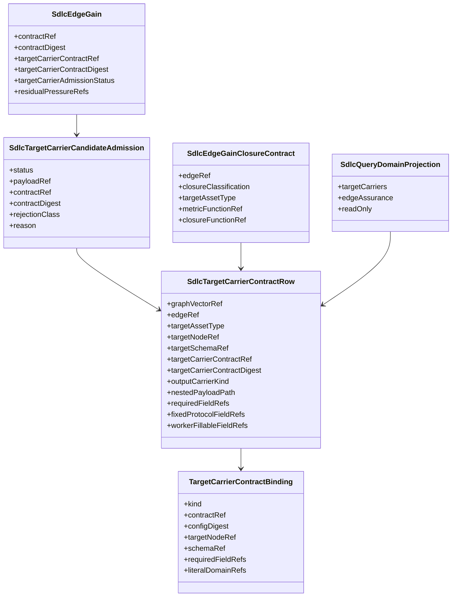

# ODD SDLC TypeScript Target Carrier Contracts

**Status**: Superseded design input for T-170 repair
**Date**: 2026-05-15
**Owner Ticket**: `.ai-workspace/tickets/active/T-170-implement-authority-placement-strategy-and-repair-fd-overreach.md`
**Superseded Ticket**: `.ai-workspace/tickets/completed/T-169-implement-gtl-target-carrier-contracts-for-sdlc-vector-outputs.md`
**Superseding Strategy**: `.ai-workspace/comments/codex/20260516T024852Z_STRATEGY_fp_fd_eventual_consistency_steel_thread_execution.md`
**Implements**: REQ-F-ODDSDLC-069, REQ-F-ODDSDLC-070, REQ-F-ODDSDLC-071, REQ-F-ODDSDLC-072, REQ-F-ODDSDLC-073
**Derives From**: `specification/requirements/17-target-carrier-contracts.md`, `specification/requirements/16-edge-gain-closure-contract.md`, `ODD_SDLC_TYPESCRIPT_EDGE_GAIN_CLOSURE_CONTRACT.md`, `ODD_SDLC_TYPESCRIPT_TEST_PIPELINE.md`, `/Users/jim/src/apps/abiogenesis/.ai-workspace/tickets/completed/T-133-declare-gtl-target-carrier-contracts-for-graph-vector-outputs.md`

T-170 must repair this design where it promotes target-carrier admission from
output identity/evidence admission into product/content closure authority.

## Design Claim

The SDLC target carrier contract is the product-owned binding between an SDLC
graph-vector output and the ABI `gtl.target_carrier_contract` machinery. It
admits the returned output envelope and identity into evidence. It does not
judge the open-ended SDLC content carried inside the worker-fillable payload.

The split is:

```text
target carrier contract -> output identity and envelope evidence admission
edge assurance contract -> gain, residual pressure, and closure over admitted evidence
F_P/content evaluation -> ambiguous SDLC content judgement
```

Closure consumes target-carrier admission as evidence and pressure, not as a
content-completeness predicate. A missing, malformed, stale, or wrong-digest
carrier preserves protocol pressure and blocks carrier evidence admission. A
well-formed carrier with weak SDLC content is admitted structurally, then routed
to F_P/content pressure and declared execution evidence.

## Structural Carrier Diagram



## Declaration And Precedence

`odd_sdlc.TS` declares product-specific rows for SDLC graph-vector outputs. The
row is projected into `GraphVector.declarations["gtl.target_carrier_contract"]`
using the ABI hook-ref config shape.

Effective binding order:

1. vector-local SDLC product row;
2. visible ABI generic defaults config;
3. fail closed.

The first implementation emits vector-local rows for all published SDLC
vectors so source operation does not depend on process-local default lookup.
The ABI defaults remain the installed fallback for workspaces that do not carry
product-specific rows.

## Runtime Flow

```text
construct SDLC GTL module
-> emit target carrier declaration on graph vector
-> derive SDLC target carrier matrix
-> project target carrier truth into handoff
-> validate returned carrier candidate through ABI validator
-> pass admission truth into edge evidence/gain
-> preserve protocol/evidence pressure when the carrier is rejected or missing
-> expose carrier ref/digest in query-domain and gaps
```

## Admission Rules

The SDLC carrier candidate must provide:

- `kind`;
- `targetAssetType`;
- `edgeRef`;
- `contractRef`;
- `contractDigest`;
- `payload`.

`payload` is the worker-fillable nested carrier. The fixed protocol fields are
owned by the contract, not by worker judgement. A worker may fill the payload
but may not mutate the fixed protocol identity.

Negative cases:

- candidate is not an object;
- missing nested payload;
- missing required field;
- wrong carrier kind literal;
- target asset type mismatch;
- edge ref mismatch;
- contract ref mismatch;
- contract digest mismatch.

## Relationship To T-168

The design-consumer test pipeline consumes the same carrier rows. Test design,
component test, test execution result, and test run archive outputs are
graph-vector targets and therefore receive target carrier rows. Test module,
test data, and expected-result truth are rows inside the test design carrier.
Test generation must not infer output shape from produced implementation code
alone.

## Closure Rule

Target carrier state is total:

```text
admitted | rejected | missing | not_required
```

An SDLC edge can close only when:

1. the edge assurance contract resolves;
2. the target carrier row resolves;
3. admitted edge evidence satisfies the edge gain contract;
4. declared execution evidence is admitted when the edge declares executable
   behavior;
5. residual pressure is clear.

Admitted target carriers contribute selected output identity and envelope
evidence. Rejected and missing target carriers contribute protocol/evidence
pressure. That pressure can prevent close because pressure remains, but target
carrier status must not be counted as SDLC content completeness or
incompleteness.
