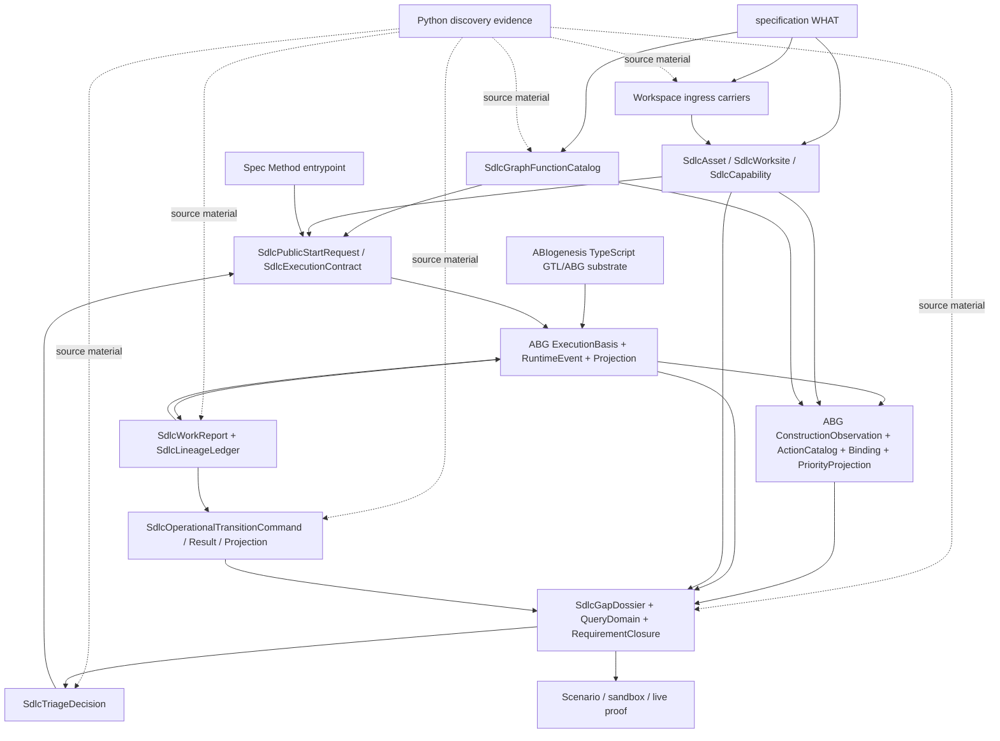

# odd_sdlc TypeScript Tenant Structural Carrier Diagram

**Status**: Active
**Date**: 2026-04-26
**Implements**: REQ-F-ODDSDLC-040, REQ-F-ODDSDLC-041, REQ-F-ODDSDLC-042, REQ-F-ODDSDLC-043
**Derives From**: `ODD_SDLC_TYPESCRIPT_TENANT_DERIVATION.md`, `ODD_SDLC_TYPESCRIPT_TENANT_FIRST_SLICE_IACS.md`

## Purpose

Render the planned TypeScript tenant as one authority topology.

## Diagram

## Reading Rules

- `specification/` is the constitutional `WHAT`.
- Python discovery evidence informs translation, but does not outrank
  TypeScript design.
- ABIogenesis TypeScript provides GTL/ABG substrate carriers.
- `SdlcGraphFunctionCatalog` is SDLC program publication.
- `SdlcPublicStartRequest` is public ignition only.
- ABG owns runtime traversal and replay projection.
- ABG owns construction observation-to-action binding and priority projection.
- odd_sdlc may contribute domain pressure/action/policy rows; it does not rank
  construction actions locally when ABG evaluator truth is available.
- `SdlcWorkReport` and `SdlcLineageLedger` are hook evidence from one
  ABG-selected vector.
- `SdlcGapDossier`, query-domain, and requirement closure are read models over
  admitted truth; gap/next-action previews read the ABG construction priority
  projection or explicitly declare a narrower non-ranking preview.
- `SdlcTriageDecision` is downstream product policy over gap truth.
- Operational command/result/projection surfaces are separate.
- Qualification proves the current release claim; it does not define product
  law.

## Compression Test

If a future TypeScript module:

- writes workspace state,
- calls ABG, and
- admits another traversal,

then it is a shadow-runtime risk and must have explicit design authority before
implementation closure.

If a future TypeScript module observes gaps and locally sorts candidate graph
functions, vectors, repair routes, or bootstrap actions, then it is a
single-surface violation unless it is a read-only rendering of ABG construction
priority projection truth.
