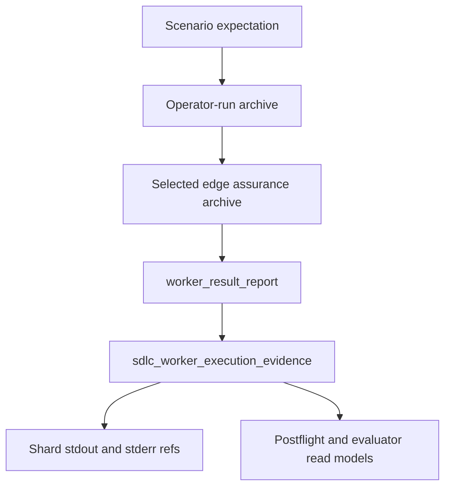

# ODD SDLC TypeScript Design-Consumer Test Pipeline

**Status**: Active design input for T-171 lifecycle parity and T-172 staged test construction
**Date**: 2026-05-15
**Owner Tickets**:
`.ai-workspace/tickets/completed/T-171-full-test35-parity-refactor-for-test72-execution-backed-closure.md`,
`.ai-workspace/tickets/active/T-172-realize-staged-disambiguation-graph-and-decomposition-admission.md`
**Superseded Ticket**:
`.ai-workspace/tickets/completed/T-168-build-design-consumer-test-pipeline-for-co-affirming-implementation.md`
**Superseding Strategy**:
`.ai-workspace/comments/codex/20260516T024852Z_STRATEGY_fp_fd_eventual_consistency_steel_thread_execution.md`
**Decommission Register**:
`ODD_SDLC_TYPESCRIPT_DECOMMISSION_REGISTER.md`
**Implements**: REQ-F-ODDSDLC-010, REQ-F-ODDSDLC-011,
REQ-F-ODDSDLC-013, REQ-F-ODDSDLC-014, REQ-F-ODDSDLC-015,
REQ-F-ODDSDLC-020, REQ-F-ODDSDLC-021, REQ-F-ODDSDLC-040,
REQ-F-ODDSDLC-043, REQ-F-ODDSDLC-063, REQ-F-ODDSDLC-064,
REQ-F-ODDSDLC-065, REQ-F-ODDSDLC-066, REQ-F-ODDSDLC-080,
REQ-F-ODDSDLC-081
**Derives From**: `specification/PRODUCT.md`,
`specification/requirements/10-odd-sdlc-software-domain-buildout.md`,
`specification/requirements/13-odd-sdlc-typescript-tenant.md`,
`specification/requirements/16-edge-gain-closure-contract.md`,
`specification/requirements/18-typed-construction-algebra.md`,
`ODD_SDLC_TYPESCRIPT_EDGE_GAIN_CLOSURE_CONTRACT.md`,
`ODD_SDLC_TYPESCRIPT_TRAVERSAL_ASSURANCE_INTEGRATION.md`,
`ODD_SDLC_TYPESCRIPT_TRAVERSAL_LEDGER_SOLUTION.md`,
`ODD_SDLC_TYPESCRIPT_SCHEDULING_PHASE.md`

T-171 repairs this design where test-pipeline conformance could become a
substitute for execution-backed co-affirmation and F_P/content judgment.

## STDO Re-Triage

T-168 is a design reframe before it is a runtime refactor.

The failing behavior is not that the TypeScript tenant lacks any test-related
files. The failing behavior is that implementation-code closure can appear as
terminal product convergence while test design, test materialization, test data,
test execution, result verification, archive, and release qualification remain
unrun or unadmitted.

The missing layer is the declared graph law that makes implementation and tests
sibling consumers of the same admitted design authority:

```text
design authority
  -> implementation construction
  -> implementation evidence

design authority
  -> test-case and test-data construction
  -> test execution
  -> result verification
  -> test evidence

implementation evidence + test evidence + execution evidence
  -> co-affirmed design interpretation or typed residual pressure
```

This belongs in the TypeScript tenant because `odd_sdlc` owns software-domain
asset meaning, edge meaning, evidence admission, and closure interpretation.
ABG owns traversal substrate truth, graph-call frames, continuations, events,
runtime replay, and raw runtime projection.

## Design Claim

Test construction and test execution are graph-owned product behavior. They are
not incidental files emitted by the implementation worker, not prompt-only
instructions, and not harness-only assertions.

Every test-pipeline phase must resolve to one of these forms:

- a published graph node / typed asset surface;
- a named graph-function edge that produces or consumes that node;
- a typed row on an admitted node with stable refs consumed by a downstream
  graph-function edge.

If a phase cannot be represented that way, the implementation must add the node
or row type before claiming closure.

T-172 adds a construction-depth rule for tests: component-test materialization
may not infer testcase authority, test topology, test-stack selection, or test
dependency ordering while writing test files. Those surfaces must already be
admitted by `derive_test_design_surface` or by a later explicit staged
authority edge before `derive_component_test_surface` can close.

## Graph Node And Edge Correlation

The current graph already publishes the spine needed for a first complete
test-pipeline pass:

| Phase | Node / Asset Surface | Producer Edge |
| --- | --- | --- |
| design obligations | `requirement_surface`, `design_surface`, `scenario_surface`, `implementation_design_surface` | existing upstream authority edges |
| test plan, UAT testcase rows, testcase authority rows, module/allocation rows, topology rows, data bindings, expected-result bindings, and execution schedule rows | `test_design_surface` | `derive_test_design_surface` |
| module/unit component test source | `component_test_surface` | `derive_component_test_surface` |
| requirement-specific UAT test source | `uat_test_source_surface` | `derive_uat_test_source_surface` |
| declared framework / command execution | `test_execution_surface` | `prepare_test_execution_surface` |
| observed test result | `test_execution_result_surface` | `derive_test_execution_result_surface` |
| verification rows | `component_test_qualification_surface` | `qualify_component_test_execution_surface` |
| repair pressure | `component_repair_schedule_surface` | `derive_component_repair_schedule_surface` |
| archived test proof | `test_run_archive_surface` | `derive_test_run_archive_surface` |
| release co-qualification | `release_depth_parity_surface` | `derive_release_depth_parity_surface` |
| release readiness | `release_surface` | `prepare_release_surface` |

The current graph does not yet make test cases, test data, expected results, or
co-affirmation independently visible enough for T-168 closure. The first
implementation may represent them as typed rows on existing nodes instead of
new graph nodes, but the refs must be stable and must be consumed by downstream
edges.

## Irreducible Carrier Set

| Carrier | Owns | Does Not Own |
| --- | --- | --- |
| `SdlcDesignConsumptionContract` | Source design obligation refs, authority basis refs, digest refs, and the graph edges that must consume them. | Prompt wording or worker memory. |
| `SdlcImplementationDesignBinding` | Binding between implementation outputs and consumed design obligations. | Test proof or release proof. |
| `SdlcTestDesignBinding` | Binding between test design/module/test source and consumed design obligations. | Implementation closure. |
| `SdlcTestCaseRow` | One generated or admitted test case, its source obligation refs, case kind, expected behavior, and downstream execution refs. | Raw framework result rows without design lineage. |
| `SdlcTestDataBinding` | Test input data or fixture refs, generation policy, testcase refs, and expected-result refs. | Arbitrary fixture files that are not admitted by graph edges. |
| `SdlcExpectedResultBinding` | Expected result/assertion refs, source testcase refs, and verification policy refs. | Observed runtime result truth. |
| `SdlcUatCaseToIntegrationTestBinding` | UAT testcase refs mapped to integration test cases and execution lanes. | Unit-test classification. |
| `SdlcTestExecutionEvidenceAdmission` | Declared framework/command contract, observed execution result, report refs, and admission diagnostics. | Product convergence by itself. |
| `SdlcTestResultVerificationRow` | Expected-vs-observed result comparison, pass/fail status, failure refs, and obligation refs. | Raw execution command status. |
| `SdlcCoAffirmationLedger` | Join rows connecting design obligations, implementation evidence, test evidence, execution evidence, and verification rows. | ABG traversal advancement. |

These carriers may serialize into existing asset surfaces for the first T-168
implementation. If the implementation keeps them as rows, the parent surfaces
must name the row refs:

- `test_design_surface` carries `SdlcDesignConsumptionContract`,
  `SdlcTestDesignBinding`, `SdlcTestCaseRow`, `SdlcTestDataBinding`,
  `SdlcExpectedResultBinding`, `SdlcUatCaseToIntegrationTestBinding`, and
  test execution schedule refs.
- `test_execution_result_surface` may carry
  `SdlcTestExecutionEvidenceAdmission` refs.
- `component_test_qualification_surface` may carry
  `SdlcTestResultVerificationRow` refs.
- `release_depth_parity_surface` or `release_surface` may carry
  `SdlcCoAffirmationLedger` refs.

If a later slice needs independent graph vectors for test data, expected
results, or co-affirmation, that is a graph-publication change and must update
the graph catalog, edge assurance matrix, overlay catalog, and tests together.

## Staged Test Topology

The test lifecycle mirrors implementation construction with test-specific
authority:

```text
requirements
-> testcase authority
-> test design
-> test module/component topology
-> test dependency map
-> test stack profile
-> evaluator-selected traversal
-> component test materialization
-> declared execution
-> observed execution result
-> verification and release co-affirmation
```

`derive_test_design_surface` owns the admitted test topology rows,
decomposition summary, dependency map, and stack/profile selection. The summary
uses the same decomposition predicates as implementation topology: high-density
rows, facade rows, under-decomposed parents, out-of-scope residual refs, and
missing trivial-product decomposition all block downstream materialization.

The test stack profile cites the tenant testing technology-stack authority. The
minimum tenant spec declares the test runtime/language when distinct from
implementation, framework or runner, test roots, fixture/data strategy, test
build/config targets, proof commands, execution environment assumptions,
evidence format, and cleanup. Same-stack testing is lawful only when the tenant
spec declares that testing reuses the implementation tenant.

`derive_component_test_surface` consumes that admitted test authority. Its
prompt may request materialized test files for bounded rows, but it must not
ask the worker to choose the testcase authority, invent the test dependency
map, or default the test stack outside admitted profile evidence.

## T-203 Code-Builder Graph Function Refinement

Component source generation, unit/component test generation, and UAT-oriented
test generation are target profiles of the same reusable code-builder graph
function:

```text
Fg_graph_code_builder(
  requirements_or_uat_test_pressure,
  selected_tenant_surface,
  design_authority_surface,
  code_builder_target_contract
) -> code_workspace_surface
```

`derive_component_code_surface` specializes the builder for source code. It
keeps the established implementation-design source edge and materializes
source-role product files. Requirement/UAT pressure, testcase authority when
present, and selected tenant/build authority are carried as staged authority or
repair pressure, not by widening this existing source edge into a second graph
shape.

`derive_component_test_surface` specializes the builder for generated test
source. It covers unit/component tests, which are requirement + design + module
specific. It consumes requirement/testcase authority, selected tenant/build
authority, test design, and implementation design. It does not require
completed `component_code_surface` as a blanket precondition.
When explicit test topology is not yet admitted, source-bearing module
definitions still derive unit/component-test dependency nodes; test source is
not discovered from already-generated implementation byproducts.

`derive_uat_test_source_surface` specializes the builder for
requirement-specific UAT executable tests. It consumes requirements,
UAT testcase authority, testcase authority, selected tenant/build authority,
and test design. It does not consume implementation module definitions as a
blanket precondition; generated UAT tests are the requirement-side peer of
generated implementation source and generated unit/component tests.
When UAT targets are derived from unit/component test authority, they preserve
the tenant's declared test source root so downstream framework discovery can
see them.

The test-run and qualification nodes are the fan-in. They consume generated
source and generated tests together. They do not substitute for missing test
source generation. A command result with zero generated source tests is
non-closure and must create residual pressure for ticket triage or lawful
re-entry.

Ticket triage is the consequence path after test-run failure. It may select
same-edge code-builder iteration for code/test/environment defects, deep
code/test zoom for underdecomposed obligations, or upstream design re-entry
when the failing test proves the design/test authority is wrong. The triage
selection is product meaning only; ABG remains the sole runtime authority for
the selected traversal, zoom, events, replay, and continuation.

This refines the prior test-pipeline graph by removing the confused split where
source code generation followed one depth-capable materialization path while
UAT-derived test code behaved like a later command/proof side effect. The
single designed path is:

```text
requirements + design + tenant authority
  -> [
       Fg_graph_code_builder(source-code target),
       Fg_graph_code_builder(unit/component-test target),
       Fg_graph_code_builder(UAT-test target)
     ]
  -> test-run / qualification fan-in
  -> ticket triage / lawful ABG re-entry
```

When admitted dependency maps select `parallel`, source-code, unit/component
test, and UAT-test specializations are ABG-frontier eligible sibling branches.
This is not a product-local scheduler; the branch/frontier artifact is ABG
runtime truth, and downstream qualification still verifies source/test
consistency before closure.
The frontier artifact must carry distinct staged authority for the UAT branch:
`operator-run-artifact://uat-test-dependency-map`,
`operator-run-artifact://uat-test-dependency-traversal-selection`, and a
nonzero `uatTestLaneCount` on `sdlc_live_fp_parallel_materialization_frontier`
whenever admitted UAT test-source work exists.

No legacy graph declaration, overlay edge, target-carrier row, or worker policy
may preserve a second route for this behavior.

`prepare_test_execution_surface` is a projection/no-close transition. It writes
the deterministic execution register from admitted test schedule and product
constraints. It does not dispatch `F_P.transform` and does not own observed
test results.

`derive_test_execution_result_surface` owns execution observation and scoped
repair pressure. `qualify_component_test_execution_surface` is the first
source/test fan-in closure edge: it verifies observed results against admitted
test design, generated component tests, generated UAT tests, and generated
component code.
`derive_test_run_archive_surface`, `derive_release_depth_parity_surface`, and
`prepare_release_surface` are evaluator/projection surfaces over admitted code,
test, execution, and ledger truth; when their edge-accounting rows declare
`workerDispatchAllowed: false`, worker dispatch is a runtime rejection.

## Scenario Execution Evidence Proof IACS

Live and sandbox scenario harnesses are proof observers. They may inspect
runtime archives and assert that a selected edge produced execution evidence,
but they do not create closure truth and do not advance the graph outside the
installed runtime selection.

| surface | role | owner | target |
| --- | --- | --- | --- |
| scenario `executionEvidence` expectation | proof-harness assertion row | qualification harness | names the edge whose archive must contain admitted execution evidence |
| operator-run edge archive | runtime observation set | installed runtime over ABG-selected edge | stores worker result reports, shard output refs, and postflight summaries |
| `worker_result_report.outputFile` | archive pointer | transform/system output report | points to the admitted edge output artifact |
| `sdlc_worker_execution_evidence` | execution evidence carrier | `derive_test_execution_result_surface` | records command, exit status, stdout/stderr refs, observed tests, pass/fail counts, and diagnostics |
| shard stdout/stderr refs | process-output evidence | worker/tool execution boundary | provides inspectable command output without becoming closure authority |



A scenario may pass only when the selected runtime edge archive contains
`sdlc_worker_execution_evidence` for the expected edge. Workspace file presence,
process checks, or harness-created artifacts are not substitutes.

## Structural Flow

The full-breadth traversal must preserve this order unless a future ticket
reprices the graph:

```text
derive_design_surface
derive_scenario_surface
derive_implementation_design_surface
derive_component_code_surface
qualify_component_realization_surface
derive_code_surface
derive_test_design_surface
derive_component_test_surface
derive_uat_test_source_surface
prepare_test_execution_surface
derive_test_execution_result_surface
qualify_component_test_execution_surface
derive_component_repair_schedule_surface
derive_test_run_archive_surface
derive_release_depth_parity_surface
prepare_release_surface
```

`derive_component_code_surface` and `derive_code_surface` are not terminal
product closure points. They produce implementation evidence for later
co-affirmation. If any downstream test/release node is required by the active
overlay or edge contract, their closure decision must carry residual pressure or
next-action truth rather than causing `product_converged`.

`derive_code_surface` is a compatibility rollup over admitted
`component_code_surface` and `component_realization_qualification_surface`
evidence. The rollup may summarize or package those facts for downstream
consumers, but it must not synthesize new implementation truth, bypass the
component realization qualification, or substitute for later generated-test,
execution-result, archive, parity, or release evidence.

## Test Case Execution Contract

Test execution means the whole graph-owned chain:

```text
design obligation
-> testcase row
-> test data binding
-> expected result binding
-> component test source
-> test execution command
-> observed execution result
-> verification row
-> co-affirmation ledger row
```

The declared command or framework is part of the graph state:

- `prepare_test_execution_surface` declares the framework/command execution
  contract from the admitted test schedule and worksite capability contract.
- `derive_test_execution_result_surface` admits returned execution evidence
  under that command contract.
- `qualify_component_test_execution_surface` verifies observed results against
  expected results and materialized tests.
- `derive_test_run_archive_surface` archives the admitted execution and
  verification truth.

For Scala/SBT workspaces, `sbt test` is closure evidence only when the installed
worksite declares that test execution contract. A prompt mention of `sbt test`
or a harness-side assertion that files exist is not execution evidence.

## Case Range Law

A test design must declare the case range expected for each design obligation.
The minimum range vocabulary is:

- `positive`;
- `negative`;
- `boundary`;
- `integration`;
- `uat`;
- `regression`.

The range is obligation-scoped. A single happy-path test cannot close an
obligation whose design calls for boundary, negative, integration, UAT, or
regression behavior.

Closure blocks when:

- no testcase row exists for a required obligation;
- testcase rows lack test data or expected results;
- test data exists without stable refs consumed by execution or verification;
- expected results exist only in prose;
- framework execution is bypassed by the harness;
- zero tests are observed;
- observed results are not compared to expected results;
- co-affirmation rows are absent for executable obligations.

## Co-Affirmation Closure

Product closure requires agreement across three evidence families:

```text
implementation evidence
+ test construction evidence
+ execution/verification evidence
-> co-affirmation ledger
-> release readiness
```

The co-affirmation ledger is not a second runtime. It is a product-owned
semantic ledger read by edge gain/closure functions. It records whether the
implementation, tests, and observed execution interpret the same design
obligation consistently.

If implementation and tests disagree, the result is typed pressure:

- `retry` when the same edge can repair local evidence;
- `repair` when component source or test source must be changed;
- `re-enter` when an earlier design/testcase/schedule node must be regenerated;
- `reprice` when requirements or product law are inconsistent;
- `block` when required authority or execution capability is missing.

## Overlay And Next-Action Law

The full traversal overlay must not treat a terminal component-code asset as
`product_converged` when any required test/release pressure remains.

The lite implementation overlay may stop with `overlay_segment_complete`, but
it must publish next-eligible pressure into the full traversal when the product
still requires test design, test execution, archive, parity, or release
qualification.

The runtime next action must come from replay-visible graph/overlay/closure
truth. The harness may act as the operator by answering a selected handoff; it
may not push the graph to a downstream edge that the installed runtime did not
select.

## Proof Obligations

The deterministic T-168 lane must prove:

- component-code closure leaves downstream test/release pressure active;
- test data and expected-result bindings are typed graph assets or typed rows
  with stable refs;
- UAT testcases map to integration tests, not unit tests;
- declared framework execution is required before execution evidence admits;
- observed results are verified against expected results;
- co-affirmation rows link design, implementation, test, and execution evidence;
- `product_converged` cannot appear before required test/release edges close.

The live or live-equivalent data_mapper proof must show the installed runtime
selecting the test lifecycle edges after code materialization. It is not enough
for the harness to create files or continue the graph outside runtime-selected
truth.
