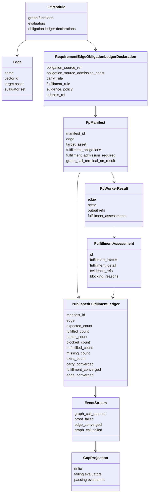
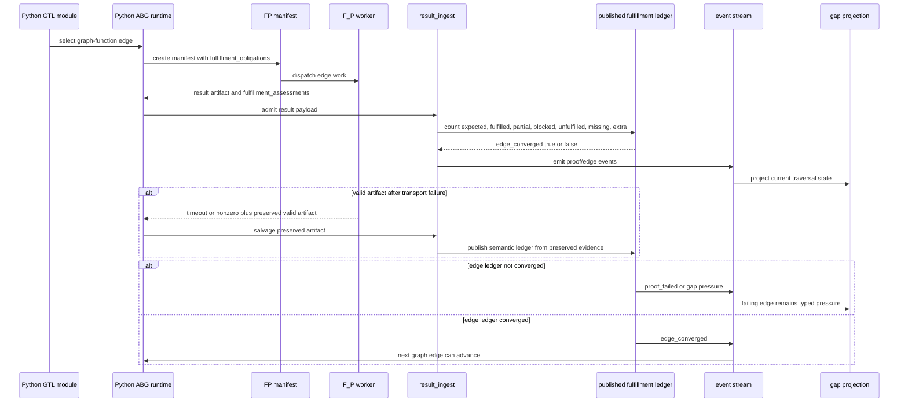
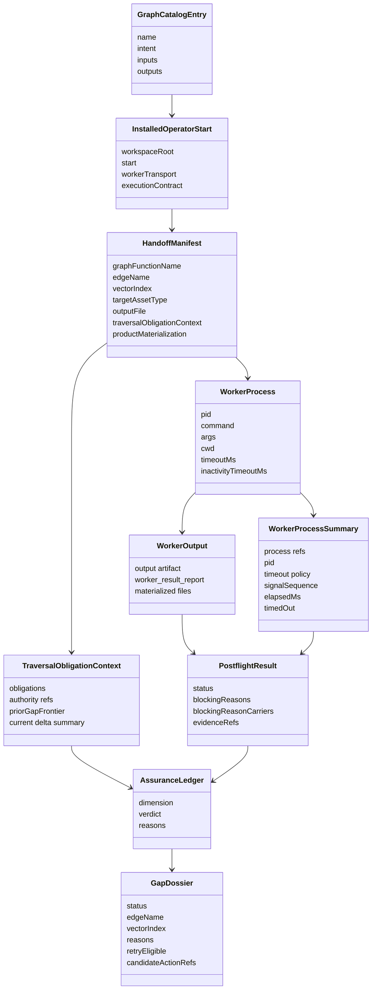
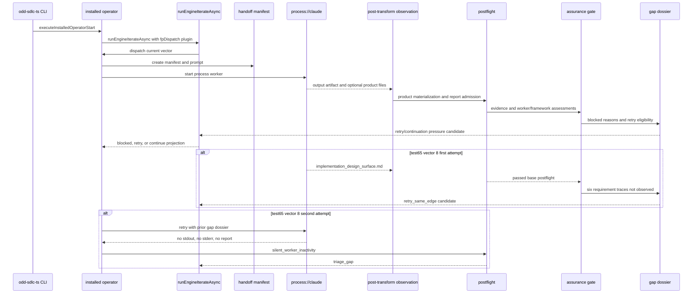
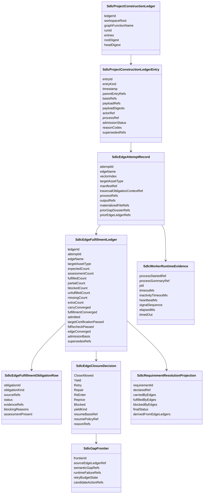
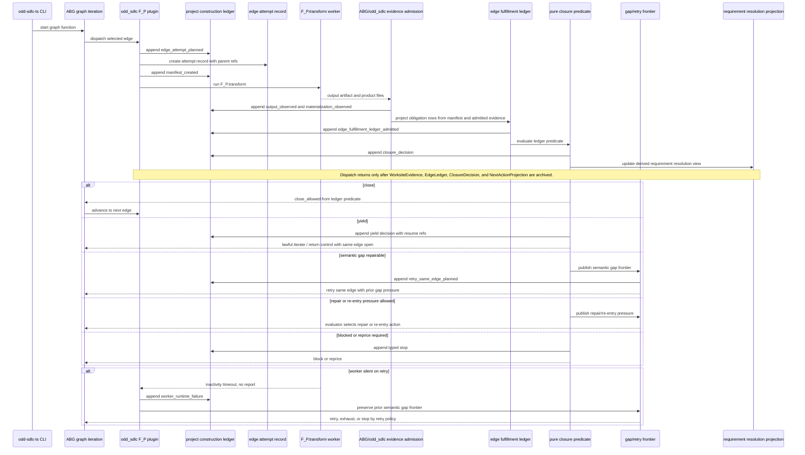

# ODD SDLC TypeScript Traversal Ledger Solution

Status: Draft canonical solution
Ticket: `T-109`
Date: 2026-05-02

## Purpose

This document is the canonical functional TypeScript design solution for
traversal ledger semantics in `odd_sdlc.TS`.

It replaces fragmented local interpretations of Python discovery evidence with
one cohesive TypeScript model:

- Python discovery domain model
- Python discovery sequence
- current TypeScript domain model
- current TypeScript flow
- final TypeScript solution domain model
- final TypeScript solution flow

The older TypeScript design docs remain source inputs for local concerns. They
must not restate a competing closure, retry, ledger, or lineage law.

The target is not to copy Python. Python is discovery evidence. TypeScript must
improve the design by making the traversal model algebraic, pure at the
decision layer, and explicit about effect boundaries.

## Authority

Product authority:

- `specification/INTENT.md`
- `specification/PRODUCT.md`
- `specification/GOALS.md`

Controlling ticket:

- `.ai-workspace/tickets/active/T-109-publish-authoritative-edge-ledger-lineage-chain-for-typescript-traversal-parity.md`

Discovery evidence:

- `.ai-workspace/comments/codex/20260502T022427AEST_test35_test65_edge_parity_gap_analysis.md`
- `data_mapper.test35/.genesis/odd_sdlc/python/code/odd_sdlc/gtl_module.py`
- `data_mapper.test35/.genesis/genesis/result_ingest.py`
- `data_mapper.test35/.genesis/genesis/interpret.py`
- `data_mapper.test35/.genesis/genesis/dispatch_runtime.py`
- selected `data_mapper.test35/.ai-workspace/fp_ledgers/*.json`

Current TypeScript evidence:

- `build_tenants/typescript/code/src/graph/catalog.ts`
- `build_tenants/typescript/code/src/operator/plugins/transform/launch_contract.ts`
- `build_tenants/typescript/code/src/operator/plugins/transform/result_projection.ts`
- `build_tenants/typescript/code/src/operator/plugins/evaluate/`
- `build_tenants/typescript/code/src/operator/plugins/consequence/`
- `build_tenants/typescript/code/src/operator/product_materialization/`
- `build_tenants/typescript/code/src/operator/assurance_gate.ts`
- `build_tenants/typescript/code/src/operator/installed_operator.ts`
- `data_mapper.test65.TS.cl/.ai-workspace/runtime/odd_sdlc/operator-runs/20260501T143724759Z_pid65991/*`
- `data_mapper.test65.TS.cl/.ai-workspace/runtime/odd_sdlc/operator-runs/20260501T144605455Z_pid65991/*`

## Design Claim

TypeScript must not copy Python service structure.

TypeScript must copy the successful algorithmic split:

- construction happens through graph-function edges
- edge obligations are declared before worker execution
- worker output is admitted as evidence, not as closure authority
- fulfillment is projected into an admitted edge ledger
- edge closure is folded from the admitted ledger
- lawful iteration is represented by yield, not by hidden local loops
- incomplete obligations remain typed pressure
- worker-runtime failure is distinct from semantic edge failure
- run-wide lineage is append-only and replayable
- requirement resolution is a projection over admitted edge ledgers

TypeScript must improve that split through functional design:

- closed algebraic data types for events, ledgers, obligations, decisions, and
  failure classes
- pure total projection functions from typed event streams to selected ledger
  surfaces
- pure total construction functions from admitted evidence to edge ledger values
- pure closure predicates over edge ledger values
- pure closure-decision classification from typed runtime and semantic failure
  values
- immutable digestable values instead of hidden mutable state
- effectful process, filesystem, and clock operations isolated at the adapter
  boundary
- fail-closed validation when external data cannot be parsed into the algebra

The information plane can use event calculus. The closure plane uses ledger
predicates.

```text
Effect adapters
  -> typed observations
  -> pure event projection
  -> admitted ledger values
  -> pure closure predicate
  -> typed continuation decision
```

## Axiomatic Closure And Iteration Target

The target traversal consequence surface is:

```text
ObservationSnapshot
-> TargetObligationBinding
-> PriorityProjection
-> ConstructionIntent
-> WorksiteEvidence
-> SdlcEdgeFulfillmentLedger
-> SdlcEdgeClosureDecision
-> EvaluatorProjection
```

The closure decision vocabulary is:

```text
close | yield | retry | repair | re-enter | reprice | block
```

`yield` is the lawful iterate boundary. It means the same edge or attempt
remains lawful/open, progress or waiting state is admitted, and resume truth is
replay-visible. It is not a timeout, retry, block, or local controller pause.

For full-breadth prompt-bearing code-builder/test-builder edges, retry is a
bounded backoff before ticket triage. The graph declares a ten-attempt
same-edge retry/yield window through GTL traversal-strategy attrs; once
replay-visible gap pressure exists, the SDLC strategy projection narrows
full-breadth retry to targeted repair so the next prompt works a bounded
window instead of repeating the same broad traversal. ABG still owns the
attached F_P retry attempts, yield/retry events, continuation, and terminal
retry-budget exhaustion.

The evaluator defaulting rule is:

```text
if active closure decision is yield:
  resume/yield the same edge from replay-visible resume basis
else if higher-priority lawful action exists:
  select it
else if current graph edge remains lawful:
  follow the graph
else if authority is missing:
  reprice or block
else:
  block with typed no-action disposition
```

When a declared target asset or target action is in scope, published-action law
governs before default graph following. The current graph edge is not a lawful
fallback unless binding proves that edge is the published action for the
declared target.

The edge fulfillment ledger records evidence and convergence. It does not carry
or decide the next graph action. Action selection belongs to evaluator projection
over the closure decision plus current observed truth.

Each admitted carrier preserves causal predecessor refs across intent, worksite
evidence, edge ledger, closure decision, and evaluator projection. Replay follows
those refs; a broken predecessor chain fails replayability.

Priority projection is ABG evaluator kernel output with odd_sdlc policy as a
visible input, not co-owned ranking authority.

## Python Discovery Domain Model

Python test35 is discovery evidence. Its domain model centers on an edge
fulfillment ledger.



### Python Model Notes

`gtl_module.py` declares requirement-bearing edge obligations. The important
fields are:

- `obligation_source_ref: requirement_surface`
- `obligation_source_admission_basis: authority_or_current_surface`
- `carry_rule: deterministic_requirement_membership`
- `adapter_ref: odd_sdlc.traceability:declared_requirement_edge_gap`

`result_ingest.py` turns a worker result into a published fulfillment ledger:

- manifest obligations are expected rows
- `fulfillment_assessments` are required rows
- missing assessments become unfulfilled rows
- status counts are projected
- `edge_converged` is computed, not asserted by the worker

The current ABG Python predicate is the TS target predicate:

```python
def published_fulfillment_edge_converged(ledger_data: Mapping[str, Any]) -> bool:
    target_certification_passed = ledger_data.get("target_certification_passed", True)
    fd_recheck_passed = ledger_data.get("fd_recheck_passed", True)
    return (
        bool(ledger_data.get("carry_converged"))
        and bool(ledger_data.get("fulfillment_converged"))
        and bool(ledger_data.get("admitted"))
        and bool(target_certification_passed)
        and bool(fd_recheck_passed)
    )
```

The older test35 installed copy demonstrates the ledger-centered shape. The
current TS target must preserve the full five-term predicate:

```text
edge_converged =
  carry_converged
  AND fulfillment_converged
  AND admitted
  AND target_certification_passed
  AND fd_recheck_passed
```

`interpret.py` emits `edge_converged` from the published fulfillment ledger.

`dispatch_runtime.py` can salvage a valid preserved result artifact after
timeout or nonzero return. That keeps transport failure separate from semantic
edge evidence.

## Python Discovery Sequence



### Python Algorithmic Lesson

Python's successful unit is not an event log entry and not a worker claim. It
is an admitted edge fulfillment ledger.

The project can have later proof pressure on an edge without erasing an earlier
admitted edge-converged fact. In test35:

- `derive_implementation_design_surface_20260419T103335367453Z.json` converged
  `77/77`
- `derive_implementation_design_surface_20260419T180828511506Z.json` later
  failed `80/81` on `dbt_build_artifacts_not_present`

That is supersession and pressure behavior, not silent invalidation.

## Current TypeScript Domain Model

Current TypeScript has useful pieces, but they are distributed across several
carriers and design attempts.



### Current TypeScript Model Notes

Current TS graph catalog has the right graph shape:

- `derive_implementation_design_surface`
- `derive_component_code_surface`
- `qualify_component_realization_surface`
- `derive_code_surface`

Current TS worker handoff has the right transform direction:

- worker is instructed to perform `F_P.transform`
- framework observes output and materialization
- closure is not supposed to be worker-owned

Current TS assurance has the right first failure classification:

- missing requirement observation becomes
  `requirement_trace_not_observed:<id>`
- blocked obligation assessments become assurance reasons
- gap dossier currently emits a retry candidate string such as `retry_same_edge`

Current TS process supervision has useful typed runtime evidence:

- process started refs
- process summary refs
- PID
- timeout policy
- heartbeat and signal sequence
- silent inactivity classification

The missing model is not another local carrier. The missing model is one
canonical relationship between those carriers.

## Current TypeScript Flow



### Current TypeScript Failure

The first vector-8 attempt in test65 produced semantic gap truth:

- output artifact existed
- base postflight passed
- assurance blocked six requirement traces
- gap dossier selected `retry_same_edge`

The second vector-8 attempt produced worker-runtime failure truth:

- no stdout
- no stderr
- no report
- inactivity timeout
- `SIGTERM`
- `silent_worker_inactivity`

The current design does not make the relationship between those two truths
strong enough. A retry worker failure can become the visible stop state while
the semantic gap stops acting like the active edge frontier.

## Final TypeScript Solution Domain Model

The final TypeScript model has one run-wide lineage ledger and one admitted
ledger per edge attempt/version.

The model is algebraic. Each carrier is a closed value. Each decision is a sum
type. No closure decision depends on hidden process state or ambient mutable
state.



### Pure Function Boundary

The final solution exposes these pure functions:

```text
projectConstructionLedger(events: readonly SdlcEvent[]): ProjectionResult<SdlcProjectConstructionLedger>

selectCurrentEdgeLedger(
  ledger: SdlcProjectConstructionLedger,
  slice: EdgeSlice
): ProjectionResult<SdlcEdgeFulfillmentLedger>

constructEdgeFulfillmentLedger(
  input: AdmittedEdgeEvidence
): ProjectionResult<SdlcEdgeFulfillmentLedger>

edgeConverged(
  ledger: SdlcEdgeFulfillmentLedger
): boolean

classifyRetry(
  input: RetryClassificationInput
): SdlcEdgeClosureDecision

projectRequirementResolution(
  ledgers: readonly SdlcEdgeFulfillmentLedger[]
): ProjectionResult<SdlcRequirementResolutionProjection>
```

`ProjectionResult<T>` is a closed result type:

```text
Ok<T> | InvalidCarrier | ContradictoryEvents | MissingAuthority | DigestMismatch
```

The exact names may differ in code, but the algebraic shape is required:
projection is total, invalid input is a value, and closure logic does not throw
partial runtime exceptions.

### Final Model Rules

The project construction ledger is information-plane lineage. It answers what
happened, in what order, from which parent facts, under which
actor/process/manifest, with which evidence refs.

The edge fulfillment ledger is closure authority. It answers whether one edge
attempt/version satisfied its carried obligations.

Its `edgeConverged` value is the five-term predicate:

```text
carryConverged
AND fulfillmentConverged
AND admitted
AND targetCertificationPassed
AND fdRecheckPassed
```

`targetCertificationPassed` is the deterministic check that the declared target
asset contract was satisfied. `fdRecheckPassed` is the deterministic F_D
recheck over the admitted result. The closure fold may compute these terms, but
it must expose them as named ledger fields and must not hide them behind a
generic `close_allowed` boolean.

The requirement resolution projection is a read model. It answers current
requirement state by deriving across admitted edge ledgers. It does not compete
with the edge ledgers.

Raw events are observations. They do not close work.

Worker reports are candidate evidence. They do not close work.

CLI summaries are operator views. They do not close work.

Gap dossiers are continuation pressure. They do not erase prior semantic
ledgers.

Worker-runtime failures attach to attempts. They do not overwrite semantic
edge gaps.

Event calculus is allowed only as pure information-plane projection:

```text
typed event stream
  -> pure projection function
  -> selected/admitted ledger surface
  -> pure closure predicate over that ledger
```

The event stream may select the current ledger, open or close retry frontiers,
and project requirement-resolution read models. It does not close an edge by
itself. Closure is the ledger predicate.

## Final TypeScript Solution Flow



## Final Flow For The Test65 Failure Shape

The repaired algorithm must handle the test65 vector-8 case as:

```text
attempt 1:
  output artifact observed
  base postflight passed
  six requirement traces not observed
  edge ledger admitted:
    edge_converged = false
    blocked obligations = 6
  closure decision:
    disposition = retry
  evaluator projection:
    selected action = retry_same_edge when policy admits it
  semantic gap frontier published

attempt 2:
  prior semantic gap frontier consumed
  worker process silent
  process summary admitted
  project ledger records worker_runtime_failure
  prior semantic gap frontier remains active
  retry policy chooses:
    retry same edge with sharpened runtime/prompt policy, or
    typed retry exhausted stop
```

The repaired algorithm must not handle it as:

```text
attempt 2 silent_worker_inactivity
  -> semantic gap effectively lost
  -> global triage stop with no edge-ledger frontier
```

## Retry Eligibility Allowlist

Python retry eligibility is not "any failed edge without a ledger." It is gated
by typed failure classes.

The legacy Python retryable failure allowlist is:

```text
transport_failure
no_output
contract_failure
```

TypeScript may use newer ABG failure vocabulary, but it must publish an
equivalence map:

| Python class | TypeScript equivalent |
| --- | --- |
| `transport_failure` | process/runtime failure such as crash, timeout, or signal-terminated worker |
| `no_output` | worker produced no valid output artifact/report payload for the declared boundary |
| `contract_failure` | payload or handoff contract failure, including schema-invalid or incomplete result payload |

`silent_worker_inactivity` is retryable only through the `no_output` or
transport-failure equivalence path, and only while retry budget and policy
allow it. Policy/config defects, proof failures, F_D findings, and requirement
repricing findings are not made retryable by this allowlist.

## Artifact Salvage Rule

Transport failure does not collapse semantic evidence when a valid preserved
artifact exists.

If a worker times out, exits nonzero, or is signaled, and the declared output
artifact is present and validates for the edge boundary, TypeScript must admit
that artifact through the same edge-ledger projection path used by successful
process exits. The process failure remains in the project construction ledger,
but the semantic artifact is still available for edge fulfillment assessment.

No salvage is allowed for placeholder, undersized, schema-invalid, wrong-target,
or digest-mismatched artifacts. Those classify as no-output or contract failure
according to the typed failure taxonomy.

## Obligation Derivation Normalization

Python test35 and current test65 do not currently carry the same obligation
count for the implementation-design edge:

- selected test35 implementation-design ledger: 77 expected obligations
- current test65 vector-8 assurance context: 90 requirement obligations

TypeScript must not become stricter by accident.

The final design requires an obligation normalization artifact for fixture
comparison:

```text
test35 obligation id
  -> TS obligation id(s)
  -> derivation basis
  -> same obligation | split obligation | TS rigor add | stale/discarded
  -> reason
```

The TS edge may intentionally split one Python obligation into multiple
obligations. It may intentionally add rigor obligations. Those deviations must
be named and justified. Unexplained count drift is a design defect.

## Obligation Observation Semantics

Requirement fulfillment is behavioral or material, not lexical.

For implementation-design edges, an obligation is observed when the design
materially represents the carried requirement and explains how the behavior
will be realized. A requirement ID string in the output is useful traceability
evidence, but absence of that exact string is not by itself proof that the
obligation is unfulfilled.

For code edges, an obligation is observed when governed code behavior realizes
the requirement. Trace comments, module names, and requirement ID strings are
not sufficient.

The TS assurance model must split two findings:

- semantic fulfillment gap: no material/behavioral evidence satisfies the
  obligation
- traceability reference gap: material/behavioral evidence may exist, but the
  explicit requirement reference is missing or weak

The test65 reason `requirement_trace_not_observed:<id>` must not remain the
sole basis for `obligation_blocked` when material evidence exists. It may drive
repair pressure for traceability, but semantic blocking requires behavioral or
material evaluation.

## Final Flow For A Converged Edge

```text
manifest declares obligations
worker writes transform output
framework admits output and materialization
edge ledger rows cover every expected obligation
fulfilled_count == expected_count
partial_count == 0
blocked_count == 0
unfulfilled_count == 0
missing_count == 0
extra_count == 0
target_certification_passed == true
fd_recheck_passed == true
admitted == true
edge_converged == true
closure fold returns close_allowed
ABG advances
requirement resolution projection updates from the admitted ledger
```

Expanded predicate:

```text
edge_converged =
  carry_converged
  AND fulfillment_converged
  AND admitted
  AND target_certification_passed
  AND fd_recheck_passed
```

## Information-Plane Projection And Supersession Rule

This section is information-plane law. It decides which ledger surface is the
current surface for a slice. It does not define closure. Closure remains the
edge fulfillment ledger predicate.

Python projection is event-sourced. For a slice identified by edge, work key,
spec hash, run id, and call id, the projector resolves the current ledger from
the latest `assessed` event whose data has `kind: fp` and whose
`published_ledger_ref` admits a valid ledger. Events before the latest reset for
that slice are ignored. Re-certification of an already certified edge requires
an explicit `edge_reopened` event; otherwise the certified edge key remains
certified.

TypeScript must preserve that projection law.

An admitted converged ledger remains a fact until the event stream creates a
new current slice view through a later admitted assessment, reset/reopen, or
governed reprice.

A later failed attempt may create new pressure. It may not silently erase an
earlier admitted ledger.

The `supersedesRefs` field in the TypeScript carriers is a deliberate TS rigor
add over the Python fixture shape. It is an audit cross-link, not the primary
projection selector.

Projection precedence:

1. event-stream order selects the current ledger for the slice;
2. reset and `edge_reopened` events bound certification and re-certification;
3. `supersedesRefs`, when present, must agree with the event-stream selection;
4. if `supersedesRefs` contradict event-stream selection, projection fails
   closed with `ledger_supersession_conflict`.

Explicit supersession metadata requires:

- superseding ledger ref
- superseded ledger ref
- authority-change or reprice reason
- parent lineage refs
- projected requirement resolution update

## Design Reconciliation Rule

After this document is accepted:

- traversal assurance integration may describe local assurance dimensions, but
  must reference this document for ledger closure law
- traceability requirement closure may describe traceability projection, but
  must reference this document for requirement-resolution derivation
- recursive realization deepening may describe capability inventory pressure,
  but must reference this document for retry and loopback law
- blocking reason carriers may describe reason vocabulary, but must reference
  this document for closure effect
- installed operator UX may describe operator commands, but must reference this
  document for runtime truth and closure authority

No TypeScript design document may define a second traversal ledger model.

## Acceptance Implications

T-109 cannot close until:

- this document is ratified as the canonical solution
- overlapping design docs are reconciled
- a recorded STDO/ODD_SDLC design review accepts this document with no
  unresolved high or medium findings
- the TypeScript implementation exposes the required pure function boundary
  for projection, ledger construction, closure, retry classification, and
  requirement-resolution derivation
- effectful process/filesystem/clock adapters are isolated from the pure
  closure model
- carrier types exist in code
- edge ledgers are emitted for requirement-bearing edges
- project construction ledger entries are emitted for edge attempts
- silent worker failure preserves prior semantic gap frontier
- test35 ledger fixtures are represented by TS tests
- test65 vector-8 failure shape is reproduced and repaired
- a fresh live data_mapper run proves productive continuation or typed
  exhaustion with separated semantic and runtime evidence

## Guaranteed Design Review Gate

The design review is mandatory. It happens after this canonical design is
published and after overlapping design docs are reconciled, but before the
feature is allowed to claim implementation closure.

The review artifact must be posted under `.ai-workspace/comments/<agent>/`.

The review must evaluate:

- STDO source authority and smallest lawful re-entry point
- ODD_SDLC ownership split across GTL, ABG, and odd_sdlc
- Python discovery domain model
- Python discovery sequence
- current TypeScript domain model
- current TypeScript flow
- final TypeScript solution domain model
- final TypeScript solution flow
- selected test35 ledger fixtures
- test65 vector-8 failure artifacts
- absence of competing TypeScript design authority
- closure law for semantic gaps, worker-runtime failures, supersession, and
  requirement-resolution projections

The review must lead with findings. Any unresolved high or medium finding
blocks T-109. A low finding may remain only when it is explicitly recorded as
non-blocking and assigned to follow-up work.
