# ODD SDLC Domain Model

**Status**: Active
**Date**: 2026-04-30
**Purpose**: Publish the current `odd_sdlc` domain model and projection vocabulary for operator and UI consumers, especially `odd_manager`, without turning UI integration guidance into new constitutional law.
**Derives From**:
- `specification/INTENT.md`
- `specification/PRODUCT.md`
- `specification/requirements/02-graph-functions.md`
- `specification/requirements/07-asset-typing-and-binding.md`
- `specification/requirements/10-odd-sdlc-software-domain-buildout.md`
- `specification/scenarios/06-first-odd-sdlc-asset-function-call.md`
- `build_tenants/common/design/ODD_SDLC_TRANSLATION.md`
- `build_tenants/typescript/design/ODD_SDLC_TYPESCRIPT_TENANT_STRUCTURAL_CARRIER_DIAGRAM.md`
- `build_tenants/typescript/code/src/domain/software_domain_catalog.ts`
- `build_tenants/typescript/code/src/graph/catalog.ts`
- `build_tenants/typescript/code/src/graph/library.ts`
- `build_tenants/typescript/code/src/projection/query_domain.ts`
- `build_tenants/typescript/code/src/projection/requirement_closure.ts`
- `build_tenants/typescript/code/src/hooks/policy.ts`
- `build_tenants/typescript/code/src/operator/carriers.ts`
- `build_tenants/typescript/code/src/operational/carriers.ts`

## Purpose Boundary

This document explains the current `odd_sdlc` domain package as a UI-facing
model.

It is for:

- `odd_manager` domain UI-pack design
- query/projection consumers
- operator drill-down views
- lineage, closure, and gap explanations

It is not:

- a replacement for `specification/`
- a rival runtime model
- a tenant-local implementation note disguised as product law

`specification/` remains the governing `WHAT`. ABG remains runtime truth.
This document summarizes how the live TypeScript line currently publishes the
SDLC domain so a UI can consume it directly.

## Ownership Boundary

| Layer | Owner | UI meaning |
| --- | --- | --- |
| Intent, product, goals, requirements, scenarios | target project | constitutional domain truth |
| Asset families, asset types, graph-function catalog, work acts, gap/read models, operator carriers | `odd_sdlc` | domain overlay and SDLC semantics |
| Run, graph call, frame, continuation, runtime events, replay projections | ABG | runtime truth |
| Pages, badges, lenses, sort/group affordances | `odd_manager` | derived control-plane read model |

The manager should never let `odd_sdlc` redefine ABG runtime objects, and it
should never let UI-only summaries masquerade as source truth.

## Topology

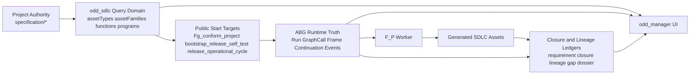

## Visual Index

This document uses diagrams for four different concerns:

1. ownership and package boundary
2. domain object model
3. graph-function catalog and executive programs
4. installed operator and closure process flow

## Ownership And Package Boundary

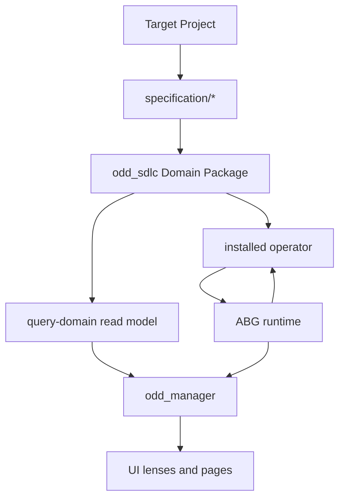

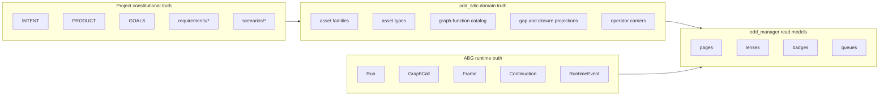

## Primary Published Contracts

These are the main machine-readable surfaces a UI should treat as first-class.

| Surface | Contract | Purpose |
| --- | --- | --- |
| query-domain | `odd_sdlc.query-domain` `ts-v1` | publish the domain catalog and start-addressable SDLC model |
| gap projection | `sdlc_gap_projection` | current graph-level progress and next edge |
| gap dossier | `sdlc_gap_dossier` | current actionable gap with evidence and next lawful actions |
| requirement closure | `sdlc_requirement_closure_register` | requirement fulfillment, carry, traceability, and open reasons |
| lineage ledger | `sdlc_lineage_ledger` | requirement-to-generated-asset linkage |
| operator outcome | `sdlc_installed_operator_start_outcome` | one `start` hop outcome with handoff, worker, postflight, and archive refs |
| runtime return | `sdlc_runtime_return_observation` | operational evidence returned into the worksite |

## Core Objects

## Domain Object Model

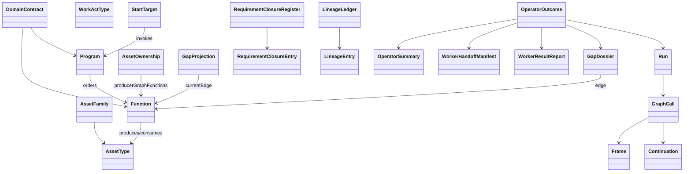

### Domain Overlay Objects

| Object | Meaning |
| --- | --- |
| `AssetFamily` | lifecycle grouping over related asset types |
| `AssetType` | typed semantic role of an SDLC artifact |
| `WorkActType` | governed mutation/qualification act such as `generate` or `deploy` |
| `Function` | one named SDLC transformation with typed inputs/outputs |
| `Program` | one executive graph-function chain exposed as a job/start target |
| `StartTarget` | top-level graph function the operator or manager may start |
| `AssetOwnership` | mapping from asset type to producing graph functions |
| `GapProjection` | compact current graph progress summary |
| `GapDossier` | current open gap and next lawful actions |
| `RequirementClosureEntry` | one requirement's carry, fulfillment, traceability, and evidence state |
| `LineageEntry` | one generated asset's upstream requirement linkage |
| `OperatorSummary` | one hop-level outcome summary for the installed operator |

### ABG Runtime Objects

The UI should consume these from ABG, not from `odd_sdlc` reinterpretation:

- `Run`
- `GraphCall`
- `Frame`
- `Continuation`
- `RuntimeEvent`

## Domain Query Projection Shape

The current `SdlcQueryDomainProjection` publishes:

- `assetTypes`
- `assetFamilies`
- `workActTypes`
- `libraryFunctions`
- `functions`
- `programs`
- `graphFunctions`
- `startTargets`
- `assetOwnership`
- `currentDossierRefs`
- `projectConformance`

This is the main UI bootstrap payload for the domain pack.

## Naming Rule

The current `odd_sdlc` line uses several adjacent but different namespaces.

| Namespace | Examples | Owner | UI rule |
| --- | --- | --- | --- |
| asset families | `implementation_branch`, `governance_loop` | `odd_sdlc` domain catalog | use for grouping and navigation |
| asset types | `implementation_module_surface`, `runtime_observation_surface` | `odd_sdlc` domain catalog | use for artifact semantics |
| graph node / function IO names | `intent_surface`, `product_surface`, `gap_observation_surface` | GTL graph publication | use for graph rendering and edge inspection |
| read-model carriers | `sdlc_gap_dossier`, `sdlc_requirement_closure_register` | `odd_sdlc` projection layer | use for overlays and operator explanations |
| runtime aggregates | `Run`, `GraphCall`, `Frame`, `Continuation` | ABG | use for execution truth |

Do not flatten these into one enum.

In the current line, many names align, but not all. For example:

- the asset-type registry currently includes `intent_doc` and `product_doc`
- the bootstrap graph publishes `intent_surface` and `product_surface`

The UI should preserve both when they are distinct:

- asset types answer "what semantic artifact is this?"
- graph node names answer "what node does this edge bind or produce?"

## Asset Families

The current TypeScript line publishes these asset families.

| Family | Lifecycle Role | Asset Types |
| --- | --- | --- |
| `worksite_inputs` | `entry` | `intent_doc`, `product_doc`, `goal_surface`, `requirement_surface`, `work_request_surface` |
| `solution_design` | `design` | `feature_decomp_surface`, `design_surface`, `scenario_surface` |
| `implementation_branch` | `build` | `implementation_design_surface`, `implementation_stack_profile`, `implementation_module_surface`, `realization_schedule_surface`, `code_surface` |
| `qualification_branch` | `qualification` | `uat_testcases_surface`, `test_design_surface`, `test_stack_profile`, `test_module_surface`, `test_schedule_surface`, `test_run_archive_surface`, `testcase_authority_surface` |
| `release_readiness` | `release` | `release_surface`, `release_document_surface` |
| `deployment_records` | `deployment` | `deployment_record_surface`, `deployment_surface`, `deployment_result_surface`, `deployed_environment_surface` |
| `runtime_evidence` | `operation` | `runtime_observation_surface`, `operational_evidence_surface`, `build_execution_surface`, `build_execution_result_surface`, `test_execution_surface`, `test_execution_result_surface` |
| `retrofit_plans` | `retrofit` | `maintenance_plan_surface`, `retrofit_design_surface`, `retrofit_plan_surface` |
| `governance_loop` | `operation` | `gap_observation_surface`, `gap_triage_surface`, `gap_route_surface`, `repricing_proposal_surface`, `ticket_work_item_route_surface`, `gap_retirement_surface` |

## Work Act Types

These are the current domain work acts:

- `generate`
- `adopt`
- `import`
- `qualify`
- `release`
- `deploy`
- `observe`
- `retrofit`

The UI should treat these as domain acts, not as raw button labels. One graph
edge may declare a default operation through target policy.

## Start Targets And Executive Programs

The current installed product exposes three top-level graph carriers:

| Start Target | Kind | Purpose | Outputs |
| --- | --- | --- | --- |
| `Fg_conform_project` | reusable graph function / induction target | normalize and classify an imported or stale workspace into the current `odd_sdlc` operating shape | `conform_project_profile`, `selected_tenant_surface`, `module_inventory_surface`, `capability_contract_surface`, `execution_contract_surface`, `conformance_gap_set` |
| `bootstrap_release_self_test` | executive program | run the retained bootstrap-to-release proving chain | `release_surface` |
| `release_operational_cycle` | executive program | continue from release into execution, deployment, runtime return, and retrofit planning | `retrofit_plan_surface` |

`Fg_conform_project` is only offered as a start target while project conformance
is still blocked. Once conformance passes, UI start controls should pivot to the
executive programs.

## Graph-Function Catalog Overview

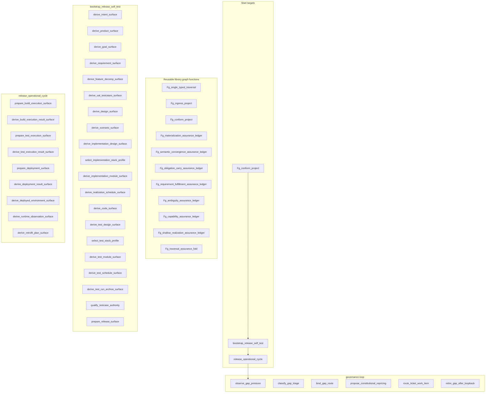

## Reusable Graph Functions

The current library layer includes these reusable GTL carriers:

- `Fg_single_typed_traversal`
- `Fg_ingress_project`
- `Fg_conform_project`
- `Fg_materialization_assurance_ledger`
- `Fg_semantic_convergence_assurance_ledger`
- `Fg_obligation_carry_assurance_ledger`
- `Fg_requirement_fulfillment_assurance_ledger`
- `Fg_ambiguity_assurance_ledger`
- `Fg_capability_assurance_ledger`
- `Fg_shallow_realization_assurance_ledger`
- `Fg_traversal_assurance_fold`

For most UI work these appear as advanced graph/runtime detail rather than
primary operator actions, but they matter for graph inspection and assurance
drill-down.

## Software-Domain Function Catalog

### Bootstrap To Release Program

These functions make up `bootstrap_release_self_test`.

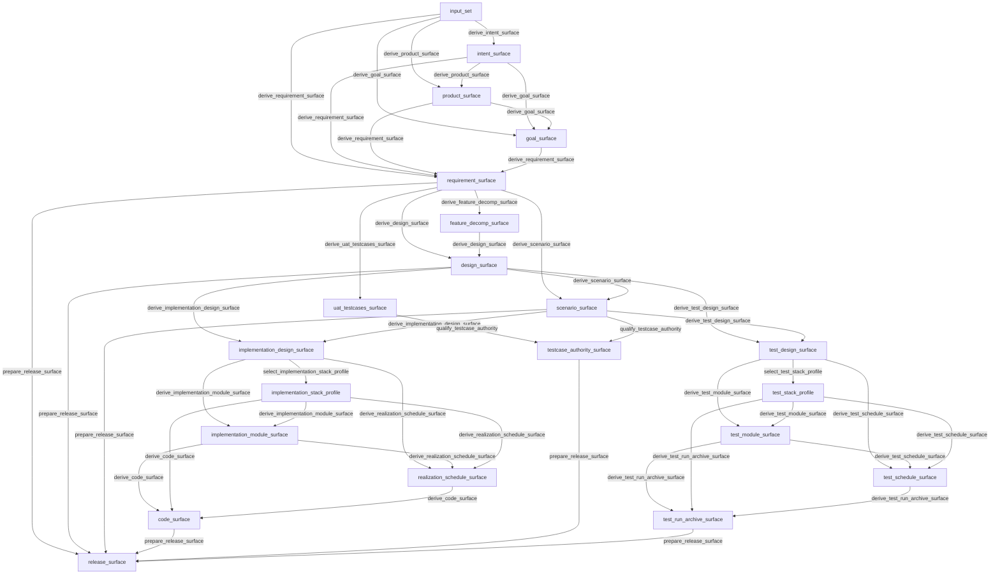

| Function | Inputs | Output | Edge Class |
| --- | --- | --- | --- |
| `derive_intent_surface` | `input_set` | `intent_surface` | `bootstrap_specification` |
| `derive_product_surface` | `input_set`, `intent_surface` | `product_surface` | `bootstrap_specification` |
| `derive_goal_surface` | `input_set`, `intent_surface`, `product_surface` | `goal_surface` | `bootstrap_specification` |
| `derive_requirement_surface` | `input_set`, `intent_surface`, `product_surface`, `goal_surface` | `requirement_surface` | `bootstrap_specification` |
| `derive_feature_decomp_surface` | `requirement_surface` | `feature_decomp_surface` | `design` |
| `derive_uat_testcases_surface` | `requirement_surface` | `uat_testcases_surface` | `qualification` |
| `derive_design_surface` | `requirement_surface`, `feature_decomp_surface` | `design_surface` | `design` |
| `derive_scenario_surface` | `requirement_surface`, `design_surface` | `scenario_surface` | `design` |
| `derive_implementation_design_surface` | `design_surface`, `scenario_surface` | `implementation_design_surface` | `design` |
| `select_implementation_stack_profile` | `implementation_design_surface` | `implementation_stack_profile` | `implementation` |
| `derive_implementation_module_surface` | `implementation_design_surface`, `implementation_stack_profile` | `implementation_module_surface` | `implementation` |
| `derive_realization_schedule_surface` | `implementation_design_surface`, `implementation_module_surface`, `implementation_stack_profile` | `realization_schedule_surface` | `implementation` |
| `derive_code_surface` | `implementation_module_surface`, `implementation_stack_profile`, `realization_schedule_surface` | `code_surface` | `implementation` |
| `derive_test_design_surface` | `design_surface`, `scenario_surface` | `test_design_surface` | `design` |
| `select_test_stack_profile` | `test_design_surface` | `test_stack_profile` | `qualification` |
| `derive_test_module_surface` | `test_design_surface`, `test_stack_profile` | `test_module_surface` | `qualification` |
| `derive_test_schedule_surface` | `test_design_surface`, `test_module_surface`, `test_stack_profile` | `test_schedule_surface` | `qualification` |
| `derive_test_run_archive_surface` | `test_module_surface`, `test_stack_profile`, `test_schedule_surface` | `test_run_archive_surface` | `qualification` |
| `qualify_testcase_authority` | `uat_testcases_surface`, `scenario_surface` | `testcase_authority_surface` | `qualification` |
| `prepare_release_surface` | `requirement_surface`, `design_surface`, `scenario_surface`, `code_surface`, `testcase_authority_surface`, `test_run_archive_surface` | `release_surface` | `release` |

### Operational Program

These functions make up `release_operational_cycle`.

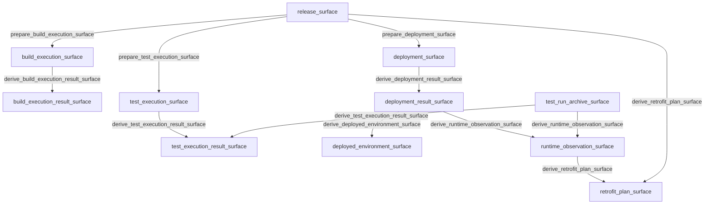

| Function | Inputs | Output | Edge Class |
| --- | --- | --- | --- |
| `prepare_build_execution_surface` | `release_surface` | `build_execution_surface` | `release` |
| `derive_build_execution_result_surface` | `build_execution_surface` | `build_execution_result_surface` | `operational_return` |
| `prepare_test_execution_surface` | `release_surface` | `test_execution_surface` | `release` |
| `derive_test_execution_result_surface` | `test_execution_surface`, `test_run_archive_surface` | `test_execution_result_surface` | `operational_return` |
| `prepare_deployment_surface` | `release_surface` | `deployment_surface` | `release` |
| `derive_deployment_result_surface` | `deployment_surface` | `deployment_result_surface` | `operational_return` |
| `derive_deployed_environment_surface` | `deployment_result_surface` | `deployed_environment_surface` | `operational_return` |
| `derive_runtime_observation_surface` | `deployment_result_surface`, `test_run_archive_surface` | `runtime_observation_surface` | `operational_return` |
| `derive_retrofit_plan_surface` | `runtime_observation_surface`, `release_surface` | `retrofit_plan_surface` | `operational_return` |

### Governance Loop Program

These are read/re-entry functions over current gap and closure truth.

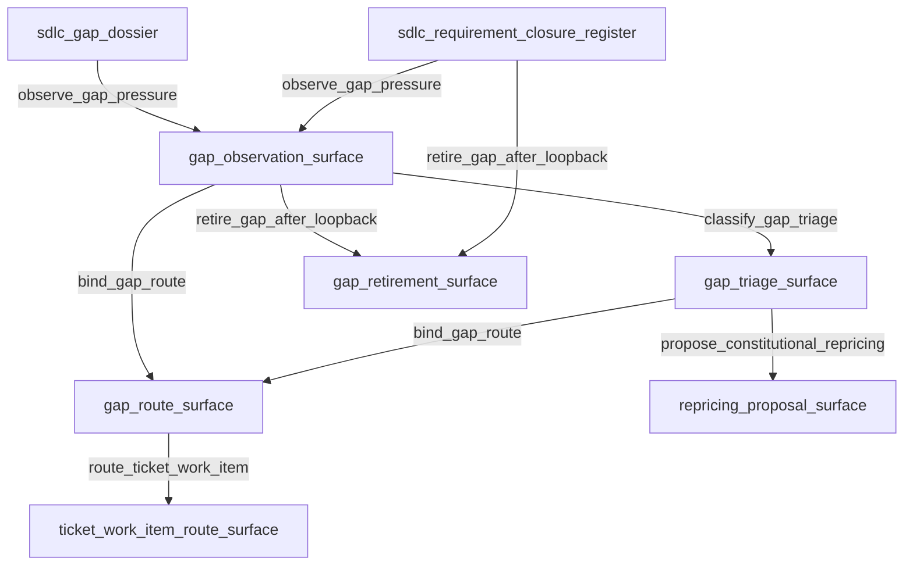

| Function | Inputs | Output | Role |
| --- | --- | --- | --- |
| `observe_gap_pressure` | `sdlc_gap_dossier`, `sdlc_requirement_closure_register` | `gap_observation_surface` | observe current pressure |
| `classify_gap_triage` | `gap_observation_surface` | `gap_triage_surface` | classify defect/process layer |
| `bind_gap_route` | `gap_observation_surface`, `gap_triage_surface` | `gap_route_surface` | bind to lawful re-entry |
| `propose_constitutional_repricing` | `gap_triage_surface` | `repricing_proposal_surface` | publish repricing proposal |
| `route_ticket_work_item` | `gap_route_surface` | `ticket_work_item_route_surface` | route into work tracking |
| `retire_gap_after_loopback` | `gap_observation_surface`, `sdlc_requirement_closure_register` | `gap_retirement_surface` | publish retirement state |

## Installed Operator And Worker Surfaces

The installed operator publishes a per-hop archive and typed carrier set. These
matter for UI drill-down and forensic views.

## Installed Operator Process Flow

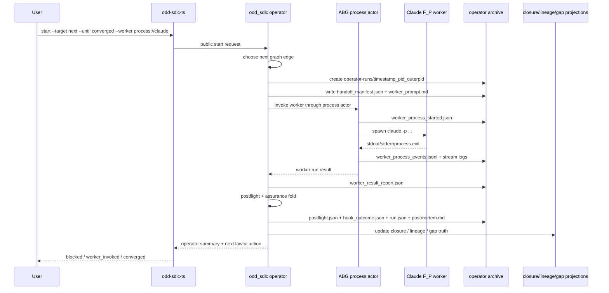

## One-Hop Archive Structure

```mermaid
flowchart TD
  Root[operator-runs/run-id]
  H[handoff_manifest.json]
  P[worker_prompt.md]
  PS[worker_process_started.json]
  PE[worker_process_events.jsonl]
  SO[worker_stdout.log]
  SE[worker_stderr.log]
  WR[worker_result_report.json]
  PF[postflight.json]
  HO[hook_outcome.json]
  AS[assurance ledgers]
  RU[run.json]
  PM[postmortem.md]
  RT[runtime_events.json]

  Root --> H
  Root --> P
  Root --> PS
  Root --> PE
  Root --> SO
  Root --> SE
  Root --> WR
  Root --> PF
  Root --> HO
  Root --> AS
  Root --> RU
  Root --> PM
  Root --> RT
```

### One-Hop Outcome

`SdlcInstalledOperatorStartOutcome` carries:

- `summary`
- `start`
- `transport`
- `manifest`
- `workerRun`
- `workerReport`
- `postflight`
- `assuranceSatisfaction`
- `gapDossier`
- `hookOutcome`
- `emittedRuntimeEventKinds`
- `eventLogPath`
- `archiveRoot`

### Worker Handoff

`SdlcWorkerHandoffManifest` is the authoritative edge handoff. It includes:

- graph function name and edge name
- input asset types and target asset type
- allowed write roots
- project conformance profile
- product materialization contract
- traversal obligation context
- traversal intent package
- retry context
- method refs
- result-report schema

### Worker Result

`SdlcWorkerResultReport` includes:

- graph function and edge identity
- target asset type
- output file and digest
- summary
- `unresolvedReasons`
- `materializedFiles`
- optional execution evidence
- per-obligation assessments

The UI should treat `unresolvedReasons` and obligation assessments as distinct
from final closure. Postflight and assurance still have to admit them.

## Lineage And Closure Surfaces

### Lineage Ledger

`SdlcLineageLedger` projects generated assets back to:

- `requirementIds`
- `sourceInputUris`
- `producedByGraphFunction`
- `targetAssetType`
- `evidenceRefs`
- `proofKinds`
- `authorityVerbs`

This is the current bridge from requirement truth to generated assets.

### Requirement Closure Register

Each `SdlcRequirementClosureEntry` carries:

- `requirementId`
- `assetIds`
- `producedByGraphFunctions`
- `proofKinds`
- `authorityVerbs`
- `traceabilityStatus`
- `fulfillmentStatus`
- `carryStatus`
- `openReasons`

For UI purposes:

- `carryStatus` and `fulfillmentStatus` must stay separate
- `traceabilityStatus` is not the same thing as fulfillment
- `openReasons` are the honest explanation surface

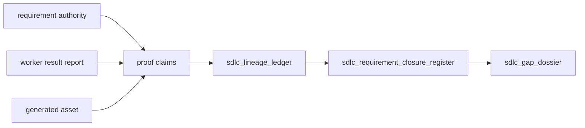

### Gap Dossier

`SdlcGapDossier` is the current actionable gap projection. It carries:

- `edge`
- `status`
- `evidenceRefs`
- `triageInput`
- `nextLawfulActions`

This is the right source for gap views. The manager may derive compact badges or
queues from it, but it should not go back to ad hoc `gaps` parsing as the
primary semantic contract.

## UI Composition Guidance For odd_manager

### Use These As First-Class

- query-domain projection
- ABG runtime projections
- requirement closure register
- lineage ledger
- current gap dossier
- installed operator hop archives for drill-down

### Do Not Infer These From Prose Or Paths

- asset family membership
- producer graph-function ownership
- start-addressability
- edge class
- closure status
- worker success

### Recommended UI Slices

1. Overview
   - workspace identity
   - domain contract identity
   - current program
   - current edge
   - conformance/gap state

2. Graph View
   - start targets
   - executive programs
   - leaf functions
   - current vector status

3. Asset View
   - asset families
   - asset types
   - producer ownership
   - latest materialized evidence

4. Closure View
   - requirement closure register
   - carry vs fulfillment
   - traceability posture
   - open reasons

5. Forensics View
   - operator archive
   - worker handoff
   - process evidence
   - worker result report
   - postflight and assurance outcomes

## UI Navigation Map

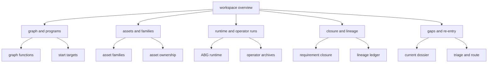

## Minimal Integration Rule

If the manager can only wire one domain pack pass initially, it should:

1. bootstrap from `odd_sdlc.query-domain ts-v1`
2. compose that with ABG runtime projections
3. treat requirement closure, lineage, and gap dossier as the first domain
   overlays
4. defer any UI-only scoring or summarization until those source projections are
   visible and drillable

That preserves the right ownership split:

- ABG owns runtime truth
- `odd_sdlc` owns SDLC domain semantics
- `odd_manager` owns supervision and presentation
