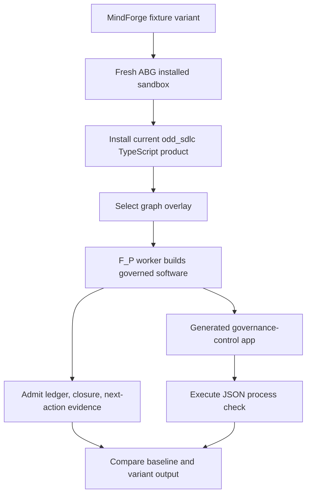

# MindForge AI Assistant Governance Proof

## A technical executive brief on the implemented `odd_sdlc` sandbox proof

Prepared from the T-163 scenario family and live proof evidence.

2026-05-13

---

# Executive Claim

We built a replayable proof that a MindForge-style AI governance use case can be expressed as specification pressure, run through `odd_sdlc`, built into software, executed, and evidenced through ledgers and archives.

The result is not only a slide model.

It is a working sandbox lane:

```text
specification variant
  -> fresh installed workspace
  -> guided graph traversal
  -> governed F_P construction
  -> generated software
  -> executable governance projection
  -> ledger, event, eval, and archive evidence
```

---

# What Was Built

T-163 created a MindForge AI assistant scenario family inside the TypeScript scenario sandbox.

Primary surfaces:

- fixture family:
  `build_tenants/typescript/test_env/fixtures/mindforge_ai_assistant/`
- scenario descriptor:
  `build_tenants/typescript/test_env/sandbox/scenarios/mindforge_ai_assistant.scenario.mjs`
- scenario harness tests:
  `build_tenants/typescript/test_env/sandbox/test_scenario_sandbox.test.mjs`
- technical proof archive:
  `build_tenants/typescript/test_env/test_runs/scenario_t163_mindforge_ai_assistant_*`

The fixture contains no prebuilt product implementation.

---

# Business Context

The scenario models an internal GenAI assistant for a regulated financial organisation.

MindForge-relevant governance pressure:

- AI inventory registration
- use-case risk tier
- third-party model disclosure
- proportional control path
- pre-deployment gate
- monitoring and KRI selection
- recertification trigger

The generated product is intentionally small. It proves the governed mechanism before expanding the domain.

---

# Core Design Choice

MindForge policy stays in the downstream governance domain.

ABG remains generic runtime truth.

`odd_sdlc` governs software delivery.

```text
ABG
  runtime facts, traversal, event truth, replay, provenance

odd_sdlc
  software-domain graph functions, worksite governance, ledgers, closure

MindForge scenario
  AI governance policy, risk taxonomy, disclosure, monitoring, recertification
```

This avoids turning the substrate into a financial-services-only runtime.

---

# Why This Matters

Financial AI governance commonly fails at the join between policy and execution.

This proof demonstrates the join:

| Governance Need | Implemented Mechanism |
| --- | --- |
| use-case specificity | scenario fixture variants |
| proportional controls | variant-specific generated projection |
| traceability | requirement markers and materialization evidence |
| controlled work | graph overlay traversal and F_P worker handoff |
| auditability | ledgers, closure decisions, next-action projections |
| repeatability | parameterised sandbox and deterministic process check |

---

# The Operating Algebra

The proof preserves the W/L/E/Ev relation.

```text
W  = sandbox workspace under construction
L  = immutable ledgers and admitted work evidence over W
E  = runtime/event spine for traversal and continuation
Ev = evaluator and process-check work over L/E
```

The generated inventory, risk, monitoring, and recertification outputs are projections.

They are not writable source-of-truth stores.

---

# End-To-End Flow



---

# Scenario Family

Four variants are declared.

| Variant | Governance Pressure |
| --- | --- |
| baseline internal assistant | moderate-risk internal productivity assistant |
| third-party model variant | provider dependency and disclosure pressure |
| high-risk customer impact | regulated customer workflow influence |
| material-change recertification | prior approval reopened by material change |

The live proof currently exercises baseline and third-party variants.

Deterministic sandbox coverage checks all four variants.

---

# Fixture Contract

Each fixture is declaration data.

It includes:

- `bootstrap.md`
- project constraints
- intent, product, goals, and requirements
- synthetic scenario evidence where needed

It excludes:

- generated application source
- real customer, employee, vendor, or model data
- ABG core carrier changes

This keeps the use case auditable and safe to replay.

---

# Generated Product

The live run builds a small JavaScript governance-control product under:

```text
build_tenants/mindforge_ai_assistant/
```

Minimum generated files:

```text
package.json
src/index.js
examples/use_case.json
```

The generated app reads a use-case record and emits a compact governance-state JSON projection.

---

# Governance Projection

The scenario expects these governed output fields:

```json
{
  "useCaseId": "...",
  "inventoryStatus": "...",
  "riskTier": "...",
  "controlPath": "...",
  "preDeploymentGate": "...",
  "monitoring": ["..."],
  "thirdPartyDisclosureRequired": true,
  "recertification": "...",
  "sourceVariant": "..."
}
```

The process check validates declared fields from the scenario descriptor.

---

# Baseline Result

The baseline internal assistant emitted:

```json
{
  "useCaseId": "MF-AI-001",
  "inventoryStatus": "registered",
  "riskTier": "moderate",
  "controlPath": "enhanced_review",
  "preDeploymentGate": "pending_ai_risk_review",
  "monitoring": ["unsupported_answer_rate", "policy_content_staleness"],
  "thirdPartyDisclosureRequired": false,
  "recertification": "annual_or_material_change",
  "sourceVariant": "baseline_internal_assistant"
}
```

This is a governed projection from the generated product, not a hand-authored slide value.

---

# Third-Party Variant Result

The third-party model variant emitted:

```json
{
  "useCaseId": "MF-AI-001",
  "inventoryStatus": "registered",
  "riskTier": "moderate",
  "controlPath": "third_party_enhanced_review",
  "preDeploymentGate": "pending_vendor_ai_risk_review",
  "monitoring": ["unsupported_answer_rate", "policy_content_staleness", "third_party_model_change"],
  "thirdPartyDisclosureRequired": true,
  "recertification": "annual_or_provider_change",
  "sourceVariant": "third_party_model_variant"
}
```

The changed specification pressure changes the output.

---

# Proof Difference

| Field | Baseline | Third-Party Variant |
| --- | --- | --- |
| `controlPath` | `enhanced_review` | `third_party_enhanced_review` |
| `preDeploymentGate` | `pending_ai_risk_review` | `pending_vendor_ai_risk_review` |
| `thirdPartyDisclosureRequired` | `false` | `true` |
| `monitoring` | unsupported answers, policy staleness | plus third-party model change |
| `recertification` | annual or material change | annual or provider change |

This is the central proof point: specification variation flows into generated governance output and archived evidence.

---

# Enforcement Boundary

The proof separates `F_D`, `F_P`, and `F_H`.

| Regime | Used For | In This Proof |
| --- | --- | --- |
| `F_D` | deterministic admission | file presence, JSON shape, source-file assertions |
| `F_P` | productive construction | model-backed worker builds product from specification |
| `F_H` | human authority | future approval and committee gates |

The harness does not hardcode MindForge risk judgment into deterministic code.

It verifies declared outputs and admitted evidence.

---

# Why The F_P Boundary Matters

The live worker is allowed to construct and repair.

The proof requires that productive work leaves evidence.

Recent repair hardened this point:

- expected generated files must exist in W
- expected generated files must have materialization evidence in L
- evidence may span repair attempts
- final clean retry does not need to re-materialize every earlier file
- the current default-overlay rerun closed all three edges without retry after
  the fixture Product files declared the product-file lineage contract

That matches the product law: governed F_P work is admitted through typed carriers and evaluated over ledger history.

---

# Graph Overlay Use

The deterministic induction path starts with:

```text
overlay:bootstrap-requirements
```

The live build path uses:

```text
overlay:lite-design-module-implementation
```

Expected live edge sequence:

```text
derive_lite_design_adr_surface
  -> derive_lite_module_surface
  -> derive_lite_component_code_surface
```

This proves guided traversal rather than an unbounded full graph walk.

---

# Evidence Pack

Each live proof run preserves operator-run archives.

Key artifacts:

- `handoff_manifest.json`
- `product_materialization_manifest.json`
- `sdlc_edge_fulfillment_ledger.json`
- `sdlc_edge_closure_decision.json`
- `fp_evaluate_result.json`
- `sdlc_next_action_projection.json`
- `sdlc_overlay_segment_completion.json`
- worker stdout, stderr, transcript, result report

These artifacts are the technical audit trail.

---

# Replayable Archive Paths

Baseline proof:

```text
build_tenants/typescript/test_env/test_runs/
scenario_t163_mindforge_ai_assistant_baseline_internal_assistant_live/
20260512T144139800Z_pid21353
```

Third-party proof:

```text
build_tenants/typescript/test_env/test_runs/
scenario_t163_mindforge_ai_assistant_third_party_model_variant_live/
20260512T163411242Z_pid80736
```

The paths contain the sandbox workspace, generated app, and operator-run archives.

---

# Operator Command

The live proof is opt-in.

```bash
npm run build:semantic && \
ODD_SDLC_TS_MINDFORGE_AI_ASSISTANT_SCENARIO_LIVE=1 \
ODD_SDLC_TS_MINDFORGE_AI_ASSISTANT_SCENARIO_WORKER=process://claude \
ODD_SDLC_TS_MINDFORGE_AI_ASSISTANT_SCENARIO_VARIANT=third_party_model_variant \
ODD_SDLC_TS_MINDFORGE_AI_ASSISTANT_SCENARIO_MAX_ADVANCES=3 \
node --test --test-name-pattern "T-163 MindForge AI assistant live" \
  test_env/sandbox/test_scenario_sandbox.test.mjs
```

The deterministic scenario suite runs without a live worker.

---

# Current Validation State

Current non-live verification:

```text
npm run test:scenario-sandbox
tests 27
pass 21
skipped 6
fail 0
```

Archived live expectations pass for:

- baseline internal assistant
- third-party model variant

T-163 remains active as a reviewable closure candidate, not an unreviewed completed claim.

---

# What An Executive Should Inspect

Three inspection levels are available.

1. Specification layer  
   fixture bootstrap, product, goals, and requirements

2. Execution layer  
   scenario descriptor, graph overlay selection, worker handoff

3. Evidence layer  
   generated files, materialization manifest, ledger, closure decision, next-action projection

This gives governance, technology, and audit teams a shared inspection model.

---

# What This Proves

The proof establishes that:

- MindForge-style controls can be represented as governed specification pressure
- `odd_sdlc` can build an executable control product from that pressure
- changed risk context changes generated governance output
- generated output is checked by a deterministic process check
- productive F_P work is ledgered and reviewable
- evidence is preserved in a replayable archive
- MindForge semantics do not need to be pushed into ABG core

---

# What This Does Not Yet Prove

This is a proof slice, not a full enterprise rollout.

Remaining product work:

- first-class MindForge domain product or `odd_aigovernance`
- typed risk, inventory, disclosure, KRI, and recertification carriers
- human approval gates as governed `F_H`
- integration with GRC, model risk, vendor risk, and audit systems
- live operational return from deployed AI systems
- broader scenario matrix with real institutional policy mappings

The proof is a reliable starting point for those increments.

---

# Adoption Path

Recommended next path:

1. Promote the scenario into an `odd_aigovernance` product slice.
2. Define MindForge domain assets: use case, inventory row, risk profile, disclosure, KRI, approval, recertification.
3. Add graph functions for intake, risk assessment, control selection, approval, monitoring, and re-entry.
4. Keep GRC and dashboard outputs as projections over admitted facts.
5. Promote only generic substrate gaps back into ABG or GTL.

This keeps institutional policy strong without contaminating the runtime kernel.

---

# Decision Ask

Use this proof as the first concrete MindForge operationalisation slice.

Authorize the next design step:

```text
T-163 proof slice
  -> MindForge domain model
  -> governed AI use-case lifecycle
  -> projection-backed inventory, KRI, risk, and audit views
```

The technical risk is now specific enough to govern through tickets, scenarios, and evidence.

---

# Source Surfaces

Implementation and proof:

- `.ai-workspace/tickets/active/T-163-mindforge-ai-assistant-sandbox-scenario-family.md`
- `build_tenants/typescript/test_env/fixtures/mindforge_ai_assistant/`
- `build_tenants/typescript/test_env/sandbox/scenarios/mindforge_ai_assistant.scenario.mjs`
- `build_tenants/typescript/test_env/sandbox/scenario_sandbox.mjs`
- `build_tenants/typescript/test_env/sandbox/test_scenario_sandbox.test.mjs`

Positioning and method:

- `specification/PRODUCT.md`
- `docs/presentations/mindforge-gtl-abg-odd-governance-executive-deck.md`
- `/Users/jim/src/apps/specification_methodology/strategy/OODD_future_strategy.md`
