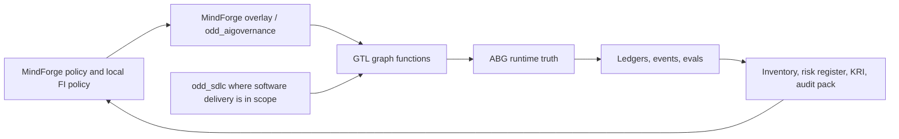

# Operationalising MindForge

## GTL / ABG / ODD as a governance and enforcement substrate

For financial institutions adopting AI across traditional AI, generative AI, and agentic AI.

Draft v0.1  
2026-05-12

---

# Executive Thesis

MindForge provides a strong financial-services AI governance vocabulary.

GTL, ABG, ODD, and OODD provide the operating structure needed to make that vocabulary enforceable.

The move is:

```text
policy described in documents
  -> policy expressed as governed workflows
  -> controls enforced through runtime admission
  -> evidence generated as a property of operation
```

---

# Why This Matters

AI governance fails when accountability lives in one system and execution lives in another.

Common failure modes:

- AI use cases are registered after the fact.
- Risk tiers are manually interpreted.
- Review gates are committee records, not executable controls.
- Monitoring becomes dashboard reporting rather than replayable evidence.
- Recertification depends on calendar discipline, not governed re-entry.
- Audit packs are assembled manually from inconsistent sources.

The target state is a control system where governance, execution, and evidence share one runtime spine.

---

# MindForge In One Slide

MindForge is a financial-services AI risk-management framework.

The MindForge handbook is organised around 17 considerations across:

- scope and oversight
- AI risk management
- AI lifecycle management
- organisational enablers

Those sections align naturally to enforceable surfaces:

| MindForge Concern | Enforceable Surface |
| --- | --- |
| oversight | roles, approval gates, accountability contracts |
| risk management | risk profiles, inventories, disclosures, KRIs |
| lifecycle | graph functions over use-case stages |
| enablers | capability, infrastructure, and operating evidence |

---

# What The Handbook Examples Show

The local MindForge implementation examples are useful because they are operational, not only conceptual.

They show recurring institutional patterns:

- an AI inventory or central repository
- risk materiality assessment
- calibrated governance requirements
- named operating roles
- senior-management or committee accountability
- lifecycle controls from design through deployment and monitoring

The GTL/ABG/ODD proposal is to make those patterns executable and replayable.

---

# The Core Design Choice

MindForge should not be pushed into the ABG kernel.

Clean split:

```text
GTL / ABG
  generic governed workflow, event truth, evidence admission, replay, projection

ODD / odd_sdlc
  outcome-driven product and SDLC governance over software delivery

MindForge overlay / odd_aigovernance
  financial AI governance policy, risk taxonomy, inventory, KRI, disclosure,
  escalation, recertification, and regulatory trace interpretation
```

This keeps the platform reusable while giving financial governance strong proof.

---

# What GTL Does

GTL is the governed workflow language.

It expresses:

- lifecycle stages
- typed inputs and outputs
- graph functions
- role and approval requirements
- evidence obligations
- closure criteria
- lawful alternatives

For an executive audience: GTL is the controlled process blueprint, but precise enough for runtime enforcement.

---

# What ABG Does

ABG is the execution and proof substrate.

It owns:

- runtime admission
- event truth
- graph traversal
- continuation and retry state
- evidence envelopes
- provenance and predecessor refs
- projection and replay
- closure mechanics

For an executive audience: ABG is the operating record and control engine behind the blueprint.

---

# What ODD Adds

ODD turns work into outcome-governed delivery.

An ODD product is built from:

- typed domain assets
- published graph functions
- domain policies
- evidence and ledger surfaces
- ABG runtime truth
- query and audit projections
- proof scenarios

ODD is how policy intent becomes controlled work rather than project narration.

---

# SDLC Governance

`odd_sdlc` governs software delivery as an installed development product.

It gives the organisation a controlled SDLC path:

```text
request
  -> specification
  -> design
  -> implementation
  -> qualification
  -> release
  -> deployment
  -> runtime return
  -> observation
  -> retrofit
```

Each stage can be expressed as graph functions, evidence obligations, ledgers, and closure decisions.

---

# Live Process Governance

MindForge needs governance beyond SDLC.

It needs live governance over AI use cases:

```text
use-case intake
  -> inherent risk assessment
  -> proportional control selection
  -> residual risk assessment
  -> pre-deployment review
  -> approval gate
  -> deployment
  -> monitoring and KRI projection
  -> recertification or change re-entry
```

This is the natural boundary for a MindForge overlay or `odd_aigovernance` product.

---

# Enforcement Model

Control depends on separating three regimes:

| Regime | Meaning | MindForge Example |
| --- | --- | --- |
| `F_D` | deterministic checks | schema, identity, digest, completeness, required evidence |
| `F_P` | probabilistic or expert judgment | risk assessment, residual risk, AI-specific review |
| `F_H` | human authority | committee approval, escalation, accountable sign-off |

Human approval must not override failed deterministic admission.

Semantic risk judgment must not be misrepresented as deterministic mechanics.

---

# Evidence Model

The core operating algebra:

```text
W  = mutable workspace or operating reality
L  = immutable governed ledger of work over W
E  = immutable event log and replay spine
Ev = evaluator work over L/E
```

MindForge control evidence should enter authority through ledgers and event truth.

Dashboards, inventories, risk registers, and audit packs are projections over admitted facts.

They are not writable truth stores.

---

# Ledger As Governed Attention

A ledger is not bookkeeping after the work.

It is governed attention over the work that matters.

It records:

- what was observed
- what was changed
- what evidence was admitted
- which predecessor facts matter
- which ambient facts must be ignored
- which evaluator may lawfully reason over the result

This is how an AI governance system resists narrative drift.

---

# Proportionality As Runtime Policy

MindForge's proportionality principle maps cleanly to graph selection.

```text
Risk profile
  -> CandidateFamily
  -> selected control path
  -> evidence obligations
  -> approval gate
  -> monitoring cadence
```

A high-risk use case does not run the same process with more manual commentary.

It selects a different governed control path with stronger evidence and approval obligations.

---

# AI Inventory As Projection

The AI inventory should be derived from admitted facts.

Inventory row inputs:

- use-case purpose and owner
- AI type and autonomy level
- data sensitivity
- third-party dependencies
- risk profile
- selected control path
- approval and deployment status
- monitoring and recertification state

The inventory is a compliance projection. The authority is the admitted use-case graph, ledger, and event history.

---

# Third-Party AI Governance

MindForge third-party disclosure should be a domain evidence surface.

Recommended shape:

```text
ThirdPartyDisclosure
  -> admitted payload/evidence
  -> linked to provider, use case, transport, and control obligations
  -> joined into inventory, risk register, KRI, and audit projections
```

Do not collapse disclosure into the invocation transport contract.

Transport governs how a model or provider is called.

Disclosure governs what the institution knows and has admitted about the provider.

---

# Monitoring And KRIs

ABG provides the replayable event and payload truth.

The MindForge overlay defines the KRI projections.

Examples:

- drift signal
- hallucination or unsupported-answer rate
- fairness or bias metrics
- model-change events
- third-party incident signals
- unresolved recertification obligations
- human override frequency

The KRI is not just a dashboard number. It is a projection from runtime evidence.

---

# Recertification And Change Re-Entry

Recertification should be a graph function, not a calendar reminder.

```text
monitoring evidence
  -> recertification trigger
  -> re-run review obligations
  -> approve, reject, defer, re-enter, or reprice
```

Material change should reopen the right governance layer:

- data change
- model or provider change
- use-case scope change
- risk-tier change
- control failure
- regulatory expectation change

This creates a controlled loop from live operation back into governance.

---

# OODD: The Longer Reach

OODD extends ODD into organisational design.

The organisation becomes a hierarchy of bounded outcome-governed cells.

Each cell has:

- declared purpose
- declared outcome surface
- declared interfaces
- local work vectors and graph functions
- local evidence and closure proof
- escalation rules

Strict boundaries remain stable.

Execution inside the boundary can be elastic.

---

# OODD For Financial Governance

In a financial institution, OODD maps to governed cells:

```text
Board / Senior Management cell
  -> enterprise AI governance cell
  -> risk and compliance cell
  -> use-case owner cell
  -> build / vendor / model cell
  -> monitoring and recertification cell
```

The hierarchy governs authority.

The graph governs dependencies.

Evidence flows upward. Control obligations flow downward.

---

# Reference Operating Model



One loop: policy becomes controlled work; controlled work produces evidence; evidence reprices policy.

---

# What This Enables

For executives:

- AI governance becomes inspectable as current operating state.
- Control enforcement becomes part of execution, not an after-the-fact review.
- Audit evidence is produced continuously.
- Risk tiering drives proportional controls automatically.
- Committee decisions are tied to admitted evidence.
- Monitoring, recertification, and change management become governed loops.
- SDLC and live-process governance use the same proof spine.

---

# Adoption Path

1. Product decision  
   Choose `mindforge_overlay`, `odd_aigovernance`, or FI-specific AI governance product.

2. Control-surface model  
   Define risk profile, inventory, disclosure, KRI, recertification, and escalation assets.

3. Proof slice  
   Implement one end-to-end use case from intake to monitoring and recertification.

4. Integration  
   Connect inventory, GRC reporting, SDLC, model risk, vendor risk, and audit outputs as projections.

5. Generic gap review  
   Promote only proven generic substrate gaps back into GTL/ABG.

---

# First Proof Slice

A practical first slice:

```text
AI use-case intake
  -> inherent risk assessment
  -> control path selection
  -> residual risk assessment
  -> pre-deployment review
  -> approval gate
  -> deployment evidence
  -> monitoring KRI projection
  -> recertification re-entry
```

Acceptance condition:

An auditor can replay the use case from admitted evidence and independently derive the current governance state.

---

# Live Sandbox Proof

T-163 adds a replayable `odd_sdlc` sandbox scenario family for a MindForge-governed internal AI assistant.

Command shape:

```bash
ODD_SDLC_TS_MINDFORGE_AI_ASSISTANT_SCENARIO_LIVE=1 \
ODD_SDLC_TS_MINDFORGE_AI_ASSISTANT_SCENARIO_WORKER=process://claude \
ODD_SDLC_TS_MINDFORGE_AI_ASSISTANT_SCENARIO_VARIANT=third_party_model_variant \
ODD_SDLC_TS_MINDFORGE_AI_ASSISTANT_SCENARIO_MAX_ADVANCES=3 \
node --test --test-name-pattern "T-163 MindForge AI assistant live" \
  test_env/sandbox/test_scenario_sandbox.test.mjs
```

Observed proof archives:

- baseline: `build_tenants/typescript/test_env/test_runs/scenario_t163_mindforge_ai_assistant_baseline_internal_assistant_live/20260512T144139800Z_pid21353`
- third-party model: `build_tenants/typescript/test_env/test_runs/scenario_t163_mindforge_ai_assistant_third_party_model_variant_live/20260512T163411242Z_pid80736`

The current third-party proof closed all three default-overlay edges without a retry: design ADR, module surface, then component code/materialization.

---

# Proof Output Difference

The same generated app shape is built from two specification variants.

| Field | Baseline | Third-Party Variant |
| --- | --- | --- |
| `controlPath` | `enhanced_review` | `third_party_enhanced_review` |
| `preDeploymentGate` | `pending_ai_risk_review` | `pending_vendor_ai_risk_review` |
| `thirdPartyDisclosureRequired` | `false` | `true` |
| `monitoring` | unsupported answers, policy staleness | plus third-party model change |
| `sourceVariant` | `baseline_internal_assistant` | `third_party_model_variant` |

The difference is generated output plus archived SDLC evidence, not slide narration.

---

# Decision Ask

Use GTL / ABG / ODD as the control substrate for MindForge operationalisation.

Do not begin by adding financial-governance concepts to ABG core.

Begin with a downstream MindForge overlay or `odd_aigovernance` product that:

- consumes ABG runtime truth
- uses ODD graph-function governance
- binds MindForge controls to typed evidence
- proves one end-to-end use case
- exports inventory, risk, KRI, and audit views as projections

---

# Source Material

Primary local MindForge PDFs:

- `/Users/jim/Downloads/MindForge AI Risk Management Executive Handbook.pdf`
- `/Users/jim/Downloads/MindForge AI Risk Management Operationalisation Handbook.pdf`
- `/Users/jim/Downloads/MindForge AI Risk Management Implementation Examples.pdf`

Local strategy and analysis:

- `/Users/jim/src/apps/abiogenesis/.ai-workspace/comments/codex/20260504T150111Z_ANALYSIS_mindforge_mapping_boundary_and_recommendations.md`
- `/Users/jim/src/apps/abiogenesis/.ai-workspace/comments/claude/20260503T150145Z_STRATEGY_mindforge-financial-ai-risk-mapping-to-gtl-abg-and-odd-sdlc.md`
- `/Users/jim/src/apps/odd_mindforge/specification/INTENT.md`
- `/Users/jim/src/apps/specification_methodology/strategy/OODD_future_strategy.md`
- `/Users/jim/src/apps/odd_sdlc/.ai-workspace/comments/codex/20260512T022307Z_STRATEGY_traversal_overlays_as_guided_graph_passes.md`
- `/Users/jim/src/apps/odd_sdlc/.ai-workspace/comments/codex/20260511T025029Z_DESIGN_REVIEW_current_and_proposed_ledgers.md`

External check:

- MAS media release PDF, 20 March 2026: `https://www.sgpc.gov.sg/api/file/getfile/Media%20release_MAS%20Partners%20Industry%20to%20Develop%20AI%20Risk%20Management%20Toolkit%20for%20the%20Financial%20Sector.pdf?path=%2Fsgpcmedia%2Fmedia_releases%2Fmas%2Fpress_release%2FP-20260320-2%2Fattachment%2FMedia+release_MAS+Partners+Industry+to+Develop+AI+Risk+Management+Toolkit+for+the+Financial+Sector.pdf`
